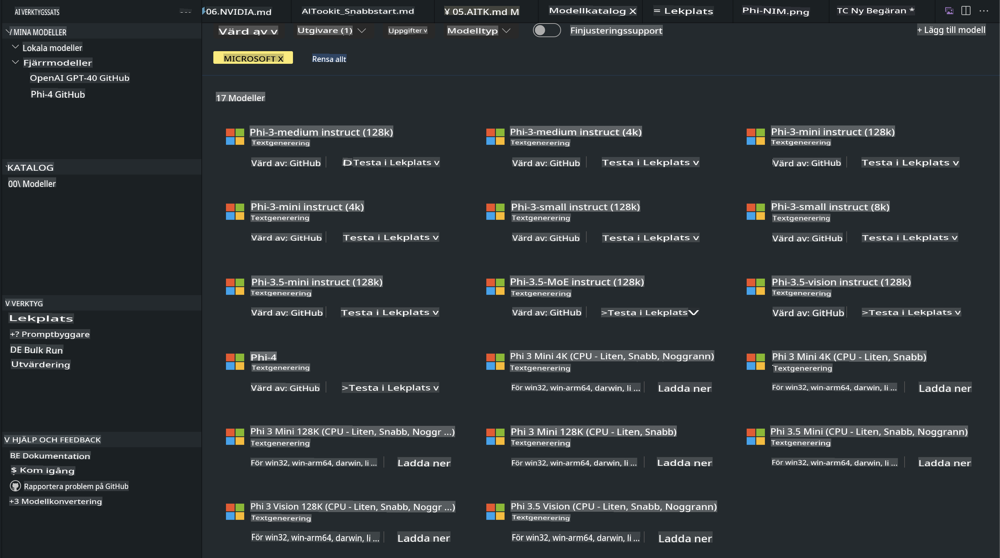
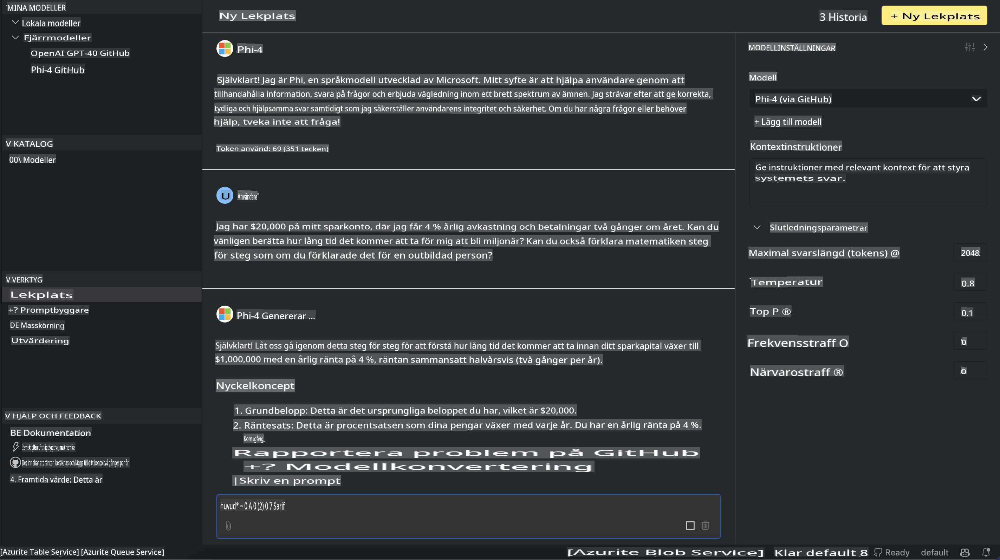

# Phi-familjen i AITK

[AI Toolkit för VS Code](https://marketplace.visualstudio.com/items?itemName=ms-windows-ai-studio.windows-ai-studio) förenklar utvecklingen av generativa AI-appar genom att samla avancerade AI-utvecklingsverktyg och modeller från Azure AI Foundry Catalog och andra kataloger som Hugging Face. Du kan bläddra i AI-modellkatalogen som drivs av GitHub Models och Azure AI Foundry Model Catalogs, ladda ner dem lokalt eller fjärrmässigt, finjustera, testa och använda dem i din applikation.

AI Toolkit Preview körs lokalt. Lokal inferens eller finjustering beror på den modell du väljer, och du kan behöva ha en GPU, som NVIDIA CUDA GPU. Du kan också köra GitHub Models direkt med AITK.

## Kom igång

[Läs mer om hur du installerar Windows Subsystem för Linux](https://learn.microsoft.com/windows/wsl/install?WT.mc_id=aiml-137032-kinfeylo)

och [ändra standarddistributionen](https://learn.microsoft.com/windows/wsl/install#change-the-default-linux-distribution-installed).

[AI Toolkit GitHub-repo](https://github.com/microsoft/vscode-ai-toolkit/)

- Windows, Linux, macOS
  
- För finjustering på både Windows och Linux behöver du en Nvidia GPU. Dessutom kräver **Windows** ett subsystem för Linux med Ubuntu-distribution 18.4 eller högre. [Läs mer om hur du installerar Windows Subsystem för Linux](https://learn.microsoft.com/windows/wsl/install) och [ändra standarddistributionen](https://learn.microsoft.com/windows/wsl/install#change-the-default-linux-distribution-installed).

### Installera AI Toolkit

AI Toolkit levereras som en [Visual Studio Code Extension](https://code.visualstudio.com/docs/setup/additional-components#_vs-code-extensions), så du måste först installera [VS Code](https://code.visualstudio.com/docs/setup/windows?WT.mc_id=aiml-137032-kinfeylo) och ladda ner AI Toolkit från [VS Marketplace](https://marketplace.visualstudio.com/items?itemName=ms-windows-ai-studio.windows-ai-studio).  
[AI Toolkit finns tillgänglig i Visual Studio Marketplace](https://marketplace.visualstudio.com/items?itemName=ms-windows-ai-studio.windows-ai-studio) och kan installeras som vilken annan VS Code-tillägg som helst.

Om du inte är bekant med att installera VS Code-tillägg, följ dessa steg:

### Logga in

1. I Aktivitetsfältet i VS Code, välj **Extensions**  
1. I sökfältet för tillägg, skriv "AI Toolkit"  
1. Välj "AI Toolkit for Visual Studio Code"  
1. Välj **Install**

Nu är du redo att använda tillägget!

Du kommer att bli ombedd att logga in på GitHub, så klicka på "Tillåt" för att fortsätta. Du kommer att omdirigeras till inloggningssidan för GitHub.

Logga in och följ stegen i processen. Efter att du har slutfört detta framgångsrikt, kommer du att omdirigeras tillbaka till VS Code.

När tillägget har installerats ser du AI Toolkit-ikonen i ditt aktivitetsfält.

Låt oss utforska de tillgängliga funktionerna!

### Tillgängliga funktioner

Huvudpanelen i AI Toolkit är organiserad i följande sektioner:

- **Models**  
- **Resources**  
- **Playground**  
- **Fine-tuning**  
- **Evaluation**

Dessa finns i avsnittet Resources. För att komma igång, välj **Model Catalog**.

### Ladda ner en modell från katalogen

När du startar AI Toolkit från sidofältet i VS Code kan du välja mellan följande alternativ:



- Hitta en stödd modell i **Model Catalog** och ladda ner den lokalt  
- Testa modellens inferens i **Model Playground**  
- Finjustera modellen lokalt eller fjärrmässigt i **Model Fine-tuning**  
- Distribuera finjusterade modeller till molnet via kommandopaletten för AI Toolkit  
- Utvärdera modeller  

> [!NOTE]
>
> **GPU vs CPU**
>
> Du kommer att märka att modellkorten visar modellstorlek, plattform och acceleratorstyp (CPU, GPU). För optimerad prestanda på **Windows-enheter som har minst en GPU**, välj modellversioner som endast riktar sig mot Windows.
>
> Detta säkerställer att du har en modell optimerad för DirectML-acceleratorn.
>
> Modellnamnen är i formatet
>
> - `{model_name}-{accelerator}-{quantization}-{format}`.
>
>För att kontrollera om du har en GPU på din Windows-enhet, öppna **Aktivitetshanteraren** och välj sedan fliken **Prestanda**. Om du har GPU:er kommer de att listas under namn som "GPU 0" eller "GPU 1".

### Kör modellen i Playground

När alla parametrar är inställda, klicka på **Generate Project**.

När din modell har laddats ner, välj **Load in Playground** på modellkortet i katalogen:

- Initiera nedladdning av modellen  
- Installera alla förutsättningar och beroenden  
- Skapa en VS Code-arbetsyta  



### Använd REST API i din applikation

AI Toolkit inkluderar en lokal REST API-webbserver **på port 5272** som använder [OpenAI chat completions-formatet](https://platform.openai.com/docs/api-reference/chat/create).

Detta gör att du kan testa din applikation lokalt utan att förlita dig på en molnbaserad AI-modelltjänst. Till exempel visar följande JSON-fil hur man konfigurerar begärans kropp:

```json
{
    "model": "Phi-4",
    "messages": [
        {
            "role": "user",
            "content": "what is the golden ratio?"
        }
    ],
    "temperature": 0.7,
    "top_p": 1,
    "top_k": 10,
    "max_tokens": 100,
    "stream": true
}
```

Du kan testa REST API med hjälp av (till exempel) [Postman](https://www.postman.com/) eller verktyget CURL (Client URL):

```bash
curl -vX POST http://127.0.0.1:5272/v1/chat/completions -H 'Content-Type: application/json' -d @body.json
```

### Använd OpenAI-klientbiblioteket för Python

```python
from openai import OpenAI

client = OpenAI(
    base_url="http://127.0.0.1:5272/v1/", 
    api_key="x" # required for the API but not used
)

chat_completion = client.chat.completions.create(
    messages=[
        {
            "role": "user",
            "content": "what is the golden ratio?",
        }
    ],
    model="Phi-4",
)

print(chat_completion.choices[0].message.content)
```

### Använd Azure OpenAI-klientbiblioteket för .NET

Lägg till [Azure OpenAI-klientbiblioteket för .NET](https://www.nuget.org/packages/Azure.AI.OpenAI/) i ditt projekt med hjälp av NuGet:

```bash
dotnet add {project_name} package Azure.AI.OpenAI --version 1.0.0-beta.17
```

Lägg till en C#-fil som heter **OverridePolicy.cs** till ditt projekt och klistra in följande kod:

```csharp
// OverridePolicy.cs
using Azure.Core.Pipeline;
using Azure.Core;

internal partial class OverrideRequestUriPolicy(Uri overrideUri)
    : HttpPipelineSynchronousPolicy
{
    private readonly Uri _overrideUri = overrideUri;

    public override void OnSendingRequest(HttpMessage message)
    {
        message.Request.Uri.Reset(_overrideUri);
    }
}
```

Klistra sedan in följande kod i din **Program.cs**-fil:

```csharp
// Program.cs
using Azure.AI.OpenAI;

Uri localhostUri = new("http://localhost:5272/v1/chat/completions");

OpenAIClientOptions clientOptions = new();
clientOptions.AddPolicy(
    new OverrideRequestUriPolicy(localhostUri),
    Azure.Core.HttpPipelinePosition.BeforeTransport);
OpenAIClient client = new(openAIApiKey: "unused", clientOptions);

ChatCompletionsOptions options = new()
{
    DeploymentName = "Phi-4",
    Messages =
    {
        new ChatRequestSystemMessage("You are a helpful assistant. Be brief and succinct."),
        new ChatRequestUserMessage("What is the golden ratio?"),
    }
};

StreamingResponse<StreamingChatCompletionsUpdate> streamingChatResponse
    = await client.GetChatCompletionsStreamingAsync(options);

await foreach (StreamingChatCompletionsUpdate chatChunk in streamingChatResponse)
{
    Console.Write(chatChunk.ContentUpdate);
}
```

## Finjustering med AI Toolkit

- Kom igång med modellupptäckt och Playground.  
- Finjustering av modeller och inferens med lokala datorkapaciteter.  
- Fjärrfinjustering och inferens med Azure-resurser.  

[Finjustering med AI Toolkit](../../03.FineTuning/Finetuning_VSCodeaitoolkit.md)

## AI Toolkit Q&A-resurser

Vänligen se vår [Q&A-sida](https://github.com/microsoft/vscode-ai-toolkit/blob/main/archive/QA.md) för de vanligaste problemen och lösningarna.

**Ansvarsfriskrivning**:  
Detta dokument har översatts med hjälp av maskinbaserade AI-översättningstjänster. Även om vi strävar efter noggrannhet, bör det noteras att automatiska översättningar kan innehålla fel eller felaktigheter. Det ursprungliga dokumentet på dess ursprungliga språk bör betraktas som den auktoritativa källan. För kritisk information rekommenderas professionell mänsklig översättning. Vi tar inget ansvar för eventuella missförstånd eller feltolkningar som uppstår vid användning av denna översättning.