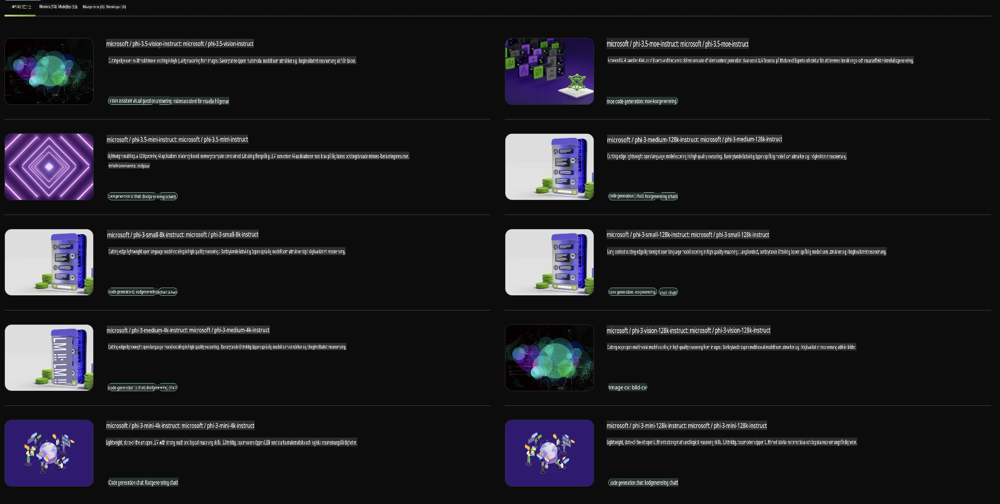

## Phi-familjen i NVIDIA NIM

NVIDIA NIM är en uppsättning lättanvända mikrotjänster som är utformade för att påskynda implementeringen av generativa AI-modeller i molnet, datacentret och arbetsstationer. NIM är kategoriserade efter modellsfamilj och per modellbasis. Till exempel erbjuder NVIDIA NIM för stora språkmodeller (LLMs) kraften hos de mest avancerade LLM:erna till företagsapplikationer och ger oöverträffade möjligheter för naturlig språkbehandling och förståelse.

NIM gör det enkelt för IT- och DevOps-team att själva vara värdar för stora språkmodeller (LLMs) i sina egna hanterade miljöer, samtidigt som utvecklare får branschstandard-API:er som låter dem bygga kraftfulla copiloter, chattbotar och AI-assistenter som kan transformera deras verksamhet. Genom att utnyttja NVIDIAs banbrytande GPU-acceleration och skalbara distribution erbjuder NIM den snabbaste vägen till inferens med oöverträffad prestanda.

Du kan använda NVIDIA NIM för att köra inferens på Phi-familjens modeller.



### **Exempel - Phi-3-Vision i NVIDIA NIM**

Föreställ dig att du har en bild (`demo.png`) och vill generera Python-kod som bearbetar denna bild och sparar en ny version av den (`phi-3-vision.jpg`).

Koden ovan automatiserar denna process genom att:

1. Ställa in miljön och nödvändiga konfigurationer.
2. Skapa en prompt som instruerar modellen att generera den önskade Python-koden.
3. Skicka prompten till modellen och samla in den genererade koden.
4. Extrahera och köra den genererade koden.
5. Visa originalbilden och den bearbetade bilden.

Denna metod utnyttjar kraften hos AI för att automatisera bildbehandlingsuppgifter, vilket gör det enklare och snabbare att nå dina mål.

[Exempellösning för kod](../../../../../code/06.E2E/E2E_Nvidia_NIM_Phi3_Vision.ipynb)

Låt oss bryta ner vad hela koden gör steg för steg:

1. **Installera nödvändigt paket**:
    ```python
    !pip install langchain_nvidia_ai_endpoints -U
    ```
    Detta kommando installerar paketet `langchain_nvidia_ai_endpoints` och ser till att det är den senaste versionen.

2. **Importera nödvändiga moduler**:
    ```python
    from langchain_nvidia_ai_endpoints import ChatNVIDIA
    import getpass
    import os
    import base64
    ```
    Dessa importerar de moduler som krävs för att interagera med NVIDIA AI-endpunkter, hantera lösenord på ett säkert sätt, interagera med operativsystemet och koda/avkoda data i base64-format.

3. **Ställ in API-nyckel**:
    ```python
    if not os.getenv("NVIDIA_API_KEY"):
        os.environ["NVIDIA_API_KEY"] = getpass.getpass("Enter your NVIDIA API key: ")
    ```
    Denna kod kontrollerar om miljövariabeln `NVIDIA_API_KEY` är inställd. Om inte, uppmanas användaren att ange sin API-nyckel på ett säkert sätt.

4. **Definiera modell och bildsökväg**:
    ```python
    model = 'microsoft/phi-3-vision-128k-instruct'
    chat = ChatNVIDIA(model=model)
    img_path = './imgs/demo.png'
    ```
    Detta ställer in modellen som ska användas, skapar en instans av `ChatNVIDIA` med den specificerade modellen och definierar sökvägen till bildfilen.

5. **Skapa textprompt**:
    ```python
    text = "Please create Python code for image, and use plt to save the new picture under imgs/ and name it phi-3-vision.jpg."
    ```
    Detta definierar en textprompt som instruerar modellen att generera Python-kod för att bearbeta en bild.

6. **Koda bilden i Base64**:
    ```python
    with open(img_path, "rb") as f:
        image_b64 = base64.b64encode(f.read()).decode()
    image = f''
    ```
    Denna kod läser in bildfilen, kodar den i base64 och skapar en HTML-bildtagg med den kodade datan.

7. **Kombinera text och bild i prompten**:
    ```python
    prompt = f"{text} {image}"
    ```
    Detta kombinerar textprompten och HTML-bildtaggen till en enda sträng.

8. **Generera kod med ChatNVIDIA**:
    ```python
    code = ""
    for chunk in chat.stream(prompt):
        print(chunk.content, end="")
        code += chunk.content
    ```
    Denna kod skickar prompten till `ChatNVIDIA` model and collects the generated code in chunks, printing and appending each chunk to the `code`-strängen.

9. **Extrahera Python-kod från genererat innehåll**:
    ```python
    begin = code.index('```python') + 9
    code = code[begin:]
    end = code.index('```')
    code = code[:end]
    ```
    Detta extraherar den faktiska Python-koden från det genererade innehållet genom att ta bort markdown-formatet.

10. **Kör den genererade koden**:
    ```python
    import subprocess
    result = subprocess.run(["python", "-c", code], capture_output=True)
    ```
    Detta kör den extraherade Python-koden som en subprocess och fångar dess output.

11. **Visa bilder**:
    ```python
    from IPython.display import Image, display
    display(Image(filename='./imgs/phi-3-vision.jpg'))
    display(Image(filename='./imgs/demo.png'))
    ```
    Dessa rader visar bilderna med hjälp av modulen `IPython.display`.

**Ansvarsfriskrivning**:  
Detta dokument har översatts med hjälp av AI-baserade maskinöversättningstjänster. Även om vi strävar efter noggrannhet, bör det noteras att automatiserade översättningar kan innehålla fel eller brister. Det ursprungliga dokumentet på dess ursprungsspråk bör betraktas som den auktoritativa källan. För kritisk information rekommenderas professionell mänsklig översättning. Vi tar inget ansvar för missförstånd eller feltolkningar som uppstår vid användning av denna översättning.