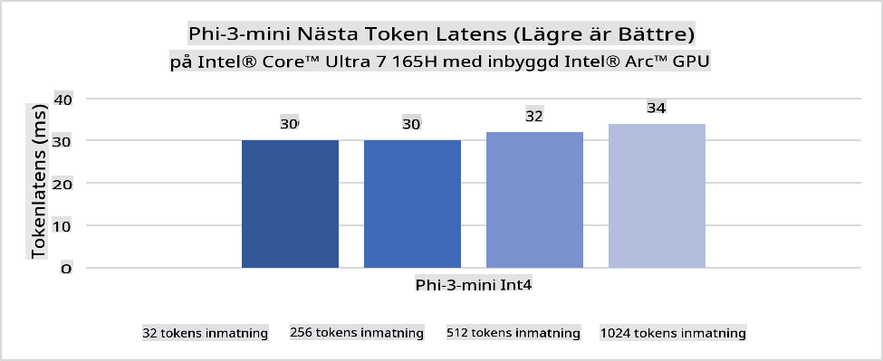
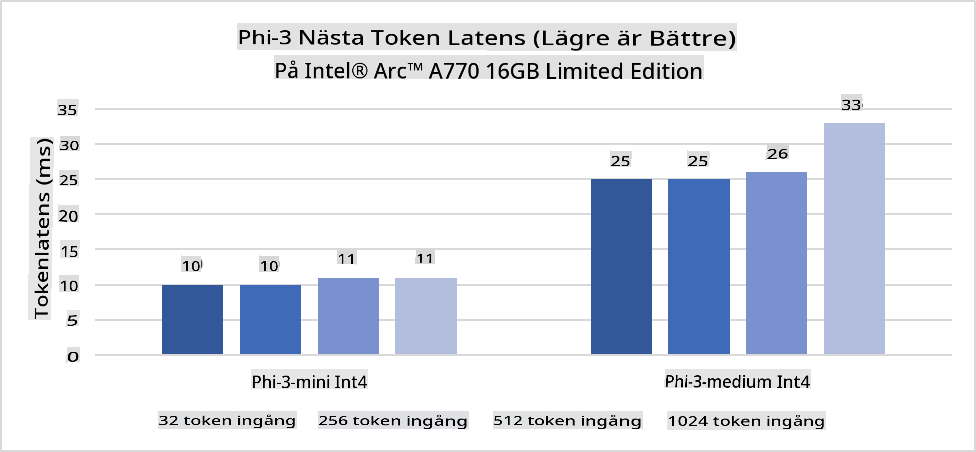
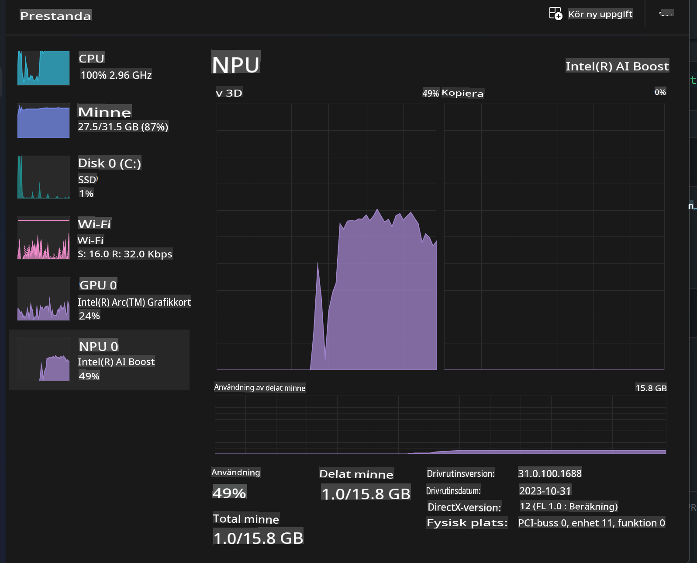
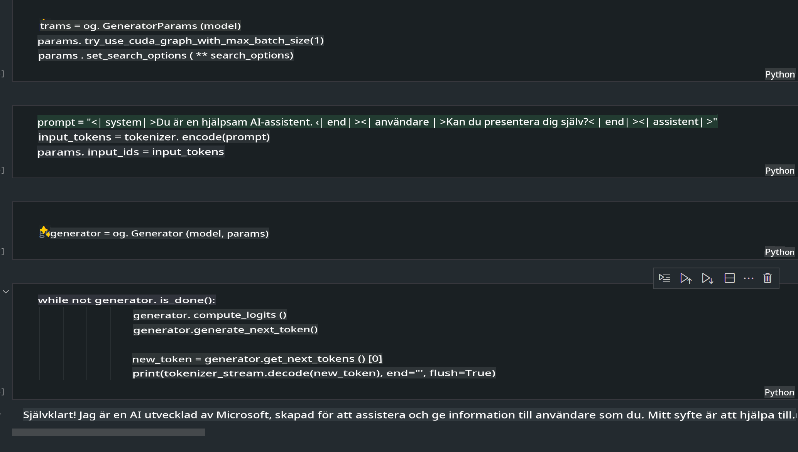
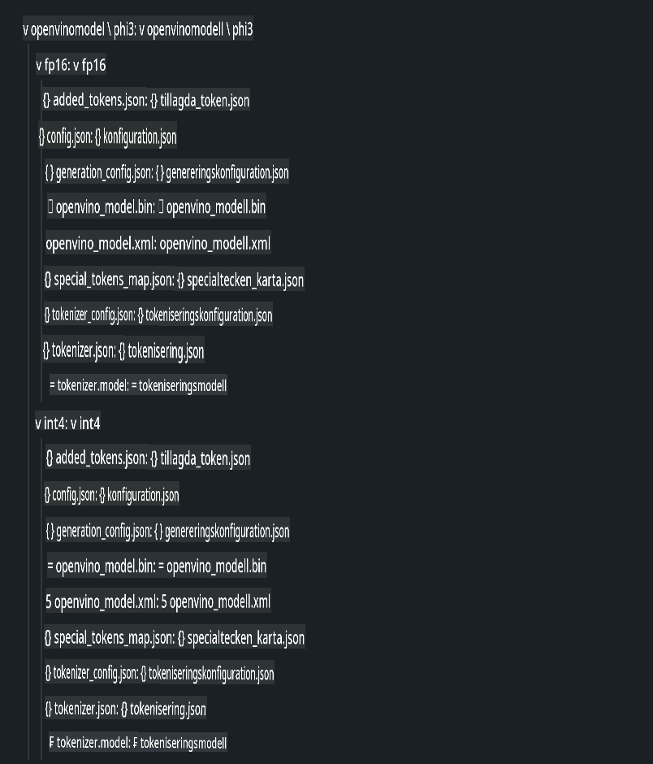
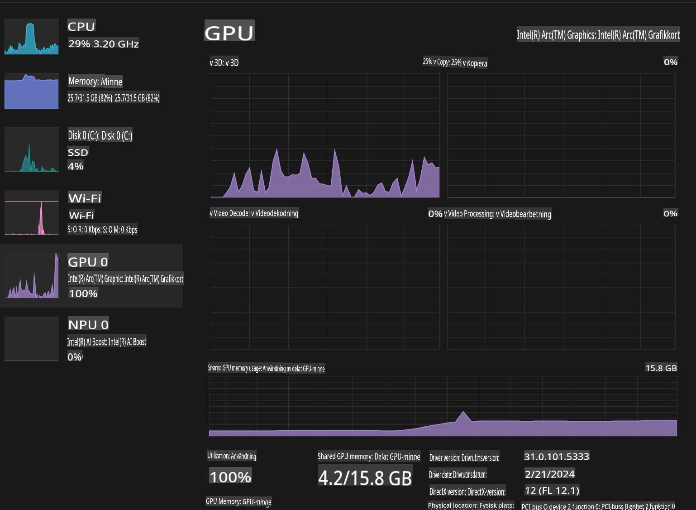

# **Inference Phi-3 i AI-PC**

Med framstegen inom generativ AI och förbättringar av hårdvarukapaciteter för edge-enheter kan allt fler generativa AI-modeller nu integreras i användarnas egna enheter (BYOD). AI-PC är en av dessa modeller. Från och med 2024 har Intel, AMD och Qualcomm samarbetat med PC-tillverkare för att introducera AI-PC som möjliggör användning av lokala generativa AI-modeller genom hårdvaruändringar. I denna diskussion fokuserar vi på Intel AI-PC och undersöker hur Phi-3 kan implementeras på en Intel AI-PC.

### Vad är en NPU?

En NPU (Neural Processing Unit) är en dedikerad processor eller bearbetningsenhet på en större SoC, specifikt designad för att accelerera neuronnätsoperationer och AI-uppgifter. Till skillnad från generella CPU:er och GPU:er är NPU:er optimerade för datadriven parallell bearbetning, vilket gör dem mycket effektiva vid bearbetning av stora mängder multimediadata, som videor och bilder, samt vid bearbetning av data för neuronnät. De är särskilt skickliga på att hantera AI-relaterade uppgifter, som taligenkänning, bakgrundsoskärpa i videosamtal och foto- eller videoredigeringsprocesser som objektidentifiering.

## NPU vs GPU

Även om många AI- och maskininlärningsarbetsbelastningar körs på GPU:er, finns det en viktig skillnad mellan GPU:er och NPU:er.  
GPU:er är kända för sina parallella beräkningsmöjligheter, men inte alla GPU:er är lika effektiva utanför grafikbearbetning. NPU:er, å andra sidan, är specialbyggda för de komplexa beräkningar som ingår i neuronnätsoperationer, vilket gör dem mycket effektiva för AI-uppgifter.

Sammanfattningsvis är NPU:er matematiska experter som accelererar AI-beräkningar och spelar en nyckelroll i den framväxande eran av AI-PC!

***Detta exempel är baserat på Intels senaste Intel Core Ultra-processor***

## **1. Använd NPU för att köra Phi-3-modellen**

Intel® NPU-enheten är en AI-inferensaccelerator som är integrerad med Intels klient-CPU:er, med start från Intel® Core™ Ultra-generationen av CPU:er (tidigare känd som Meteor Lake). Den möjliggör energieffektiv körning av artificiella neuronnätsuppgifter.





**Intel NPU Acceleration Library**

Intel NPU Acceleration Library [https://github.com/intel/intel-npu-acceleration-library](https://github.com/intel/intel-npu-acceleration-library) är ett Python-bibliotek designat för att öka effektiviteten i dina applikationer genom att utnyttja kraften hos Intels Neural Processing Unit (NPU) för att utföra högpresterande beräkningar på kompatibel hårdvara.

Exempel på Phi-3-mini på en AI-PC driven av Intel® Core™ Ultra-processorer.


Installera Python-biblioteket med pip

```bash

   pip install intel-npu-acceleration-library

```

***Notera*** Projektet är fortfarande under utveckling, men referensmodellen är redan mycket komplett.

### **Köra Phi-3 med Intel NPU Acceleration Library**

Med hjälp av Intel NPU-acceleration påverkar detta bibliotek inte den traditionella kodningsprocessen. Du behöver bara använda detta bibliotek för att kvantisera den ursprungliga Phi-3-modellen, som FP16, INT8, INT4, till exempel  

```python
from transformers import AutoTokenizer, pipeline,TextStreamer
from intel_npu_acceleration_library import NPUModelForCausalLM, int4
from intel_npu_acceleration_library.compiler import CompilerConfig
import warnings

model_id = "microsoft/Phi-3-mini-4k-instruct"

compiler_conf = CompilerConfig(dtype=int4)
model = NPUModelForCausalLM.from_pretrained(
    model_id, use_cache=True, config=compiler_conf, attn_implementation="sdpa"
).eval()

tokenizer = AutoTokenizer.from_pretrained(model_id)

text_streamer = TextStreamer(tokenizer, skip_prompt=True)
```

När kvantiseringen är klar, fortsätt exekveringen för att kalla på NPU för att köra Phi-3-modellen.

```python
generation_args = {
   "max_new_tokens": 1024,
   "return_full_text": False,
   "temperature": 0.3,
   "do_sample": False,
   "streamer": text_streamer,
}

pipe = pipeline(
   "text-generation",
   model=model,
   tokenizer=tokenizer,
)

query = "<|system|>You are a helpful AI assistant.<|end|><|user|>Can you introduce yourself?<|end|><|assistant|>"

with warnings.catch_warnings():
    warnings.simplefilter("ignore")
    pipe(query, **generation_args)
```

När du kör koden kan vi se NPU:ns körstatus via Aktivitetshanteraren.



***Exempel*** : [AIPC_NPU_DEMO.ipynb](../../../../../code/03.Inference/AIPC/AIPC_NPU_DEMO.ipynb)

## **2. Använd DirectML + ONNX Runtime för att köra Phi-3-modellen**

### **Vad är DirectML**

[DirectML](https://github.com/microsoft/DirectML) är ett högpresterande, hårdvaruaccelererat DirectX 12-bibliotek för maskininlärning. DirectML tillhandahåller GPU-acceleration för vanliga maskininlärningsuppgifter över ett brett spektrum av stödd hårdvara och drivrutiner, inklusive alla DirectX 12-kompatibla GPU:er från leverantörer som AMD, Intel, NVIDIA och Qualcomm.

När det används fristående är DirectML API ett lågnivåbibliotek för DirectX 12 och är lämpligt för högpresterande, lågfördröjningsapplikationer som ramverk, spel och andra realtidsapplikationer. DirectML:s sömlösa interoperabilitet med Direct3D 12 samt dess låga overhead och konsekvens över hårdvara gör det idealiskt för att accelerera maskininlärning när både hög prestanda och tillförlitlighet är avgörande.

***Notera*** : Den senaste versionen av DirectML stöder redan NPU (https://devblogs.microsoft.com/directx/introducing-neural-processor-unit-npu-support-in-directml-developer-preview/)

### DirectML och CUDA i termer av deras kapacitet och prestanda:

**DirectML** är ett maskininlärningsbibliotek utvecklat av Microsoft. Det är designat för att accelerera maskininlärningsarbetsbelastningar på Windows-enheter, inklusive stationära datorer, bärbara datorer och edge-enheter.
- DX12-baserat: DirectML är byggt ovanpå DirectX 12 (DX12), vilket ger ett brett utbud av hårdvarustöd över GPU:er, inklusive både NVIDIA och AMD.
- Bredare stöd: Eftersom det använder DX12 kan DirectML fungera med vilken GPU som helst som stöder DX12, även integrerade GPU:er.
- Bildbearbetning: DirectML bearbetar bilder och annan data med hjälp av neuronnät, vilket gör det lämpligt för uppgifter som bildigenkänning, objektidentifiering och mer.
- Enkel installation: Att ställa in DirectML är enkelt och kräver inte specifika SDK:er eller bibliotek från GPU-tillverkare.
- Prestanda: I vissa fall presterar DirectML bra och kan vara snabbare än CUDA, särskilt för vissa arbetsbelastningar.
- Begränsningar: Det finns dock fall där DirectML kan vara långsammare, särskilt för float16 och stora batchstorlekar.

**CUDA** är NVIDIAs plattform och programmeringsmodell för parallell beräkning. Den gör det möjligt för utvecklare att utnyttja kraften i NVIDIA GPU:er för allmänna beräkningar, inklusive maskininlärning och vetenskapliga simuleringar.
- NVIDIA-specifikt: CUDA är nära integrerat med NVIDIA GPU:er och specifikt designat för dem.
- Hög optimering: Det ger utmärkt prestanda för GPU-accelererade uppgifter, särskilt när NVIDIA GPU:er används.
- Utbredd användning: Många maskininlärningsramverk och bibliotek (som TensorFlow och PyTorch) har stöd för CUDA.
- Anpassning: Utvecklare kan finjustera CUDA-inställningar för specifika uppgifter, vilket kan leda till optimal prestanda.
- Begränsningar: Dock kan CUDA:s beroende av NVIDIA-hårdvara vara begränsande om du vill ha bredare kompatibilitet över olika GPU:er.

### Att välja mellan DirectML och CUDA

Valet mellan DirectML och CUDA beror på din specifika användning, tillgänglig hårdvara och preferenser.  
Om du letar efter bredare kompatibilitet och enkel installation kan DirectML vara ett bra val. Men om du har NVIDIA GPU:er och behöver högoptimerad prestanda förblir CUDA ett starkt alternativ. Sammanfattningsvis har både DirectML och CUDA sina styrkor och svagheter, så överväg dina krav och tillgängliga hårdvara när du fattar ett beslut.

### **Generativ AI med ONNX Runtime**

I AI-eran är portabiliteten hos AI-modeller mycket viktig. ONNX Runtime gör det enkelt att implementera tränade modeller på olika enheter. Utvecklare behöver inte fokusera på inferensramverket utan kan använda ett enhetligt API för att slutföra modellinferenst. I den generativa AI-eran har ONNX Runtime också genomfört kodoptimering (https://onnxruntime.ai/docs/genai/). Genom det optimerade ONNX Runtime kan den kvantiserade generativa AI-modellen köras på olika terminaler. I Generativ AI med ONNX Runtime kan du använda AI-modellens API via Python, C#, C/C++. Självklart kan distribution på iPhone dra nytta av C++:s Generativ AI med ONNX Runtime API.

[Exempelkod](https://github.com/Azure-Samples/Phi-3MiniSamples/tree/main/onnx)

***Kompilera generativ AI med ONNX Runtime-bibliotek***

```bash

winget install --id=Kitware.CMake  -e

git clone https://github.com/microsoft/onnxruntime.git

cd .\onnxruntime\

./build.bat --build_shared_lib --skip_tests --parallel --use_dml --config Release

cd ../

git clone https://github.com/microsoft/onnxruntime-genai.git

cd .\onnxruntime-genai\

mkdir ort

cd ort

mkdir include

mkdir lib

copy ..\onnxruntime\include\onnxruntime\core\providers\dml\dml_provider_factory.h ort\include

copy ..\onnxruntime\include\onnxruntime\core\session\onnxruntime_c_api.h ort\include

copy ..\onnxruntime\build\Windows\Release\Release\*.dll ort\lib

copy ..\onnxruntime\build\Windows\Release\Release\onnxruntime.lib ort\lib

python build.py --use_dml


```

**Installera bibliotek**

```bash

pip install .\onnxruntime_genai_directml-0.3.0.dev0-cp310-cp310-win_amd64.whl

```

Detta är körresultatet



***Exempel*** : [AIPC_DirectML_DEMO.ipynb](../../../../../code/03.Inference/AIPC/AIPC_DirectML_DEMO.ipynb)

## **3. Använd Intel OpenVINO för att köra Phi-3-modellen**

### **Vad är OpenVINO**

[OpenVINO](https://github.com/openvinotoolkit/openvino) är ett öppen källkod-verktyg för optimering och distribution av djupa inlärningsmodeller. Det erbjuder förbättrad prestanda för vision-, ljud- och språkmodeller från populära ramverk som TensorFlow, PyTorch och fler. Kom igång med OpenVINO. OpenVINO kan också användas i kombination med CPU och GPU för att köra Phi-3-modellen.

***Notera***: För närvarande stöder OpenVINO inte NPU.

### **Installera OpenVINO-bibliotek**

```bash

 pip install git+https://github.com/huggingface/optimum-intel.git

 pip install git+https://github.com/openvinotoolkit/nncf.git

 pip install openvino-nightly

```

### **Köra Phi-3 med OpenVINO**

Precis som NPU slutför OpenVINO anropet av generativa AI-modeller genom att köra kvantitativa modeller. Vi behöver först kvantisera Phi-3-modellen och slutföra modellkvantiseringen i kommandoraden via optimum-cli.

**INT4**

```bash

optimum-cli export openvino --model "microsoft/Phi-3-mini-4k-instruct" --task text-generation-with-past --weight-format int4 --group-size 128 --ratio 0.6  --sym  --trust-remote-code ./openvinomodel/phi3/int4

```

**FP16**

```bash

optimum-cli export openvino --model "microsoft/Phi-3-mini-4k-instruct" --task text-generation-with-past --weight-format fp16 --trust-remote-code ./openvinomodel/phi3/fp16

```

Det konverterade formatet ser ut så här:



Ladda modellvägar (model_dir), relaterade konfigurationer (ov_config = {"PERFORMANCE_HINT": "LATENCY", "NUM_STREAMS": "1", "CACHE_DIR": ""}) och hårdvaruaccelererade enheter (GPU.0) genom OVModelForCausalLM.

```python

ov_model = OVModelForCausalLM.from_pretrained(
     model_dir,
     device='GPU.0',
     ov_config=ov_config,
     config=AutoConfig.from_pretrained(model_dir, trust_remote_code=True),
     trust_remote_code=True,
)

```

När du kör koden kan vi se GPU:ns körstatus via Aktivitetshanteraren.



***Exempel*** : [AIPC_OpenVino_Demo.ipynb](../../../../../code/03.Inference/AIPC/AIPC_OpenVino_Demo.ipynb)

### ***Notera*** : De tre ovanstående metoderna har alla sina fördelar, men det rekommenderas att använda NPU-acceleration för AI-PC-inferens.

**Ansvarsfriskrivning**:  
Detta dokument har översatts med maskinbaserade AI-översättningstjänster. Även om vi strävar efter noggrannhet, vänligen notera att automatiska översättningar kan innehålla fel eller felaktigheter. Det ursprungliga dokumentet på dess originalspråk bör betraktas som den auktoritativa källan. För kritisk information rekommenderas professionell mänsklig översättning. Vi tar inget ansvar för eventuella missförstånd eller feltolkningar som uppstår vid användning av denna översättning.