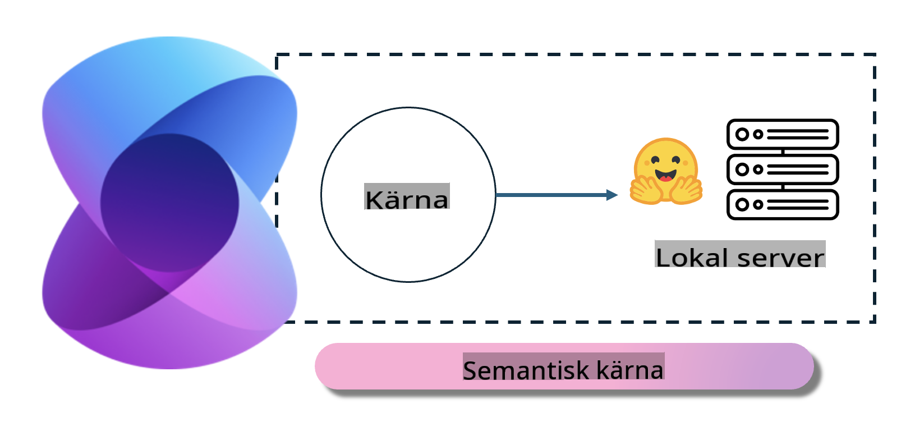
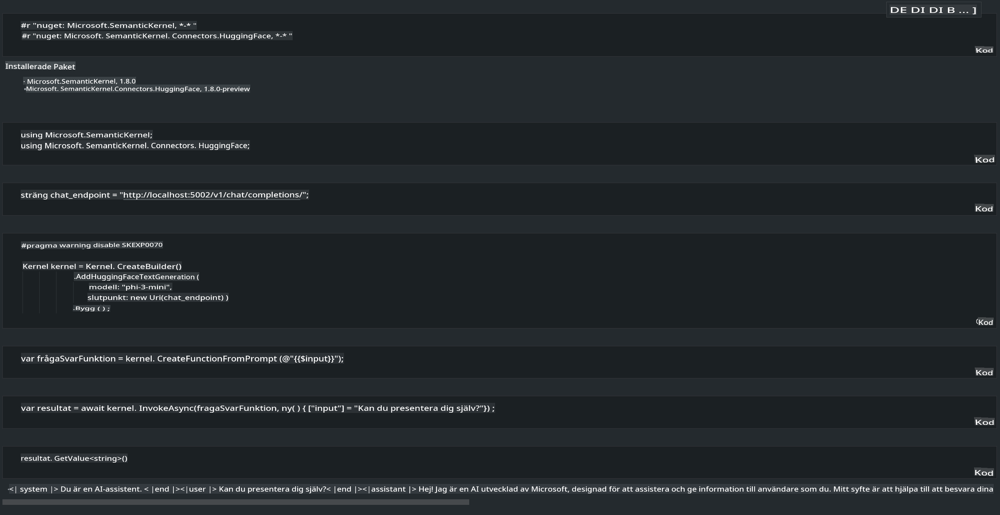

# **Köra Phi-3 på en Lokal Server**

Vi kan köra Phi-3 på en lokal server. Användare kan välja lösningar som [Ollama](https://ollama.com) eller [LM Studio](https://llamaedge.com), eller skriva sin egen kod. Du kan ansluta till Phi-3:s lokala tjänster via [Semantic Kernel](https://github.com/microsoft/semantic-kernel?WT.mc_id=aiml-138114-kinfeylo) eller [Langchain](https://www.langchain.com/) för att bygga Copilot-applikationer.

## **Använd Semantic Kernel för att komma åt Phi-3-mini**

I Copilot-applikationen skapar vi applikationer med hjälp av Semantic Kernel / LangChain. Denna typ av applikationsramverk är generellt kompatibelt med Azure OpenAI Service / OpenAI-modeller och kan också stödja öppen källkodsmodeller på Hugging Face samt lokala modeller. Vad gör vi om vi vill använda Semantic Kernel för att komma åt Phi-3-mini? Med .NET som exempel kan vi kombinera det med Hugging Face Connector i Semantic Kernel. Som standard kan den kopplas till modell-id på Hugging Face (första gången du använder det kommer modellen att laddas ner från Hugging Face, vilket tar lång tid). Du kan också ansluta till den lokala tjänst du har byggt. Mellan de två rekommenderar vi det senare eftersom det ger en högre grad av autonomi, särskilt för företagsapplikationer.

Som bilden visar kan du enkelt ansluta till den egenbyggda Phi-3-mini-modelltjänsten via Semantic Kernel. Här är resultatet av körningen:

***Exempelkod*** https://github.com/kinfey/Phi3MiniSamples/tree/main/semantickernel

**Ansvarsfriskrivning**:  
Detta dokument har översatts med maskinbaserade AI-översättningstjänster. Även om vi strävar efter noggrannhet, vänligen notera att automatiserade översättningar kan innehålla fel eller felaktigheter. Det ursprungliga dokumentet på dess originalspråk bör betraktas som den auktoritativa källan. För kritisk information rekommenderas professionell mänsklig översättning. Vi tar inget ansvar för eventuella missförstånd eller feltolkningar som uppstår vid användning av denna översättning.