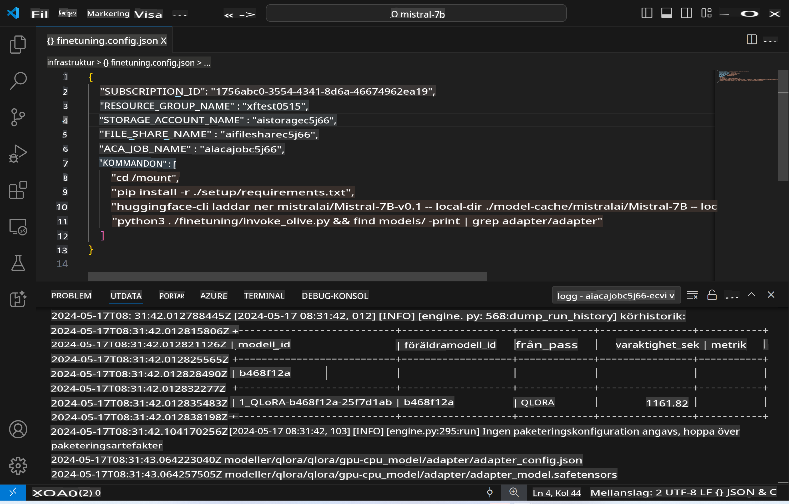
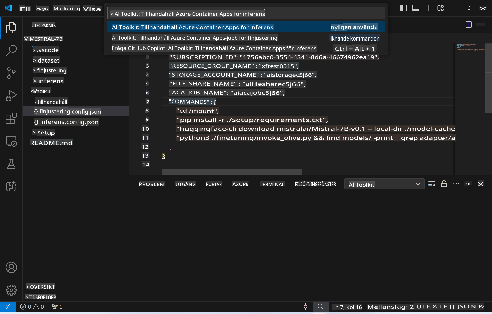
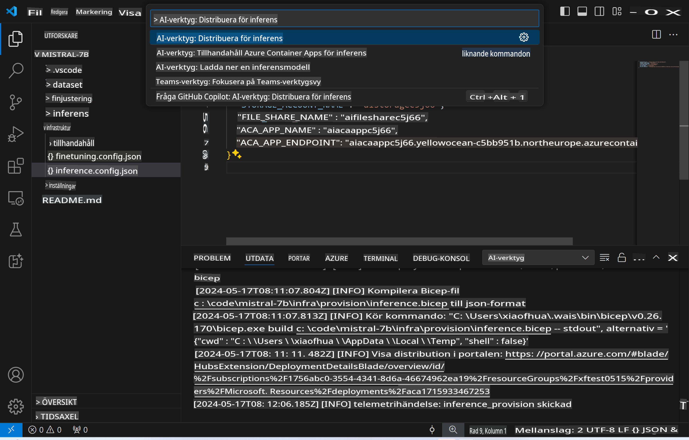
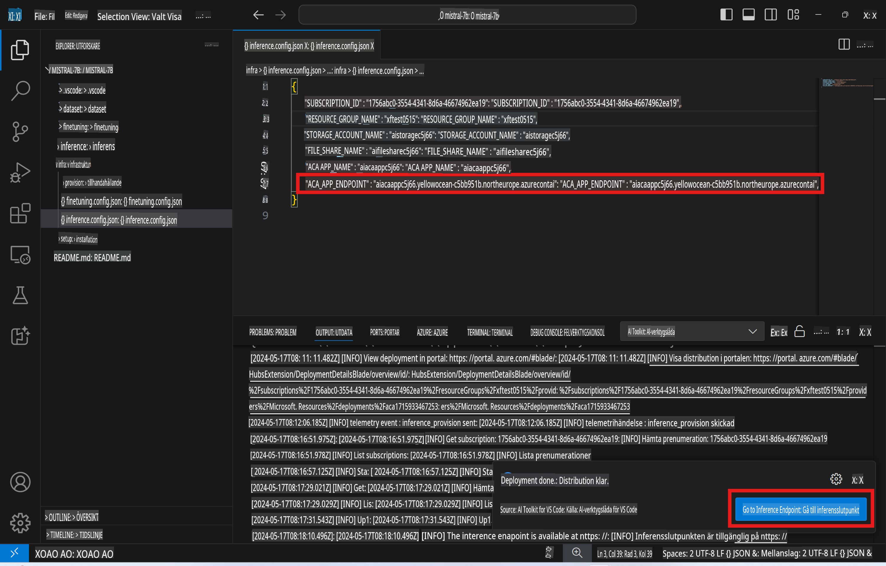

# Fjärrslutledning med den finjusterade modellen

Efter att adaptrarna har tränats i den fjärrmiljön kan du använda en enkel Gradio-applikation för att interagera med modellen.



### Skapa Azure-resurser
Du behöver konfigurera Azure-resurserna för fjärrslutledning genom att köra `AI Toolkit: Provision Azure Container Apps for inference` från kommandopaletten. Under denna konfiguration kommer du att bli ombedd att välja din Azure-prenumeration och resursgrupp.  

   
Som standard ska prenumerationen och resursgruppen för slutledning matcha de som användes för finjustering. Slutledningen kommer att använda samma Azure Container App-miljö och få åtkomst till modellen och modelladaptern som lagrats i Azure Files, vilka genererades under finjusteringssteget.

## Använda AI Toolkit 

### Distribution för slutledning  
Om du vill revidera slutledningskoden eller ladda om slutledningsmodellen, kör kommandot `AI Toolkit: Deploy for inference`. Detta kommer att synkronisera din senaste kod med ACA och starta om repliken.  



Efter att distributionen har slutförts framgångsrikt är modellen nu redo för utvärdering via denna slutpunkten.

### Åtkomst till slutlednings-API

Du kan komma åt slutlednings-API:t genom att klicka på knappen "*Go to Inference Endpoint*" som visas i VSCode-meddelandet. Alternativt kan web-API-slutpunkten hittas under `ACA_APP_ENDPOINT` i `./infra/inference.config.json` samt i utdatafönstret.



> **Obs:** Slutledningsslutpunkten kan behöva några minuter för att bli fullt operationell.

## Komponenter för slutledning som ingår i mallen
 
| Mapp | Innehåll |
| ------ |--------- |
| `infra` | Innehåller alla nödvändiga konfigurationer för fjärroperationer. |
| `infra/provision/inference.parameters.json` | Innehåller parametrar för bicep-mallar, som används för att skapa Azure-resurser för slutledning. |
| `infra/provision/inference.bicep` | Innehåller mallar för att skapa Azure-resurser för slutledning. |
| `infra/inference.config.json` | Konfigurationsfilen som genereras av kommandot `AI Toolkit: Provision Azure Container Apps for inference`. Den används som indata för andra fjärrkommandopaletter. |

### Använda AI Toolkit för att konfigurera Azure-resursprovisionering
Konfigurera [AI Toolkit](https://marketplace.visualstudio.com/items?itemName=ms-windows-ai-studio.windows-ai-studio)

Provisionera Azure Container Apps för slutledning` command.

You can find configuration parameters in `./infra/provision/inference.parameters.json` file. Here are the details:
| Parameter | Description |
| --------- |------------ |
| `defaultCommands` | This is the commands to initiate a web API. |
| `maximumInstanceCount` | This parameter sets the maximum capacity of GPU instances. |
| `location` | This is the location where Azure resources are provisioned. The default value is the same as the chosen resource group's location. |
| `storageAccountName`, `fileShareName` `acaEnvironmentName`, `acaEnvironmentStorageName`, `acaAppName`,  `acaLogAnalyticsName` | These parameters are used to name the Azure resources for provision. By default, they will be same to the fine-tuning resource name. You can input a new, unused resource name to create your own custom-named resources, or you can input the name of an already existing Azure resource if you'd prefer to use that. For details, refer to the section [Using existing Azure Resources](../../../../../md/01.Introduction/03). |

### Using Existing Azure Resources

By default, the inference provision use the same Azure Container App Environment, Storage Account, Azure File Share, and Azure Log Analytics that were used for fine-tuning. A separate Azure Container App is created solely for the inference API. 

If you have customized the Azure resources during the fine-tuning step or want to use your own existing Azure resources for inference, specify their names in the `./infra/inference.parameters.json`-filen. Kör sedan kommandot `AI Toolkit: Provision Azure Container Apps for inference` från kommandopaletten. Detta uppdaterar eventuella angivna resurser och skapar de som saknas.

Till exempel, om du har en befintlig Azure-containermiljö, bör din `./infra/finetuning.parameters.json` se ut så här:

```json
{
    "$schema": "https://schema.management.azure.com/schemas/2019-04-01/deploymentParameters.json#",
    "contentVersion": "1.0.0.0",
    "parameters": {
      ...
      "acaEnvironmentName": {
        "value": "<your-aca-env-name>"
      },
      "acaEnvironmentStorageName": {
        "value": null
      },
      ...
    }
  }
```

### Manuell provisionering  
Om du föredrar att manuellt konfigurera Azure-resurserna kan du använda de tillhandahållna bicep-filerna i `./infra/provision` folders. If you have already set up and configured all the Azure resources without using the AI Toolkit command palette, you can simply enter the resource names in the `inference.config.json`-filen.

Till exempel:

```json
{
  "SUBSCRIPTION_ID": "<your-subscription-id>",
  "RESOURCE_GROUP_NAME": "<your-resource-group-name>",
  "STORAGE_ACCOUNT_NAME": "<your-storage-account-name>",
  "FILE_SHARE_NAME": "<your-file-share-name>",
  "ACA_APP_NAME": "<your-aca-name>",
  "ACA_APP_ENDPOINT": "<your-aca-endpoint>"
}
```

**Ansvarsfriskrivning**:  
Detta dokument har översatts med hjälp av AI-baserade maskinöversättningstjänster. Även om vi strävar efter noggrannhet, vänligen notera att automatiserade översättningar kan innehålla fel eller felaktigheter. Det ursprungliga dokumentet på dess ursprungliga språk bör betraktas som den auktoritativa källan. För kritisk information rekommenderas professionell mänsklig översättning. Vi tar inget ansvar för eventuella missförstånd eller feltolkningar som uppstår till följd av användningen av denna översättning.