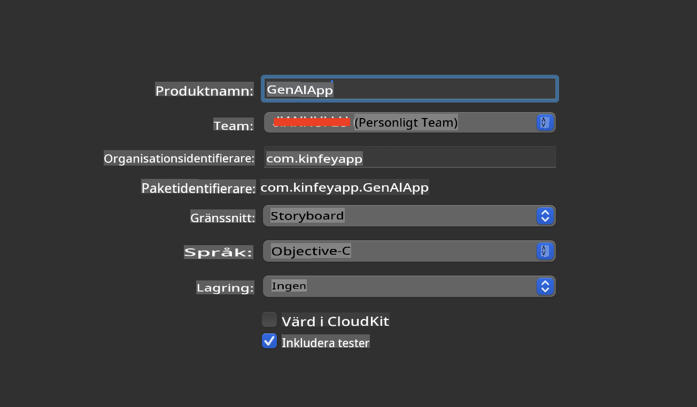
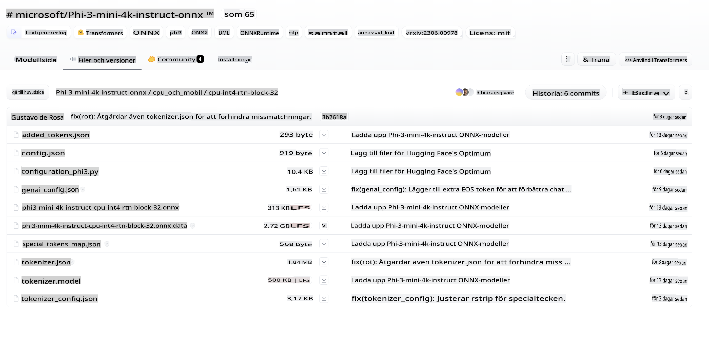
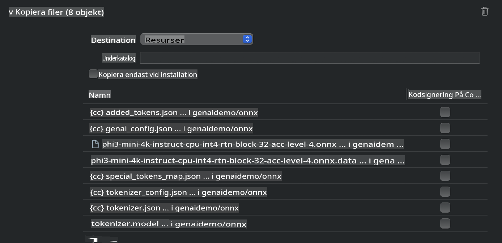
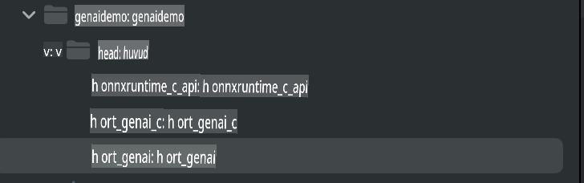
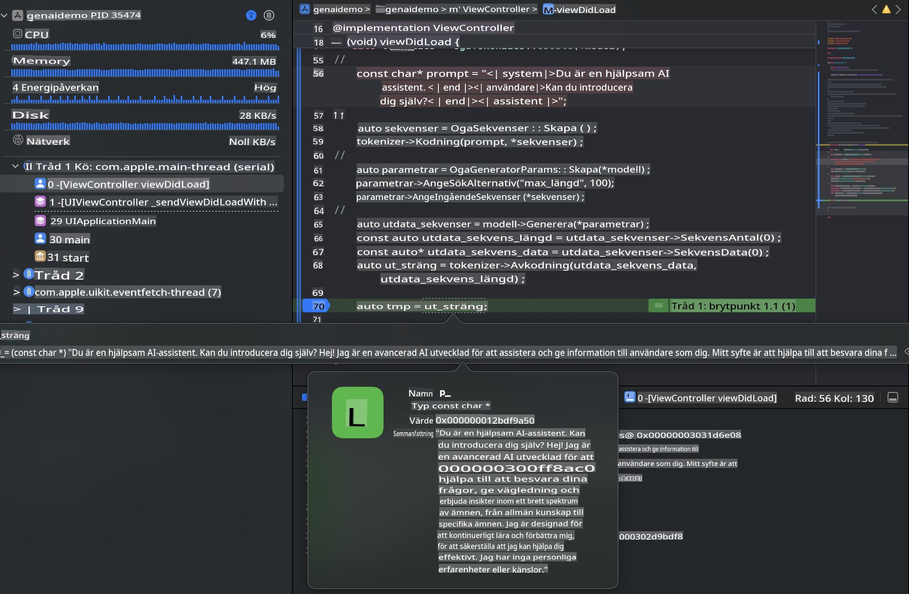

# **Inferens Phi-3 på iOS**

Phi-3-mini är en ny serie modeller från Microsoft som möjliggör implementering av Large Language Models (LLMs) på edge-enheter och IoT-enheter. Phi-3-mini är tillgänglig för iOS, Android och edge-enheter, vilket gör det möjligt att använda generativ AI i BYOD-miljöer. Följande exempel visar hur man implementerar Phi-3-mini på iOS.

## **1. Förberedelser**

- **a.** macOS 14+
- **b.** Xcode 15+
- **c.** iOS SDK 17.x (iPhone 14 A16 eller senare)
- **d.** Installera Python 3.10+ (Conda rekommenderas)
- **e.** Installera Python-biblioteket: `python-flatbuffers`
- **f.** Installera CMake

### Semantic Kernel och Inferens

Semantic Kernel är ett applikationsramverk som låter dig skapa applikationer kompatibla med Azure OpenAI Service, OpenAI-modeller och även lokala modeller. Genom att använda Semantic Kernel för att komma åt lokala tjänster blir det enkelt att integrera med din egenvärdade Phi-3-mini-modellserver.

### Använda kvantiserade modeller med Ollama eller LlamaEdge

Många användare föredrar att använda kvantiserade modeller för att köra modeller lokalt. [Ollama](https://ollama.com) och [LlamaEdge](https://llamaedge.com) gör det möjligt att anropa olika kvantiserade modeller:

#### **Ollama**

Du kan köra `ollama run phi3` direkt eller konfigurera den offline. Skapa en Modelfile med sökvägen till din `gguf`-fil. Exempel på kod för att köra Phi-3-mini kvantiserad modell:

```gguf
FROM {Add your gguf file path}
TEMPLATE \"\"\"<|user|> .Prompt<|end|> <|assistant|>\"\"\"
PARAMETER stop <|end|>
PARAMETER num_ctx 4096
```

#### **LlamaEdge**

Om du vill använda `gguf` både i molnet och på edge-enheter samtidigt är LlamaEdge ett utmärkt alternativ.

## **2. Kompilera ONNX Runtime för iOS**

```bash

git clone https://github.com/microsoft/onnxruntime.git

cd onnxruntime

./build.sh --build_shared_lib --ios --skip_tests --parallel --build_dir ./build_ios --ios --apple_sysroot iphoneos --osx_arch arm64 --apple_deploy_target 17.5 --cmake_generator Xcode --config Release

cd ../

```

### **Notera**

- **a.** Innan du kompilerar, se till att Xcode är korrekt konfigurerat och ställ in det som aktiv utvecklardirectory i terminalen:

    ```bash
    sudo xcode-select -switch /Applications/Xcode.app/Contents/Developer
    ```

- **b.** ONNX Runtime behöver kompileras för olika plattformar. För iOS kan du kompilera för `arm64` or `x86_64`.

- **c.** Det rekommenderas att använda den senaste iOS SDK för kompilering. Du kan dock använda en äldre version om du behöver kompatibilitet med tidigare SDK-versioner.

## **3. Kompilera Generativ AI med ONNX Runtime för iOS**

> **Notera:** Eftersom Generativ AI med ONNX Runtime är i förhandsgranskning, var medveten om potentiella förändringar.

```bash

git clone https://github.com/microsoft/onnxruntime-genai
 
cd onnxruntime-genai
 
mkdir ort
 
cd ort
 
mkdir include
 
mkdir lib
 
cd ../
 
cp ../onnxruntime/include/onnxruntime/core/session/onnxruntime_c_api.h ort/include
 
cp ../onnxruntime/build_ios/Release/Release-iphoneos/libonnxruntime*.dylib* ort/lib
 
export OPENCV_SKIP_XCODEBUILD_FORCE_TRYCOMPILE_DEBUG=1
 
python3 build.py --parallel --build_dir ./build_ios --ios --ios_sysroot iphoneos --ios_arch arm64 --ios_deployment_target 17.5 --cmake_generator Xcode --cmake_extra_defines CMAKE_XCODE_ATTRIBUTE_CODE_SIGNING_ALLOWED=NO

```

## **4. Skapa en App-applikation i Xcode**

Jag valde Objective-C som utvecklingsmetod för appen, eftersom Generativ AI med ONNX Runtime C++ API är bättre kompatibelt med Objective-C. Naturligtvis kan du också slutföra relaterade anrop via Swift bridging.



## **5. Kopiera ONNX kvantiserad INT4-modell till appens projekt**

Vi behöver importera INT4-kvantiseringsmodellen i ONNX-format, som först måste laddas ner.



Efter nedladdning behöver du lägga till den i projektets Resources-katalog i Xcode.



## **6. Lägg till C++ API i ViewControllers**

> **Notera:**

- **a.** Lägg till motsvarande C++-headerfiler i projektet.

  

- **b.** Inkludera `onnxruntime-genai` dynamic library in Xcode.

  

- **c.** Use the C Samples code for testing. You can also add additional features like ChatUI for more functionality.

- **d.** Since you need to use C++ in your project, rename `ViewController.m` to `ViewController.mm` för att aktivera Objective-C++-stöd.

```objc

    NSString *llmPath = [[NSBundle mainBundle] resourcePath];
    char const *modelPath = llmPath.cString;

    auto model =  OgaModel::Create(modelPath);

    auto tokenizer = OgaTokenizer::Create(*model);

    const char* prompt = "<|system|>You are a helpful AI assistant.<|end|><|user|>Can you introduce yourself?<|end|><|assistant|>";

    auto sequences = OgaSequences::Create();
    tokenizer->Encode(prompt, *sequences);

    auto params = OgaGeneratorParams::Create(*model);
    params->SetSearchOption("max_length", 100);
    params->SetInputSequences(*sequences);

    auto output_sequences = model->Generate(*params);
    const auto output_sequence_length = output_sequences->SequenceCount(0);
    const auto* output_sequence_data = output_sequences->SequenceData(0);
    auto out_string = tokenizer->Decode(output_sequence_data, output_sequence_length);
    
    auto tmp = out_string;

```

## **7. Köra applikationen**

När installationen är klar kan du köra applikationen för att se resultaten av Phi-3-mini-modellens inferens.



För mer exempel på kod och detaljerade instruktioner, besök [Phi-3 Mini Samples repository](https://github.com/Azure-Samples/Phi-3MiniSamples/tree/main/ios).

**Ansvarsfriskrivning**:  
Detta dokument har översatts med hjälp av maskinbaserade AI-översättningstjänster. Även om vi strävar efter noggrannhet, vänligen notera att automatiska översättningar kan innehålla fel eller felaktigheter. Det ursprungliga dokumentet på sitt originalspråk bör betraktas som den auktoritativa källan. För kritisk information rekommenderas professionell mänsklig översättning. Vi ansvarar inte för eventuella missförstånd eller feltolkningar som uppstår vid användning av denna översättning.