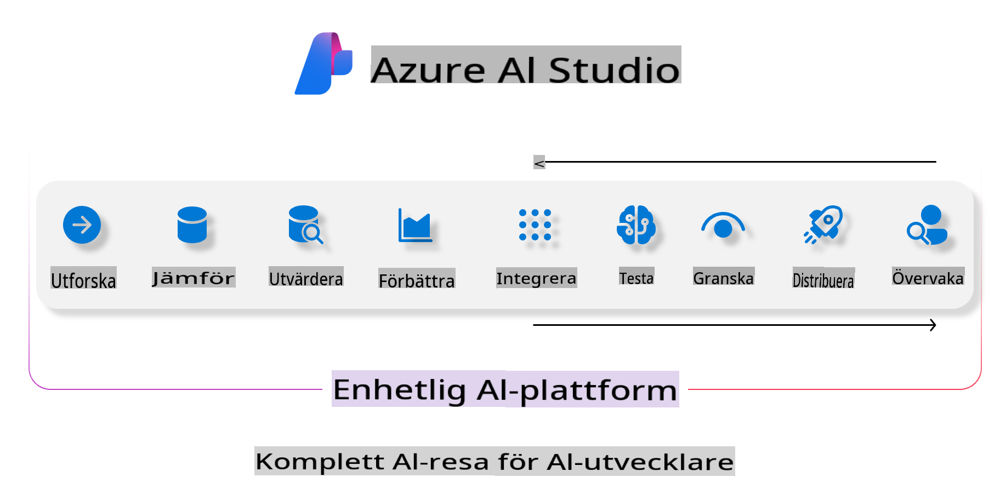
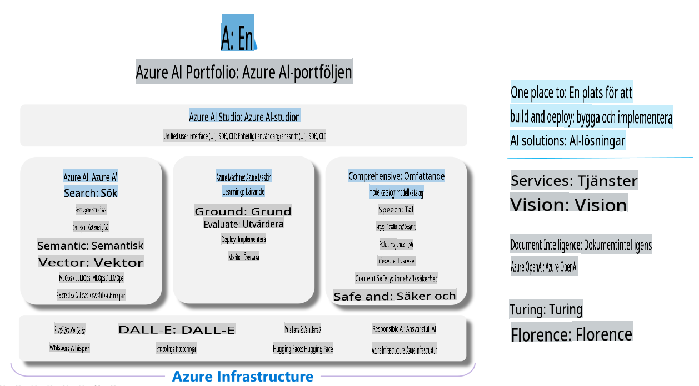

# **Använda Azure AI Foundry för utvärdering**

Hur du utvärderar din generativa AI-applikation med [Azure AI Foundry](https://ai.azure.com?WT.mc_id=aiml-138114-kinfeylo). Oavsett om du utvärderar enkla eller komplexa konversationer, erbjuder Azure AI Foundry verktyg för att bedöma modellens prestanda och säkerhet.

## Hur man utvärderar generativa AI-appar med Azure AI Foundry
För mer detaljerade instruktioner, se [Azure AI Foundry-dokumentationen](https://learn.microsoft.com/azure/ai-studio/how-to/evaluate-generative-ai-app?WT.mc_id=aiml-138114-kinfeylo)

Här är stegen för att komma igång:

## Utvärdera generativa AI-modeller i Azure AI Foundry

**Förutsättningar**

- Ett testdatamängd i antingen CSV- eller JSON-format.
- En distribuerad generativ AI-modell (som Phi-3, GPT 3.5, GPT 4 eller Davinci-modeller).
- En runtime med en beräkningsinstans för att köra utvärderingen.

## Inbyggda utvärderingsmått

Azure AI Foundry låter dig utvärdera både enkla och komplexa, flerstegs konversationer.  
För Retrieval Augmented Generation (RAG)-scenarier, där modellen är baserad på specifik data, kan du bedöma prestandan med hjälp av inbyggda utvärderingsmått.  
Dessutom kan du utvärdera generella enkla frågesvarsscenarier (icke-RAG).

## Skapa en utvärderingskörning

Från Azure AI Foundry UI, navigera till antingen sidan Utvärdera eller sidan Prompt Flow.  
Följ guiden för att skapa en utvärderingskörning. Ge ett valfritt namn till din utvärdering.  
Välj det scenario som stämmer överens med din applikations mål.  
Välj en eller flera utvärderingsmått för att bedöma modellens output.

## Anpassat utvärderingsflöde (valfritt)

För större flexibilitet kan du skapa ett anpassat utvärderingsflöde. Anpassa utvärderingsprocessen efter dina specifika behov.

## Visa resultat

Efter att utvärderingen har körts kan du logga, visa och analysera detaljerade utvärderingsmått i Azure AI Foundry. Få insikter om din applikations kapaciteter och begränsningar.

**Notera** Azure AI Foundry är för närvarande i offentlig förhandsversion, så använd den för experimentering och utvecklingsändamål. För produktionsarbetsbelastningar, överväg andra alternativ. Utforska den officiella [AI Foundry-dokumentationen](https://learn.microsoft.com/azure/ai-studio/?WT.mc_id=aiml-138114-kinfeylo) för mer detaljer och steg-för-steg-instruktioner.

**Ansvarsfriskrivning**:  
Detta dokument har översatts med hjälp av maskinbaserade AI-översättningstjänster. Även om vi strävar efter noggrannhet, vänligen notera att automatiserade översättningar kan innehålla fel eller oriktigheter. Det ursprungliga dokumentet på dess originalspråk bör betraktas som den auktoritativa källan. För kritisk information rekommenderas professionell mänsklig översättning. Vi tar inget ansvar för missförstånd eller feltolkningar som uppstår till följd av användningen av denna översättning.