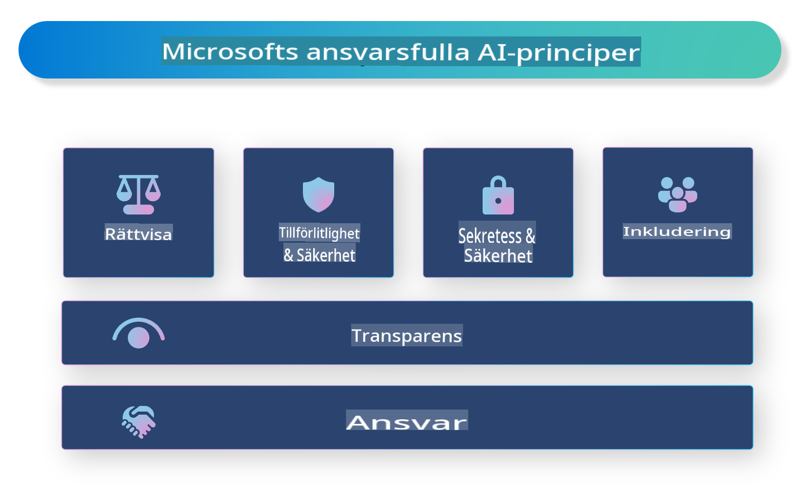

# **Introducera Ansvarsfull AI**

[Microsoft Responsible AI](https://www.microsoft.com/ai/responsible-ai?WT.mc_id=aiml-138114-kinfeylo) är ett initiativ som syftar till att hjälpa utvecklare och organisationer att bygga AI-system som är transparenta, pålitliga och ansvarsfulla. Initiativet erbjuder vägledning och resurser för att utveckla ansvarsfulla AI-lösningar som följer etiska principer, såsom integritet, rättvisa och transparens. Vi kommer också att utforska några av de utmaningar och bästa praxis som är förknippade med att bygga ansvarsfulla AI-system.

## Översikt av Microsoft Responsible AI 

**Etiska principer** 

Microsoft Responsible AI styrs av ett antal etiska principer, såsom integritet, rättvisa, transparens, ansvarsskyldighet och säkerhet. Dessa principer är utformade för att säkerställa att AI-system utvecklas på ett etiskt och ansvarsfullt sätt.

**Transparent AI**

Microsoft Responsible AI betonar vikten av transparens i AI-system. Detta inkluderar att ge tydliga förklaringar av hur AI-modeller fungerar samt att säkerställa att datakällor och algoritmer är offentligt tillgängliga.

**Ansvarsfull AI** 

[Microsoft Responsible AI](https://www.microsoft.com/ai/responsible-ai?WT.mc_id=aiml-138114-kinfeylo) främjar utvecklingen av ansvarsfulla AI-system som kan ge insikter om hur AI-modeller fattar beslut. Detta kan hjälpa användare att förstå och lita på resultaten från AI-system.

**Inkluderande AI** 

AI-system bör utformas för att gynna alla. Microsoft strävar efter att skapa inkluderande AI som tar hänsyn till olika perspektiv och undviker partiskhet eller diskriminering.

**Tillförlitlighet och säkerhet**

Att säkerställa att AI-system är tillförlitliga och säkra är avgörande. Microsoft fokuserar på att bygga robusta modeller som fungerar konsekvent och undviker skadliga utfall.

**Rättvisa i AI** 

Microsoft Responsible AI erkänner att AI-system kan förstärka partiskhet om de tränas på partisk data eller algoritmer. Initiativet erbjuder vägledning för att utveckla rättvisa AI-system som inte diskriminerar baserat på faktorer som ras, kön eller ålder.

**Integritet och säkerhet** 

Microsoft Responsible AI betonar vikten av att skydda användarnas integritet och datasäkerhet i AI-system. Detta inkluderar att implementera stark datakryptering och åtkomstkontroller samt regelbundet granska AI-system för sårbarheter.

**Ansvar och skyldighet** 

Microsoft Responsible AI främjar ansvar och skyldighet i AI-utveckling och implementering. Detta inkluderar att säkerställa att utvecklare och organisationer är medvetna om de potentiella riskerna med AI-system och vidtar åtgärder för att minska dessa risker.

## Bästa praxis för att bygga ansvarsfulla AI-system

**Utveckla AI-modeller med hjälp av mångsidiga dataset** 

För att undvika partiskhet i AI-system är det viktigt att använda mångsidiga dataset som representerar en rad olika perspektiv och erfarenheter.

**Använd tekniker för förklarande AI** 

Förklarande AI-tekniker kan hjälpa användare att förstå hur AI-modeller fattar beslut, vilket kan öka förtroendet för systemet.

**Granska regelbundet AI-system för sårbarheter** 

Regelbundna granskningar av AI-system kan hjälpa till att identifiera potentiella risker och sårbarheter som behöver åtgärdas.

**Implementera stark datakryptering och åtkomstkontroller** 

Datakryptering och åtkomstkontroller kan hjälpa till att skydda användarnas integritet och säkerhet i AI-system.

**Följ etiska principer vid AI-utveckling** 

Genom att följa etiska principer, såsom rättvisa, transparens och ansvarsskyldighet, kan man bygga förtroende för AI-system och säkerställa att de utvecklas på ett ansvarsfullt sätt.

## Använda AI Foundry för Ansvarsfull AI 

[Azure AI Foundry](https://ai.azure.com?WT.mc_id=aiml-138114-kinfeylo) är en kraftfull plattform som gör det möjligt för utvecklare och organisationer att snabbt skapa intelligenta, avancerade, marknadsklara och ansvarsfulla applikationer. Här är några nyckelfunktioner och möjligheter med Azure AI Foundry:

**Färdiga API:er och modeller** 

Azure AI Foundry tillhandahåller förbyggda och anpassningsbara API:er och modeller. Dessa täcker ett brett spektrum av AI-uppgifter, inklusive generativ AI, naturlig språkbehandling för konversationer, sökning, övervakning, översättning, tal, bildigenkänning och beslutsfattande.

**Prompt Flow** 

Prompt flow i Azure AI Foundry gör det möjligt att skapa konversationsupplevelser med AI. Det låter dig designa och hantera konversationsflöden, vilket underlättar byggandet av chattbottar, virtuella assistenter och andra interaktiva applikationer.

**Retrieval Augmented Generation (RAG)** 

RAG är en teknik som kombinerar retrieval-baserade och generativa tillvägagångssätt. Den förbättrar kvaliteten på genererade svar genom att utnyttja både befintlig kunskap (retrieval) och kreativ generering (generation).

**Utvärderings- och övervakningsmetrik för generativ AI** 

Azure AI Foundry tillhandahåller verktyg för att utvärdera och övervaka generativa AI-modeller. Du kan bedöma deras prestanda, rättvisa och andra viktiga mätvärden för att säkerställa ansvarsfull implementering. Dessutom, om du har skapat en instrumentpanel, kan du använda no-code-gränssnittet i Azure Machine Learning Studio för att anpassa och generera en Responsible AI Dashboard och tillhörande scorecard baserat på [Responsible AI Toolbox](https://responsibleaitoolbox.ai/?WT.mc_id=aiml-138114-kinfeylo) Python Libraries. Detta scorecard hjälper dig att dela viktiga insikter om rättvisa, funktionsviktighet och andra ansvarsfulla implementeringsöverväganden med både tekniska och icke-tekniska intressenter.

För att använda AI Foundry med ansvarsfull AI kan du följa dessa bästa praxis:

**Definiera problemet och målen för ditt AI-system**

Innan du påbörjar utvecklingsprocessen är det viktigt att tydligt definiera problemet eller målet som ditt AI-system syftar till att lösa. Detta hjälper dig att identifiera de data, algoritmer och resurser som behövs för att bygga en effektiv modell.

**Samla in och förbehandla relevant data** 

Kvaliteten och mängden data som används för att träna ett AI-system kan ha en betydande inverkan på dess prestanda. Därför är det viktigt att samla in relevant data, rengöra den, förbehandla den och säkerställa att den är representativ för den population eller det problem du försöker lösa.

**Välj lämplig utvärdering** 

Det finns olika utvärderingsalgoritmer tillgängliga. Det är viktigt att välja den mest lämpliga algoritmen baserat på dina data och problem.

**Utvärdera och tolka modellen** 

När du har byggt en AI-modell är det viktigt att utvärdera dess prestanda med hjälp av lämpliga mätvärden och tolka resultaten på ett transparent sätt. Detta hjälper dig att identifiera eventuella partiskheter eller begränsningar i modellen och göra förbättringar där det behövs.

**Säkerställ transparens och förklarbarhet** 

AI-system bör vara transparenta och förklarbara så att användare kan förstå hur de fungerar och hur beslut fattas. Detta är särskilt viktigt för applikationer som har stor påverkan på människors liv, såsom hälso- och sjukvård, finans och juridiska system.

**Övervaka och uppdatera modellen** 

AI-system bör kontinuerligt övervakas och uppdateras för att säkerställa att de förblir korrekta och effektiva över tid. Detta kräver löpande underhåll, testning och omträning av modellen.

Sammanfattningsvis är Microsoft Responsible AI ett initiativ som syftar till att hjälpa utvecklare och organisationer att bygga AI-system som är transparenta, pålitliga och ansvarsfulla. Kom ihåg att ansvarsfull AI-implementering är avgörande, och Azure AI Foundry strävar efter att göra det praktiskt för organisationer. Genom att följa etiska principer och bästa praxis kan vi säkerställa att AI-system utvecklas och implementeras på ett ansvarsfullt sätt som gynnar samhället som helhet.

**Ansvarsfriskrivning**:  
Detta dokument har översatts med hjälp av maskinbaserade AI-översättningstjänster. Även om vi strävar efter noggrannhet, bör det noteras att automatiserade översättningar kan innehålla fel eller felaktigheter. Det ursprungliga dokumentet på dess originalspråk bör betraktas som den auktoritativa källan. För kritisk information rekommenderas professionell mänsklig översättning. Vi ansvarar inte för eventuella missförstånd eller feltolkningar som uppstår vid användning av denna översättning.