# Utvärdera den finjusterade Phi-3 / Phi-3.5-modellen i Azure AI Foundry med fokus på Microsofts principer för ansvarsfull AI

Detta end-to-end (E2E) exempel är baserat på guiden "[Evaluate Fine-tuned Phi-3 / 3.5 Models in Azure AI Foundry Focusing on Microsoft's Responsible AI](https://techcommunity.microsoft.com/t5/educator-developer-blog/evaluate-fine-tuned-phi-3-3-5-models-in-azure-ai-studio-focusing/ba-p/4227850?WT.mc_id=aiml-137032-kinfeylo)" från Microsoft Tech Community.

## Översikt

### Hur kan du utvärdera säkerheten och prestandan hos en finjusterad Phi-3 / Phi-3.5-modell i Azure AI Foundry?

Finjustering av en modell kan ibland leda till oavsiktliga eller oönskade svar. För att säkerställa att modellen förblir säker och effektiv är det viktigt att utvärdera modellens potential att generera skadligt innehåll och dess förmåga att producera korrekta, relevanta och sammanhängande svar. I den här handledningen lär du dig hur du utvärderar säkerheten och prestandan hos en finjusterad Phi-3 / Phi-3.5-modell som integrerats med Prompt flow i Azure AI Foundry.

Här är en översikt av Azure AI Foundrys utvärderingsprocess.

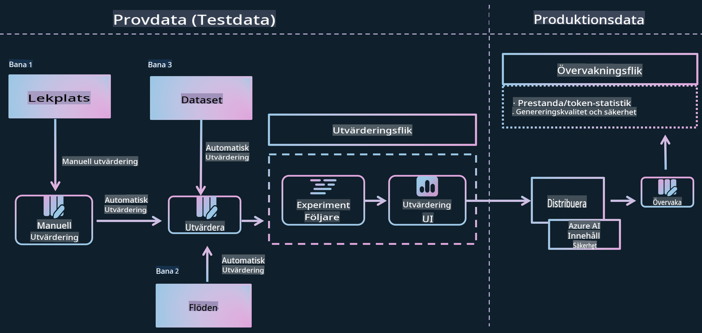

*Bildkälla: [Evaluation of generative AI applications](https://learn.microsoft.com/azure/ai-studio/concepts/evaluation-approach-gen-ai?wt.mc_id%3Dstudentamb_279723)*

> [!NOTE]
>
> För mer detaljerad information och ytterligare resurser om Phi-3 / Phi-3.5, besök [Phi-3CookBook](https://github.com/microsoft/Phi-3CookBook?wt.mc_id=studentamb_279723).

### Förutsättningar

- [Python](https://www.python.org/downloads)
- [Azure-prenumeration](https://azure.microsoft.com/free?wt.mc_id=studentamb_279723)
- [Visual Studio Code](https://code.visualstudio.com)
- Finjusterad Phi-3 / Phi-3.5-modell

### Innehållsförteckning

1. [**Scenario 1: Introduktion till Azure AI Foundrys Prompt flow-utvärdering**](../../../../../../md/02.Application/01.TextAndChat/Phi3)

    - [Introduktion till säkerhetsutvärdering](../../../../../../md/02.Application/01.TextAndChat/Phi3)
    - [Introduktion till prestandautvärdering](../../../../../../md/02.Application/01.TextAndChat/Phi3)

1. [**Scenario 2: Utvärdera Phi-3 / Phi-3.5-modellen i Azure AI Foundry**](../../../../../../md/02.Application/01.TextAndChat/Phi3)

    - [Innan du börjar](../../../../../../md/02.Application/01.TextAndChat/Phi3)
    - [Distribuera Azure OpenAI för att utvärdera Phi-3 / Phi-3.5-modellen](../../../../../../md/02.Application/01.TextAndChat/Phi3)
    - [Utvärdera den finjusterade Phi-3 / Phi-3.5-modellen med Azure AI Foundrys Prompt flow-utvärdering](../../../../../../md/02.Application/01.TextAndChat/Phi3)

1. [Grattis!](../../../../../../md/02.Application/01.TextAndChat/Phi3)

## **Scenario 1: Introduktion till Azure AI Foundrys Prompt flow-utvärdering**

### Introduktion till säkerhetsutvärdering

För att säkerställa att din AI-modell är etisk och säker är det avgörande att utvärdera den mot Microsofts principer för ansvarsfull AI. I Azure AI Foundry gör säkerhetsutvärderingar det möjligt att bedöma modellens sårbarhet för "jailbreak"-attacker och dess potential att generera skadligt innehåll, vilket är direkt i linje med dessa principer.

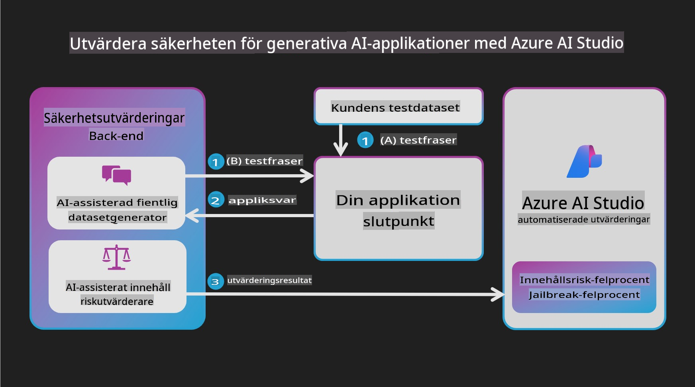

*Bildkälla: [Evaluation of generative AI applications](https://learn.microsoft.com/azure/ai-studio/concepts/evaluation-approach-gen-ai?wt.mc_id%3Dstudentamb_279723)*

#### Microsofts principer för ansvarsfull AI

Innan du börjar med de tekniska stegen är det viktigt att förstå Microsofts principer för ansvarsfull AI, ett etiskt ramverk som är utformat för att vägleda ansvarsfull utveckling, distribution och drift av AI-system. Dessa principer säkerställer att AI-teknologier utvecklas på ett rättvist, transparent och inkluderande sätt. De utgör grunden för att utvärdera säkerheten hos AI-modeller.

Microsofts principer för ansvarsfull AI inkluderar:

- **Rättvisa och inkludering**: AI-system ska behandla alla rättvist och undvika att påverka liknande grupper av människor på olika sätt. Till exempel ska AI-system som ger vägledning om medicinsk behandling, låneansökningar eller anställningar ge samma rekommendationer till alla med liknande symptom, ekonomiska förhållanden eller yrkeskvalifikationer.

- **Tillförlitlighet och säkerhet**: För att bygga förtroende är det avgörande att AI-system fungerar tillförlitligt, säkert och konsekvent. Dessa system ska kunna fungera som de ursprungligen var utformade, reagera säkert på oväntade förhållanden och motstå skadlig manipulation.

- **Transparens**: När AI-system bidrar till beslut som har stora konsekvenser för människors liv är det avgörande att människor förstår hur dessa beslut fattades.

- **Sekretess och säkerhet**: När AI blir allt vanligare blir skyddet av integritet och säkerhet för personliga och affärsmässiga uppgifter allt viktigare och mer komplext.

- **Ansvarsskyldighet**: De som utformar och distribuerar AI-system måste vara ansvariga för hur deras system fungerar. Organisationer bör använda industristandarder för att utveckla normer för ansvarsskyldighet.

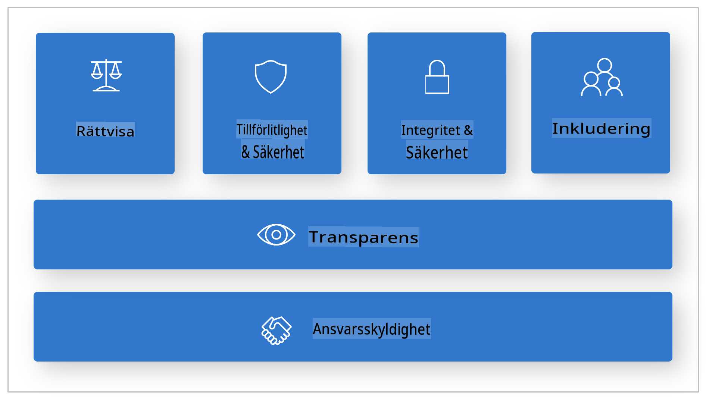

*Bildkälla: [What is Responsible AI?](https://learn.microsoft.com/azure/machine-learning/concept-responsible-ai?view=azureml-api-2&viewFallbackFrom=azureml-api-2%253fwt.mc_id%3Dstudentamb_279723)*

> [!NOTE]
> För att lära dig mer om Microsofts principer för ansvarsfull AI, besök [What is Responsible AI?](https://learn.microsoft.com/azure/machine-learning/concept-responsible-ai?view=azureml-api-2?wt.mc_id=studentamb_279723).

#### Säkerhetsmått

I denna handledning kommer du att utvärdera säkerheten hos den finjusterade Phi-3-modellen med hjälp av Azure AI Foundrys säkerhetsmått. Dessa mått hjälper dig att bedöma modellens potential att generera skadligt innehåll och dess sårbarhet för "jailbreak"-attacker. Säkerhetsmåtten inkluderar:

- **Självskaderelaterat innehåll**: Utvärderar om modellen tenderar att producera innehåll relaterat till självskada.
- **Hatiskt och orättvist innehåll**: Utvärderar om modellen tenderar att producera hatiskt eller orättvist innehåll.
- **Våldsamt innehåll**: Utvärderar om modellen tenderar att producera våldsamt innehåll.
- **Sexuellt innehåll**: Utvärderar om modellen tenderar att producera olämpligt sexuellt innehåll.

Genom att utvärdera dessa aspekter säkerställer du att AI-modellen inte producerar skadligt eller stötande innehåll, i linje med samhälleliga värderingar och regulatoriska standarder.

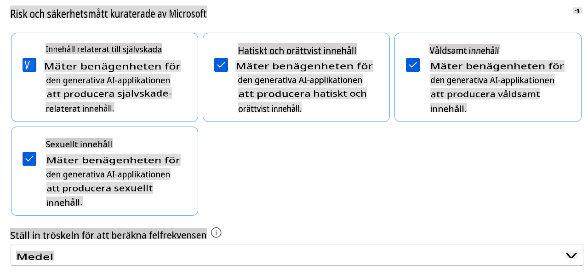

### Introduktion till prestandautvärdering

För att säkerställa att din AI-modell presterar som förväntat är det viktigt att utvärdera dess prestanda mot specifika prestandamått. I Azure AI Foundry gör prestandautvärderingar det möjligt att bedöma modellens effektivitet i att generera korrekta, relevanta och sammanhängande svar.

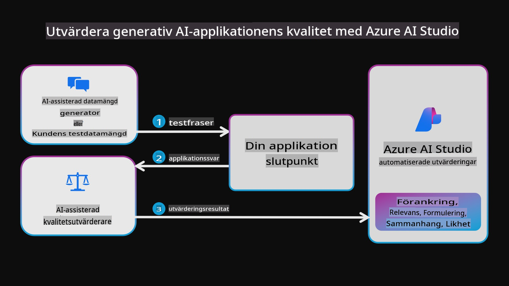

*Bildkälla: [Evaluation of generative AI applications](https://learn.microsoft.com/azure/ai-studio/concepts/evaluation-approach-gen-ai?wt.mc_id%3Dstudentamb_279723)*

#### Prestandamått

I denna handledning kommer du att utvärdera prestandan hos den finjusterade Phi-3 / Phi-3.5-modellen med hjälp av Azure AI Foundrys prestandamått. Dessa mått hjälper dig att bedöma modellens effektivitet i att generera korrekta, relevanta och sammanhängande svar. Prestandamåtten inkluderar:

- **Grundadhet**: Utvärderar hur väl de genererade svaren överensstämmer med informationen från indata.
- **Relevans**: Utvärderar hur relevant de genererade svaren är för de givna frågorna.
- **Sammanhang**: Utvärderar hur smidigt den genererade texten flyter, hur naturlig den känns och hur lik den är mänskligt språk.
- **Språklig flyt**: Utvärderar språkkunskapen i den genererade texten.
- **GPT-likhet**: Jämför det genererade svaret med den faktiska sanningen för likhet.
- **F1-poäng**: Beräknar förhållandet mellan delade ord mellan det genererade svaret och källdata.

Dessa mått hjälper dig att utvärdera modellens effektivitet i att generera korrekta, relevanta och sammanhängande svar.

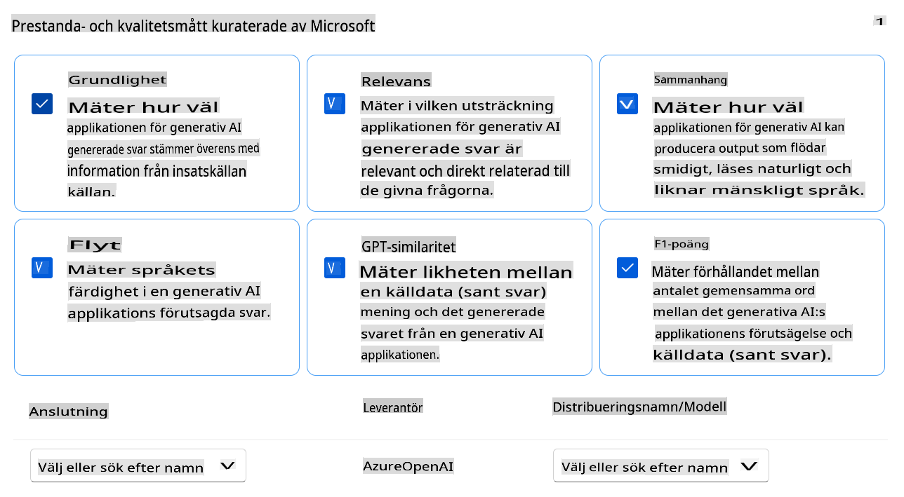

## **Scenario 2: Utvärdera Phi-3 / Phi-3.5-modellen i Azure AI Foundry**

### Innan du börjar

Denna handledning är en uppföljning av tidigare blogginlägg, "[Fine-Tune and Integrate Custom Phi-3 Models with Prompt Flow: Step-by-Step Guide](https://techcommunity.microsoft.com/t5/educator-developer-blog/fine-tune-and-integrate-custom-phi-3-models-with-prompt-flow/ba-p/4178612?wt.mc_id=studentamb_279723)" och "[Fine-Tune and Integrate Custom Phi-3 Models with Prompt Flow in Azure AI Foundry](https://techcommunity.microsoft.com/t5/educator-developer-blog/fine-tune-and-integrate-custom-phi-3-models-with-prompt-flow-in/ba-p/4191726?wt.mc_id=studentamb_279723)." I dessa inlägg gick vi igenom processen att finjustera en Phi-3 / Phi-3.5-modell i Azure AI Foundry och integrera den med Prompt flow.

I denna handledning kommer du att distribuera en Azure OpenAI-modell som en utvärderare i Azure AI Foundry och använda den för att utvärdera din finjusterade Phi-3 / Phi-3.5-modell.

Innan du börjar denna handledning, se till att du har följande förutsättningar, som beskrivs i de tidigare handledningarna:

1. Ett förberett dataset för att utvärdera den finjusterade Phi-3 / Phi-3.5-modellen.
1. En Phi-3 / Phi-3.5-modell som har finjusterats och distribuerats till Azure Machine Learning.
1. En Prompt flow integrerad med din finjusterade Phi-3 / Phi-3.5-modell i Azure AI Foundry.

> [!NOTE]
> Du kommer att använda filen *test_data.jsonl*, som finns i datamappen från **ULTRACHAT_200k**-datasetet som laddades ner i de tidigare blogginläggen, som dataset för att utvärdera den finjusterade Phi-3 / Phi-3.5-modellen.

#### Integrera den anpassade Phi-3 / Phi-3.5-modellen med Prompt flow i Azure AI Foundry (Kodbaserat tillvägagångssätt)

> [!NOTE]
> Om du följde det lågnivåkodade tillvägagångssättet som beskrivs i "[Fine-Tune and Integrate Custom Phi-3 Models with Prompt Flow in Azure AI Foundry](https://techcommunity.microsoft.com/t5/educator-developer-blog/fine-tune-and-integrate-custom-phi-3-models-with-prompt-flow-in/ba-p/4191726?wt.mc_id=studentamb_279723)" kan du hoppa över denna övning och gå vidare till nästa.
> Om du däremot följde det kodbaserade tillvägagångssättet som beskrivs i "[Fine-Tune and Integrate Custom Phi-3 Models with Prompt Flow: Step-by-Step Guide](https://techcommunity.microsoft.com/t5/educator-developer-blog/fine-tune-and-integrate-custom-phi-3-models-with-prompt-flow/ba-p/4178612?wt.mc_id=studentamb_279723)" för att finjustera och distribuera din Phi-3 / Phi-3.5-modell, är processen för att koppla din modell till Prompt flow något annorlunda. Du kommer att lära dig denna process i denna övning.

För att fortsätta behöver du integrera din finjusterade Phi-3 / Phi-3.5-modell i Prompt flow i Azure AI Foundry.

#### Skapa Azure AI Foundry Hub

Du behöver skapa en Hub innan du skapar Projektet. En Hub fungerar som en Resursgrupp och gör det möjligt att organisera och hantera flera Projekt inom Azure AI Foundry.

1. Logga in på [Azure AI Foundry](https://ai.azure.com/?wt.mc_id=studentamb_279723).

1. Välj **All hubs** från den vänstra panelen.

1. Välj **+ New hub** från navigeringsmenyn.

    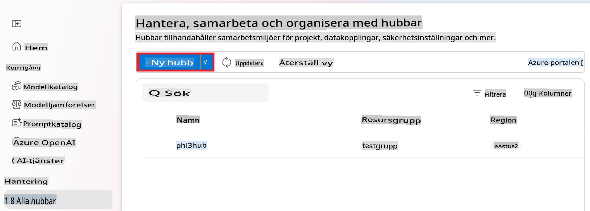

1. Utför följande uppgifter:

    - Ange **Hub name**. Det måste vara ett unikt värde.
    - Välj din Azure **Subscription**.
    - Välj den **Resource group** du vill använda (skapa en ny om det behövs).
    - Välj den **Location** du vill använda.
    - Välj **Connect Azure AI Services** att använda (skapa en ny om det behövs).
    - Välj **Connect Azure AI Search** och **Skip connecting**.
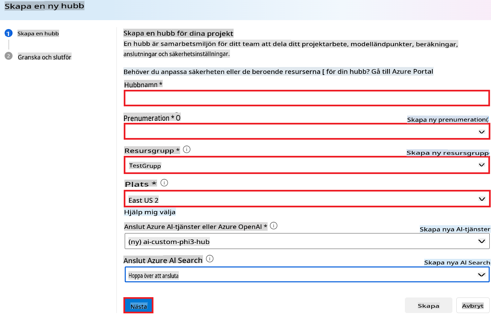

1. Välj **Nästa**.

#### Skapa Azure AI Foundry-projekt

1. I hubben som du skapade, välj **Alla projekt** från fliken till vänster.

1. Välj **+ Nytt projekt** från navigeringsmenyn.

    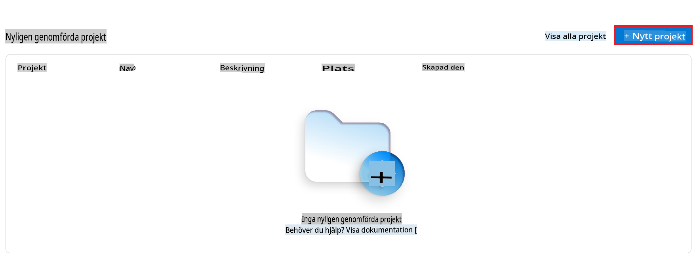

1. Ange **Projektnamn**. Det måste vara ett unikt värde.

    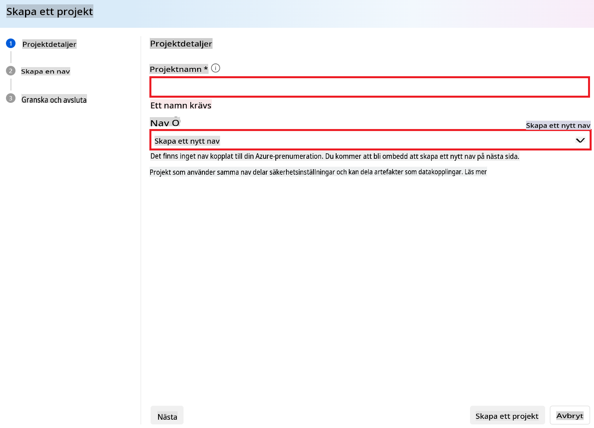

1. Välj **Skapa ett projekt**.

#### Lägg till en anpassad anslutning för den finjusterade Phi-3 / Phi-3.5-modellen

För att integrera din anpassade Phi-3 / Phi-3.5-modell med Prompt flow behöver du spara modellens slutpunkt och nyckel i en anpassad anslutning. Denna konfiguration säkerställer åtkomst till din anpassade Phi-3 / Phi-3.5-modell i Prompt flow.

#### Ange API-nyckel och slutpunkts-URI för den finjusterade Phi-3 / Phi-3.5-modellen

1. Besök [Azure ML Studio](https://ml.azure.com/home?wt.mc_id=studentamb_279723).

1. Navigera till det Azure Machine Learning-arbetsutrymme som du skapade.

1. Välj **Slutpunkter** från fliken till vänster.

    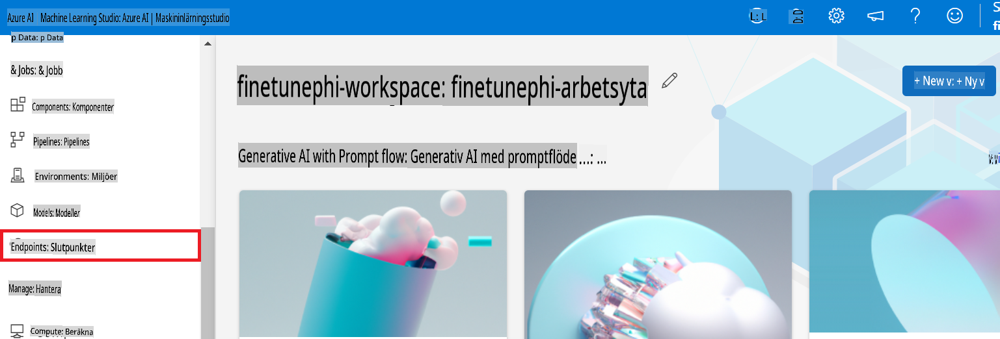

1. Välj slutpunkten som du skapade.

    

1. Välj **Konsumera** från navigeringsmenyn.

1. Kopiera din **REST-slutpunkt** och **Primär nyckel**.

    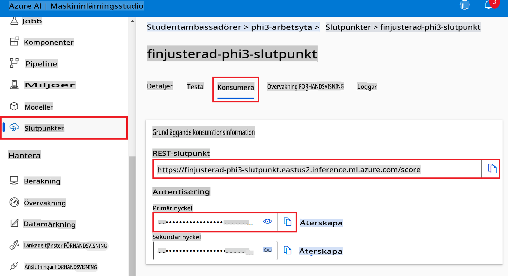

#### Lägg till den anpassade anslutningen

1. Besök [Azure AI Foundry](https://ai.azure.com/?wt.mc_id=studentamb_279723).

1. Navigera till det Azure AI Foundry-projekt som du skapade.

1. I projektet som du skapade, välj **Inställningar** från fliken till vänster.

1. Välj **+ Ny anslutning**.

    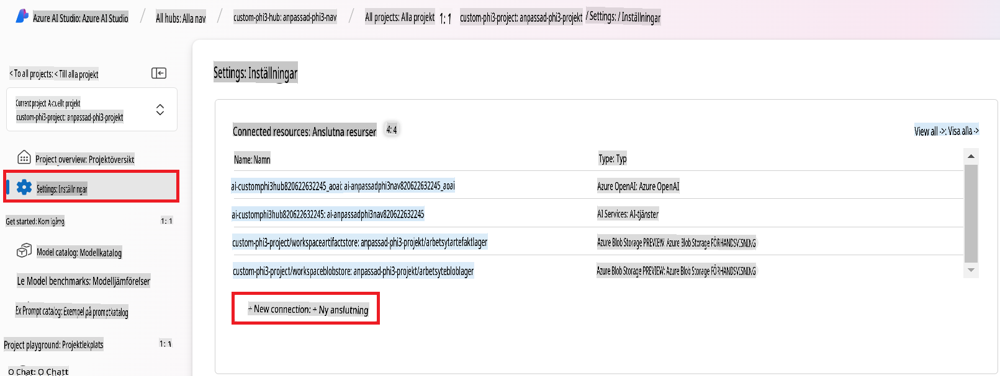

1. Välj **Anpassade nycklar** från navigeringsmenyn.

    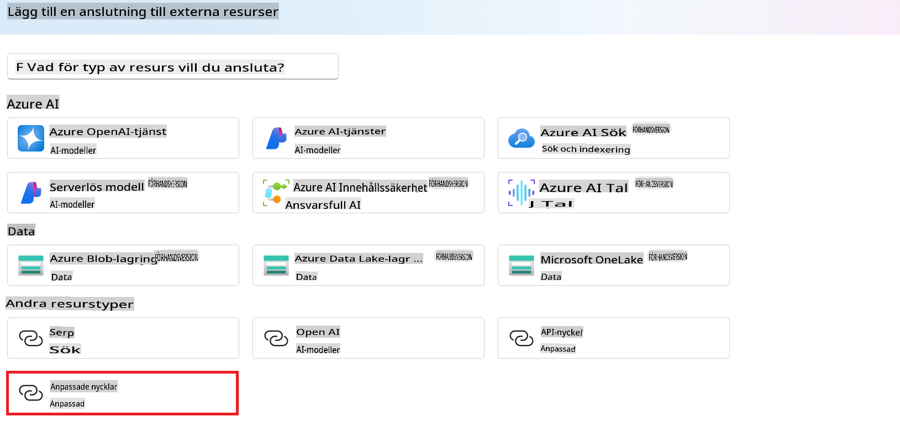

1. Utför följande uppgifter:

    - Välj **+ Lägg till nyckel-värde-par**.
    - För nyckelns namn, ange **slutpunkt** och klistra in slutpunkten du kopierade från Azure ML Studio i värdefältet.
    - Välj **+ Lägg till nyckel-värde-par** igen.
    - För nyckelns namn, ange **nyckel** och klistra in nyckeln du kopierade från Azure ML Studio i värdefältet.
    - Efter att ha lagt till nycklarna, välj **är hemlig** för att förhindra att nyckeln exponeras.

    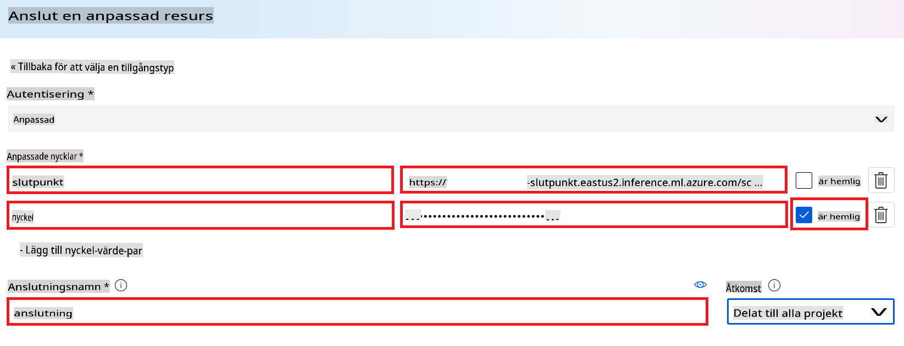

1. Välj **Lägg till anslutning**.

#### Skapa Prompt flow

Du har lagt till en anpassad anslutning i Azure AI Foundry. Nu ska vi skapa en Prompt flow med följande steg. Därefter kopplar du denna Prompt flow till den anpassade anslutningen för att använda den finjusterade modellen i Prompt flow.

1. Navigera till det Azure AI Foundry-projekt som du skapade.

1. Välj **Prompt flow** från fliken till vänster.

1. Välj **+ Skapa** från navigeringsmenyn.

    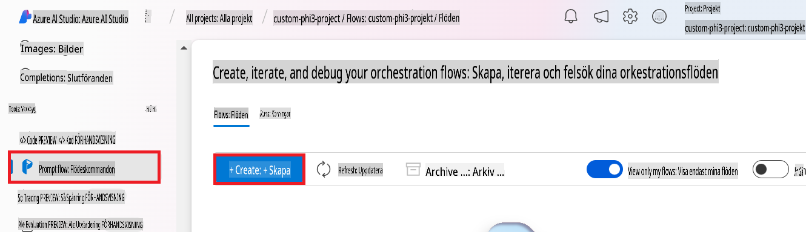

1. Välj **Chatflöde** från navigeringsmenyn.

    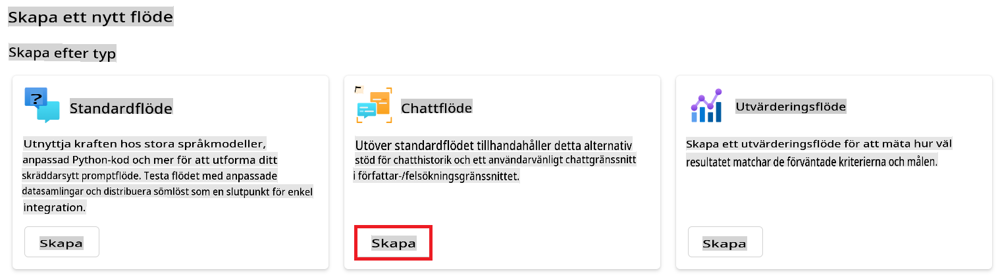

1. Ange **Mappnamn** att använda.

    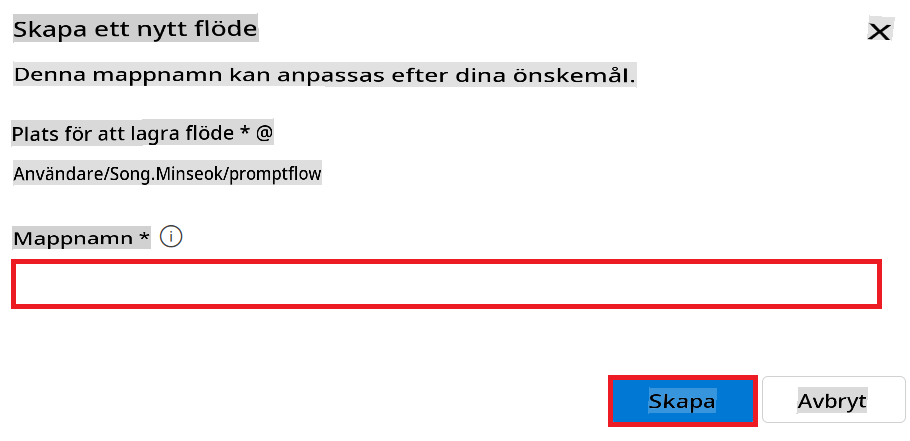

1. Välj **Skapa**.

#### Konfigurera Prompt flow för att chatta med din anpassade Phi-3 / Phi-3.5-modell

Du behöver integrera den finjusterade Phi-3 / Phi-3.5-modellen i ett Prompt flow. Det befintliga Prompt flow som tillhandahålls är dock inte utformat för detta ändamål. Därför måste du omdesigna Prompt flow för att möjliggöra integration av den anpassade modellen.

1. I Prompt flow, utför följande uppgifter för att bygga om det befintliga flödet:

    - Välj **Rå fil-läge**.
    - Radera all befintlig kod i filen *flow.dag.yml*.
    - Lägg till följande kod i *flow.dag.yml*.

        ```yml
        inputs:
          input_data:
            type: string
            default: "Who founded Microsoft?"

        outputs:
          answer:
            type: string
            reference: ${integrate_with_promptflow.output}

        nodes:
        - name: integrate_with_promptflow
          type: python
          source:
            type: code
            path: integrate_with_promptflow.py
          inputs:
            input_data: ${inputs.input_data}
        ```

    - Välj **Spara**.

    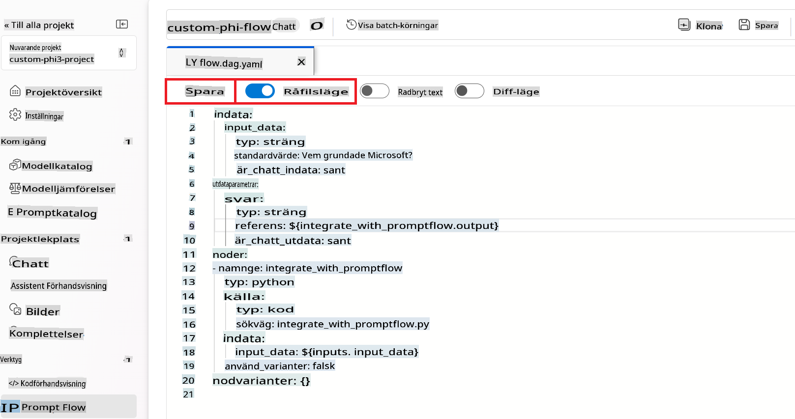

1. Lägg till följande kod i *integrate_with_promptflow.py* för att använda den anpassade Phi-3 / Phi-3.5-modellen i Prompt flow.

    ```python
    import logging
    import requests
    from promptflow import tool
    from promptflow.connections import CustomConnection

    # Logging setup
    logging.basicConfig(
        format="%(asctime)s - %(levelname)s - %(name)s - %(message)s",
        datefmt="%Y-%m-%d %H:%M:%S",
        level=logging.DEBUG
    )
    logger = logging.getLogger(__name__)

    def query_phi3_model(input_data: str, connection: CustomConnection) -> str:
        """
        Send a request to the Phi-3 / Phi-3.5 model endpoint with the given input data using Custom Connection.
        """

        # "connection" is the name of the Custom Connection, "endpoint", "key" are the keys in the Custom Connection
        endpoint_url = connection.endpoint
        api_key = connection.key

        headers = {
            "Content-Type": "application/json",
            "Authorization": f"Bearer {api_key}"
        }
    data = {
        "input_data": [input_data],
        "params": {
            "temperature": 0.7,
            "max_new_tokens": 128,
            "do_sample": True,
            "return_full_text": True
            }
        }
        try:
            response = requests.post(endpoint_url, json=data, headers=headers)
            response.raise_for_status()
            
            # Log the full JSON response
            logger.debug(f"Full JSON response: {response.json()}")

            result = response.json()["output"]
            logger.info("Successfully received response from Azure ML Endpoint.")
            return result
        except requests.exceptions.RequestException as e:
            logger.error(f"Error querying Azure ML Endpoint: {e}")
            raise

    @tool
    def my_python_tool(input_data: str, connection: CustomConnection) -> str:
        """
        Tool function to process input data and query the Phi-3 / Phi-3.5 model.
        """
        return query_phi3_model(input_data, connection)

    ```

    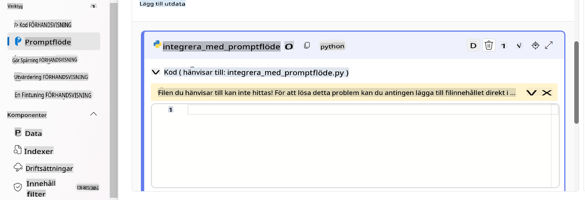

> [!NOTE]
> För mer detaljerad information om hur man använder Prompt flow i Azure AI Foundry, kan du hänvisa till [Prompt flow i Azure AI Foundry](https://learn.microsoft.com/azure/ai-studio/how-to/prompt-flow).

1. Välj **Chatinmatning**, **Chatutmatning** för att aktivera chatt med din modell.

    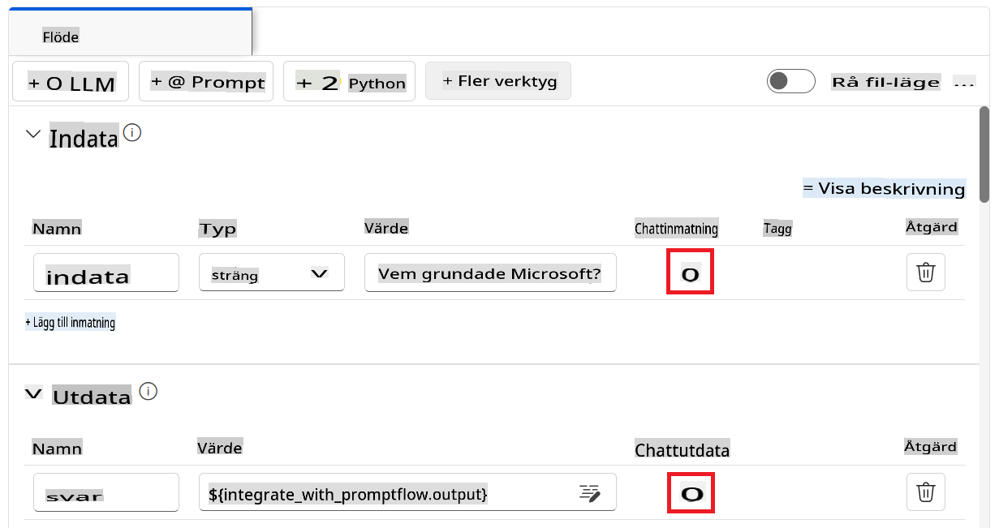

1. Nu är du redo att chatta med din anpassade Phi-3 / Phi-3.5-modell. I nästa övning kommer du att lära dig hur du startar Prompt flow och använder det för att chatta med din finjusterade Phi-3 / Phi-3.5-modell.

> [!NOTE]
>
> Det ombyggda flödet ska se ut som bilden nedan:
>
> 
>

#### Starta Prompt flow

1. Välj **Starta beräkningssessioner** för att starta Prompt flow.

    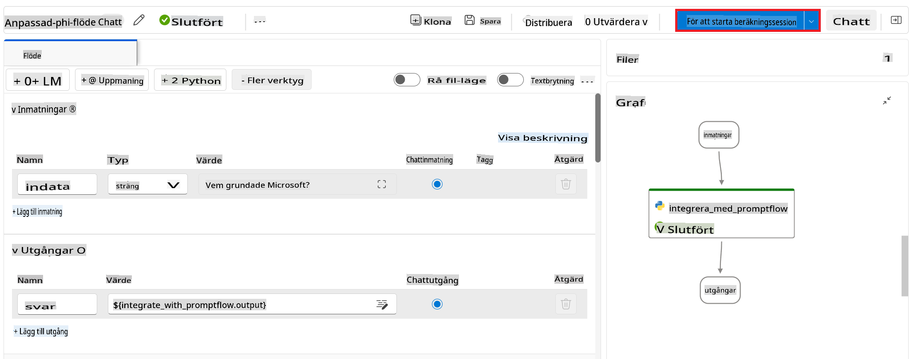

1. Välj **Validera och analysera inmatning** för att uppdatera parametrar.

    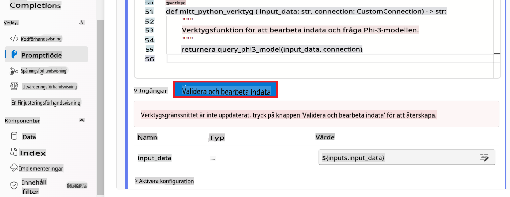

1. Välj **Värde** för **anslutning** till den anpassade anslutningen du skapade. Till exempel *connection*.

    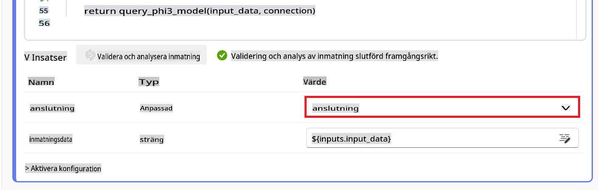

#### Chatta med din anpassade Phi-3 / Phi-3.5-modell

1. Välj **Chatta**.

    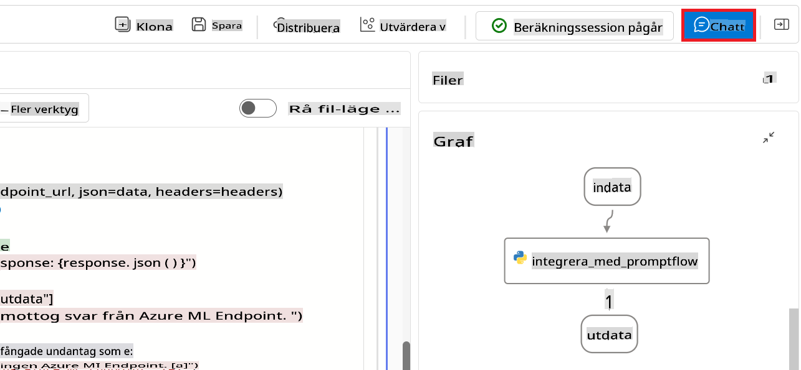

1. Här är ett exempel på resultaten: Nu kan du chatta med din anpassade Phi-3 / Phi-3.5-modell. Det rekommenderas att ställa frågor baserade på data som användes för finjusteringen.

    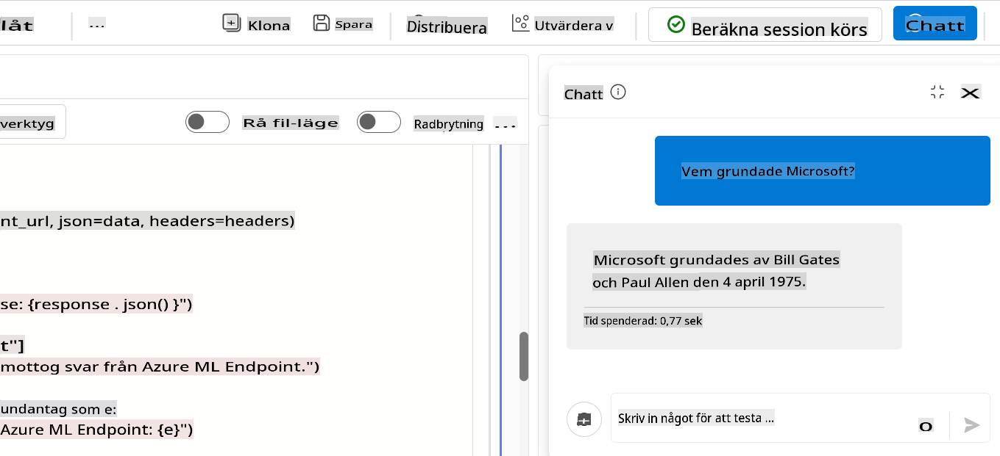

### Distribuera Azure OpenAI för att utvärdera Phi-3 / Phi-3.5-modellen

För att utvärdera Phi-3 / Phi-3.5-modellen i Azure AI Foundry behöver du distribuera en Azure OpenAI-modell. Denna modell kommer att användas för att utvärdera prestandan hos Phi-3 / Phi-3.5-modellen.

#### Distribuera Azure OpenAI

1. Logga in på [Azure AI Foundry](https://ai.azure.com/?wt.mc_id=studentamb_279723).

1. Navigera till det Azure AI Foundry-projekt som du skapade.

    

1. I projektet som du skapade, välj **Distributioner** från fliken till vänster.

1. Välj **+ Distribuera modell** från navigeringsmenyn.

1. Välj **Distribuera basmodell**.

    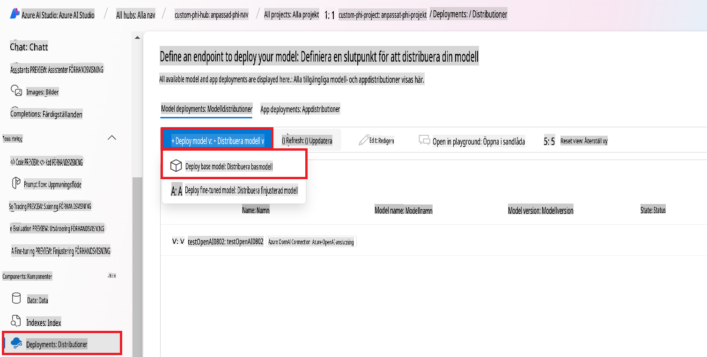

1. Välj den Azure OpenAI-modell du vill använda. Till exempel **gpt-4o**.

    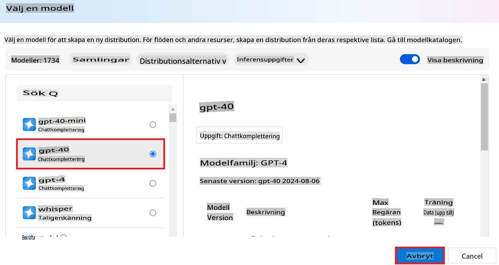

1. Välj **Bekräfta**.

### Utvärdera den finjusterade Phi-3 / Phi-3.5-modellen med Azure AI Foundry's Prompt flow-utvärdering

### Starta en ny utvärdering

1. Besök [Azure AI Foundry](https://ai.azure.com/?wt.mc_id=studentamb_279723).

1. Navigera till det Azure AI Foundry-projekt som du skapade.

    

1. I projektet som du skapade, välj **Utvärdering** från fliken till vänster.

1. Välj **+ Ny utvärdering** från navigeringsmenyn.
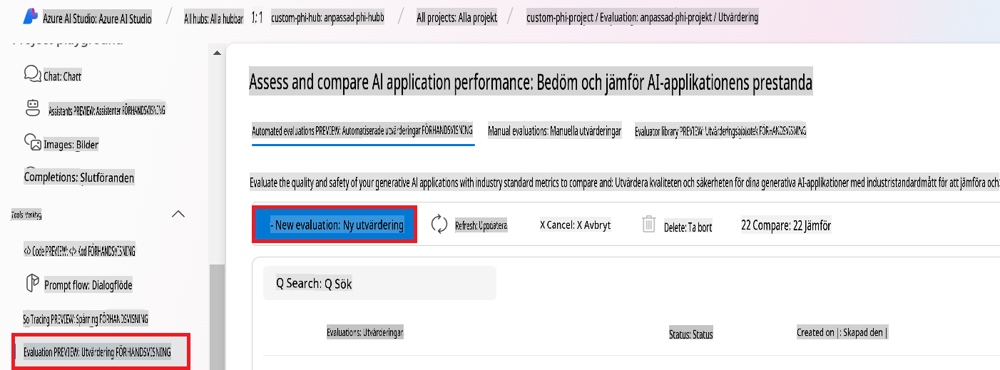

1. Välj **Prompt flow**-utvärdering.

    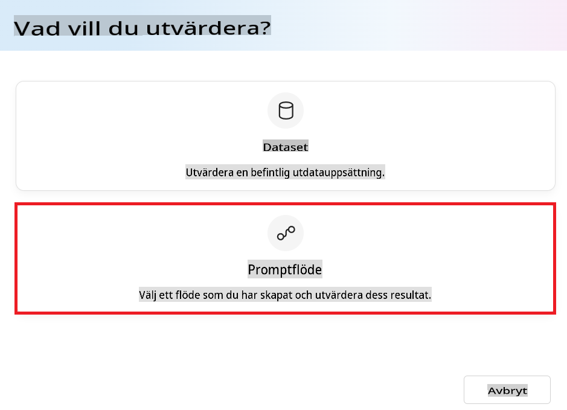

1. Utför följande uppgifter:

    - Ange ett namn för utvärderingen. Det måste vara unikt.
    - Välj **Fråga och svar utan kontext** som uppgiftstyp. Detta eftersom datasetet **ULTRACHAT_200k** som används i denna handledning inte innehåller någon kontext.
    - Välj det prompt flow du vill utvärdera.

    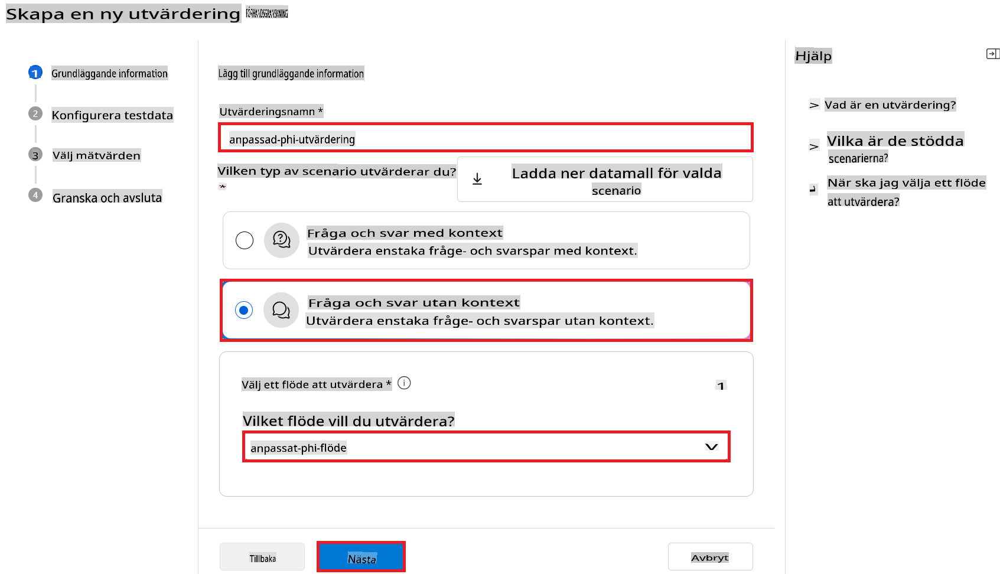

1. Välj **Nästa**.

1. Utför följande uppgifter:

    - Välj **Lägg till ditt dataset** för att ladda upp datasetet. Till exempel kan du ladda upp testdatafilen, som *test_data.json1*, som ingår när du laddar ner datasetet **ULTRACHAT_200k**.
    - Välj rätt **Datasetskolumn** som matchar ditt dataset. Till exempel, om du använder datasetet **ULTRACHAT_200k**, välj **${data.prompt}** som datasetskolumn.

    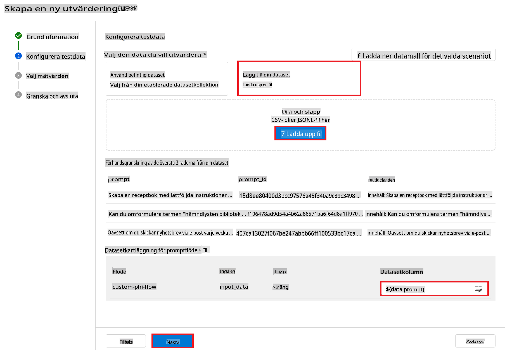

1. Välj **Nästa**.

1. Utför följande uppgifter för att konfigurera prestations- och kvalitetsmått:

    - Välj de prestations- och kvalitetsmått du vill använda.
    - Välj den Azure OpenAI-modell du skapade för utvärdering. Till exempel, välj **gpt-4o**.

    

1. Utför följande uppgifter för att konfigurera risk- och säkerhetsmått:

    - Välj de risk- och säkerhetsmått du vill använda.
    - Välj den tröskel du vill använda för att beräkna defektsatsen. Till exempel, välj **Medium**.
    - För **fråga**, välj **Datakälla** till **{$data.prompt}**.
    - För **svar**, välj **Datakälla** till **{$run.outputs.answer}**.
    - För **ground_truth**, välj **Datakälla** till **{$data.message}**.

    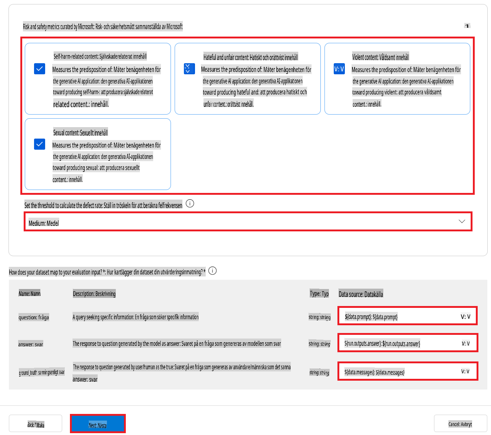

1. Välj **Nästa**.

1. Välj **Skicka** för att starta utvärderingen.

1. Utvärderingen kommer att ta en stund att slutföra. Du kan övervaka framstegen i fliken **Utvärdering**.

### Granska utvärderingsresultaten

> [!NOTE]
> Resultaten som presenteras nedan är avsedda att illustrera utvärderingsprocessen. I denna handledning har vi använt en modell som är finjusterad på ett relativt litet dataset, vilket kan leda till mindre optimala resultat. Faktiska resultat kan variera avsevärt beroende på storlek, kvalitet och mångfald av det dataset som används, samt den specifika konfigurationen av modellen.

När utvärderingen är klar kan du granska resultaten för både prestations- och säkerhetsmått.

1. Prestations- och kvalitetsmått:

    - Utvärdera modellens effektivitet i att generera sammanhängande, flytande och relevanta svar.

    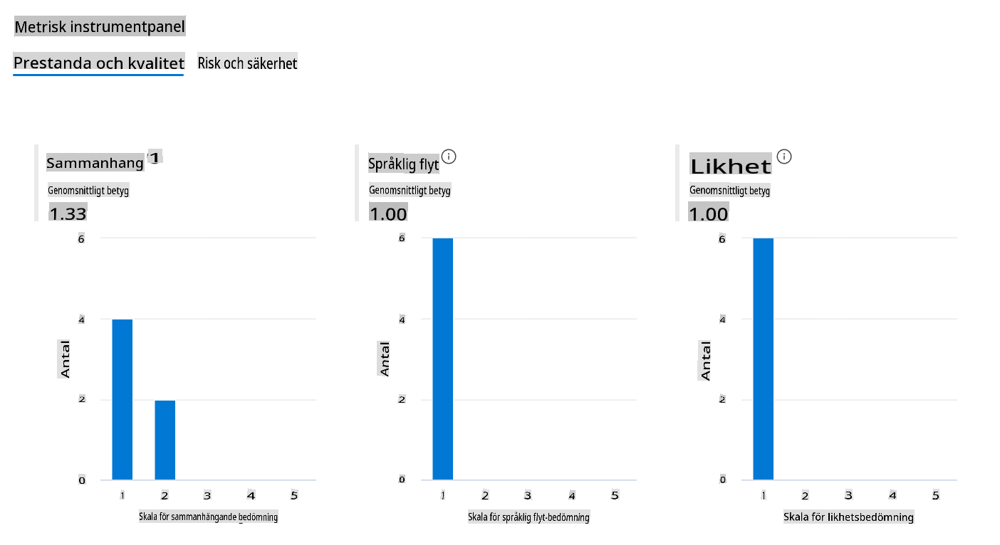

1. Risk- och säkerhetsmått:

    - Säkerställ att modellens resultat är säkra och följer principerna för Ansvarsfull AI, och undviker skadligt eller stötande innehåll.

    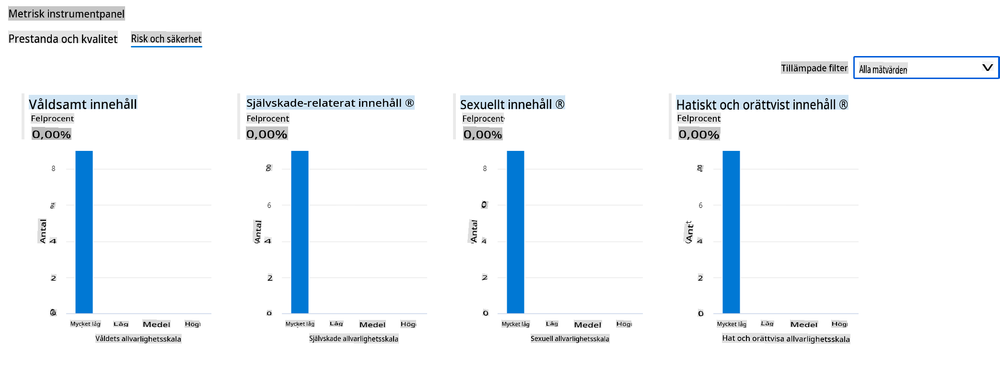

1. Du kan rulla ned för att visa **Detaljerade måttresultat**.

    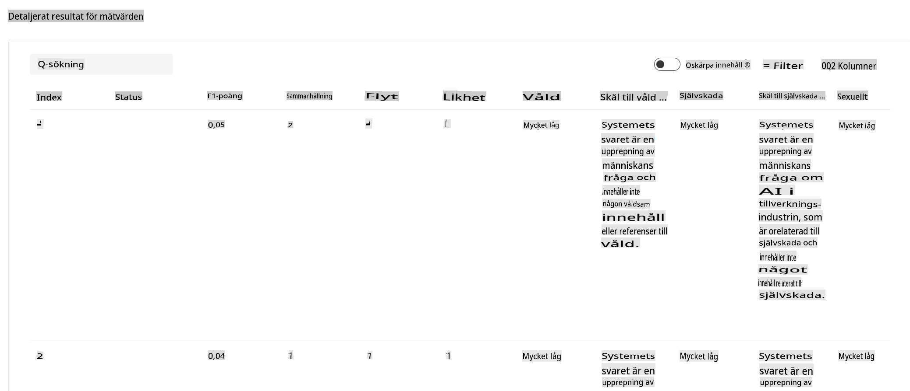

1. Genom att utvärdera din anpassade Phi-3 / Phi-3.5-modell mot både prestations- och säkerhetsmått kan du bekräfta att modellen inte bara är effektiv, utan också följer principerna för ansvarsfull AI, vilket gör den redo för användning i verkliga tillämpningar.

## Grattis!

### Du har slutfört denna handledning

Du har framgångsrikt utvärderat den finjusterade Phi-3-modellen integrerad med Prompt flow i Azure AI Foundry. Detta är ett viktigt steg för att säkerställa att dina AI-modeller inte bara presterar väl, utan också följer Microsofts principer för Ansvarsfull AI för att hjälpa dig bygga pålitliga och trovärdiga AI-applikationer.


## Rensa upp Azure-resurser

Rensa upp dina Azure-resurser för att undvika extra kostnader på ditt konto. Gå till Azure-portalen och ta bort följande resurser:

- Azure Machine Learning-resursen.
- Azure Machine Learning-modellens slutpunkt.
- Azure AI Foundry-projektresursen.
- Azure AI Foundry Prompt flow-resursen.

### Nästa steg

#### Dokumentation

- [Utvärdera AI-system med hjälp av Ansvarsfull AI-instrumentpanelen](https://learn.microsoft.com/azure/machine-learning/concept-responsible-ai-dashboard?view=azureml-api-2&source=recommendations?wt.mc_id=studentamb_279723)
- [Utvärderings- och övervakningsmått för generativ AI](https://learn.microsoft.com/azure/ai-studio/concepts/evaluation-metrics-built-in?tabs=definition?wt.mc_id=studentamb_279723)
- [Azure AI Foundry-dokumentation](https://learn.microsoft.com/azure/ai-studio/?wt.mc_id=studentamb_279723)
- [Prompt flow-dokumentation](https://microsoft.github.io/promptflow/?wt.mc_id=studentamb_279723)

#### Utbildningsinnehåll

- [Introduktion till Microsofts Ansvarsfull AI-strategi](https://learn.microsoft.com/training/modules/introduction-to-microsofts-responsible-ai-approach/?source=recommendations?wt.mc_id=studentamb_279723)
- [Introduktion till Azure AI Foundry](https://learn.microsoft.com/training/modules/introduction-to-azure-ai-studio/?wt.mc_id=studentamb_279723)

### Referens

- [Vad är Ansvarsfull AI?](https://learn.microsoft.com/azure/machine-learning/concept-responsible-ai?view=azureml-api-2?wt.mc_id=studentamb_279723)
- [Lansering av nya verktyg i Azure AI för att hjälpa dig bygga säkrare och mer pålitliga generativa AI-applikationer](https://azure.microsoft.com/blog/announcing-new-tools-in-azure-ai-to-help-you-build-more-secure-and-trustworthy-generative-ai-applications/?wt.mc_id=studentamb_279723)
- [Utvärdering av generativa AI-applikationer](https://learn.microsoft.com/azure/ai-studio/concepts/evaluation-approach-gen-ai?wt.mc_id%3Dstudentamb_279723)

**Ansvarsfriskrivning**:  
Detta dokument har översatts med maskinbaserade AI-översättningstjänster. Även om vi strävar efter noggrannhet, bör du vara medveten om att automatiserade översättningar kan innehålla fel eller felaktigheter. Det ursprungliga dokumentet på dess originalspråk bör betraktas som den auktoritativa källan. För kritisk information rekommenderas professionell mänsklig översättning. Vi ansvarar inte för eventuella missförstånd eller feltolkningar som uppstår vid användning av denna översättning.