# Finjustera och integrera anpassade Phi-3-modeller med Prompt flow i Azure AI Foundry

Detta end-to-end (E2E) exempel är baserat på guiden "[Fine-Tune and Integrate Custom Phi-3 Models with Prompt Flow in Azure AI Foundry](https://techcommunity.microsoft.com/t5/educator-developer-blog/fine-tune-and-integrate-custom-phi-3-models-with-prompt-flow-in/ba-p/4191726?WT.mc_id=aiml-137032-kinfeylo)" från Microsoft Tech Community. Det beskriver processen för att finjustera, distribuera och integrera anpassade Phi-3-modeller med Prompt flow i Azure AI Foundry.  
Till skillnad från E2E-exemplet "[Fine-Tune and Integrate Custom Phi-3 Models with Prompt Flow](./E2E_Phi-3-FineTuning_PromptFlow_Integration.md)", som innebar att köra kod lokalt, fokuserar denna handledning helt på att finjustera och integrera din modell i Azure AI / ML Studio.

## Översikt

I detta E2E-exempel kommer du att lära dig hur man finjusterar Phi-3-modellen och integrerar den med Prompt flow i Azure AI Foundry. Genom att använda Azure AI / ML Studio kommer du att skapa ett arbetsflöde för att distribuera och använda anpassade AI-modeller. Detta E2E-exempel är uppdelat i tre scenarier:

**Scenario 1: Skapa Azure-resurser och förbered för finjustering**

**Scenario 2: Finjustera Phi-3-modellen och distribuera i Azure Machine Learning Studio**

**Scenario 3: Integrera med Prompt flow och chatta med din anpassade modell i Azure AI Foundry**

Här är en översikt av detta E2E-exempel.

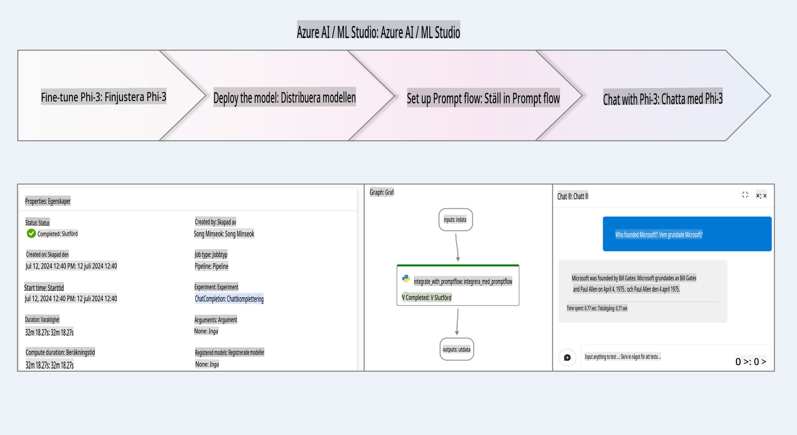

### Innehållsförteckning

1. **[Scenario 1: Skapa Azure-resurser och förbered för finjustering](../../../../../../md/02.Application/01.TextAndChat/Phi3)**
    - [Skapa ett Azure Machine Learning-arbetsutrymme](../../../../../../md/02.Application/01.TextAndChat/Phi3)
    - [Begär GPU-kvoter i Azure-prenumeration](../../../../../../md/02.Application/01.TextAndChat/Phi3)
    - [Lägg till rolltilldelning](../../../../../../md/02.Application/01.TextAndChat/Phi3)
    - [Ställ in projekt](../../../../../../md/02.Application/01.TextAndChat/Phi3)
    - [Förbered dataset för finjustering](../../../../../../md/02.Application/01.TextAndChat/Phi3)

1. **[Scenario 2: Finjustera Phi-3-modellen och distribuera i Azure Machine Learning Studio](../../../../../../md/02.Application/01.TextAndChat/Phi3)**
    - [Finjustera Phi-3-modellen](../../../../../../md/02.Application/01.TextAndChat/Phi3)
    - [Distribuera den finjusterade Phi-3-modellen](../../../../../../md/02.Application/01.TextAndChat/Phi3)

1. **[Scenario 3: Integrera med Prompt flow och chatta med din anpassade modell i Azure AI Foundry](../../../../../../md/02.Application/01.TextAndChat/Phi3)**
    - [Integrera den anpassade Phi-3-modellen med Prompt flow](../../../../../../md/02.Application/01.TextAndChat/Phi3)
    - [Chatta med din anpassade Phi-3-modell](../../../../../../md/02.Application/01.TextAndChat/Phi3)

## Scenario 1: Skapa Azure-resurser och förbered för finjustering

### Skapa ett Azure Machine Learning-arbetsutrymme

1. Skriv *azure machine learning* i **sökrutan** högst upp på portalsidan och välj **Azure Machine Learning** från alternativen som visas.

    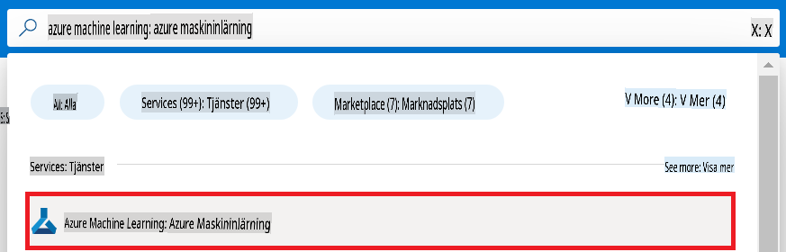

2. Välj **+ Skapa** från navigationsmenyn.

3. Välj **Nytt arbetsutrymme** från navigationsmenyn.

    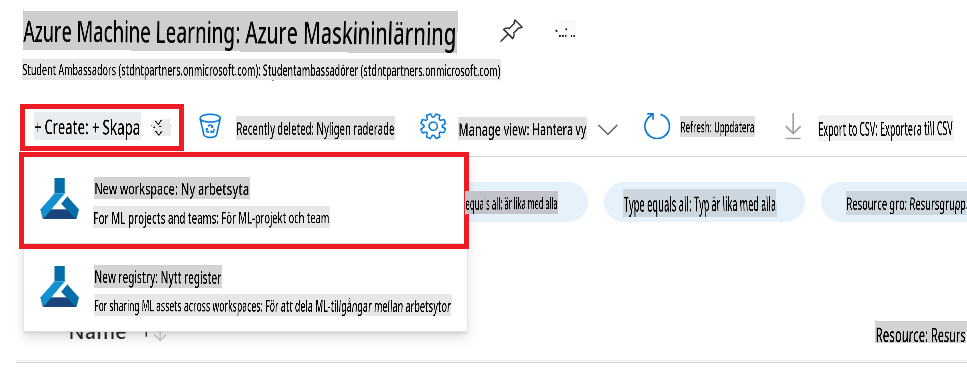

4. Utför följande uppgifter:

    - Välj din Azure **Prenumeration**.
    - Välj den **Resursgrupp** du vill använda (skapa en ny om det behövs).
    - Ange **Arbetsutrymmets namn**. Det måste vara ett unikt värde.
    - Välj den **Region** du vill använda.
    - Välj det **Lagringskonto** du vill använda (skapa ett nytt om det behövs).
    - Välj **Nyckelvalv** att använda (skapa ett nytt om det behövs).
    - Välj **Application Insights** att använda (skapa ett nytt om det behövs).
    - Välj **Containerregister** att använda (skapa ett nytt om det behövs).

    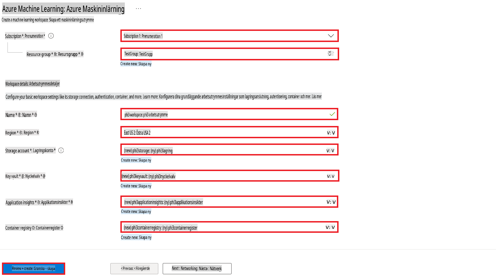

5. Välj **Granska + Skapa**.

6. Välj **Skapa**.

### Begär GPU-kvoter i Azure-prenumeration

I denna handledning kommer du att lära dig hur man finjusterar och distribuerar en Phi-3-modell med hjälp av GPU:er. För finjustering kommer du att använda *Standard_NC24ads_A100_v4*-GPU, som kräver en kvotbegäran. För distribution kommer du att använda *Standard_NC6s_v3*-GPU, som också kräver en kvotbegäran.

> [!NOTE]
>
> Endast Pay-As-You-Go-prenumerationer (standardprenumerationstypen) är berättigade till GPU-tilldelning; förmånsprenumerationer stöds för närvarande inte.
>

1. Besök [Azure ML Studio](https://ml.azure.com/home?wt.mc_id=studentamb_279723).

1. Utför följande uppgifter för att begära *Standard NCADSA100v4 Family*-kvot:

    - Välj **Kvot** från vänstra fliken.
    - Välj den **Virtuella maskinfamilj** du vill använda. Till exempel, välj **Standard NCADSA100v4 Family Cluster Dedicated vCPUs**, som inkluderar *Standard_NC24ads_A100_v4*-GPU.
    - Välj **Begär kvot** från navigationsmenyn.

        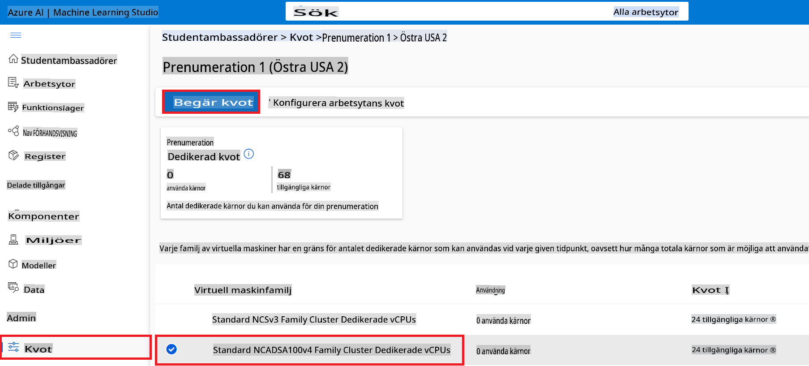

    - På sidan för kvotbegäran, ange den **Nya kärnbegränsningen** du vill använda. Till exempel 24.
    - På sidan för kvotbegäran, välj **Skicka** för att begära GPU-kvoten.

1. Utför följande uppgifter för att begära *Standard NCSv3 Family*-kvot:

    - Välj **Kvot** från vänstra fliken.
    - Välj den **Virtuella maskinfamilj** du vill använda. Till exempel, välj **Standard NCSv3 Family Cluster Dedicated vCPUs**, som inkluderar *Standard_NC6s_v3*-GPU.
    - Välj **Begär kvot** från navigationsmenyn.
    - På sidan för kvotbegäran, ange den **Nya kärnbegränsningen** du vill använda. Till exempel 24.
    - På sidan för kvotbegäran, välj **Skicka** för att begära GPU-kvoten.

### Lägg till rolltilldelning

För att finjustera och distribuera dina modeller måste du först skapa en Användartilldelad Hanterad Identitet (UAI) och tilldela den lämpliga behörigheter. Denna UAI kommer att användas för autentisering under distributionen.

#### Skapa användartilldelad hanterad identitet (UAI)

1. Skriv *managed identities* i **sökrutan** högst upp på portalsidan och välj **Managed Identities** från alternativen som visas.

    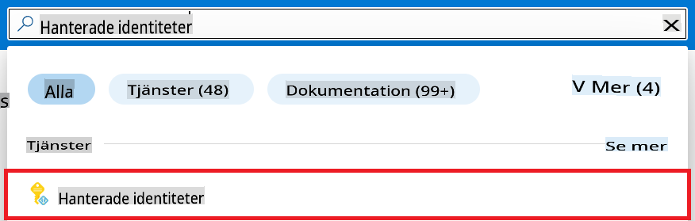

1. Välj **+ Skapa**.

    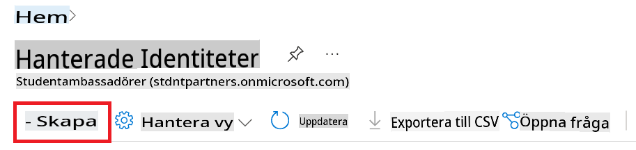

1. Utför följande uppgifter:

    - Välj din Azure **Prenumeration**.
    - Välj den **Resursgrupp** du vill använda (skapa en ny om det behövs).
    - Välj den **Region** du vill använda.
    - Ange **Namn**. Det måste vara ett unikt värde.

    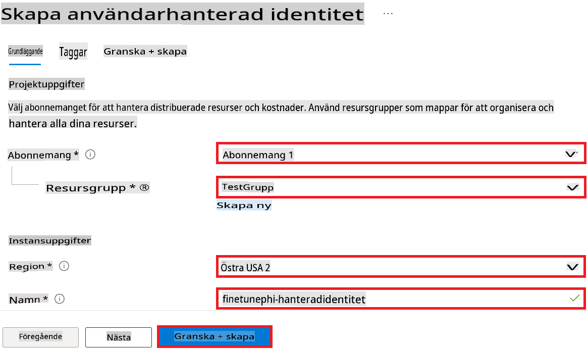

1. Välj **Granska + skapa**.

1. Välj **+ Skapa**.

#### Lägg till Contributor-rolltilldelning till hanterad identitet

1. Navigera till resursen för den hanterade identiteten som du skapade.

1. Välj **Azure-rolltilldelningar** från vänstra fliken.

1. Välj **+Lägg till rolltilldelning** från navigationsmenyn.

1. På sidan Lägg till rolltilldelning, utför följande uppgifter:
    - Välj **Scope** till **Resursgrupp**.
    - Välj din Azure **Prenumeration**.
    - Välj den **Resursgrupp** du vill använda.
    - Välj **Roll** till **Contributor**.

    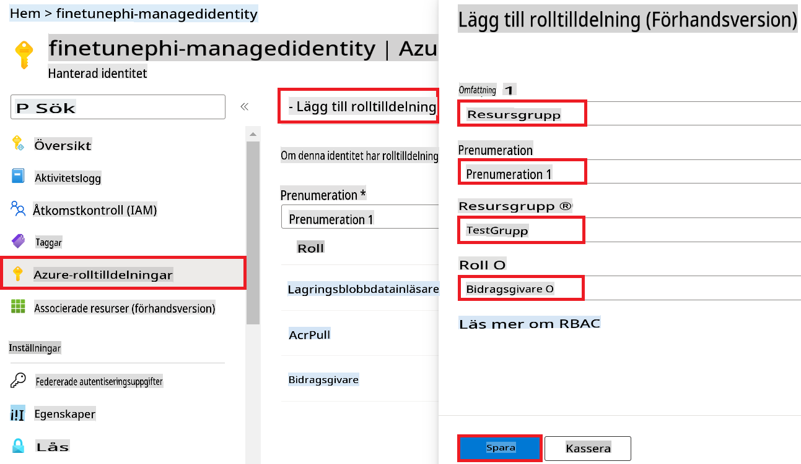

2. Välj **Spara**.

#### Lägg till Storage Blob Data Reader-rolltilldelning till hanterad identitet

1. Skriv *storage accounts* i **sökrutan** högst upp på portalsidan och välj **Storage accounts** från alternativen som visas.

    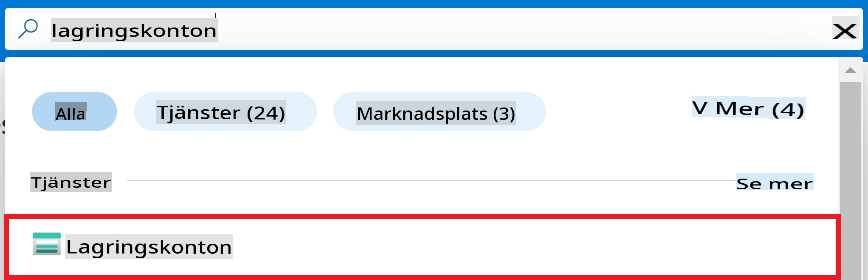

1. Välj lagringskontot som är kopplat till det Azure Machine Learning-arbetsutrymme som du skapade. Till exempel *finetunephistorage*.

1. Utför följande uppgifter för att navigera till sidan Lägg till rolltilldelning:

    - Navigera till det Azure Storage-konto som du skapade.
    - Välj **Åtkomstkontroll (IAM)** från vänstra fliken.
    - Välj **+ Lägg till** från navigationsmenyn.
    - Välj **Lägg till rolltilldelning** från navigationsmenyn.

    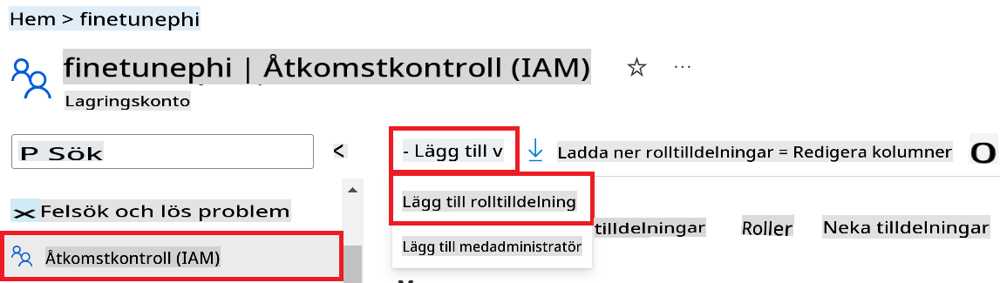

1. På sidan Lägg till rolltilldelning, utför följande uppgifter:

    - På rollen-sidan, skriv *Storage Blob Data Reader* i **sökrutan** och välj **Storage Blob Data Reader** från alternativen som visas.
    - På rollen-sidan, välj **Nästa**.
    - På medlemmar-sidan, välj **Tilldela åtkomst till** **Hanterad identitet**.
    - På medlemmar-sidan, välj **+ Välj medlemmar**.
    - På sidan Välj hanterade identiteter, välj din Azure **Prenumeration**.
    - På sidan Välj hanterade identiteter, välj **Hanterad identitet** till **Manage Identity**.
    - På sidan Välj hanterade identiteter, välj den hanterade identitet som du skapade. Till exempel *finetunephi-managedidentity*.
    - På sidan Välj hanterade identiteter, välj **Välj**.

    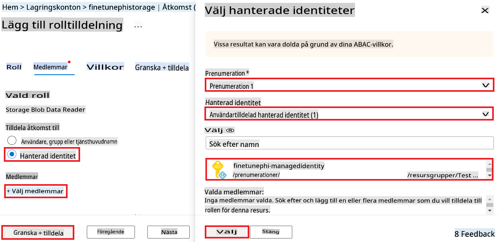

1. Välj **Granska + tilldela**.

#### Lägg till AcrPull-rolltilldelning till hanterad identitet

1. Skriv *container registries* i **sökrutan** högst upp på portalsidan och välj **Container registries** från alternativen som visas.

    

1. Välj containerregistret som är kopplat till Azure Machine Learning-arbetsutrymmet. Till exempel *finetunephicontainerregistry*.

1. Utför följande uppgifter för att navigera till sidan Lägg till rolltilldelning:

    - Välj **Åtkomstkontroll (IAM)** från vänstra fliken.
    - Välj **+ Lägg till** från navigationsmenyn.
    - Välj **Lägg till rolltilldelning** från navigationsmenyn.

1. På sidan Lägg till rolltilldelning, utför följande uppgifter:

    - På rollen-sidan, skriv *AcrPull* i **sökrutan** och välj **AcrPull** från alternativen som visas.
    - På rollen-sidan, välj **Nästa**.
    - På medlemmar-sidan, välj **Tilldela åtkomst till** **Hanterad identitet**.
    - På medlemmar-sidan, välj **+ Välj medlemmar**.
    - På sidan Välj hanterade identiteter, välj din Azure **Prenumeration**.
    - På sidan Välj hanterade identiteter, välj **Hanterad identitet** till **Manage Identity**.
    - På sidan Välj hanterade identiteter, välj den hanterade identitet som du skapade. Till exempel *finetunephi-managedidentity*.
    - På sidan Välj hanterade identiteter, välj **Välj**.
    - Välj **Granska + tilldela**.

### Ställ in projekt

För att ladda ner de dataset som behövs för finjustering kommer du att ställa in en lokal miljö.

I denna övning kommer du att:

- Skapa en mapp att arbeta i.
- Skapa en virtuell miljö.
- Installera de nödvändiga paketen.
- Skapa en *download_dataset.py*-fil för att ladda ner dataset.

#### Skapa en mapp att arbeta i

1. Öppna ett terminalfönster och skriv följande kommando för att skapa en mapp med namnet *finetune-phi* i standardvägen.

    ```console
    mkdir finetune-phi
    ```

2. Skriv följande kommando i din terminal för att navigera till den skapade mappen *finetune-phi*.

    ```console
    cd finetune-phi
    ```

#### Skapa en virtuell miljö

1. Skriv följande kommando i din terminal för att skapa en virtuell miljö med namnet *.venv*.

    ```console
    python -m venv .venv
    ```

2. Skriv följande kommando i din terminal för att aktivera den virtuella miljön.

    ```console
    .venv\Scripts\activate.bat
    ```

> [!NOTE]
> Om det fungerade bör du se *(.venv)* före kommandoprompten.

#### Installera de nödvändiga paketen

1. Skriv följande kommandon i din terminal för att installera de nödvändiga paketen.

    ```console
    pip install datasets==2.19.1
    ```

#### Skapa `download_dataset.py`

> [!NOTE]
> Komplett mappstruktur:
>
> ```text
> └── YourUserName
> .    └── finetune-phi
> .        └── download_dataset.py
> ```

1. Öppna **Visual Studio Code**.

1. Välj **Arkiv** från menyraden.

1. Välj **Öppna mapp**.

1. Välj mappen *finetune-phi* som du skapade, som finns på *C:\Users\yourUserName\finetune-phi*.

    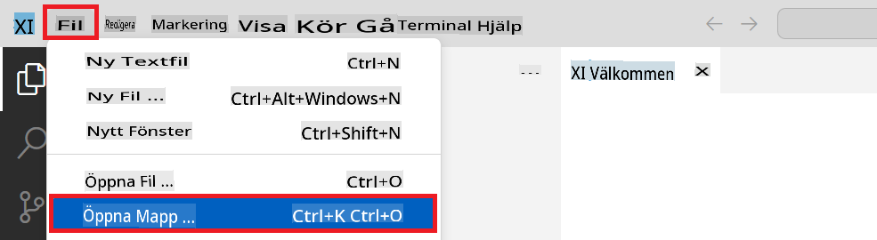

1. I vänstra panelen i Visual Studio Code, högerklicka och välj **Ny fil** för att skapa en ny fil med namnet *download_dataset.py*.

    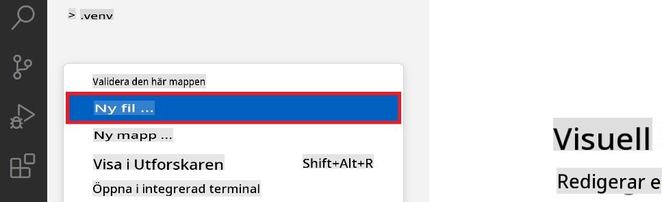

### Förbered dataset för finjustering

I denna övning kommer du att köra filen *download_dataset.py* för att ladda ner datasetet *ultrachat_200k* till din lokala miljö. Du kommer sedan att använda detta dataset för att finjustera Phi-3-modellen i Azure Machine Learning.

I denna övning kommer du att:

- Lägga till kod i filen *download_dataset.py* för att ladda ner datasetet.
- Köra filen *download_dataset.py* för att ladda ner datasetet till din lokala miljö.

#### Ladda ner ditt dataset med hjälp av *download_dataset.py*

1. Öppna filen *download_dataset.py* i Visual Studio Code.

1. Lägg till följande kod i filen *download_dataset.py*.

    ```python
    import json
    import os
    from datasets import load_dataset

    def load_and_split_dataset(dataset_name, config_name, split_ratio):
        """
        Load and split a dataset.
        """
        # Load the dataset with the specified name, configuration, and split ratio
        dataset = load_dataset(dataset_name, config_name, split=split_ratio)
        print(f"Original dataset size: {len(dataset)}")
        
        # Split the dataset into train and test sets (80% train, 20% test)
        split_dataset = dataset.train_test_split(test_size=0.2)
        print(f"Train dataset size: {len(split_dataset['train'])}")
        print(f"Test dataset size: {len(split_dataset['test'])}")
        
        return split_dataset

    def save_dataset_to_jsonl(dataset, filepath):
        """
        Save a dataset to a JSONL file.
        """
        # Create the directory if it does not exist
        os.makedirs(os.path.dirname(filepath), exist_ok=True)
        
        # Open the file in write mode
        with open(filepath, 'w', encoding='utf-8') as f:
            # Iterate over each record in the dataset
            for record in dataset:
                # Dump the record as a JSON object and write it to the file
                json.dump(record, f)
                # Write a newline character to separate records
                f.write('\n')
        
        print(f"Dataset saved to {filepath}")

    def main():
        """
        Main function to load, split, and save the dataset.
        """
        # Load and split the ULTRACHAT_200k dataset with a specific configuration and split ratio
        dataset = load_and_split_dataset("HuggingFaceH4/ultrachat_200k", 'default', 'train_sft[:1%]')
        
        # Extract the train and test datasets from the split
        train_dataset = dataset['train']
        test_dataset = dataset['test']

        # Save the train dataset to a JSONL file
        save_dataset_to_jsonl(train_dataset, "data/train_data.jsonl")
        
        # Save the test dataset to a separate JSONL file
        save_dataset_to_jsonl(test_dataset, "data/test_data.jsonl")

    if __name__ == "__main__":
        main()

    ```

1. Skriv följande kommando i din terminal för att köra skriptet och ladda ner datasetet till din lokala miljö.

    ```console
    python download_dataset.py
    ```

1. Verifiera att datasetet sparades framgångsrikt i din lokala mapp *finetune-phi/data*.

> [!NOTE]
>
> #### Notering om datasetstorlek och finjusteringstid
>
> I denna handledning använder du endast 1% av datasetet (`split='train[:1%]'`). Detta minskar mängden data
1. Besök [Azure ML Studio](https://ml.azure.com/home?wt.mc_id=studentamb_279723).

1. Välj **Compute** från fliken till vänster.

1. Välj **Compute clusters** från navigationsmenyn.

1. Välj **+ New**.

    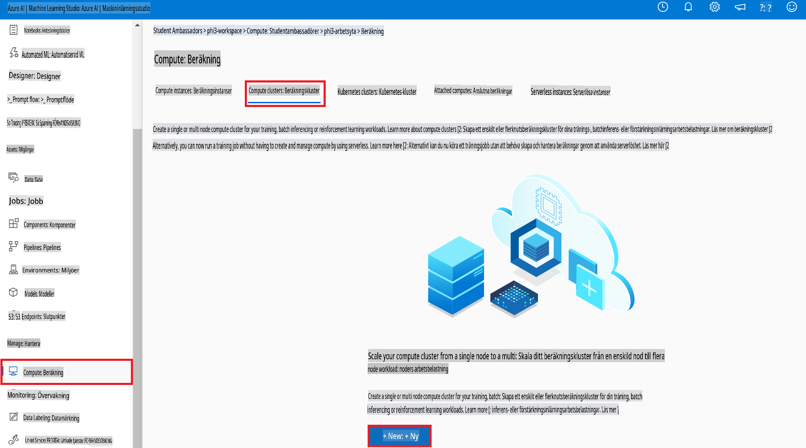

1. Utför följande uppgifter:

    - Välj den **Region** du vill använda.
    - Ställ in **Virtual machine tier** till **Dedicated**.
    - Ställ in **Virtual machine type** till **GPU**.
    - Använd filtret **Virtual machine size** och välj **Select from all options**.
    - Välj **Virtual machine size** till **Standard_NC24ads_A100_v4**.

    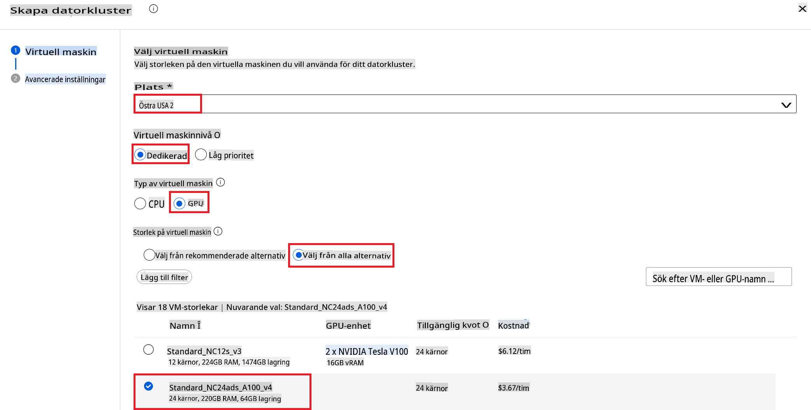

1. Välj **Next**.

1. Utför följande uppgifter:

    - Ange ett unikt **Compute name**.
    - Ställ in **Minimum number of nodes** till **0**.
    - Ställ in **Maximum number of nodes** till **1**.
    - Ställ in **Idle seconds before scale down** till **120**.

    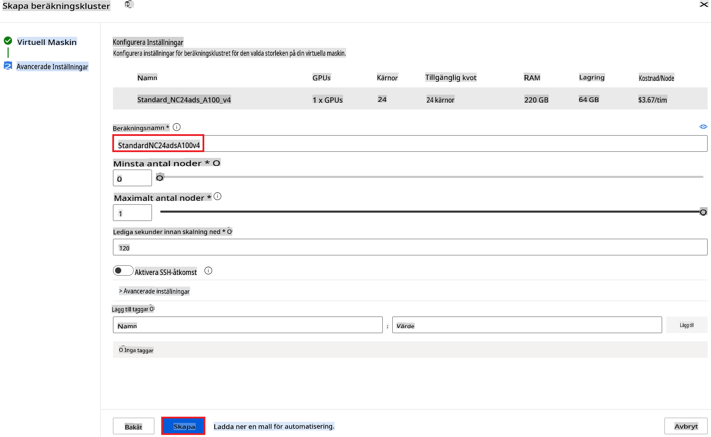

1. Välj **Create**.

#### Finjustera Phi-3-modellen

1. Besök [Azure ML Studio](https://ml.azure.com/home?wt.mc_id=studentamb_279723).

1. Välj det Azure Machine Learning-arbetsutrymme som du skapade.

    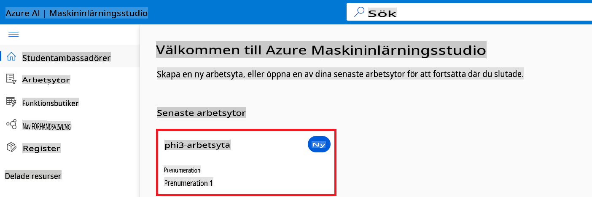

1. Utför följande uppgifter:

    - Välj **Model catalog** från fliken till vänster.
    - Skriv *phi-3-mini-4k* i **sökrutan** och välj **Phi-3-mini-4k-instruct** från alternativen som visas.

    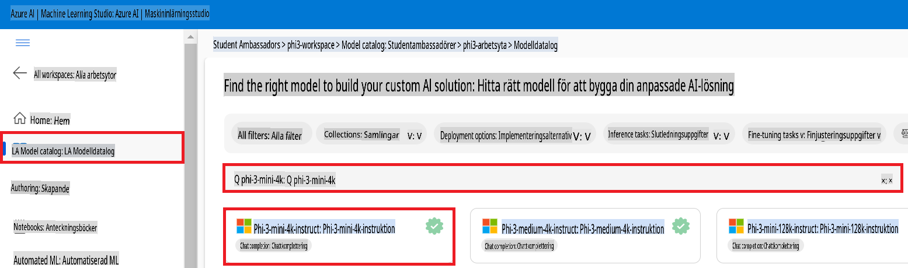

1. Välj **Fine-tune** från navigationsmenyn.

    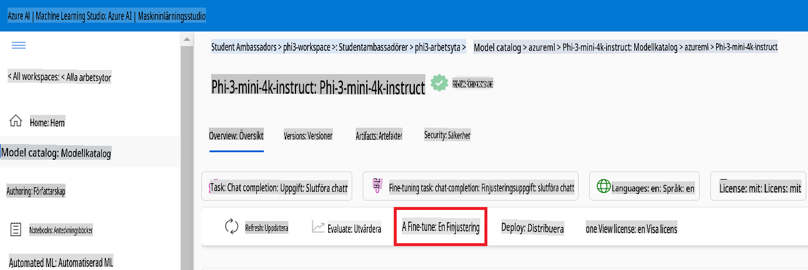

1. Utför följande uppgifter:

    - Ställ in **Select task type** till **Chat completion**.
    - Välj **+ Select data** för att ladda upp **Traning data**.
    - Välj valideringsdatatyp till **Provide different validation data**.
    - Välj **+ Select data** för att ladda upp **Validation data**.

    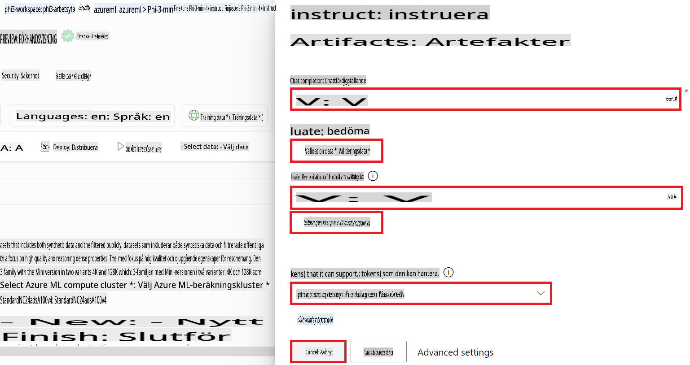

    > [!TIP]
    >
    > Du kan välja **Advanced settings** för att anpassa inställningar som **learning_rate** och **lr_scheduler_type** för att optimera finjusteringsprocessen efter dina specifika behov.

1. Välj **Finish**.

1. I denna övning finjusterade du framgångsrikt Phi-3-modellen med Azure Machine Learning. Observera att finjusteringsprocessen kan ta avsevärd tid. Efter att ha kört finjusteringsjobbet behöver du vänta tills det är klart. Du kan övervaka statusen för jobbet genom att navigera till fliken Jobs i ditt Azure Machine Learning-arbetsutrymme. I nästa delserie kommer du att distribuera den finjusterade modellen och integrera den med Prompt flow.

    

### Distribuera den finjusterade Phi-3-modellen

För att integrera den finjusterade Phi-3-modellen med Prompt flow behöver du distribuera modellen för att göra den tillgänglig för realtidsinläsning. Denna process inkluderar att registrera modellen, skapa en online-endpoint och distribuera modellen.

I denna övning kommer du att:

- Registrera den finjusterade modellen i Azure Machine Learning-arbetsutrymmet.
- Skapa en online-endpoint.
- Distribuera den registrerade finjusterade Phi-3-modellen.

#### Registrera den finjusterade modellen

1. Besök [Azure ML Studio](https://ml.azure.com/home?wt.mc_id=studentamb_279723).

1. Välj det Azure Machine Learning-arbetsutrymme som du skapade.

    

1. Välj **Models** från fliken till vänster.
1. Välj **+ Register**.
1. Välj **From a job output**.

    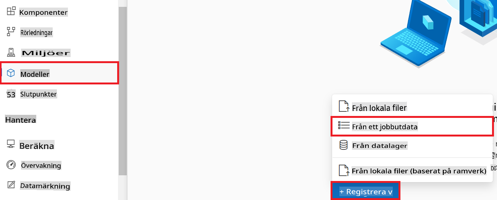

1. Välj jobbet som du skapade.

    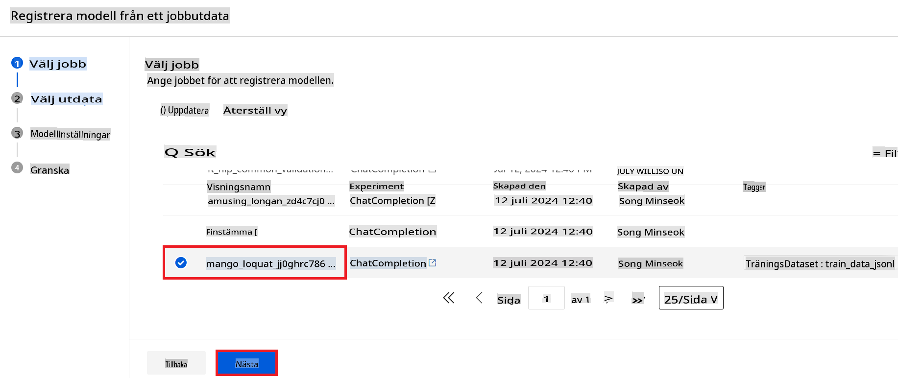

1. Välj **Next**.

1. Ställ in **Model type** till **MLflow**.

1. Kontrollera att **Job output** är valt; detta bör vara förvalt.

    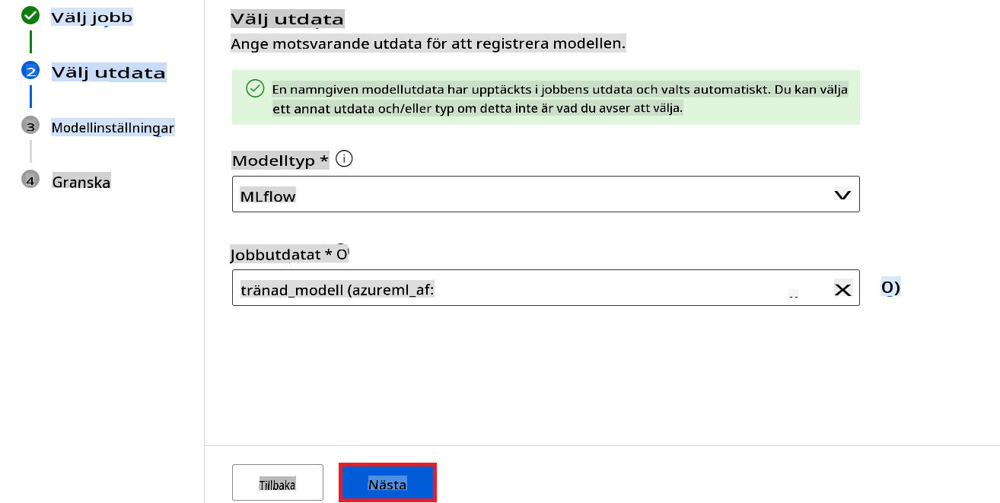

2. Välj **Next**.

3. Välj **Register**.

    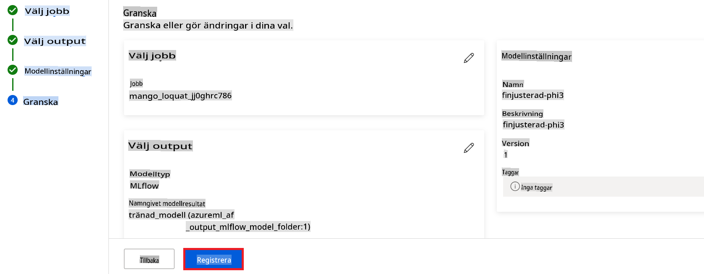

4. Du kan se din registrerade modell genom att navigera till menyn **Models** från fliken till vänster.

    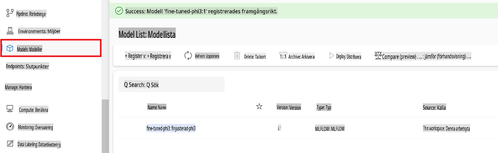

#### Distribuera den finjusterade modellen

1. Navigera till det Azure Machine Learning-arbetsutrymme som du skapade.

1. Välj **Endpoints** från fliken till vänster.

1. Välj **Real-time endpoints** från navigationsmenyn.

    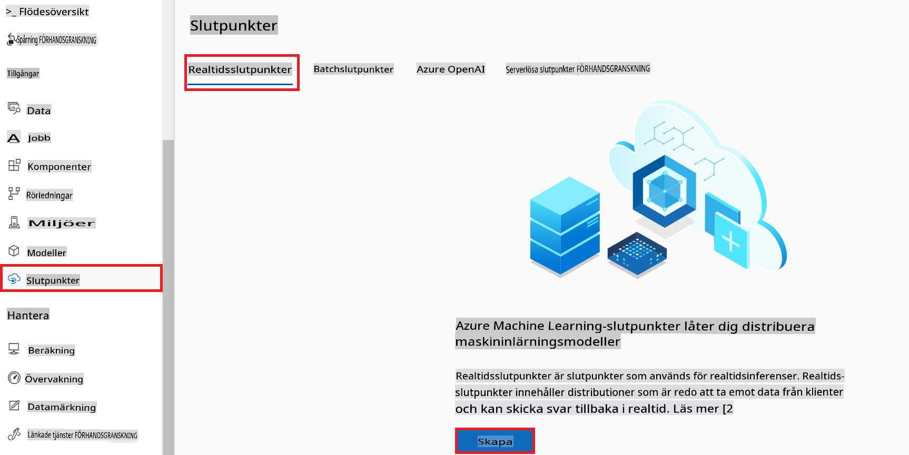

1. Välj **Create**.

1. Välj den registrerade modellen som du skapade.

    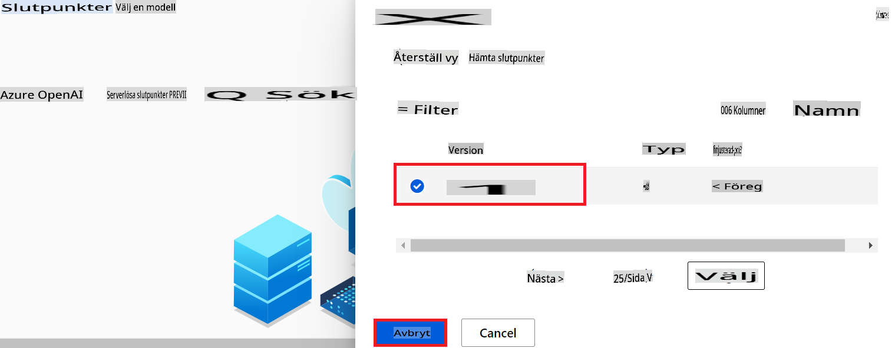

1. Välj **Select**.

1. Utför följande uppgifter:

    - Ställ in **Virtual machine** till *Standard_NC6s_v3*.
    - Ange det **Instance count** du vill använda, exempelvis *1*.
    - Ställ in **Endpoint** till **New** för att skapa en ny endpoint.
    - Ange ett unikt **Endpoint name**.
    - Ange ett unikt **Deployment name**.

    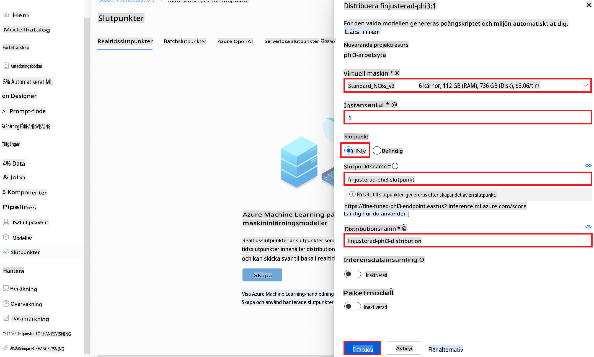

1. Välj **Deploy**.

> [!WARNING]
> För att undvika extra kostnader på ditt konto, se till att ta bort den skapade endpointen i Azure Machine Learning-arbetsutrymmet.
>

#### Kontrollera distributionsstatus i Azure Machine Learning-arbetsutrymme

1. Navigera till det Azure Machine Learning-arbetsutrymme som du skapade.

1. Välj **Endpoints** från fliken till vänster.

1. Välj den endpoint som du skapade.

    

1. På denna sida kan du hantera endpoints under distributionsprocessen.

> [!NOTE]
> När distributionen är klar, se till att **Live traffic** är inställt på **100%**. Om det inte är det, välj **Update traffic** för att justera trafikinställningarna. Observera att du inte kan testa modellen om trafiken är inställd på 0%.
>
> 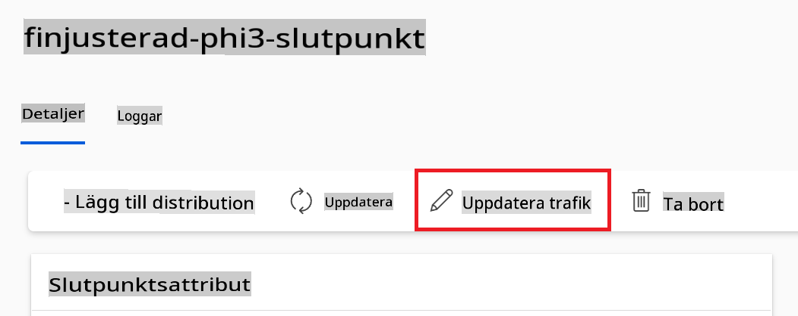
>

## Scenario 3: Integrera med Prompt flow och chatta med din anpassade modell i Azure AI Foundry

### Integrera den anpassade Phi-3-modellen med Prompt flow

Efter att framgångsrikt ha distribuerat din finjusterade modell kan du nu integrera den med Prompt Flow för att använda din modell i realtidsapplikationer, vilket möjliggör en mängd interaktiva uppgifter med din anpassade Phi-3-modell.

I denna övning kommer du att:

- Skapa en Azure AI Foundry Hub.
- Skapa ett Azure AI Foundry-projekt.
- Skapa en Prompt flow.
- Lägga till en anpassad anslutning för den finjusterade Phi-3-modellen.
- Konfigurera Prompt flow för att chatta med din anpassade Phi-3-modell.

> [!NOTE]
> Du kan också integrera med Promptflow via Azure ML Studio. Samma integrationsprocess kan tillämpas i Azure ML Studio.

#### Skapa Azure AI Foundry Hub

Du måste skapa en Hub innan du skapar ett projekt. En Hub fungerar som en resursgrupp och gör det möjligt att organisera och hantera flera projekt inom Azure AI Foundry.

1. Besök [Azure AI Foundry](https://ai.azure.com/?WT.mc_id=aiml-137032-kinfeylo).

1. Välj **All hubs** från fliken till vänster.

1. Välj **+ New hub** från navigationsmenyn.

    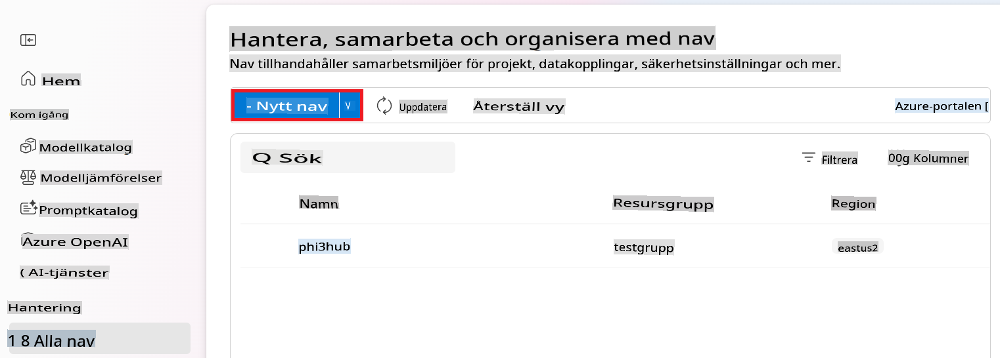

1. Utför följande uppgifter:

    - Ange ett unikt **Hub name**.
    - Välj ditt Azure **Subscription**.
    - Välj den **Resource group** som ska användas (skapa en ny om det behövs).
    - Välj den **Location** du vill använda.
    - Välj **Connect Azure AI Services** som ska användas (skapa en ny om det behövs).
    - Ställ in **Connect Azure AI Search** till **Skip connecting**.

    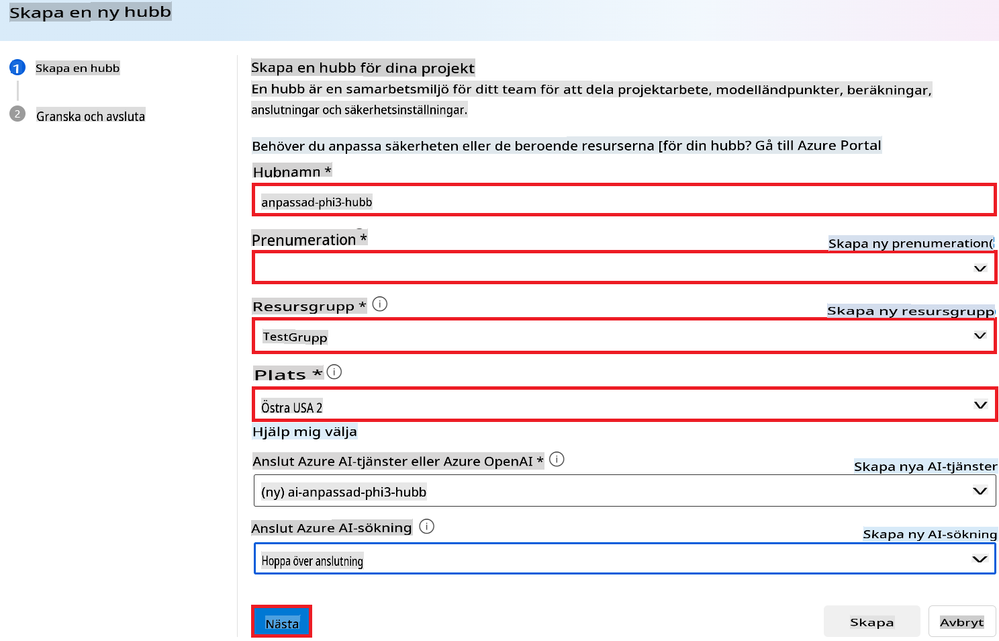

1. Välj **Next**.

#### Skapa Azure AI Foundry-projekt

1. I den Hub som du skapade, välj **All projects** från fliken till vänster.

1. Välj **+ New project** från navigationsmenyn.

    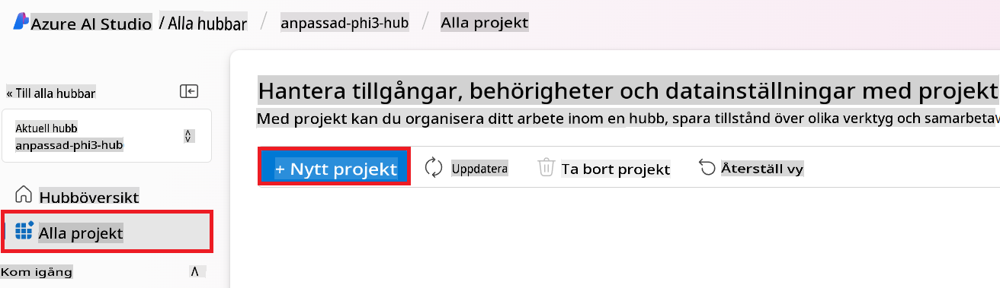

1. Ange ett unikt **Project name**.

    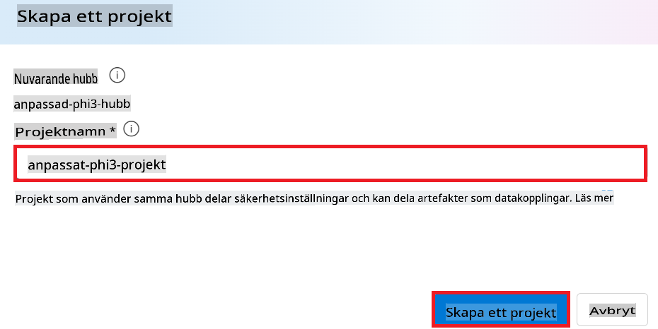

1. Välj **Create a project**.

#### Lägg till en anpassad anslutning för den finjusterade Phi-3-modellen

För att integrera din anpassade Phi-3-modell med Prompt flow behöver du spara modellens endpoint och nyckel i en anpassad anslutning. Denna inställning säkerställer åtkomst till din anpassade Phi-3-modell i Prompt flow.

#### Ställ in api-nyckel och endpoint-URI för den finjusterade Phi-3-modellen

1. Besök [Azure ML Studio](https://ml.azure.com/home?WT.mc_id=aiml-137032-kinfeylo).

1. Navigera till det Azure Machine Learning-arbetsutrymme som du skapade.

1. Välj **Endpoints** från fliken till vänster.

    

1. Välj den endpoint som du skapade.

    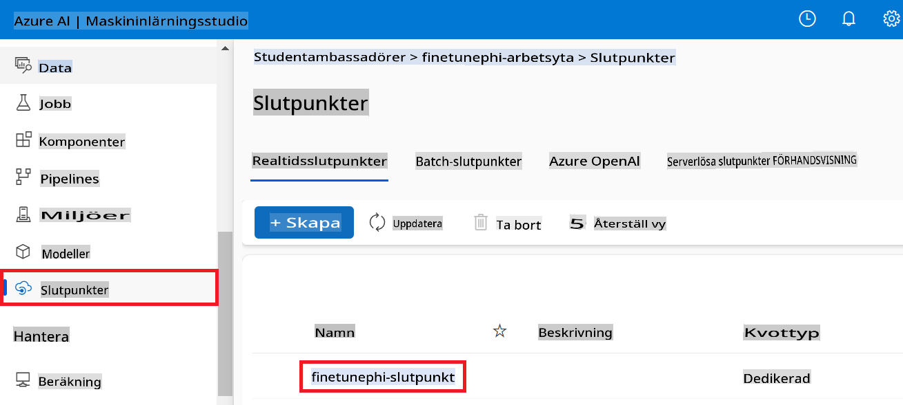

1. Välj **Consume** från navigationsmenyn.

1. Kopiera din **REST endpoint** och **Primary key**.
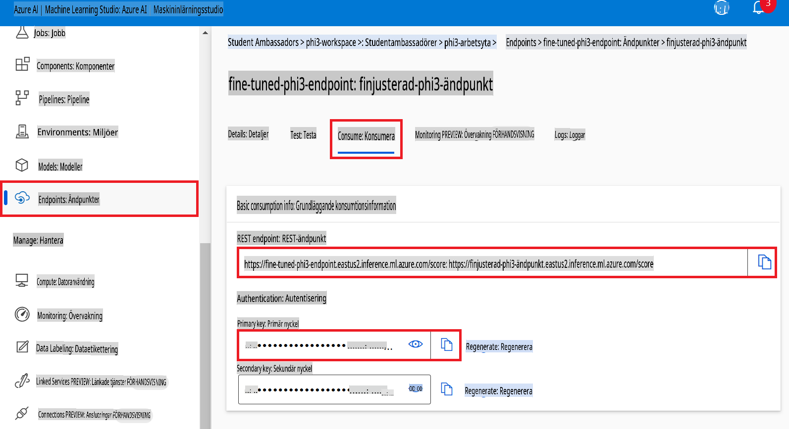

#### Lägg till den anpassade anslutningen

1. Besök [Azure AI Foundry](https://ai.azure.com/?WT.mc_id=aiml-137032-kinfeylo).

1. Navigera till det Azure AI Foundry-projekt som du skapade.

1. I projektet som du skapade, välj **Inställningar** från fliken till vänster.

1. Välj **+ Ny anslutning**.

    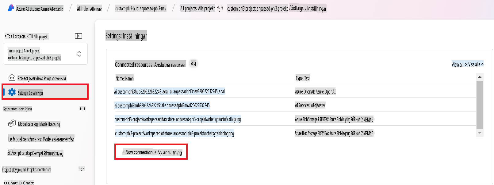

1. Välj **Anpassade nycklar** från navigationsmenyn.

    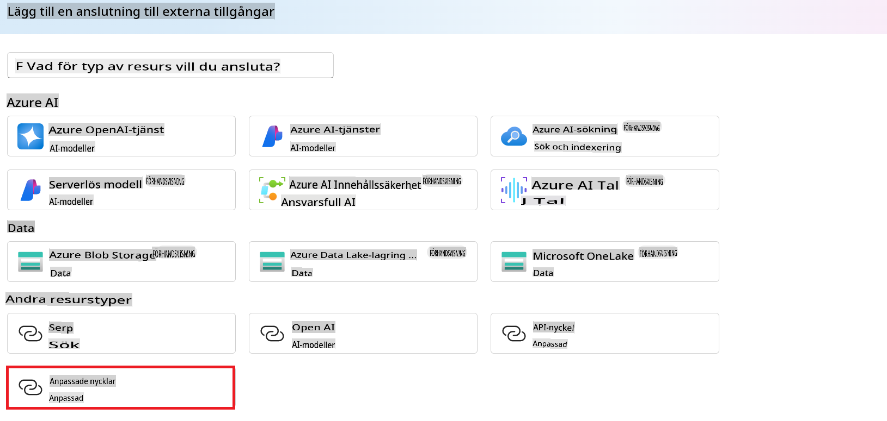

1. Utför följande steg:

    - Välj **+ Lägg till nyckel-värde-par**.
    - För nyckelns namn, ange **endpoint** och klistra in slutpunkten som du kopierade från Azure ML Studio i värdefältet.
    - Välj **+ Lägg till nyckel-värde-par** igen.
    - För nyckelns namn, ange **key** och klistra in nyckeln som du kopierade från Azure ML Studio i värdefältet.
    - Efter att ha lagt till nycklarna, välj **is secret** för att förhindra att nyckeln exponeras.

    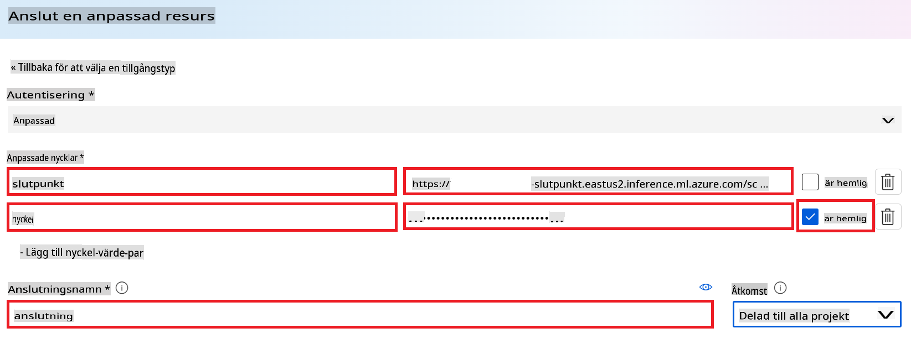

1. Välj **Lägg till anslutning**.

#### Skapa Prompt flow

Du har lagt till en anpassad anslutning i Azure AI Foundry. Nu ska vi skapa ett Prompt flow med följande steg. Därefter kommer du att ansluta detta Prompt flow till den anpassade anslutningen så att du kan använda den finjusterade modellen inom Prompt flow.

1. Navigera till det Azure AI Foundry-projekt som du skapade.

1. Välj **Prompt flow** från fliken till vänster.

1. Välj **+ Skapa** från navigationsmenyn.

    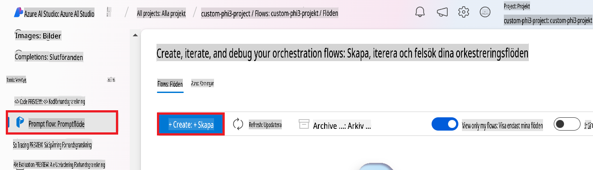

1. Välj **Chat flow** från navigationsmenyn.

    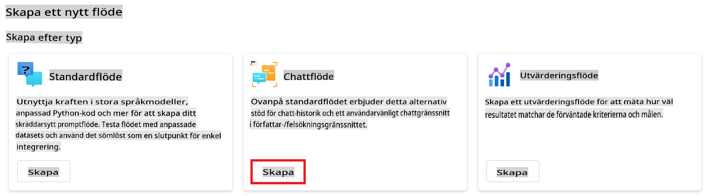

1. Ange **Mappnamn** som ska användas.

    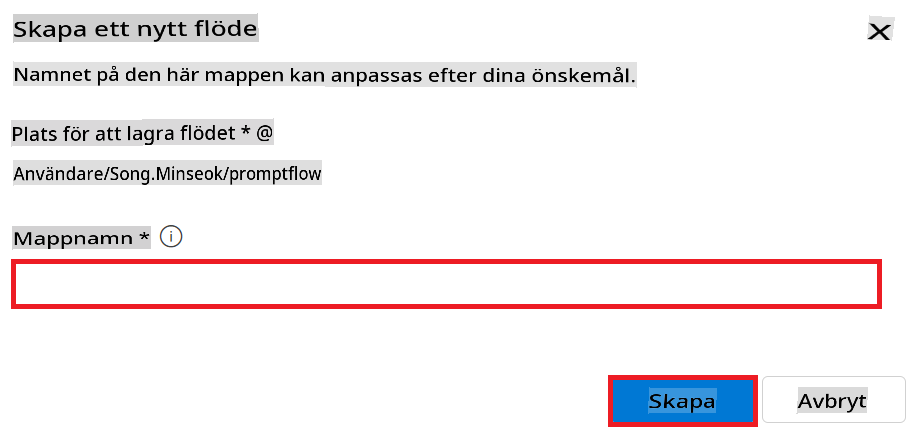

2. Välj **Skapa**.

#### Ställ in Prompt flow för att chatta med din anpassade Phi-3-modell

Du behöver integrera den finjusterade Phi-3-modellen i ett Prompt flow. Men det befintliga Prompt flow som tillhandahålls är inte utformat för detta ändamål. Därför måste du designa om Prompt flow för att möjliggöra integrationen av den anpassade modellen.

1. I Prompt flow, utför följande steg för att bygga om det befintliga flödet:

    - Välj **Rå fil-läge**.
    - Ta bort all befintlig kod i filen *flow.dag.yml*.
    - Lägg till följande kod i filen *flow.dag.yml*.

        ```yml
        inputs:
          input_data:
            type: string
            default: "Who founded Microsoft?"

        outputs:
          answer:
            type: string
            reference: ${integrate_with_promptflow.output}

        nodes:
        - name: integrate_with_promptflow
          type: python
          source:
            type: code
            path: integrate_with_promptflow.py
          inputs:
            input_data: ${inputs.input_data}
        ```

    - Välj **Spara**.

    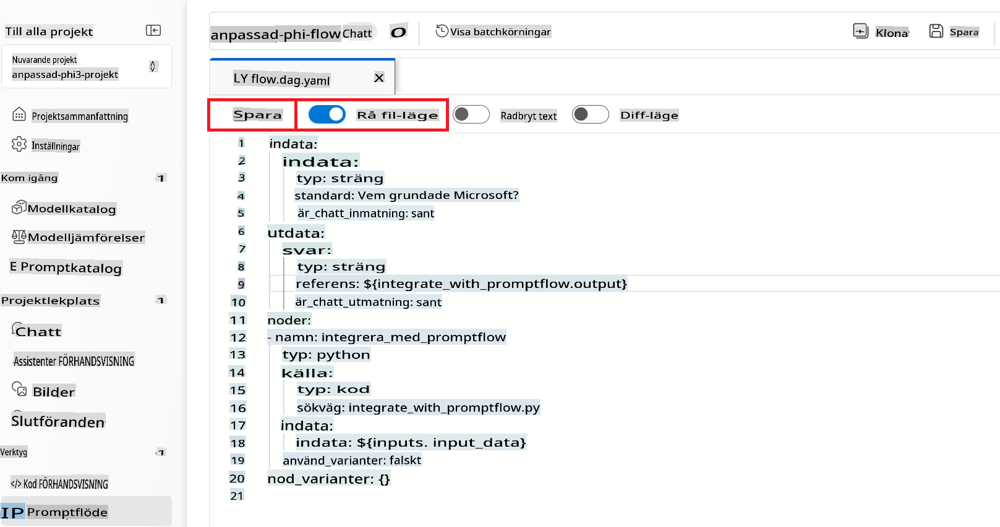

1. Lägg till följande kod i filen *integrate_with_promptflow.py* för att använda den anpassade Phi-3-modellen i Prompt flow.

    ```python
    import logging
    import requests
    from promptflow import tool
    from promptflow.connections import CustomConnection

    # Logging setup
    logging.basicConfig(
        format="%(asctime)s - %(levelname)s - %(name)s - %(message)s",
        datefmt="%Y-%m-%d %H:%M:%S",
        level=logging.DEBUG
    )
    logger = logging.getLogger(__name__)

    def query_phi3_model(input_data: str, connection: CustomConnection) -> str:
        """
        Send a request to the Phi-3 model endpoint with the given input data using Custom Connection.
        """

        # "connection" is the name of the Custom Connection, "endpoint", "key" are the keys in the Custom Connection
        endpoint_url = connection.endpoint
        api_key = connection.key

        headers = {
            "Content-Type": "application/json",
            "Authorization": f"Bearer {api_key}"
        }
        data = {
            "input_data": {
                "input_string": [
                    {"role": "user", "content": input_data}
                ],
                "parameters": {
                    "temperature": 0.7,
                    "max_new_tokens": 128
                }
            }
        }
        try:
            response = requests.post(endpoint_url, json=data, headers=headers)
            response.raise_for_status()
            
            # Log the full JSON response
            logger.debug(f"Full JSON response: {response.json()}")

            result = response.json()["output"]
            logger.info("Successfully received response from Azure ML Endpoint.")
            return result
        except requests.exceptions.RequestException as e:
            logger.error(f"Error querying Azure ML Endpoint: {e}")
            raise

    @tool
    def my_python_tool(input_data: str, connection: CustomConnection) -> str:
        """
        Tool function to process input data and query the Phi-3 model.
        """
        return query_phi3_model(input_data, connection)

    ```

    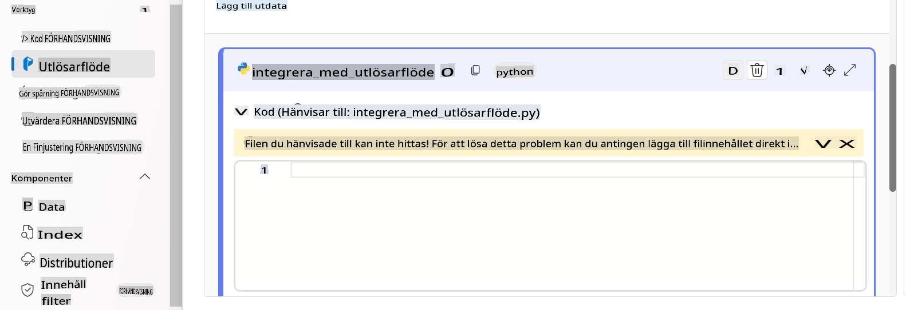

> [!NOTE]
> För mer detaljerad information om hur du använder Prompt flow i Azure AI Foundry kan du läsa [Prompt flow i Azure AI Foundry](https://learn.microsoft.com/azure/ai-studio/how-to/prompt-flow).

1. Välj **Chat input**, **Chat output** för att aktivera chat med din modell.

    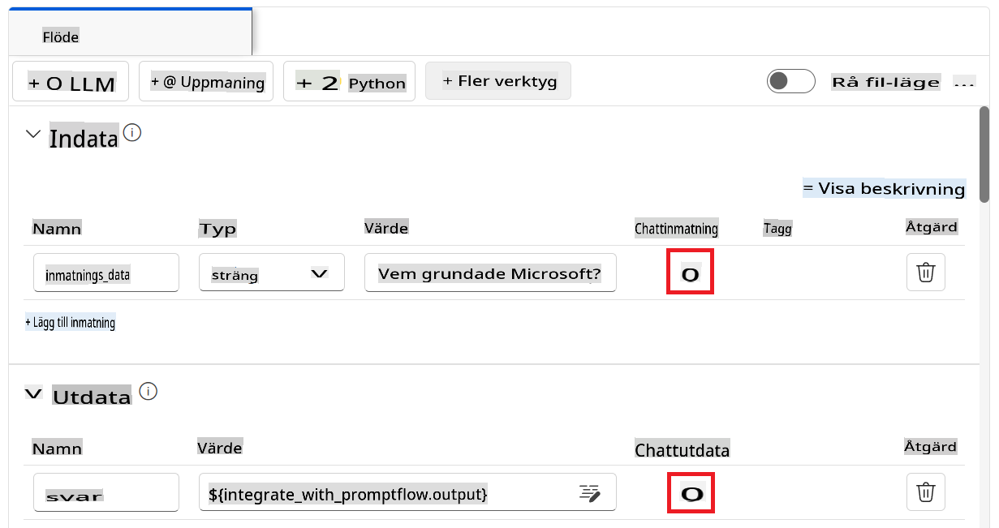

1. Nu är du redo att chatta med din anpassade Phi-3-modell. I nästa övning kommer du att lära dig hur du startar Prompt flow och använder det för att chatta med din finjusterade Phi-3-modell.

> [!NOTE]
>
> Det ombyggda flödet bör se ut som bilden nedan:
>
> 
>

### Chatta med din anpassade Phi-3-modell

Nu när du har finjusterat och integrerat din anpassade Phi-3-modell med Prompt flow är du redo att börja interagera med den. Denna övning guidar dig genom processen att ställa in och initiera en chatt med din modell med hjälp av Prompt flow. Genom att följa dessa steg kan du fullt ut utnyttja kapabiliteterna hos din finjusterade Phi-3-modell för olika uppgifter och samtal.

- Chatta med din anpassade Phi-3-modell med hjälp av Prompt flow.

#### Starta Prompt flow

1. Välj **Starta beräkningssessioner** för att starta Prompt flow.

    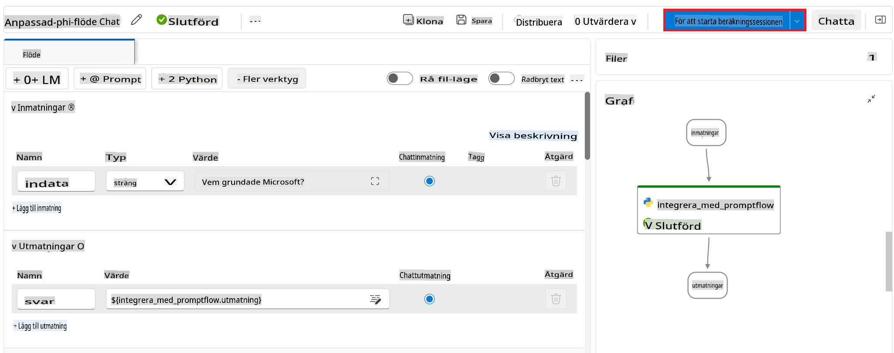

1. Välj **Validera och tolka indata** för att uppdatera parametrar.

    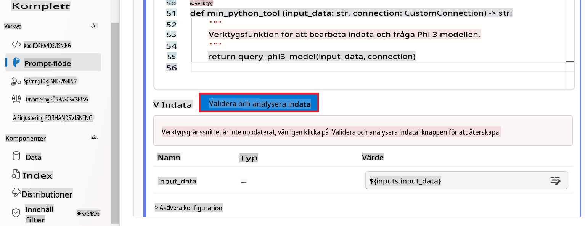

1. Välj **Värde** för **anslutning** till den anpassade anslutning du skapade. Till exempel, *connection*.

    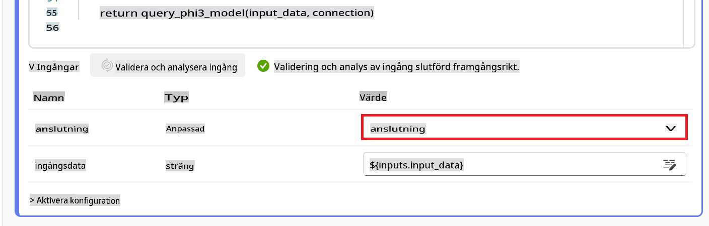

#### Chatta med din anpassade modell

1. Välj **Chat**.

    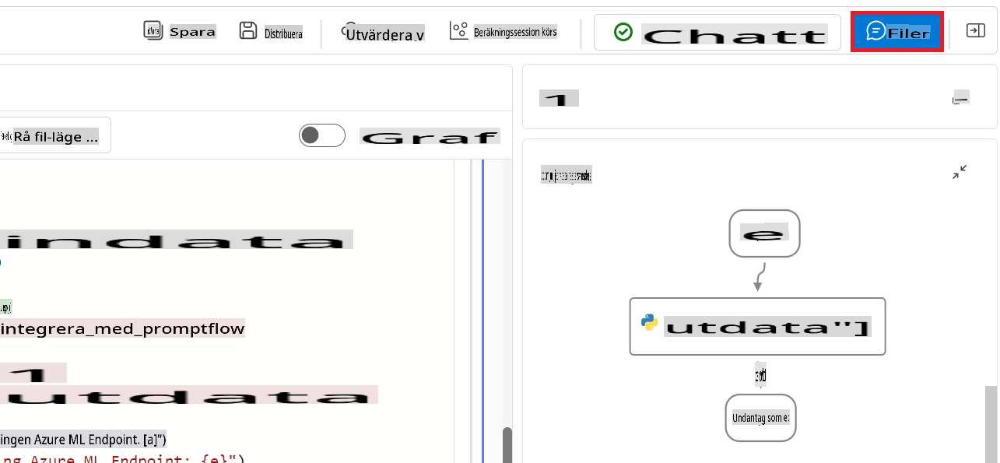

1. Här är ett exempel på resultat: Nu kan du chatta med din anpassade Phi-3-modell. Det rekommenderas att ställa frågor baserade på data som användes för finjusteringen.

    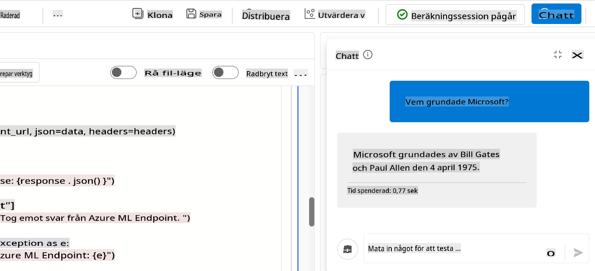

**Ansvarsfriskrivning**:  
Detta dokument har översatts med hjälp av AI-baserade maskinöversättningstjänster. Även om vi strävar efter noggrannhet, bör det noteras att automatiserade översättningar kan innehålla fel eller felaktigheter. Det ursprungliga dokumentet på dess originalspråk bör betraktas som den auktoritativa källan. För kritisk information rekommenderas professionell mänsklig översättning. Vi ansvarar inte för eventuella missförstånd eller feltolkningar som uppstår vid användning av denna översättning.