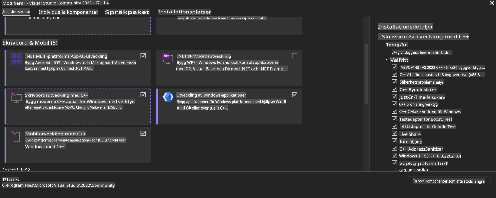
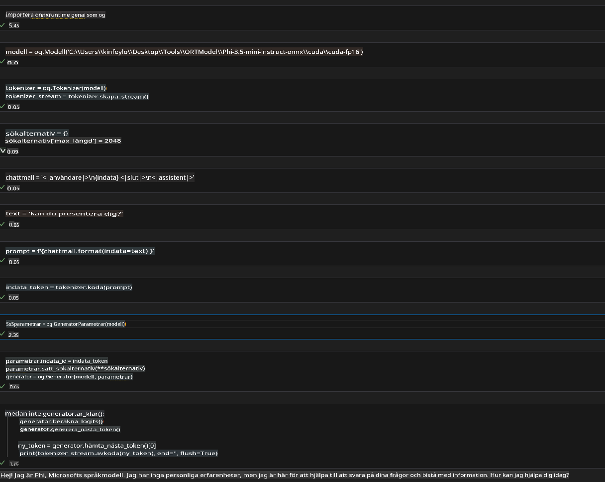
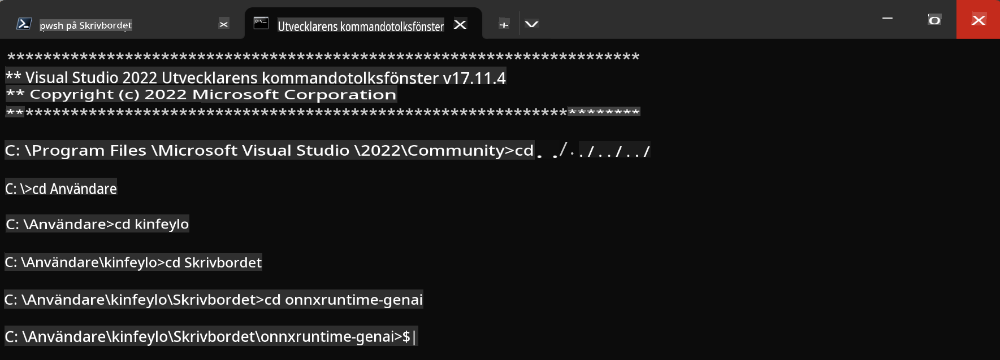

# **Vägledning för OnnxRuntime GenAI Windows GPU**

Den här vägledningen beskriver stegen för att installera och använda ONNX Runtime (ORT) med GPU:er på Windows. Den är utformad för att hjälpa dig att dra nytta av GPU-acceleration för dina modeller och förbättra prestanda och effektivitet.

Dokumentet ger vägledning om:

- Miljöinställning: Instruktioner för att installera nödvändiga beroenden som CUDA, cuDNN och ONNX Runtime.
- Konfiguration: Hur du konfigurerar miljön och ONNX Runtime för att effektivt använda GPU-resurser.
- Optimeringstips: Råd om hur du finjusterar dina GPU-inställningar för bästa prestanda.

### **1. Python 3.10.x /3.11.8**

   ***Notera*** Vi föreslår att du använder [miniforge](https://github.com/conda-forge/miniforge/releases/latest/download/Miniforge3-Windows-x86_64.exe) som din Python-miljö.

   ```bash

   conda create -n pydev python==3.11.8

   conda activate pydev

   ```

   ***Påminnelse*** Om du har installerat någon Python ONNX-bibliotek, avinstallera det först.

### **2. Installera CMake med winget**

   ```bash

   winget install -e --id Kitware.CMake

   ```

### **3. Installera Visual Studio 2022 - Desktop Development with C++**

   ***Notera*** Om du inte vill kompilera kan du hoppa över detta steg.



### **4. Installera NVIDIA-drivrutiner**

1. **NVIDIA GPU Driver**  [https://www.nvidia.com/en-us/drivers/](https://www.nvidia.com/en-us/drivers/)

2. **NVIDIA CUDA 12.4** [https://developer.nvidia.com/cuda-12-4-0-download-archive](https://developer.nvidia.com/cuda-12-4-0-download-archive)

3. **NVIDIA CUDNN 9.4**  [https://developer.nvidia.com/cudnn-downloads](https://developer.nvidia.com/cudnn-downloads)

***Påminnelse*** Använd standardinställningarna under installationsprocessen.

### **5. Ställ in NVIDIA-miljön**

Kopiera NVIDIA CUDNN 9.4 lib, bin och include till NVIDIA CUDA 12.4 lib, bin och include.

- kopiera *'C:\Program Files\NVIDIA\CUDNN\v9.4\bin\12.6'*-filer till *'C:\Program Files\NVIDIA GPU Computing Toolkit\CUDA\v12.4\bin'*

- kopiera *'C:\Program Files\NVIDIA\CUDNN\v9.4\include\12.6'*-filer till *'C:\Program Files\NVIDIA GPU Computing Toolkit\CUDA\v12.4\include'*

- kopiera *'C:\Program Files\NVIDIA\CUDNN\v9.4\lib\12.6'*-filer till *'C:\Program Files\NVIDIA GPU Computing Toolkit\CUDA\v12.4\lib\x64'*

### **6. Ladda ner Phi-3.5-mini-instruct-onnx**

   ```bash

   winget install -e --id Git.Git

   winget install -e --id GitHub.GitLFS

   git lfs install

   git clone https://huggingface.co/microsoft/Phi-3.5-mini-instruct-onnx

   ```

### **7. Kör InferencePhi35Instruct.ipynb**

   Öppna [Notebook](../../../../../../code/09.UpdateSamples/Aug/ortgpu-phi35-instruct.ipynb) och kör den.



### **8. Kompilera ORT GenAI GPU**

   ***Notera*** 
   
   1. Avinstallera först alla ONNX-, ONNX Runtime- och ONNX Runtime GenAI-bibliotek.

   ```bash

   pip list 
   
   ```

   Avinstallera sedan alla ONNX Runtime-bibliotek, t.ex.

   ```bash

   pip uninstall onnxruntime

   pip uninstall onnxruntime-genai

   pip uninstall onnxruntume-genai-cuda
   
   ```

   2. Kontrollera stöd för Visual Studio Extension.

   Kontrollera att C:\Program Files\NVIDIA GPU Computing Toolkit\CUDA\v12.4\extras innehåller mappen C:\Program Files\NVIDIA GPU Computing Toolkit\CUDA\v12.4\extras\visual_studio_integration. 

   Om mappen inte hittas, kontrollera andra CUDA Toolkit-drivrutinsmappar och kopiera visual_studio_integration-mappen och dess innehåll till C:\Program Files\NVIDIA GPU Computing Toolkit\CUDA\v12.4\extras\visual_studio_integration.

   - Om du inte vill kompilera kan du hoppa över detta steg.

   ```bash

   git clone https://github.com/microsoft/onnxruntime-genai

   ```

   - Ladda ner [https://github.com/microsoft/onnxruntime/releases/download/v1.19.2/onnxruntime-win-x64-gpu-1.19.2.zip](https://github.com/microsoft/onnxruntime/releases/download/v1.19.2/onnxruntime-win-x64-gpu-1.19.2.zip)

   - Packa upp onnxruntime-win-x64-gpu-1.19.2.zip, döp om den till **ort**, och kopiera ort-mappen till onnxruntime-genai.

   - Använd Windows Terminal, gå till Developer Command Prompt för VS 2022 och navigera till onnxruntime-genai.



   - Kompilera den med din Python-miljö.

   ```bash

   cd onnxruntime-genai

   python build.py --use_cuda  --cuda_home "C:\Program Files\NVIDIA GPU Computing Toolkit\CUDA\v12.4" --config Release
 

   cd build/Windows/Release/Wheel

   pip install .whl

   ```

**Ansvarsfriskrivning**:  
Detta dokument har översatts med hjälp av AI-baserade maskinöversättningstjänster. Även om vi strävar efter noggrannhet, bör det noteras att automatiska översättningar kan innehålla fel eller felaktigheter. Det ursprungliga dokumentet på dess originalspråk bör betraktas som den auktoritativa källan. För kritisk information rekommenderas professionell mänsklig översättning. Vi ansvarar inte för missförstånd eller feltolkningar som uppstår till följd av användningen av denna översättning.