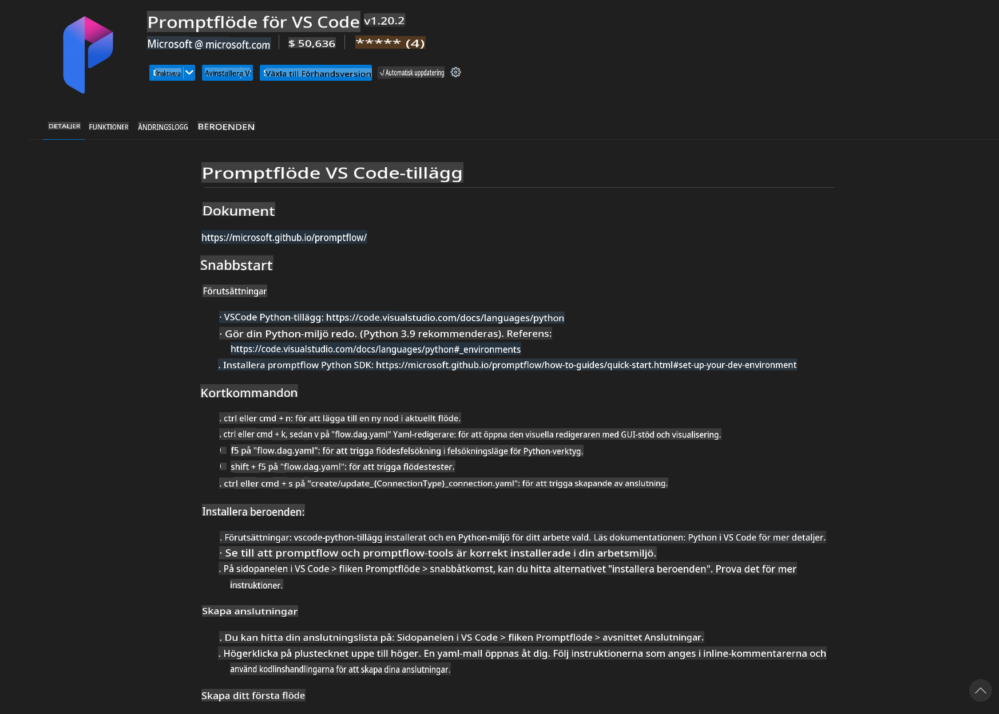
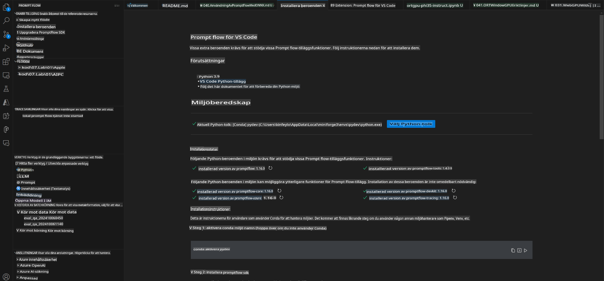
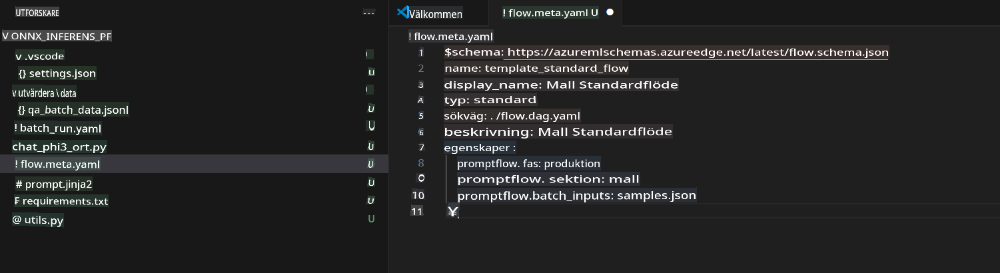
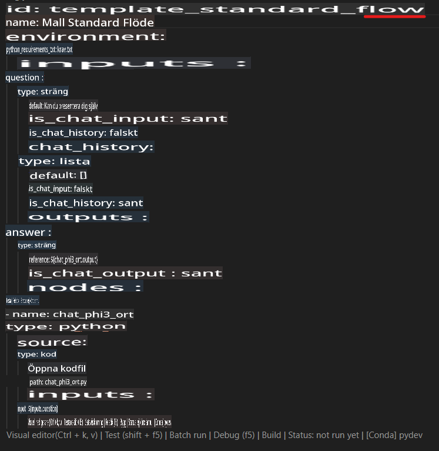
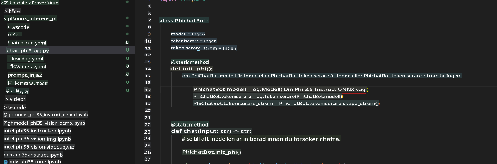
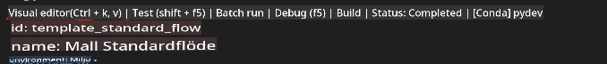
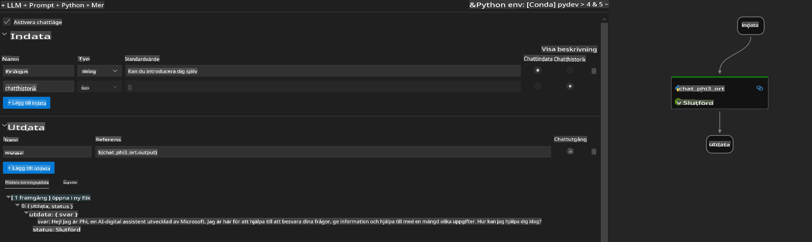
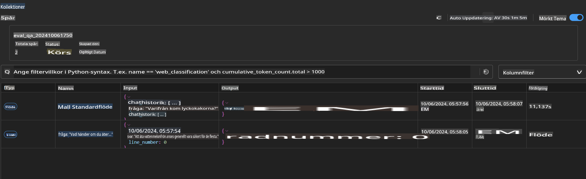

# Använda Windows GPU för att skapa en Prompt flow-lösning med Phi-3.5-Instruct ONNX

Detta dokument är ett exempel på hur man använder PromptFlow med ONNX (Open Neural Network Exchange) för att utveckla AI-applikationer baserade på Phi-3-modeller.

PromptFlow är en uppsättning utvecklingsverktyg som är utformade för att effektivisera hela utvecklingscykeln för AI-applikationer baserade på stora språkmodeller (LLM), från idé och prototyp till testning och utvärdering.

Genom att integrera PromptFlow med ONNX kan utvecklare:

- **Optimera modellprestanda**: Dra nytta av ONNX för effektiv modellinferens och distribution.
- **Förenkla utveckling**: Använd PromptFlow för att hantera arbetsflödet och automatisera repetitiva uppgifter.
- **Förbättra samarbete**: Underlätta bättre samarbete mellan teammedlemmar genom att tillhandahålla en enhetlig utvecklingsmiljö.

**Prompt flow** är en uppsättning utvecklingsverktyg som är utformade för att effektivisera hela utvecklingscykeln för AI-applikationer baserade på stora språkmodeller (LLM), från idé, prototyp, testning och utvärdering till produktionsdistribution och övervakning. Det gör prompt engineering mycket enklare och gör det möjligt att bygga LLM-applikationer med produktionskvalitet.

Prompt flow kan ansluta till OpenAI, Azure OpenAI Service och anpassningsbara modeller (Huggingface, lokala LLM/SLM). Vi hoppas kunna distribuera Phi-3.5:s kvantiserade ONNX-modell till lokala applikationer. Prompt flow kan hjälpa oss att bättre planera vår verksamhet och skapa lokala lösningar baserade på Phi-3.5. I detta exempel kommer vi att kombinera ONNX Runtime GenAI Library för att skapa en Prompt flow-lösning baserad på Windows GPU.

## **Installation**

### **ONNX Runtime GenAI för Windows GPU**

Läs denna guide för att konfigurera ONNX Runtime GenAI för Windows GPU [klicka här](./ORTWindowGPUGuideline.md)

### **Konfigurera Prompt flow i VSCode**

1. Installera Prompt flow VS Code Extension



2. Efter att ha installerat Prompt flow VS Code Extension, klicka på tillägget och välj **Installation dependencies**. Följ denna guide för att installera Prompt flow SDK i din miljö.



3. Ladda ner [Exempelkod](../../../../../../code/09.UpdateSamples/Aug/pf/onnx_inference_pf) och öppna detta exempel i VS Code.



4. Öppna **flow.dag.yaml** för att välja din Python-miljö.



   Öppna **chat_phi3_ort.py** för att ändra platsen för din Phi-3.5-instruct ONNX-modell.



5. Kör din Prompt flow för att testa.

Öppna **flow.dag.yaml** och klicka på visuell redigerare.



Efter att ha klickat på detta, kör och testa.



1. Du kan köra batch i terminalen för att kontrollera fler resultat.

```bash

pf run create --file batch_run.yaml --stream --name 'Your eval qa name'    

```

Du kan kontrollera resultaten i din standardwebbläsare.



**Ansvarsfriskrivning**:  
Detta dokument har översatts med hjälp av maskinbaserade AI-översättningstjänster. Även om vi strävar efter noggrannhet, bör det noteras att automatiserade översättningar kan innehålla fel eller felaktigheter. Det ursprungliga dokumentet på dess originalspråk bör betraktas som den auktoritativa källan. För kritisk information rekommenderas professionell human översättning. Vi ansvarar inte för eventuella missförstånd eller feltolkningar som uppstår vid användning av denna översättning.