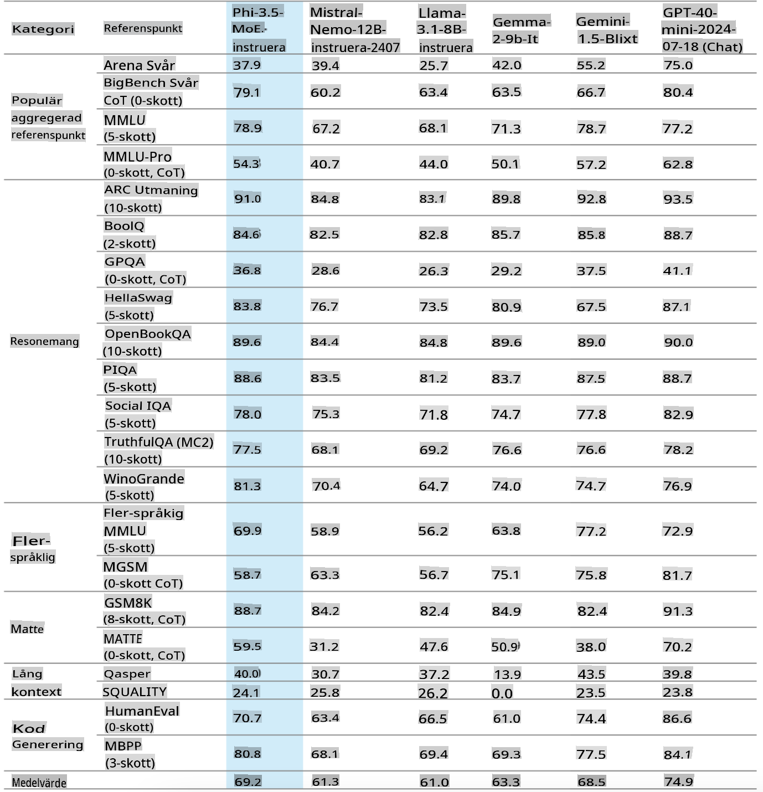
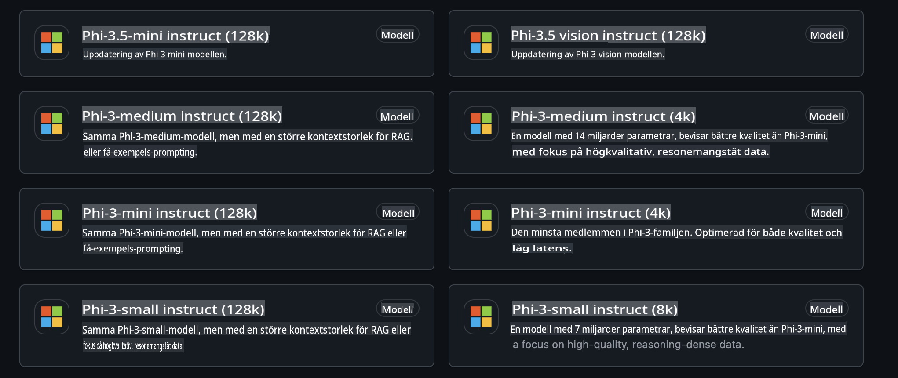
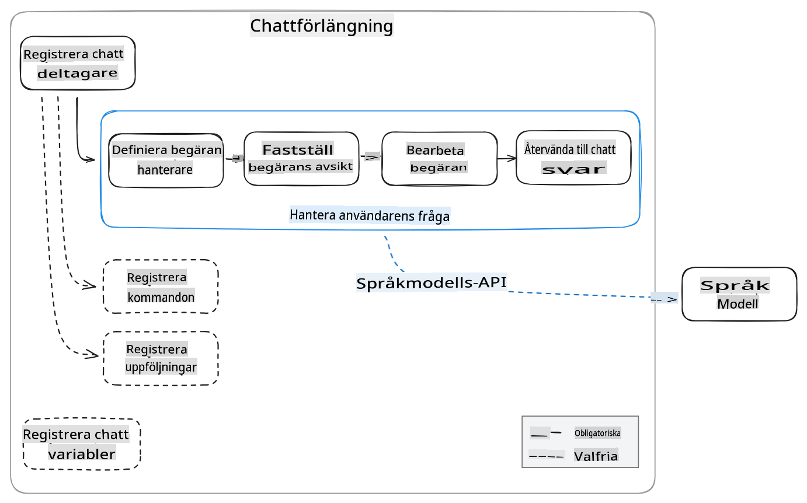
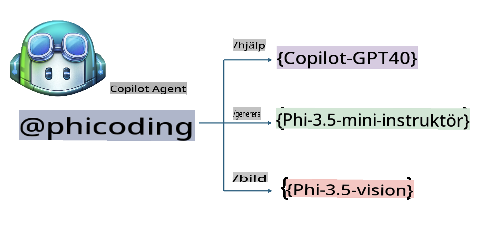
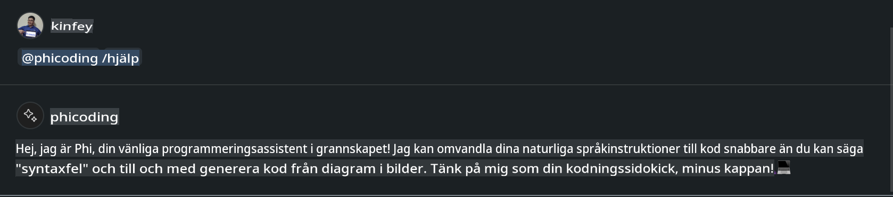
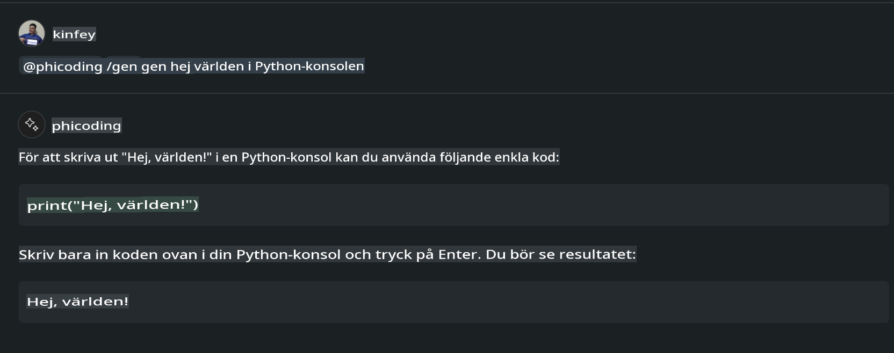
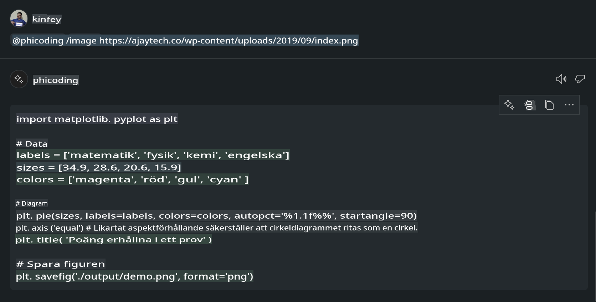

# **Skapa din egen Visual Studio Code Chat Copilot Agent med Phi-3.5 från GitHub Models**

Använder du Visual Studio Code Copilot? Speciellt i Chat kan du använda olika agenter för att förbättra förmågan att skapa, skriva och underhålla projekt i Visual Studio Code. Visual Studio Code tillhandahåller ett API som gör det möjligt för företag och individer att skapa olika agenter baserade på sina behov för att utöka funktionaliteten inom olika specialiserade områden. I den här artikeln fokuserar vi på **Phi-3.5-mini-instruct (128k)** och **Phi-3.5-vision-instruct (128k)** från GitHub Models för att skapa din egen Visual Studio Code Agent.

## **Om Phi-3.5 i GitHub Models**

Vi vet att Phi-3/3.5-mini-instruct i Phi-3/3.5-familjen har starka förmågor för att förstå och generera kod, och har fördelar över Gemma-2-9b och Mistral-Nemo-12B-instruct-2407.



De senaste GitHub Models erbjuder redan tillgång till Phi-3.5-mini-instruct (128k) och Phi-3.5-vision-instruct (128k). Utvecklare kan få tillgång till dem via OpenAI SDK, Azure AI Inference SDK och REST API.



***Notera:*** Det rekommenderas att använda Azure AI Inference SDK här, eftersom det bättre kan integreras med Azure Model Catalog i produktionsmiljöer.

Nedan visas resultaten från **Phi-3.5-mini-instruct (128k)** och **Phi-3.5-vision-instruct (128k)** i kodgenereringsscenarier efter att ha integrerats med GitHub Models. Dessa resultat fungerar också som förberedelse för de följande exemplen.

**Demo: GitHub Models Phi-3.5-mini-instruct (128k) genererar kod från Prompt** ([klicka här](../../../../../../code/09.UpdateSamples/Aug/ghmodel_phi35_instruct_demo.ipynb))

**Demo: GitHub Models Phi-3.5-vision-instruct (128k) genererar kod från bild** ([klicka här](../../../../../../code/09.UpdateSamples/Aug/ghmodel_phi35_vision_demo.ipynb))

## **Om GitHub Copilot Chat Agent**

GitHub Copilot Chat Agent kan utföra olika uppgifter i olika projektscenarier baserat på koden. Systemet har fyra agenter: workspace, github, terminal, vscode.


Genom att lägga till agentens namn med ‘@’ kan du snabbt utföra motsvarande arbete. För företag, om du lägger till eget affärsrelaterat innehåll som krav, kodning, testspecifikationer och release, kan du få kraftfulla företagsanpassade funktioner baserade på GitHub Copilot.

Visual Studio Code Chat Agent har nu officiellt släppt sitt API, vilket gör det möjligt för företag eller företagsutvecklare att utveckla agenter baserade på olika mjukvaru-ekosystem. Baserat på utvecklingsmetoden för Visual Studio Code Extension Development kan du enkelt få åtkomst till gränssnittet för Visual Studio Code Chat Agent API. Vi kan utveckla enligt denna process.



Utvecklingsscenariot stöder tillgång till tredjepartsmodell-API:er (såsom GitHub Models, Azure Model Catalog och egenbyggda tjänster baserade på öppen källkod) och kan även använda modellerna gpt-35-turbo, gpt-4 och gpt-4o som tillhandahålls av GitHub Copilot.

## **Lägg till en Agent @phicoding baserad på Phi-3.5**

Vi försöker integrera programmeringsförmågorna hos Phi-3.5 för att utföra kodskrivning, bildgenerering av kod och andra uppgifter. Vi skapar en Agent byggd kring Phi-3.5 - @PHI, med följande funktioner:

1. Generera en självintroduktion baserad på GPT-4o som tillhandahålls av GitHub Copilot genom kommandot **@phicoding /help**.

2. Generera kod för olika programmeringsspråk baserat på **Phi-3.5-mini-instruct (128k)** genom kommandot **@phicoding /gen**.

3. Generera kod baserat på **Phi-3.5-vision-instruct (128k)** och bildkomplettering genom kommandot **@phicoding /image**.



## **Relaterade steg**

1. Installera stöd för Visual Studio Code Extension-utveckling med npm.

```bash

npm install --global yo generator-code 

```

2. Skapa ett Visual Studio Code Extension-plugin (använd Typescript-utvecklingsläge, namngivet phiext).

```bash

yo code 

```

3. Öppna det skapade projektet och ändra package.json. Här finns de relaterade instruktionerna och konfigurationerna, samt konfigurationen för GitHub Models. Observera att du behöver lägga till din GitHub Models-token här.

```json

{
  "name": "phiext",
  "displayName": "phiext",
  "description": "",
  "version": "0.0.1",
  "engines": {
    "vscode": "^1.93.0"
  },
  "categories": [
    "AI",
    "Chat"
  ],
  "activationEvents": [],
  "enabledApiProposals": [
      "chatVariableResolver"
  ],
  "main": "./dist/extension.js",
  "contributes": {
    "chatParticipants": [
        {
            "id": "chat.phicoding",
            "name": "phicoding",
            "description": "Hey! I am Microsoft Phi-3.5, She can help me with coding problems, such as generation code with your natural language, or even generation code about chart from images. Just ask me anything!",
            "isSticky": true,
            "commands": [
                {
                    "name": "help",
                    "description": "Introduce myself to you"
                },
                {
                    "name": "gen",
                    "description": "Generate code for you with Microsoft Phi-3.5-mini-instruct"
                },
                {
                    "name": "image",
                    "description": "Generate code for chart from image(png or jpg) with Microsoft Phi-3.5-vision-instruct, please add image url like this : https://ajaytech.co/wp-content/uploads/2019/09/index.png"
                }
            ]
        }
    ],
    "commands": [
        {
            "command": "phicoding.namesInEditor",
            "title": "Use Microsoft Phi 3.5 in Editor"
        }
    ],
    "configuration": {
      "type": "object",
      "title": "githubmodels",
      "properties": {
        "githubmodels.endpoint": {
          "type": "string",
          "default": "https://models.inference.ai.azure.com",
          "description": "Your GitHub Models Endpoint",
          "order": 0
        },
        "githubmodels.api_key": {
          "type": "string",
          "default": "Your GitHub Models Token",
          "description": "Your GitHub Models Token",
          "order": 1
        },
        "githubmodels.phi35instruct": {
          "type": "string",
          "default": "Phi-3.5-mini-instruct",
          "description": "Your Phi-35-Instruct Model",
          "order": 2
        },
        "githubmodels.phi35vision": {
          "type": "string",
          "default": "Phi-3.5-vision-instruct",
          "description": "Your Phi-35-Vision Model",
          "order": 3
        }
      }
    }
  },
  "scripts": {
    "vscode:prepublish": "npm run package",
    "compile": "webpack",
    "watch": "webpack --watch",
    "package": "webpack --mode production --devtool hidden-source-map",
    "compile-tests": "tsc -p . --outDir out",
    "watch-tests": "tsc -p . -w --outDir out",
    "pretest": "npm run compile-tests && npm run compile && npm run lint",
    "lint": "eslint src",
    "test": "vscode-test"
  },
  "devDependencies": {
    "@types/vscode": "^1.93.0",
    "@types/mocha": "^10.0.7",
    "@types/node": "20.x",
    "@typescript-eslint/eslint-plugin": "^8.3.0",
    "@typescript-eslint/parser": "^8.3.0",
    "eslint": "^9.9.1",
    "typescript": "^5.5.4",
    "ts-loader": "^9.5.1",
    "webpack": "^5.94.0",
    "webpack-cli": "^5.1.4",
    "@vscode/test-cli": "^0.0.10",
    "@vscode/test-electron": "^2.4.1"
  },
  "dependencies": {
    "@types/node-fetch": "^2.6.11",
    "node-fetch": "^3.3.2",
    "@azure-rest/ai-inference": "latest",
    "@azure/core-auth": "latest",
    "@azure/core-sse": "latest"
  }
}


```

4. Ändra src/extension.ts.

```typescript

// The module 'vscode' contains the VS Code extensibility API
// Import the module and reference it with the alias vscode in your code below
import * as vscode from 'vscode';
import ModelClient from "@azure-rest/ai-inference";
import { AzureKeyCredential } from "@azure/core-auth";


interface IPhiChatResult extends vscode.ChatResult {
    metadata: {
        command: string;
    };
}


const MODEL_SELECTOR: vscode.LanguageModelChatSelector = { vendor: 'copilot', family: 'gpt-4o' };

function isValidImageUrl(url: string): boolean {
    const regex = /^(https?:\/\/.*\.(?:png|jpg))$/i;
    return regex.test(url);
}
  

// This method is called when your extension is activated
// Your extension is activated the very first time the command is executed
export function activate(context: vscode.ExtensionContext) {

    const codinghandler: vscode.ChatRequestHandler = async (request: vscode.ChatRequest, context: vscode.ChatContext, stream: vscode.ChatResponseStream, token: vscode.CancellationToken): Promise<IPhiChatResult> => {


        const config : any = vscode.workspace.getConfiguration('githubmodels');
        const endPoint: string = config.get('endpoint');
        const apiKey: string = config.get('api_key');
        const phi35instruct: string = config.get('phi35instruct');
        const phi35vision: string = config.get('phi35vision');
        
        if (request.command === 'help') {

            const content = "Welcome to Coding assistant with Microsoft Phi-3.5"; 
            stream.progress(content);


            try {
                const [model] = await vscode.lm.selectChatModels(MODEL_SELECTOR);
                if (model) {
                    const messages = [
                        vscode.LanguageModelChatMessage.User("Please help me express this content in a humorous way: I am a programming assistant who can help you convert natural language into code and generate code based on the charts in the images. output format like this : Hey I am Phi ......")
                    ];
                    const chatResponse = await model.sendRequest(messages, {}, token);
                    for await (const fragment of chatResponse.text) {
                        stream.markdown(fragment);
                    }
                }
            } catch(err) {
                console.log(err);
            }


            return { metadata: { command: 'help' } };

        }

        
        if (request.command === 'gen') {

            const content = "Welcome to use phi-3.5 to generate code";

            stream.progress(content);

            const client = new ModelClient(endPoint, new AzureKeyCredential(apiKey));

            const response = await client.path("/chat/completions").post({
              body: {
                messages: [
                  { role:"system", content: "You are a coding assistant.Help answer all code generation questions." },
                  { role:"user", content: request.prompt }
                ],
                model: phi35instruct,
                temperature: 0.4,
                max_tokens: 1000,
                top_p: 1.
              }
            });

            stream.markdown(response.body.choices[0].message.content);

            return { metadata: { command: 'gen' } };

        }


        
        if (request.command === 'image') {


            const content = "Welcome to use phi-3.5 to generate code from image(png or jpg),image url like this:https://ajaytech.co/wp-content/uploads/2019/09/index.png";

            stream.progress(content);

            if (!isValidImageUrl(request.prompt)) {
                stream.markdown('Please provide a valid image URL');
                return { metadata: { command: 'image' } };
            }
            else
            {

                const client = new ModelClient(endPoint, new AzureKeyCredential(apiKey));
    
                const response = await client.path("/chat/completions").post({
                    body: {
                      messages: [
                        { role: "system", content: "You are a helpful assistant that describes images in details." },
                        { role: "user", content: [
                            { type: "text", text: "Please generate code according to the chart in the picture according to the following requirements\n1. Keep all information in the chart, including data and text\n2. Do not generate additional information that is not included in the chart\n3. Please extract data from the picture, do not generate it from csv\n4. Please save the regenerated chart as a chart and save it to ./output/demo.png"},
                            { type: "image_url", image_url: {url: request.prompt}
                            }
                          ]
                        }
                      ],
                      model: phi35vision,
                      temperature: 0.4,
                      max_tokens: 2048,
                      top_p: 1.
                    }
                  });
    
                
                stream.markdown(response.body.choices[0].message.content);
    
                return { metadata: { command: 'image' } };
            }


        }


        return { metadata: { command: '' } };
    };


    const phi_ext = vscode.chat.createChatParticipant("chat.phicoding", codinghandler);

    phi_ext.iconPath = new vscode.ThemeIcon('sparkle');


    phi_ext.followupProvider = {
        provideFollowups(result: IPhiChatResult, context: vscode.ChatContext, token: vscode.CancellationToken) {
            return [{
                prompt: 'Let us coding with Phi-3.5 😋😋😋😋',
                label: vscode.l10n.t('Enjoy coding with Phi-3.5'),
                command: 'help'
            } satisfies vscode.ChatFollowup];
        }
    };

    context.subscriptions.push(phi_ext);
}

// This method is called when your extension is deactivated
export function deactivate() {}


```

6. Körning.

***/help***


***@phicoding /help***



***@phicoding /gen***



***@phicoding /image***



Du kan ladda ner exempelkod: [klicka här](../../../../../../code/09.UpdateSamples/Aug/vscode)

## **Resurser**

1. Registrera dig för GitHub Models [https://gh.io/models](https://gh.io/models)

2. Lär dig Visual Studio Code Extension-utveckling [https://code.visualstudio.com/api/get-started/your-first-extension](https://code.visualstudio.com/api/get-started/your-first-extension)

3. Läs om Visual Studio Code Copilot Chat API [https://code.visualstudio.com/api/extension-guides/chat](https://code.visualstudio.com/api/extension-guides/chat)

**Ansvarsfriskrivning**:  
Detta dokument har översatts med hjälp av AI-baserade maskinöversättningstjänster. Även om vi strävar efter noggrannhet, bör du vara medveten om att automatiserade översättningar kan innehålla fel eller felaktigheter. Det ursprungliga dokumentet på dess originalspråk bör betraktas som den auktoritativa källan. För kritisk information rekommenderas professionell human översättning. Vi ansvarar inte för eventuella missförstånd eller feltolkningar som uppstår vid användning av denna översättning.