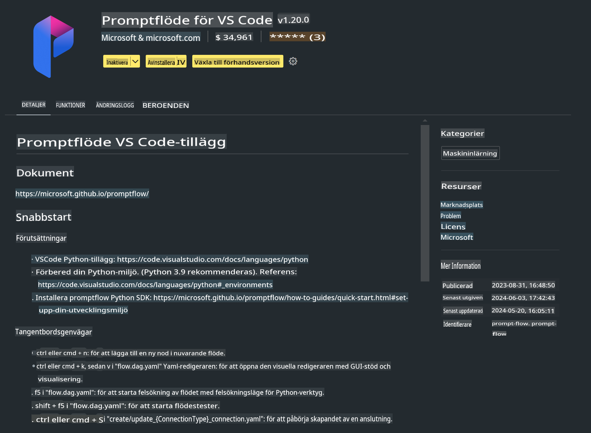

# **Lab 0 - Installation**

När vi går in i labben behöver vi konfigurera den relevanta miljön:

### **1. Python 3.11+**

Det rekommenderas att använda miniforge för att konfigurera din Python-miljö.  

För att konfigurera miniforge, vänligen se [https://github.com/conda-forge/miniforge](https://github.com/conda-forge/miniforge).

Efter att ha konfigurerat miniforge, kör följande kommando i Power Shell:

```bash

conda create -n pyenv python==3.11.8 -y

conda activate pyenv

```

### **2. Installera Prompt flow SDK**

I Lab 1 använder vi Prompt flow, så du behöver konfigurera Prompt flow SDK.

```bash

pip install promptflow --upgrade

```

Du kan kontrollera promptflow SDK med detta kommando:

```bash

pf --version

```

### **3. Installera Visual Studio Code Prompt flow Extension**



### **4. Intel NPU Acceleration Library**

Intels nya generation av processorer stöder NPU. Om du vill använda NPU för att köra LLMs / SLMs lokalt kan du använda ***Intel NPU Acceleration Library***. För mer information kan du läsa [https://github.com/microsoft/PhiCookBook/blob/main/md/01.Introduction/03/AIPC_Inference.md](https://github.com/microsoft/PhiCookBook/blob/main/md/01.Introduction/03/AIPC_Inference.md).

Installera Intel NPU Acceleration Library i bash:

```bash

pip install intel-npu-acceleration-library

```

***Notera***: Observera att detta bibliotek stöder transformers ***4.40.2***, vänligen bekräfta versionen.

### **5. Andra Python-bibliotek**

Skapa requirements.txt och lägg till detta innehåll:

```txt

notebook
numpy 
scipy 
scikit-learn 
matplotlib 
pandas 
pillow 
graphviz

```

### **6. Installera NVM**

Installera nvm i PowerShell:

```bash

winget install -e --id CoreyButler.NVMforWindows

```

Installera nodejs 18.20:

```bash

nvm install 18.20.0

nvm use 18.20.0

```

### **7. Installera Visual Studio Code Development Support**

```bash

npm install --global yo generator-code

```

Grattis! Du har framgångsrikt konfigurerat SDK. Gå vidare till de praktiska stegen.

**Ansvarsfriskrivning**:  
Detta dokument har översatts med hjälp av AI-baserade maskinöversättningstjänster. Även om vi strävar efter noggrannhet, vänligen notera att automatiska översättningar kan innehålla fel eller felaktigheter. Det ursprungliga dokumentet på dess ursprungliga språk bör betraktas som den auktoritativa källan. För kritisk information rekommenderas professionell mänsklig översättning. Vi tar inget ansvar för eventuella missförstånd eller feltolkningar som uppstår vid användning av denna översättning.