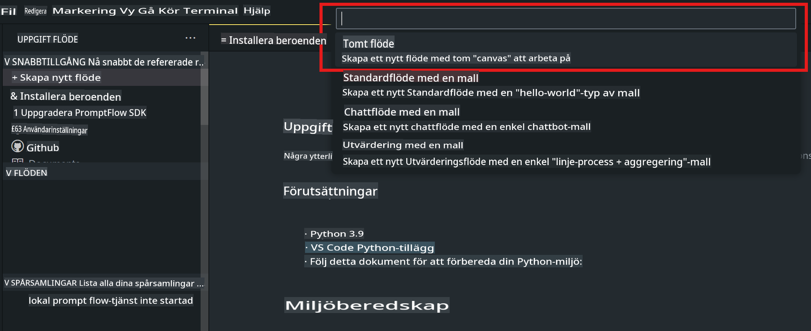
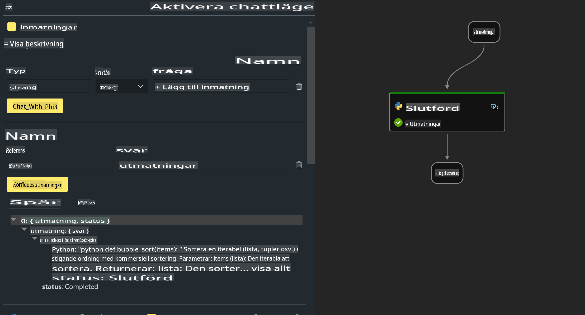

# **Lab 2 - Kör Prompt flow med Phi-3-mini i AIPC**

## **Vad är Prompt flow**

Prompt flow är en uppsättning utvecklingsverktyg som är utformade för att förenkla hela utvecklingscykeln för AI-applikationer baserade på stora språkmodeller (LLM), från idé, prototyp, testning, utvärdering till produktionsimplementering och övervakning. Det gör prompt engineering mycket enklare och låter dig bygga LLM-appar med produktionskvalitet.

Med Prompt flow kan du:

- Skapa flöden som länkar LLM:er, prompts, Python-kod och andra verktyg tillsammans i ett exekverbart arbetsflöde.

- Felsöka och iterera dina flöden, särskilt interaktionen med LLM:er, på ett smidigt sätt.

- Utvärdera dina flöden och beräkna kvalitets- och prestandamått med större dataset.

- Integrera testning och utvärdering i ditt CI/CD-system för att säkerställa kvaliteten på ditt flöde.

- Distribuera dina flöden till den serverplattform du väljer eller enkelt integrera dem i din apps kodbas.

- (Valfritt men starkt rekommenderat) Samarbeta med ditt team genom att använda molnversionen av Prompt flow i Azure AI.

## **Vad är AIPC**

En AI-PC har en CPU, en GPU och en NPU, var och en med specifika AI-accelerationsförmågor. En NPU, eller neural processing unit, är en specialiserad accelerator som hanterar uppgifter inom artificiell intelligens (AI) och maskininlärning (ML) direkt på din dator istället för att skicka data till molnet för bearbetning. GPU:n och CPU:n kan också bearbeta dessa arbetsbelastningar, men NPU:n är särskilt bra på AI-beräkningar med låg strömförbrukning. AI-PC:n representerar ett grundläggande skifte i hur våra datorer fungerar. Det är inte en lösning på ett problem som inte fanns tidigare. Istället lovar det att vara en stor förbättring för vardaglig datoranvändning.

Så hur fungerar det? Jämfört med generativ AI och de massiva stora språkmodellerna (LLM) som tränas på stora mängder offentlig data, är AI som sker på din dator mer tillgänglig på nästan alla nivåer. Konceptet är lättare att förstå, och eftersom det är tränat på din data utan att behöva tillgång till molnet, är fördelarna mer omedelbart tilltalande för en bredare publik.

På kort sikt innebär AI-PC-världen personliga assistenter och mindre AI-modeller som körs direkt på din dator, med hjälp av din data för att erbjuda personliga, privata och säkrare AI-förbättringar för saker du redan gör varje dag – som att ta mötesanteckningar, organisera en fantasy-fotbollsliga, automatisera förbättringar för foto- och videoredigering, eller lägga upp den perfekta resplanen för en familjesammankomst baserat på allas ankomst- och avresetider.

## **Bygga kodgenereringsflöden på AIPC**

***Note*** ：Om du inte har slutfört installationen av miljön, vänligen besök [Lab 0 -Installations](./01.Installations.md)

1. Öppna Prompt flow-tillägget i Visual Studio Code och skapa ett tomt flödessprojekt



2. Lägg till in- och utgångsparametrar och lägg till Python-kod som ett nytt flöde



Du kan hänvisa till denna struktur (flow.dag.yaml) för att konstruera ditt flöde

```yaml

inputs:
  question:
    type: string
    default: how to write Bubble Algorithm
outputs:
  answer:
    type: string
    reference: ${Chat_With_Phi3.output}
nodes:
- name: Chat_With_Phi3
  type: python
  source:
    type: code
    path: Chat_With_Phi3.py
  inputs:
    question: ${inputs.question}


```

3. Lägg till kod i ***Chat_With_Phi3.py***

```python


from promptflow.core import tool

# import torch
from transformers import AutoTokenizer, pipeline,TextStreamer
import intel_npu_acceleration_library as npu_lib

import warnings

import asyncio
import platform

class Phi3CodeAgent:
    
    model = None
    tokenizer = None
    text_streamer = None
    
    model_id = "microsoft/Phi-3-mini-4k-instruct"

    @staticmethod
    def init_phi3():
        
        if Phi3CodeAgent.model is None or Phi3CodeAgent.tokenizer is None or Phi3CodeAgent.text_streamer is None:
            Phi3CodeAgent.model = npu_lib.NPUModelForCausalLM.from_pretrained(
                                    Phi3CodeAgent.model_id,
                                    torch_dtype="auto",
                                    dtype=npu_lib.int4,
                                    trust_remote_code=True
                                )
            Phi3CodeAgent.tokenizer = AutoTokenizer.from_pretrained(Phi3CodeAgent.model_id)
            Phi3CodeAgent.text_streamer = TextStreamer(Phi3CodeAgent.tokenizer, skip_prompt=True)

    

    @staticmethod
    def chat_with_phi3(prompt):
        
        Phi3CodeAgent.init_phi3()

        messages = "<|system|>You are a AI Python coding assistant. Please help me to generate code in Python.The answer only genertated Python code, but any comments and instructions do not need to be generated<|end|><|user|>" + prompt +"<|end|><|assistant|>"


        generation_args = {
            "max_new_tokens": 1024,
            "return_full_text": False,
            "temperature": 0.3,
            "do_sample": False,
            "streamer": Phi3CodeAgent.text_streamer,
        }

        pipe = pipeline(
            "text-generation",
            model=Phi3CodeAgent.model,
            tokenizer=Phi3CodeAgent.tokenizer,
            # **generation_args
        )

        result = ''

        with warnings.catch_warnings():
            warnings.simplefilter("ignore")
            response = pipe(messages, **generation_args)
            result =response[0]['generated_text']
            return result


@tool
def my_python_tool(question: str) -> str:
    if platform.system() == 'Windows':
        asyncio.set_event_loop_policy(asyncio.WindowsSelectorEventLoopPolicy())
    return Phi3CodeAgent.chat_with_phi3(question)


```

4. Du kan testa flödet från Debug eller Run för att kontrollera om kodgenereringen fungerar korrekt


5. Kör flödet som en utvecklings-API i terminalen

```

pf flow serve --source ./ --port 8080 --host localhost   

```

Du kan testa det i Postman / Thunder Client

### **Notera**

1. Den första körningen tar lång tid. Det rekommenderas att ladda ner phi-3-modellen från Hugging face CLI.

2. Med tanke på den begränsade beräkningskraften hos Intel NPU rekommenderas det att använda Phi-3-mini-4k-instruct.

3. Vi använder Intel NPU-acceleration för att kvantisera INT4-konvertering, men om du kör om tjänsten måste du ta bort cache- och nc_workshop-mapparna.

## **Resurser**

1. Lär dig Promptflow [https://microsoft.github.io/promptflow/](https://microsoft.github.io/promptflow/)

2. Lär dig Intel NPU Acceleration [https://github.com/intel/intel-npu-acceleration-library](https://github.com/intel/intel-npu-acceleration-library)

3. Exempelkod, ladda ner [Local NPU Agent Sample Code](../../../../../../../../../code/07.Lab/01/AIPC)

**Ansvarsfriskrivning**:  
Detta dokument har översatts med hjälp av maskinbaserade AI-översättningstjänster. Även om vi strävar efter noggrannhet, vänligen observera att automatiska översättningar kan innehålla fel eller brister. Det ursprungliga dokumentet på dess originalspråk bör betraktas som den auktoritativa källan. För kritisk information rekommenderas professionell mänsklig översättning. Vi tar inget ansvar för missförstånd eller feltolkningar som uppstår vid användning av denna översättning.