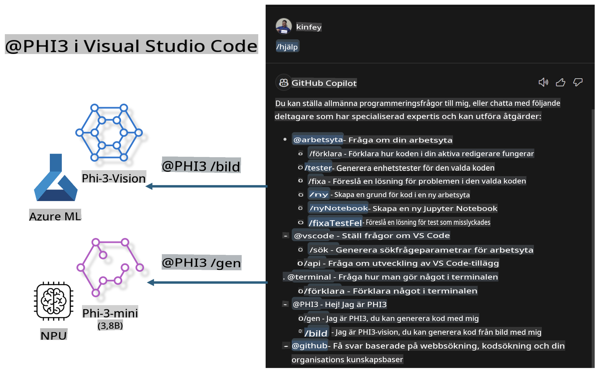

# **Bygg din egen Visual Studio Code GitHub Copilot Chat med Microsoft Phi-3 Family**

Har du använt arbetsyteagenten i GitHub Copilot Chat? Vill du bygga en kodagent för ditt eget team? Denna praktiska labb hoppas kombinera den öppna källkodsmodellen för att skapa en företagsnivå kodagent.

## **Grundläggande**

### **Varför välja Microsoft Phi-3**

Phi-3 är en familjeserie som inkluderar phi-3-mini, phi-3-small och phi-3-medium baserat på olika träningsparametrar för textgenerering, dialogslutförande och kodgenerering. Det finns också phi-3-vision baserat på Vision. Det är lämpligt för företag eller olika team att skapa offline generativa AI-lösningar.

Rekommenderas att läsa denna länk [https://github.com/microsoft/PhiCookBook/blob/main/md/01.Introduction/01/01.PhiFamily.md](https://github.com/microsoft/PhiCookBook/blob/main/md/01.Introduction/01/01.PhiFamily.md)

### **Microsoft GitHub Copilot Chat**

GitHub Copilot Chat-tillägget ger dig ett chattgränssnitt som låter dig interagera med GitHub Copilot och få svar på kodrelaterade frågor direkt i VS Code, utan att behöva navigera i dokumentation eller söka på nätforum.

Copilot Chat kan använda syntaxmarkering, indrag och andra formateringsfunktioner för att tydliggöra det genererade svaret. Beroende på användarens fråga kan resultatet innehålla länkar till kontext som Copilot använde för att generera ett svar, såsom källkodsfiler eller dokumentation, eller knappar för att komma åt VS Code-funktionalitet.

- Copilot Chat integreras i din utvecklingsflöde och ger dig hjälp där du behöver det:

- Starta en chattkonversation direkt från editorn eller terminalen för hjälp medan du kodar

- Använd Chat-vyn för att ha en AI-assistent vid sidan som hjälper dig när som helst

- Starta Quick Chat för att ställa en snabb fråga och återgå till vad du håller på med

Du kan använda GitHub Copilot Chat i olika scenarier, som:

- Besvara kodrelaterade frågor om hur man bäst löser ett problem

- Förklara någon annans kod och föreslå förbättringar

- Föreslå kodfixar

- Generera enhetstestfall

- Generera koddokumentation

Rekommenderas att läsa denna länk [https://code.visualstudio.com/docs/copilot/copilot-chat](https://code.visualstudio.com/docs/copilot/copilot-chat?WT.mc_id=aiml-137032-kinfeylo)

### **Microsoft GitHub Copilot Chat @workspace**

Att referera till **@workspace** i Copilot Chat låter dig ställa frågor om hela din kodbas. Baserat på frågan hämtar Copilot intelligent relevanta filer och symboler, som det sedan refererar till i sitt svar som länkar och kodexempel.

För att besvara din fråga söker **@workspace** igenom samma källor som en utvecklare skulle använda när denne navigerar en kodbas i VS Code:

- Alla filer i arbetsytan, förutom filer som ignoreras av en .gitignore-fil

- Katalogstrukturen med inbäddade mappar och filnamn

- GitHubs kodsökningsindex, om arbetsytan är ett GitHub-repository och indexeras av kodsökning

- Symboler och definitioner i arbetsytan

- För närvarande markerad text eller synlig text i den aktiva editorn

Observera: .gitignore ignoreras om du har en fil öppen eller har markerat text inom en ignorerad fil.

Rekommenderas att läsa denna länk [https://code.visualstudio.com/docs/copilot/workspace-context](https://code.visualstudio.com/docs/copilot/workspace-context?WT.mc_id=aiml-137032-kinfeylo)

## **Lär dig mer om denna labb**

GitHub Copilot har kraftigt förbättrat företags effektivitet i programmering, och varje företag hoppas kunna anpassa relevanta funktioner i GitHub Copilot. Många företag har anpassat tillägg liknande GitHub Copilot baserat på sina egna affärsscenarier och öppna källkodsmodeller. För företag är anpassade tillägg enklare att kontrollera, men detta påverkar också användarupplevelsen. Trots allt har GitHub Copilot starkare funktioner när det gäller att hantera generella scenarier och professionalism. Om upplevelsen kan förbli konsekvent, skulle det vara bättre att anpassa företagets eget tillägg. GitHub Copilot Chat tillhandahåller relevanta API:er för företag att expandera i chattupplevelsen. Att upprätthålla en konsekvent upplevelse och ha anpassade funktioner ger en bättre användarupplevelse.

Denna labb använder huvudsakligen Phi-3-modellen kombinerad med den lokala NPU:n och Azure hybrid för att bygga en anpassad agent i GitHub Copilot Chat ***@PHI3*** för att hjälpa företagsutvecklare att slutföra kodgenerering ***(@PHI3 /gen)*** och generera kod baserat på bilder ***(@PHI3 /img)***.

### ***Notera:*** 

Denna labb är för närvarande implementerad i AIPC på Intel CPU och Apple Silicon. Vi kommer att fortsätta uppdatera Qualcomm-versionen av NPU.

## **Labben**

| Namn | Beskrivning | AIPC | Apple |
| ------------ | ----------- | -------- |-------- |
| Lab0 - Installationer(✅) | Konfigurera och installera relaterade miljöer och verktyg | [Gå](./HOL/AIPC/01.Installations.md) |[Gå](./HOL/Apple/01.Installations.md) |
| Lab1 - Kör Prompt flow med Phi-3-mini (✅) | Kombinerat med AIPC / Apple Silicon, använd lokal NPU för att skapa kodgenerering genom Phi-3-mini | [Gå](./HOL/AIPC/02.PromptflowWithNPU.md) |  [Gå](./HOL/Apple/02.PromptflowWithMLX.md) |
| Lab2 - Distribuera Phi-3-vision på Azure Machine Learning Service(✅) | Generera kod genom att distribuera Azure Machine Learning Service:s Model Catalog - Phi-3-vision bild | [Gå](./HOL/AIPC/03.DeployPhi3VisionOnAzure.md) |[Gå](./HOL/Apple/03.DeployPhi3VisionOnAzure.md) |
| Lab3 - Skapa en @phi-3 agent i GitHub Copilot Chat(✅)  | Skapa en anpassad Phi-3 agent i GitHub Copilot Chat för att slutföra kodgenerering, grafgenerering, RAG, etc. | [Gå](./HOL/AIPC/04.CreatePhi3AgentInVSCode.md) | [Gå](./HOL/Apple/04.CreatePhi3AgentInVSCode.md) |
| Exempelkod (✅)  | Ladda ner exempelkod | [Gå](../../../../../../../code/07.Lab/01/AIPC) | [Gå](../../../../../../../code/07.Lab/01/Apple) |

## **Resurser**

1. Phi-3 Cookbook [https://github.com/microsoft/Phi-3CookBook](https://github.com/microsoft/Phi-3CookBook)

2. Lär dig mer om GitHub Copilot [https://learn.microsoft.com/training/paths/copilot/](https://learn.microsoft.com/training/paths/copilot/?WT.mc_id=aiml-137032-kinfeylo)

3. Lär dig mer om GitHub Copilot Chat [https://learn.microsoft.com/training/paths/accelerate-app-development-using-github-copilot/](https://learn.microsoft.com/training/paths/accelerate-app-development-using-github-copilot/?WT.mc_id=aiml-137032-kinfeylo)

4. Lär dig mer om GitHub Copilot Chat API [https://code.visualstudio.com/api/extension-guides/chat](https://code.visualstudio.com/api/extension-guides/chat?WT.mc_id=aiml-137032-kinfeylo)

5. Lär dig mer om Azure AI Foundry [https://learn.microsoft.com/training/paths/create-custom-copilots-ai-studio/](https://learn.microsoft.com/training/paths/create-custom-copilots-ai-studio/?WT.mc_id=aiml-137032-kinfeylo)

6. Lär dig mer om Azure AI Foundry's Model Catalog [https://learn.microsoft.com/azure/ai-studio/how-to/model-catalog-overview](https://learn.microsoft.com/azure/ai-studio/how-to/model-catalog-overview)

**Ansvarsfriskrivning**:  
Detta dokument har översatts med hjälp av maskinbaserade AI-översättningstjänster. Även om vi strävar efter noggrannhet, vänligen notera att automatiska översättningar kan innehålla fel eller inexaktheter. Det ursprungliga dokumentet på dess originalspråk bör betraktas som den auktoritativa källan. För kritisk information rekommenderas professionell mänsklig översättning. Vi tar inget ansvar för missförstånd eller feltolkningar som uppstår vid användning av denna översättning.