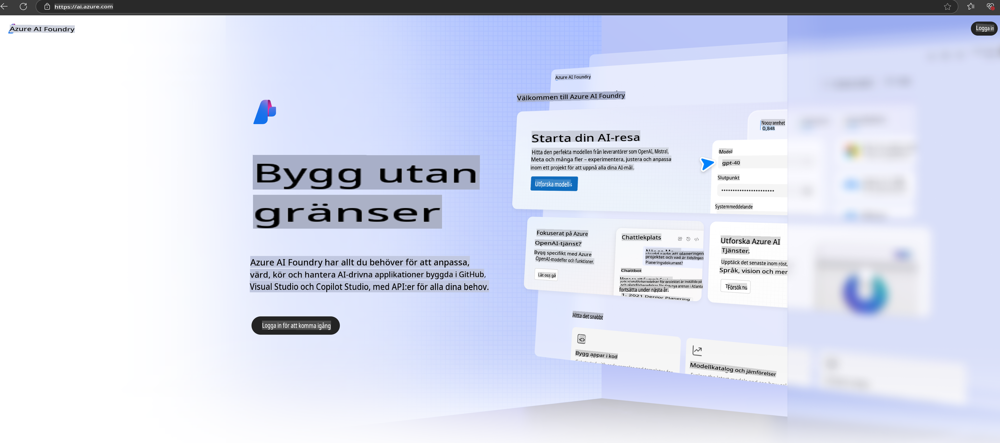

# **Använda Phi-3 i Azure AI Foundry**

Med utvecklingen av Generativ AI hoppas vi kunna använda en enhetlig plattform för att hantera olika LLM och SLM, integrera företagsdata, finjustera/RAG-operationer och utvärdera olika företagsverksamheter efter integrationen av LLM och SLM, med mera, så att generativ AI kan implementeras på ett smartare sätt. [Azure AI Foundry](https://ai.azure.com) är en företagsplattform för generativa AI-applikationer.

Med Azure AI Foundry kan du utvärdera svar från stora språkmodeller (LLM) och orkestrera promptkomponenter med prompt flow för att uppnå bättre prestanda. Plattformen möjliggör skalbarhet för att enkelt omvandla koncepttester till fullskalig produktion. Kontinuerlig övervakning och förbättring stödjer långsiktig framgång.

Vi kan snabbt distribuera Phi-3-modellen på Azure AI Foundry genom enkla steg och sedan använda Azure AI Foundry för att utföra Phi-3-relaterade Playground/Chat, finjustering, utvärdering och andra relaterade uppgifter.

## **1. Förberedelse**

Om du redan har [Azure Developer CLI](https://learn.microsoft.com/azure/developer/azure-developer-cli/overview?WT.mc_id=aiml-138114-kinfeylo) installerad på din dator, är det lika enkelt att använda denna mall som att köra detta kommando i en ny katalog.

## Manuell skapelse

Att skapa ett Microsoft Azure AI Foundry-projekt och en hubb är ett utmärkt sätt att organisera och hantera ditt AI-arbete. Här är en steg-för-steg-guide för att komma igång:

### Skapa ett projekt i Azure AI Foundry

1. **Gå till Azure AI Foundry**: Logga in på Azure AI Foundry-portalen.
2. **Skapa ett projekt**:
   - Om du är i ett projekt, välj "Azure AI Foundry" längst upp till vänster på sidan för att gå till startsidan.
   - Välj "+ Skapa projekt".
   - Ange ett namn för projektet.
   - Om du har en hubb kommer den att väljas som standard. Om du har tillgång till fler än en hubb kan du välja en annan från rullgardinsmenyn. Om du vill skapa en ny hubb väljer du "Skapa ny hubb" och anger ett namn.
   - Välj "Skapa".

### Skapa en hubb i Azure AI Foundry

1. **Gå till Azure AI Foundry**: Logga in med ditt Azure-konto.
2. **Skapa en hubb**:
   - Välj Hanteringscenter från menyn till vänster.
   - Välj "Alla resurser", klicka sedan på pilen bredvid "+ Nytt projekt" och välj "+ Ny hubb".
   - I dialogrutan "Skapa en ny hubb", ange ett namn för din hubb (t.ex. contoso-hub) och justera de andra fälten efter behov.
   - Välj "Nästa", granska informationen och välj sedan "Skapa".

För mer detaljerade instruktioner kan du hänvisa till den officiella [Microsoft-dokumentationen](https://learn.microsoft.com/azure/ai-studio/how-to/create-projects).

Efter en lyckad skapelse kan du komma åt den studio du skapade via [ai.azure.com](https://ai.azure.com/)

Det kan finnas flera projekt på en AI Foundry. Skapa ett projekt i AI Foundry för att förbereda.

Skapa Azure AI Foundry [QuickStarts](https://learn.microsoft.com/azure/ai-studio/quickstarts/get-started-code)

## **2. Distribuera en Phi-modell i Azure AI Foundry**

Klicka på Utforska-alternativet för projektet för att gå in i Modellkatalogen och välj Phi-3.

Välj Phi-3-mini-4k-instruct.

Klicka på 'Distribuera' för att distribuera Phi-3-mini-4k-instruct-modellen.

> [!NOTE]
>
> Du kan välja datorkraft vid distribution.

## **3. Playground Chat Phi i Azure AI Foundry**

Gå till distributionssidan, välj Playground och chatta med Phi-3 i Azure AI Foundry.

## **4. Distribuera modellen från Azure AI Foundry**

För att distribuera en modell från Azure Model Catalog kan du följa dessa steg:

- Logga in på Azure AI Foundry.
- Välj den modell du vill distribuera från modellkatalogen i Azure AI Foundry.
- På modellens detaljsida väljer du Distribuera och sedan Serverless API med Azure AI Content Safety.
- Välj det projekt där du vill distribuera dina modeller. För att använda Serverless API-erbjudandet måste din arbetsyta tillhöra regionen East US 2 eller Sweden Central. Du kan anpassa distributionsnamnet.
- I distributionsguiden, välj Prissättning och villkor för att läsa om prissättning och användningsvillkor.
- Välj Distribuera. Vänta tills distributionen är klar och du omdirigeras till distributionssidan.
- Välj Öppna i playground för att börja interagera med modellen.
- Du kan återvända till distributionssidan, välja distributionen och notera slutpunktens mål-URL och hemliga nyckel, som du kan använda för att anropa distributionen och generera svar.
- Du kan alltid hitta slutpunktens detaljer, URL och åtkomstnycklar genom att navigera till fliken Bygg och välja Distributioner från Komponentsektionen.

> [!NOTE]
> Observera att ditt konto måste ha Azure AI Developer-rollbehörigheter på resursgruppen för att utföra dessa steg.

## **5. Använda Phi API i Azure AI Foundry**

Du kan komma åt https://{Ditt projektnamn}.region.inference.ml.azure.com/swagger.json genom att använda Postman GET och kombinera det med nyckeln för att lära dig om de tillgängliga gränssnitten.

Du kan mycket enkelt få fram begäransparametrar samt svarparametrar.

**Ansvarsfriskrivning**:  
Detta dokument har översatts med hjälp av maskinbaserade AI-översättningstjänster. Även om vi strävar efter noggrannhet, var medveten om att automatiserade översättningar kan innehålla fel eller felaktigheter. Det ursprungliga dokumentet på dess originalspråk bör betraktas som den auktoritativa källan. För kritisk information rekommenderas professionell mänsklig översättning. Vi ansvarar inte för eventuella missförstånd eller feltolkningar som uppstår till följd av användningen av denna översättning.