# Finjustering av Phi-3 med Azure AI Foundry

Låt oss utforska hur man kan finjustera Microsofts språkmodell Phi-3 Mini med Azure AI Foundry. Genom finjustering kan du anpassa Phi-3 Mini till specifika uppgifter, vilket gör den ännu kraftfullare och mer kontextmedveten.

## Överväganden

- **Kapacitet:** Vilka modeller kan finjusteras? Vad kan grundmodellen anpassas till att göra?  
- **Kostnad:** Vad är prismodellen för finjustering?  
- **Anpassningsbarhet:** Hur mycket kan jag modifiera grundmodellen – och på vilka sätt?  
- **Bekvämlighet:** Hur går finjusteringen till – behöver jag skriva egen kod? Behöver jag tillhandahålla egen beräkningskapacitet?  
- **Säkerhet:** Finjusterade modeller är kända för att kunna innebära säkerhetsrisker – finns det skyddsåtgärder för att förhindra oavsiktlig skada?  

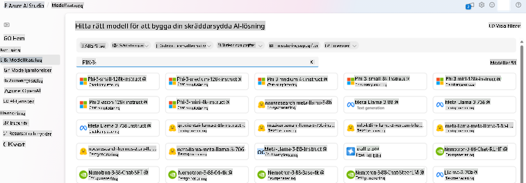

## Förberedelser inför finjustering

### Förutsättningar

> [!NOTE]  
> För modeller i Phi-3-familjen är betalningsmodellen för finjustering endast tillgänglig för hubbar skapade i regionen **East US 2**.

- Ett Azure-abonnemang. Om du inte har ett Azure-abonnemang, skapa ett [betalt Azure-konto](https://azure.microsoft.com/pricing/purchase-options/pay-as-you-go) för att komma igång.  

- Ett [AI Foundry-projekt](https://ai.azure.com?WT.mc_id=aiml-138114-kinfeylo).  
- Azure-rollbaserade åtkomstkontroller (Azure RBAC) används för att ge åtkomst till operationer i Azure AI Foundry. För att utföra stegen i den här artikeln måste ditt användarkonto ha rollen __Azure AI Developer__ tilldelad på resursgruppen.  

### Registrering av abonnemangsleverantör

Verifiera att abonnemanget är registrerat för resursleverantören `Microsoft.Network`.

1. Logga in på [Azure-portalen](https://portal.azure.com).  
1. Välj **Abonnemang** från vänstermenyn.  
1. Välj det abonnemang du vill använda.  
1. Välj **AI-projektinställningar** > **Resursleverantörer** från vänstermenyn.  
1. Kontrollera att **Microsoft.Network** finns i listan över resursleverantörer. Lägg till det om det saknas.  

### Datapreparering

Förbered din tränings- och valideringsdata för att finjustera din modell. Dina tränings- och valideringsdatasätt består av in- och utgångsexempel för hur du vill att modellen ska prestera.

Se till att alla dina träningsdata följer det förväntade formatet för inferens. För att effektivt finjustera modeller bör du säkerställa en balanserad och varierad dataset.

Detta innebär att bibehålla databalans, inkludera olika scenarier och periodiskt justera träningsdata för att stämma överens med verkliga förväntningar, vilket i slutändan leder till mer exakta och balanserade modellresponser.

Olika typer av modeller kräver olika format för träningsdata.

### Chat Completion

De tränings- och valideringsdata du använder **måste** vara formaterade som ett JSON Lines (JSONL)-dokument. För `Phi-3-mini-128k-instruct` måste datasetet för finjustering vara formaterat i det konversationsformat som används av Chat completions API.

### Exempelfilformat

```json
    {"messages": [{"role": "system", "content": "You are an Xbox customer support agent whose primary goal is to help users with issues they are experiencing with their Xbox devices. You are friendly and concise. You only provide factual answers to queries, and do not provide answers that are not related to Xbox."}, {"role": "user", "content": "Is Xbox better than PlayStation?"}, {"role": "assistant", "content": "I apologize, but I cannot provide personal opinions. My primary job is to assist you with any issues related to your Xbox device. Do you have any Xbox-related issues that need addressing?"}]}
    {"messages": [{"role": "system", "content": "You are an Xbox customer support agent whose primary goal is to help users with issues they are experiencing with their Xbox devices. You are friendly and concise. You only provide factual answers to queries, and do not provide answers that are not related to Xbox."}, {"role": "user", "content": "Can I play PC games on my Xbox?"}, {"role": "assistant", "content": "While Xbox consoles don't natively support PC games, they can play an array of Xbox games, many of which are also available on PC. Can I assist you with finding games compatible with your Xbox device?"}]}
    {"messages": [{"role": "system", "content": "You are an Xbox customer support agent whose primary goal is to help users with issues they are experiencing with their Xbox devices. You are friendly and concise. You only provide factual answers to queries, and do not provide answers that are not related to Xbox."}, {"role": "user", "content": "I'm having trouble connecting my Xbox to the Wi-Fi."}, {"role": "assistant", "content": "No worries, let's go through the network settings on your Xbox. Can you please tell me what happens when you try to connect it to the Wi-Fi?"}]}
```

Den stödda filtypen är JSON Lines. Filer laddas upp till standarddatalagret och görs tillgängliga i ditt projekt.

## Finjustering av Phi-3 med Azure AI Foundry

Azure AI Foundry gör det möjligt att anpassa stora språkmodeller till dina egna datasets genom en process som kallas finjustering. Finjustering ger betydande värde genom att möjliggöra anpassning och optimering för specifika uppgifter och tillämpningar. Detta leder till förbättrad prestanda, kostnadseffektivitet, minskad latens och skräddarsydda resultat.

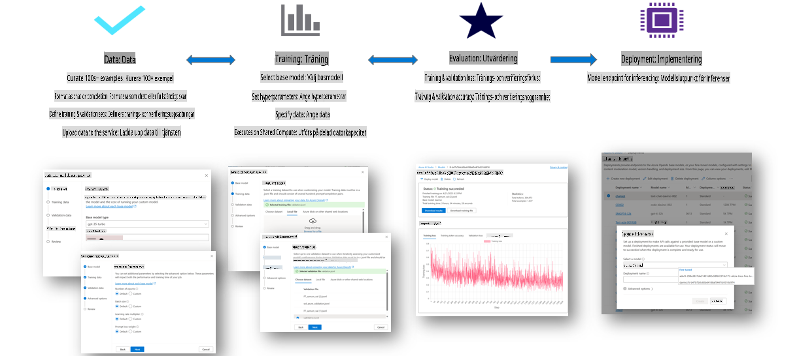

### Skapa ett nytt projekt

1. Logga in på [Azure AI Foundry](https://ai.azure.com).  

1. Välj **+Nytt projekt** för att skapa ett nytt projekt i Azure AI Foundry.  

    

1. Utför följande uppgifter:  

    - Ange ett unikt **Hub-namn** för projektet.  
    - Välj den **Hub** du vill använda (skapa en ny om det behövs).  

    

1. Utför följande uppgifter för att skapa en ny hubb:  

    - Ange ett unikt **Hub-namn**.  
    - Välj ditt Azure-**abonnemang**.  
    - Välj den **resursgrupp** du vill använda (skapa en ny om det behövs).  
    - Välj den **plats** du vill använda.  
    - Välj **Anslut Azure AI Services** (skapa en ny om det behövs).  
    - Välj **Anslut Azure AI Search** och välj **Hoppa över anslutning**.  

    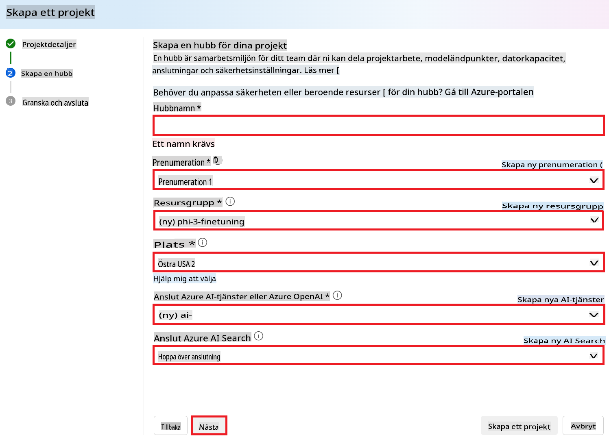

1. Välj **Nästa**.  
1. Välj **Skapa ett projekt**.  

### Datapreparering

Innan du finjusterar, samla in eller skapa en dataset som är relevant för din uppgift, såsom chattinstruktioner, frågor och svar eller annan relevant textdata. Rensa och förbehandla denna data genom att ta bort brus, hantera saknade värden och tokenisera texten.

### Finjustera Phi-3-modeller i Azure AI Foundry

> [!NOTE]  
> Finjustering av Phi-3-modeller stöds för närvarande endast i projekt lokaliserade i East US 2.

1. Välj **Modellkatalog** från vänstermenyn.  

1. Skriv *phi-3* i **sökfältet** och välj den phi-3-modell du vill använda.  

    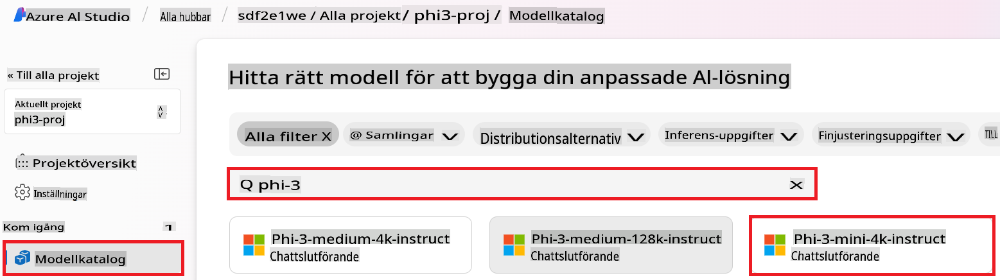

1. Välj **Finjustera**.  

    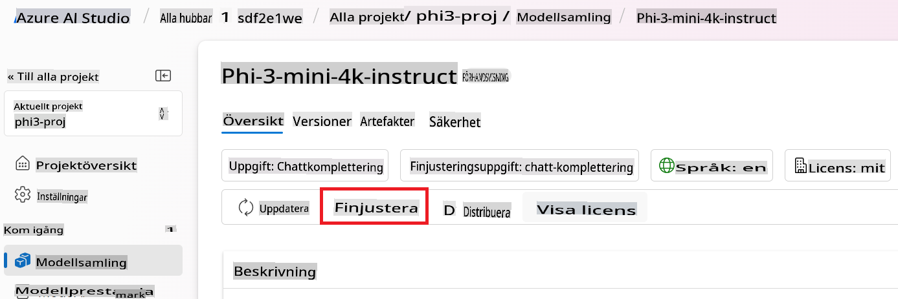

1. Ange ett **namn på den finjusterade modellen**.  

    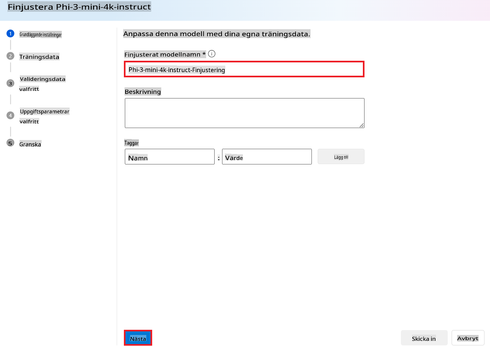

1. Välj **Nästa**.  

1. Utför följande uppgifter:  

    - Välj **Uppgiftstyp** till **Chat completion**.  
    - Välj den **Träningsdata** du vill använda. Du kan ladda upp den via Azure AI Foundry eller från din lokala miljö.  

    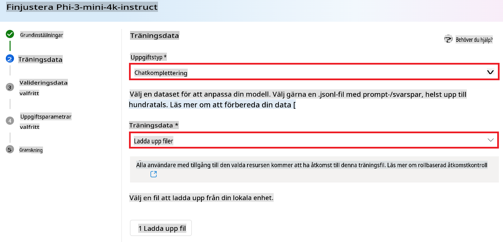

1. Välj **Nästa**.  

1. Ladda upp den **valideringsdata** du vill använda, eller välj **Automatisk uppdelning av träningsdata**.  

    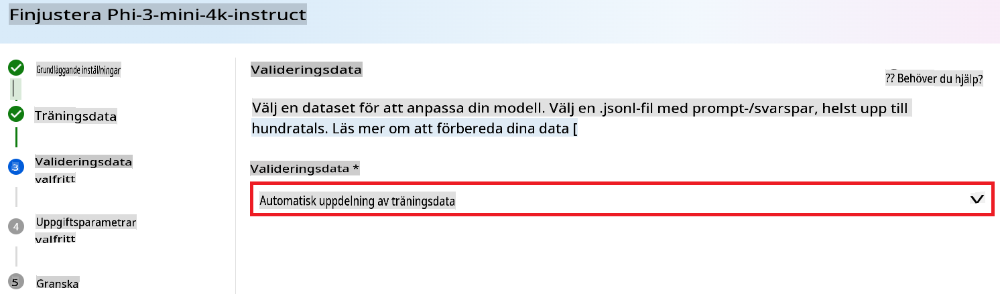

1. Välj **Nästa**.  

1. Utför följande uppgifter:  

    - Välj **Batchstorleksmultiplikator**.  
    - Välj **Inlärningshastighet**.  
    - Välj antal **Epochs**.  

    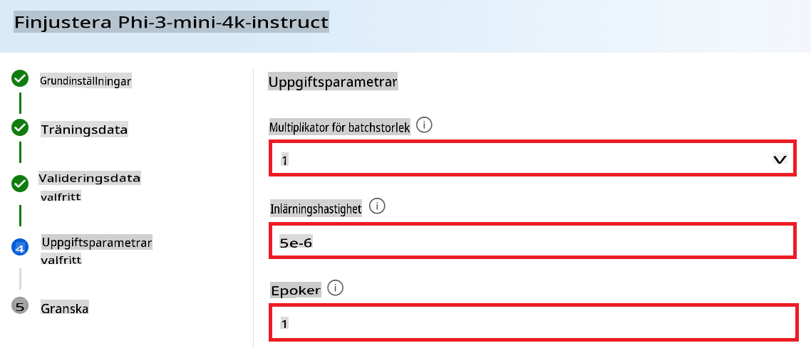

1. Välj **Skicka in** för att starta finjusteringsprocessen.  

    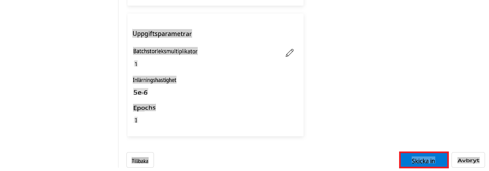

1. När modellen är finjusterad kommer statusen att visas som **Slutförd**, som visas i bilden nedan. Nu kan du distribuera modellen och använda den i din egen applikation, i lekplatsen eller i promptflödet. För mer information, se [Hur man distribuerar Phi-3-familjen av små språkmodeller med Azure AI Foundry](https://learn.microsoft.com/azure/ai-studio/how-to/deploy-models-phi-3?tabs=phi-3-5&pivots=programming-language-python).  

    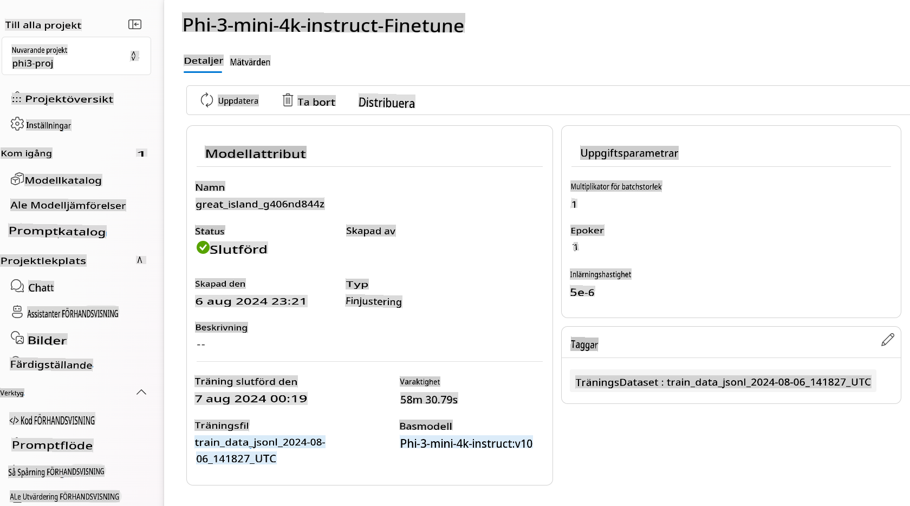

> [!NOTE]  
> För mer detaljerad information om finjustering av Phi-3, besök [Finjustera Phi-3-modeller i Azure AI Foundry](https://learn.microsoft.com/azure/ai-studio/how-to/fine-tune-phi-3?tabs=phi-3-mini).

## Rensa upp dina finjusterade modeller

Du kan ta bort en finjusterad modell från listan över finjusteringsmodeller i [Azure AI Foundry](https://ai.azure.com) eller från modelsidans detaljer. Välj den finjusterade modellen att ta bort från finjusteringssidan och klicka på Ta bort-knappen för att radera modellen.

> [!NOTE]  
> Du kan inte ta bort en anpassad modell om den har en aktiv distribution. Du måste först ta bort modellens distribution innan du kan ta bort den anpassade modellen.

## Kostnad och kvoter

### Kostnads- och kvotöverväganden för Phi-3-modeller finjusterade som en tjänst

Phi-modeller finjusterade som en tjänst erbjuds av Microsoft och är integrerade med Azure AI Foundry för användning. Du kan hitta prissättningen vid [distribution](https://learn.microsoft.com/azure/ai-studio/how-to/deploy-models-phi-3?tabs=phi-3-5&pivots=programming-language-python) eller finjustering av modeller under fliken "Prissättning och villkor" i distributionsguiden.

## Innehållsfiltrering

Modeller distribuerade som en tjänst med betalning efter användning skyddas av Azure AI Content Safety. När de distribueras till realtidsändpunkter kan du välja att inaktivera denna funktion. Med Azure AI Content Safety aktiverad passerar både prompten och resultatet genom en ensemble av klassificeringsmodeller som syftar till att upptäcka och förhindra skadligt innehåll. Innehållsfiltreringssystemet upptäcker och vidtar åtgärder mot specifika kategorier av potentiellt skadligt innehåll i både inmatning och resultat. Läs mer om [Azure AI Content Safety](https://learn.microsoft.com/azure/ai-studio/concepts/content-filtering).

**Konfiguration av finjustering**

Hyperparametrar: Definiera hyperparametrar som inlärningshastighet, batchstorlek och antal träningsomgångar.

**Förlustfunktion**

Välj en lämplig förlustfunktion för din uppgift (t.ex. korsentropi).

**Optimerare**

Välj en optimerare (t.ex. Adam) för gradientuppdateringar under träningen.

**Finjusteringsprocess**

- Ladda förtränad modell: Ladda Phi-3 Mini-checkpointen.  
- Lägg till anpassade lager: Lägg till uppgiftsspecifika lager (t.ex. klassificeringslager för chattinstruktioner).

**Träna modellen**  
Finjustera modellen med din förberedda dataset. Övervaka träningsprocessen och justera hyperparametrarna vid behov.

**Utvärdering och validering**

Valideringsuppsättning: Dela upp din data i tränings- och valideringsuppsättningar.

**Utvärdera prestanda**

Använd mått som noggrannhet, F1-score eller perplexitet för att bedöma modellens prestanda.

## Spara finjusterad modell

**Checkpoint**  
Spara den finjusterade modellens checkpoint för framtida användning.

## Distribution

- Distribuera som en webbtjänst: Distribuera din finjusterade modell som en webbtjänst i Azure AI Foundry.  
- Testa ändpunkten: Skicka testfrågor till den distribuerade ändpunkten för att verifiera dess funktionalitet.  

## Iterera och förbättra

Iterera: Om prestandan inte är tillfredsställande, iterera genom att justera hyperparametrar, lägga till mer data eller finjustera ytterligare omgångar.

## Övervaka och förbättra

Övervaka kontinuerligt modellens beteende och förbättra vid behov.

## Anpassa och utöka

Anpassade uppgifter: Phi-3 Mini kan finjusteras för olika uppgifter utöver chattinstruktioner. Utforska andra användningsområden!  
Experimentera: Prova olika arkitekturer, lagerkombinationer och tekniker för att förbättra prestandan.

> [!NOTE]  
> Finjustering är en iterativ process. Experimentera, lär dig och anpassa din modell för att uppnå bästa möjliga resultat för din specifika uppgift!  

**Ansvarsfriskrivning**:  
Detta dokument har översatts med hjälp av AI-baserade maskinöversättningstjänster. Även om vi strävar efter noggrannhet, vänligen notera att automatiserade översättningar kan innehålla fel eller felaktigheter. Det ursprungliga dokumentet på dess originalspråk bör betraktas som den auktoritativa källan. För kritisk information rekommenderas professionell mänsklig översättning. Vi tar inget ansvar för missförstånd eller feltolkningar som uppstår vid användning av denna översättning.