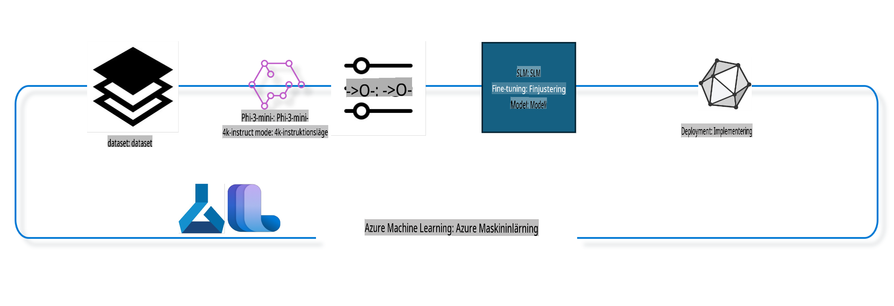

## Hur man använder komponenter för chat-completion från Azure ML-systemregistret för att finjustera en modell

I det här exemplet kommer vi att finjustera modellen Phi-3-mini-4k-instruct för att slutföra en konversation mellan två personer med hjälp av datasetet ultrachat_200k.



Exemplet visar hur du kan finjustera en modell med Azure ML SDK och Python och sedan distribuera den finjusterade modellen till en online-endpoint för realtidsinferens.

### Träningsdata

Vi kommer att använda datasetet ultrachat_200k. Detta är en starkt filtrerad version av UltraChat-datasetet och användes för att träna Zephyr-7B-β, en ledande 7B chattmodell.

### Modell

Vi kommer att använda modellen Phi-3-mini-4k-instruct för att visa hur användare kan finjustera en modell för chat-completion-uppgifter. Om du har öppnat den här notebooken från ett specifikt modellkort, kom ihåg att ersätta modellnamnet med det specifika.

### Uppgifter

- Välj en modell att finjustera.
- Välj och utforska träningsdata.
- Konfigurera jobbet för finjustering.
- Kör jobbet för finjustering.
- Granska tränings- och utvärderingsmetrik.
- Registrera den finjusterade modellen.
- Distribuera den finjusterade modellen för realtidsinferens.
- Rensa resurser.

## 1. Förberedelser

- Installera beroenden.
- Anslut till AzureML Workspace. Läs mer om att ställa in SDK-autentisering. Ersätt <WORKSPACE_NAME>, <RESOURCE_GROUP> och <SUBSCRIPTION_ID> nedan.
- Anslut till AzureML-systemregistret.
- Ange ett valfritt experimentnamn.
- Kontrollera eller skapa beräkningsresurser.

> [!NOTE]
> Kraven är att en GPU-nod kan ha flera GPU-kort. Till exempel finns det 4 NVIDIA V100-GPU:er i en nod av Standard_NC24rs_v3 medan Standard_NC12s_v3 har 2 NVIDIA V100-GPU:er. Se dokumentationen för mer information. Antalet GPU-kort per nod anges i parametern gpus_per_node nedan. Om du ställer in detta värde korrekt kommer alla GPU:er i noden att utnyttjas. Rekommenderade GPU-beräknings-SKU:er finns här och här.

### Python-bibliotek

Installera beroenden genom att köra cellen nedan. Detta steg är inte valfritt om du kör i en ny miljö.

```bash
pip install azure-ai-ml
pip install azure-identity
pip install datasets==2.9.0
pip install mlflow
pip install azureml-mlflow
```

### Interagera med Azure ML

1. Detta Python-skript används för att interagera med Azure Machine Learning (Azure ML). Här är en sammanfattning av vad det gör:

    - Importerar nödvändiga moduler från azure.ai.ml, azure.identity och azure.ai.ml.entities samt time-modulen.

    - Försöker autentisera med DefaultAzureCredential(), vilket förenklar autentisering för applikationer som körs i Azure-molnet. Om detta misslyckas används InteractiveBrowserCredential() som ger en interaktiv inloggningsprompt.

    - Försöker skapa en MLClient-instans med from_config-metoden, som läser konfigurationen från standardkonfigurationsfilen (config.json). Om detta misslyckas skapas en MLClient-instans genom att manuellt ange subscription_id, resource_group_name och workspace_name.

    - Skapar ytterligare en MLClient-instans för Azure ML-registret med namnet "azureml". Detta register lagrar modeller, finjusteringspipelines och miljöer.

    - Sätter experiment_name till "chat_completion_Phi-3-mini-4k-instruct".

    - Genererar en unik tidsstämpel genom att konvertera den aktuella tiden (i sekunder sedan epoken, som ett flyttal) till ett heltal och sedan till en sträng. Denna tidsstämpel kan användas för att skapa unika namn och versioner.

    ```python
    # Import necessary modules from Azure ML and Azure Identity
    from azure.ai.ml import MLClient
    from azure.identity import (
        DefaultAzureCredential,
        InteractiveBrowserCredential,
    )
    from azure.ai.ml.entities import AmlCompute
    import time  # Import time module
    
    # Try to authenticate using DefaultAzureCredential
    try:
        credential = DefaultAzureCredential()
        credential.get_token("https://management.azure.com/.default")
    except Exception as ex:  # If DefaultAzureCredential fails, use InteractiveBrowserCredential
        credential = InteractiveBrowserCredential()
    
    # Try to create an MLClient instance using the default config file
    try:
        workspace_ml_client = MLClient.from_config(credential=credential)
    except:  # If that fails, create an MLClient instance by manually providing the details
        workspace_ml_client = MLClient(
            credential,
            subscription_id="<SUBSCRIPTION_ID>",
            resource_group_name="<RESOURCE_GROUP>",
            workspace_name="<WORKSPACE_NAME>",
        )
    
    # Create another MLClient instance for the Azure ML registry named "azureml"
    # This registry is where models, fine-tuning pipelines, and environments are stored
    registry_ml_client = MLClient(credential, registry_name="azureml")
    
    # Set the experiment name
    experiment_name = "chat_completion_Phi-3-mini-4k-instruct"
    
    # Generate a unique timestamp that can be used for names and versions that need to be unique
    timestamp = str(int(time.time()))
    ```

## 2. Välj en grundmodell att finjustera

1. Phi-3-mini-4k-instruct är en modell med 3,8 miljarder parametrar, lättviktig och ledande, baserad på dataset som användes för Phi-2. Modellen tillhör Phi-3-modellfamiljen, och Mini-versionen finns i två varianter, 4K och 128K, vilket representerar kontextlängden (i tokens) som den kan hantera. Vi behöver finjustera modellen för vårt specifika ändamål för att kunna använda den. Du kan bläddra bland dessa modeller i Model Catalog i AzureML Studio genom att filtrera efter chat-completion-uppgifter. I det här exemplet använder vi modellen Phi-3-mini-4k-instruct. Om du har öppnat den här notebooken för en annan modell, ersätt modellnamn och version därefter.

    > [!NOTE]
    > Modellens id-egenskap. Denna kommer att skickas som indata till jobbet för finjustering. Den är också tillgänglig som fältet Asset ID på modellsidan i AzureML Studio Model Catalog.

2. Detta Python-skript interagerar med Azure Machine Learning (Azure ML). Här är en sammanfattning av vad det gör:

    - Sätter model_name till "Phi-3-mini-4k-instruct".

    - Använder get-metoden från registry_ml_client-objektets models-egenskap för att hämta den senaste versionen av modellen med det angivna namnet från Azure ML-registret. Metoden anropas med två argument: modellens namn och en etikett som anger att den senaste versionen ska hämtas.

    - Skriver ut ett meddelande i konsolen som anger modellens namn, version och id som kommer att användas för finjustering. Metodens format används för att infoga modellens namn, version och id i meddelandet. Namn, version och id åtkomst via egenskaper hos foundation_model-objektet.

    ```python
    # Set the model name
    model_name = "Phi-3-mini-4k-instruct"
    
    # Get the latest version of the model from the Azure ML registry
    foundation_model = registry_ml_client.models.get(model_name, label="latest")
    
    # Print the model name, version, and id
    # This information is useful for tracking and debugging
    print(
        "\n\nUsing model name: {0}, version: {1}, id: {2} for fine tuning".format(
            foundation_model.name, foundation_model.version, foundation_model.id
        )
    )
    ```

## 3. Skapa en beräkningsresurs för jobbet

Finjusteringsjobbet fungerar ENDAST med GPU-beräkning. Storleken på beräkningsresursen beror på modellens storlek och det kan ibland vara knepigt att identifiera rätt resurs för jobbet. I denna cell vägleder vi användaren att välja rätt resurs för jobbet.

> [!NOTE]
> De resurser som listas nedan fungerar med den mest optimerade konfigurationen. Ändringar i konfigurationen kan leda till Cuda Out Of Memory-fel. I sådana fall, försök att uppgradera till en större resurs.

> [!NOTE]
> När du väljer compute_cluster_size nedan, se till att resursen är tillgänglig i din resursgrupp. Om en viss resurs inte är tillgänglig kan du begära åtkomst till den.

### Kontrollera om modellen stöder finjustering

1. Detta Python-skript interagerar med en modell i Azure Machine Learning (Azure ML). Här är en sammanfattning av vad det gör:

    - Importerar ast-modulen, som tillhandahåller funktioner för att hantera träd i Pythons abstrakta syntaxgrammatik.

    - Kontrollerar om foundation_model-objektet har en tagg som heter finetune_compute_allow_list. Taggar i Azure ML är nyckel-värde-par som kan skapas och användas för att filtrera och sortera modeller.

    - Om taggen finetune_compute_allow_list finns, används ast.literal_eval-funktionen för att säkert tolka taggens värde (en sträng) till en Python-lista. Denna lista tilldelas variabeln computes_allow_list. Ett meddelande skrivs ut som indikerar att en resurs ska skapas från listan.

    - Om taggen finetune_compute_allow_list inte finns, sätts computes_allow_list till None och ett meddelande skrivs ut som anger att taggen inte är en del av modellens taggar.

    - Sammanfattningsvis kontrollerar detta skript om en specifik tagg finns i modellens metadata, konverterar taggens värde till en lista om den finns och ger feedback till användaren.

    ```python
    # Import the ast module, which provides functions to process trees of the Python abstract syntax grammar
    import ast
    
    # Check if the 'finetune_compute_allow_list' tag is present in the model's tags
    if "finetune_compute_allow_list" in foundation_model.tags:
        # If the tag is present, use ast.literal_eval to safely parse the tag's value (a string) into a Python list
        computes_allow_list = ast.literal_eval(
            foundation_model.tags["finetune_compute_allow_list"]
        )  # convert string to python list
        # Print a message indicating that a compute should be created from the list
        print(f"Please create a compute from the above list - {computes_allow_list}")
    else:
        # If the tag is not present, set computes_allow_list to None
        computes_allow_list = None
        # Print a message indicating that the 'finetune_compute_allow_list' tag is not part of the model's tags
        print("`finetune_compute_allow_list` is not part of model tags")
    ```

### Kontrollera beräkningsinstans

1. Detta Python-skript interagerar med Azure Machine Learning (Azure ML) och utför flera kontroller på en beräkningsinstans. Här är en sammanfattning av vad det gör:

    - Försöker hämta beräkningsinstansen med namnet som lagras i compute_cluster från Azure ML-arbetsytan. Om provisioning state för beräkningsinstansen är "failed", genereras ett ValueError.

    - Kontrollerar om computes_allow_list inte är None. Om den inte är det, konverteras alla resursstorlekar i listan till gemener och det kontrolleras om storleken på den aktuella beräkningsinstansen finns i listan. Om inte, genereras ett ValueError.

    - Om computes_allow_list är None, kontrolleras om storleken på beräkningsinstansen finns i en lista över ej stödda GPU VM-storlekar. Om den gör det, genereras ett ValueError.

    - Hämtar en lista över alla tillgängliga resursstorlekar i arbetsytan. Itererar över listan och för varje resursstorlek kontrolleras om dess namn matchar storleken på den aktuella beräkningsinstansen. Om det gör det, hämtas antalet GPU:er för den resursstorleken och gpu_count_found sätts till True.

    - Om gpu_count_found är True, skrivs antalet GPU:er i beräkningsinstansen ut. Om gpu_count_found är False, genereras ett ValueError.

    - Sammanfattningsvis utför detta skript flera kontroller på en beräkningsinstans i en Azure ML-arbetsyta, inklusive kontroll av dess tillstånd, storlek mot en tillåtelse- eller avvisningslista och antalet GPU:er den har.

    ```python
    # Print the exception message
    print(e)
    # Raise a ValueError if the compute size is not available in the workspace
    raise ValueError(
        f"WARNING! Compute size {compute_cluster_size} not available in workspace"
    )
    
    # Retrieve the compute instance from the Azure ML workspace
    compute = workspace_ml_client.compute.get(compute_cluster)
    # Check if the provisioning state of the compute instance is "failed"
    if compute.provisioning_state.lower() == "failed":
        # Raise a ValueError if the provisioning state is "failed"
        raise ValueError(
            f"Provisioning failed, Compute '{compute_cluster}' is in failed state. "
            f"please try creating a different compute"
        )
    
    # Check if computes_allow_list is not None
    if computes_allow_list is not None:
        # Convert all compute sizes in computes_allow_list to lowercase
        computes_allow_list_lower_case = [x.lower() for x in computes_allow_list]
        # Check if the size of the compute instance is in computes_allow_list_lower_case
        if compute.size.lower() not in computes_allow_list_lower_case:
            # Raise a ValueError if the size of the compute instance is not in computes_allow_list_lower_case
            raise ValueError(
                f"VM size {compute.size} is not in the allow-listed computes for finetuning"
            )
    else:
        # Define a list of unsupported GPU VM sizes
        unsupported_gpu_vm_list = [
            "standard_nc6",
            "standard_nc12",
            "standard_nc24",
            "standard_nc24r",
        ]
        # Check if the size of the compute instance is in unsupported_gpu_vm_list
        if compute.size.lower() in unsupported_gpu_vm_list:
            # Raise a ValueError if the size of the compute instance is in unsupported_gpu_vm_list
            raise ValueError(
                f"VM size {compute.size} is currently not supported for finetuning"
            )
    
    # Initialize a flag to check if the number of GPUs in the compute instance has been found
    gpu_count_found = False
    # Retrieve a list of all available compute sizes in the workspace
    workspace_compute_sku_list = workspace_ml_client.compute.list_sizes()
    available_sku_sizes = []
    # Iterate over the list of available compute sizes
    for compute_sku in workspace_compute_sku_list:
        available_sku_sizes.append(compute_sku.name)
        # Check if the name of the compute size matches the size of the compute instance
        if compute_sku.name.lower() == compute.size.lower():
            # If it does, retrieve the number of GPUs for that compute size and set gpu_count_found to True
            gpus_per_node = compute_sku.gpus
            gpu_count_found = True
    # If gpu_count_found is True, print the number of GPUs in the compute instance
    if gpu_count_found:
        print(f"Number of GPU's in compute {compute.size}: {gpus_per_node}")
    else:
        # If gpu_count_found is False, raise a ValueError
        raise ValueError(
            f"Number of GPU's in compute {compute.size} not found. Available skus are: {available_sku_sizes}."
            f"This should not happen. Please check the selected compute cluster: {compute_cluster} and try again."
        )
    ```

## 4. Välj dataset för att finjustera modellen

1. Vi använder datasetet ultrachat_200k. Datasetet har fyra uppdelningar, lämpliga för Supervised fine-tuning (sft). Generation ranking (gen). Antalet exempel per uppdelning visas nedan:

    ```bash
    train_sft test_sft  train_gen  test_gen
    207865  23110  256032  28304
    ```

1. De följande cellerna visar grundläggande datapreparering för finjustering:

### Visualisera några rader från datan

Vi vill att detta exempel ska köras snabbt, så vi sparar train_sft- och test_sft-filer som innehåller 5% av de redan trimmade raderna. Detta innebär att den finjusterade modellen kommer att ha lägre noggrannhet och därför inte bör användas i verkliga applikationer.  
Skriptet download-dataset.py används för att ladda ner datasetet ultrachat_200k och transformera det till ett format som kan konsumeras av finjusteringspipeline-komponenten. Eftersom datasetet är stort, använder vi här endast en del av det.

1. Att köra skriptet nedan laddar endast ner 5% av datan. Detta kan ökas genom att ändra parametern dataset_split_pc till önskad procentandel.

    > [!NOTE]
    > Vissa språkmodeller har olika språk-koder och därför bör kolumnnamnen i datasetet spegla detta.

1. Här är ett exempel på hur datan bör se ut:
Datasetet för chat-completion lagras i Parquet-format där varje post använder följande schema:

    - Detta är ett JSON-dokument (JavaScript Object Notation), ett populärt datautbytesformat. Här är en sammanfattning av dess struktur:

    - "prompt": Denna nyckel innehåller en sträng som representerar en uppgift eller fråga till en AI-assistent.

    - "messages": Denna nyckel innehåller en array av objekt. Varje objekt representerar ett meddelande i en konversation mellan en användare och en AI-assistent. Varje meddelandeobjekt har två nycklar:

    - "content": Denna nyckel innehåller en sträng som representerar innehållet i meddelandet.
    - "role": Denna nyckel innehåller en sträng som representerar rollen för den som skickade meddelandet. Det kan vara antingen "user" eller "assistant".
    - "prompt_id": Denna nyckel innehåller en sträng som representerar ett unikt identifierare för prompten.

1. I detta specifika JSON-dokument representeras en konversation där en användare ber en AI-assistent att skapa en protagonist för en dystopisk berättelse. Assistenten svarar, och användaren ber sedan om fler detaljer. Assistenten går med på att ge fler detaljer. Hela konversationen är kopplad till ett specifikt prompt_id.

    ```python
    {
        // The task or question posed to an AI assistant
        "prompt": "Create a fully-developed protagonist who is challenged to survive within a dystopian society under the rule of a tyrant. ...",
        
        // An array of objects, each representing a message in a conversation between a user and an AI assistant
        "messages":[
            {
                // The content of the user's message
                "content": "Create a fully-developed protagonist who is challenged to survive within a dystopian society under the rule of a tyrant. ...",
                // The role of the entity that sent the message
                "role": "user"
            },
            {
                // The content of the assistant's message
                "content": "Name: Ava\n\n Ava was just 16 years old when the world as she knew it came crashing down. The government had collapsed, leaving behind a chaotic and lawless society. ...",
                // The role of the entity that sent the message
                "role": "assistant"
            },
            {
                // The content of the user's message
                "content": "Wow, Ava's story is so intense and inspiring! Can you provide me with more details.  ...",
                // The role of the entity that sent the message
                "role": "user"
            }, 
            {
                // The content of the assistant's message
                "content": "Certainly! ....",
                // The role of the entity that sent the message
                "role": "assistant"
            }
        ],
        
        // A unique identifier for the prompt
        "prompt_id": "d938b65dfe31f05f80eb8572964c6673eddbd68eff3db6bd234d7f1e3b86c2af"
    }
    ```

### Ladda ner data

1. Detta Python-skript används för att ladda ner ett dataset med hjälp av ett hjälpskript som heter download-dataset.py. Här är en sammanfattning av vad det gör:

    - Importerar os-modulen, som tillhandahåller en portabel lösning för operativsystemberoende funktionalitet.

    - Använder os.system-funktionen för att köra skriptet download-dataset.py i skalet med specifika kommandoradsargument. Argumenten specificerar datasetet som ska laddas ner (HuggingFaceH4/ultrachat_200k), katalogen där det ska laddas ner (ultrachat_200k_dataset) och procentandelen av datasetet som ska delas upp (5). Funktionen os.system returnerar kommandots utgångsstatus, som lagras i variabeln exit_status.

    - Kontrollerar om exit_status inte är 0. I Unix-liknande operativsystem indikerar en utgångsstatus på 0 vanligtvis att ett kommando lyckades, medan något annat nummer indikerar ett fel. Om exit_status inte är 0, genereras ett undantag med ett meddelande som anger att det uppstod ett fel vid nedladdning av datasetet.

    - Sammanfattningsvis kör detta skript ett kommando för att ladda ner ett dataset med hjälp av ett hjälpskript och genererar ett undantag om kommandot misslyckas.

    ```python
    # Import the os module, which provides a way of using operating system dependent functionality
    import os
    
    # Use the os.system function to run the download-dataset.py script in the shell with specific command-line arguments
    # The arguments specify the dataset to download (HuggingFaceH4/ultrachat_200k), the directory to download it to (ultrachat_200k_dataset), and the percentage of the dataset to split (5)
    # The os.system function returns the exit status of the command it executed; this status is stored in the exit_status variable
    exit_status = os.system(
        "python ./download-dataset.py --dataset HuggingFaceH4/ultrachat_200k --download_dir ultrachat_200k_dataset --dataset_split_pc 5"
    )
    
    # Check if exit_status is not 0
    # In Unix-like operating systems, an exit status of 0 usually indicates that a command has succeeded, while any other number indicates an error
    # If exit_status is not 0, raise an Exception with a message indicating that there was an error downloading the dataset
    if exit_status != 0:
        raise Exception("Error downloading dataset")
    ```

### Ladda data i en DataFrame

1. Detta Python-skript laddar en JSON Lines-fil i en pandas DataFrame och visar de första 5 raderna. Här är en sammanfattning av vad det gör:

    - Importerar pandas-biblioteket, som är ett kraftfullt bibliotek för datamanipulation och analys.

    - Ställer in den maximala kolumnbredden för pandas visningsalternativ till 0. Detta innebär att hela texten i varje kolumn visas utan avkortning när DataFrame skrivs ut.

    - Använder pd.read_json-funktionen för att ladda filen train_sft.jsonl från katalogen ultrachat_200k_dataset till en DataFrame. Argumentet lines=True anger att filen är i JSON Lines-format, där varje rad är ett separat JSON-objekt.

    - Använder head-metoden för att visa de första 5 raderna i DataFrame. Om DataFrame har färre än 5 rader, visas alla.

    - Sammanfattningsvis laddar detta skript en JSON Lines-fil i en DataFrame och visar de första 5 raderna med fullständig kolumntext.

    ```python
    # Import the pandas library, which is a powerful data manipulation and analysis library
    import pandas as pd
    
    # Set the maximum column width for pandas' display options to 0
    # This means that the full text of each column will be displayed without truncation when the DataFrame is printed
    pd.set_option("display.max_colwidth", 0)
    
    # Use the pd.read_json function to load the train_sft.jsonl file from the ultrachat_200k_dataset directory into a DataFrame
    # The lines=True argument indicates that the file is in JSON Lines format, where each line is a separate JSON object
    df = pd.read_json("./ultrachat_200k_dataset/train_sft.jsonl", lines=True)
    
    # Use the head method to display the first 5 rows of the DataFrame
    # If the DataFrame has less than 5 rows, it will display all of them
    df.head()
    ```

## 5. Skicka in jobbet för finjustering med modellen och datan som indata

Skapa jobbet som använder chat-completion pipeline-komponenten. Läs mer om alla parametrar som stöds för finjustering.

### Definiera parametrar för finjustering

1. Parametrar för finjustering kan grupperas i två kategorier: träningsparametrar och optimeringsparametrar.

1. Träningsparametrar definierar träningsaspekter som:

    - Vilken optimizer och scheduler som ska användas.
    - Vilken metrik som ska optimeras under finjusteringen.
    - Antal träningssteg, batchstorlekar och så vidare.
    - Optimeringsparametrar hjälper till att optimera GPU-minnet och effektivt utnyttja beräkningsresurserna.

1. Nedan är några av parametrarna som tillhör denna kategori. Optimeringsparametrarna skiljer sig åt för varje modell och är paketerade med modellen för att hantera dessa variationer.

    - Aktivera deepspeed och LoRA.
    - Aktivera träning med blandad precision.
    - Aktivera träning med flera noder.

> [!NOTE]
> Supervised finetuning kan leda till förlust av alignment eller katastrofal glömska. Vi rekommenderar att kontrollera detta problem och köra ett alignment-steg efter finjusteringen.

### Parametrar för finjustering

1. Detta Python-skript ställer in parametrar för finjustering av en maskininlärningsmodell. Här är en sammanfattning av vad det gör:

    - Ställer in standardparametrar för träning, som antal tränings-epoker, batchstorlekar för träning och utvärdering, inlärningshastighet och typ av scheduler för inlärningshastighet.

    - Ställer in standardparametrar för optimering, som om Layer-wise Relevance Propagation (LoRa) och DeepSpeed ska tillämpas, samt DeepSpeed-stadiet.

    - Kombinerar tränings- och optimeringsparametrarna i en enda ordbok kallad finetune_parameters.

    - Kontrollerar om foundation_model har några modellspecifika standardparametrar. Om det finns, skrivs en varning ut och ordboken finetune_parameters uppdateras med dessa modellspecifika standardparametrar. Funktionen ast.literal_eval används för att konvertera de modellspecifika standardparametrarna från en sträng till en Python-ordbok.

    - Skriver ut den slutliga uppsättningen finjusteringsparametrar som kommer att användas för körningen.

    - Sammanfattningsvis ställer detta skript in och visar parametrarna för finjustering av en maskininl
träna pipeline baserat på olika parametrar och sedan skriva ut detta visningsnamn. ```python
    # Define a function to generate a display name for the training pipeline
    def get_pipeline_display_name():
        # Calculate the total batch size by multiplying the per-device batch size, the number of gradient accumulation steps, the number of GPUs per node, and the number of nodes used for fine-tuning
        batch_size = (
            int(finetune_parameters.get("per_device_train_batch_size", 1))
            * int(finetune_parameters.get("gradient_accumulation_steps", 1))
            * int(gpus_per_node)
            * int(finetune_parameters.get("num_nodes_finetune", 1))
        )
        # Retrieve the learning rate scheduler type
        scheduler = finetune_parameters.get("lr_scheduler_type", "linear")
        # Retrieve whether DeepSpeed is applied
        deepspeed = finetune_parameters.get("apply_deepspeed", "false")
        # Retrieve the DeepSpeed stage
        ds_stage = finetune_parameters.get("deepspeed_stage", "2")
        # If DeepSpeed is applied, include "ds" followed by the DeepSpeed stage in the display name; if not, include "nods"
        if deepspeed == "true":
            ds_string = f"ds{ds_stage}"
        else:
            ds_string = "nods"
        # Retrieve whether Layer-wise Relevance Propagation (LoRa) is applied
        lora = finetune_parameters.get("apply_lora", "false")
        # If LoRa is applied, include "lora" in the display name; if not, include "nolora"
        if lora == "true":
            lora_string = "lora"
        else:
            lora_string = "nolora"
        # Retrieve the limit on the number of model checkpoints to keep
        save_limit = finetune_parameters.get("save_total_limit", -1)
        # Retrieve the maximum sequence length
        seq_len = finetune_parameters.get("max_seq_length", -1)
        # Construct the display name by concatenating all these parameters, separated by hyphens
        return (
            model_name
            + "-"
            + "ultrachat"
            + "-"
            + f"bs{batch_size}"
            + "-"
            + f"{scheduler}"
            + "-"
            + ds_string
            + "-"
            + lora_string
            + f"-save_limit{save_limit}"
            + f"-seqlen{seq_len}"
        )
    
    # Call the function to generate the display name
    pipeline_display_name = get_pipeline_display_name()
    # Print the display name
    print(f"Display name used for the run: {pipeline_display_name}")
    ``` ### Konfigurera Pipeline Detta Python-skript definierar och konfigurerar en maskininlärningspipeline med hjälp av Azure Machine Learning SDK. Här är en översikt av vad det gör: 1. Det importerar nödvändiga moduler från Azure AI ML SDK. 2. Det hämtar en pipeline-komponent som heter "chat_completion_pipeline" från registret. 3. Det definierar ett pipeline-jobb med `@pipeline` decorator and the function `create_pipeline`. The name of the pipeline is set to `pipeline_display_name`.

1. Inside the `create_pipeline` function, it initializes the fetched pipeline component with various parameters, including the model path, compute clusters for different stages, dataset splits for training and testing, the number of GPUs to use for fine-tuning, and other fine-tuning parameters.

1. It maps the output of the fine-tuning job to the output of the pipeline job. This is done so that the fine-tuned model can be easily registered, which is required to deploy the model to an online or batch endpoint.

1. It creates an instance of the pipeline by calling the `create_pipeline` function.

1. It sets the `force_rerun` setting of the pipeline to `True`, meaning that cached results from previous jobs will not be used.

1. It sets the `continue_on_step_failure` setting of the pipeline to `False`, vilket innebär att pipelinen kommer att stoppas om något steg misslyckas. 4. Sammanfattningsvis definierar och konfigurerar detta skript en maskininlärningspipeline för en uppgift med chattkomplettering med hjälp av Azure Machine Learning SDK. ```python
    # Import necessary modules from the Azure AI ML SDK
    from azure.ai.ml.dsl import pipeline
    from azure.ai.ml import Input
    
    # Fetch the pipeline component named "chat_completion_pipeline" from the registry
    pipeline_component_func = registry_ml_client.components.get(
        name="chat_completion_pipeline", label="latest"
    )
    
    # Define the pipeline job using the @pipeline decorator and the function create_pipeline
    # The name of the pipeline is set to pipeline_display_name
    @pipeline(name=pipeline_display_name)
    def create_pipeline():
        # Initialize the fetched pipeline component with various parameters
        # These include the model path, compute clusters for different stages, dataset splits for training and testing, the number of GPUs to use for fine-tuning, and other fine-tuning parameters
        chat_completion_pipeline = pipeline_component_func(
            mlflow_model_path=foundation_model.id,
            compute_model_import=compute_cluster,
            compute_preprocess=compute_cluster,
            compute_finetune=compute_cluster,
            compute_model_evaluation=compute_cluster,
            # Map the dataset splits to parameters
            train_file_path=Input(
                type="uri_file", path="./ultrachat_200k_dataset/train_sft.jsonl"
            ),
            test_file_path=Input(
                type="uri_file", path="./ultrachat_200k_dataset/test_sft.jsonl"
            ),
            # Training settings
            number_of_gpu_to_use_finetuning=gpus_per_node,  # Set to the number of GPUs available in the compute
            **finetune_parameters
        )
        return {
            # Map the output of the fine tuning job to the output of pipeline job
            # This is done so that we can easily register the fine tuned model
            # Registering the model is required to deploy the model to an online or batch endpoint
            "trained_model": chat_completion_pipeline.outputs.mlflow_model_folder
        }
    
    # Create an instance of the pipeline by calling the create_pipeline function
    pipeline_object = create_pipeline()
    
    # Don't use cached results from previous jobs
    pipeline_object.settings.force_rerun = True
    
    # Set continue on step failure to False
    # This means that the pipeline will stop if any step fails
    pipeline_object.settings.continue_on_step_failure = False
    ``` ### Skicka in jobbet 1. Detta Python-skript skickar in ett maskininlärningspipeline-jobb till ett Azure Machine Learning-arbetsyta och väntar sedan på att jobbet ska slutföras. Här är en översikt av vad det gör: - Det anropar metoden create_or_update i jobs-objektet i workspace_ml_client för att skicka in pipeline-jobbet. Pipelinen som ska köras anges av pipeline_object, och experimentet under vilket jobbet körs anges av experiment_name. - Det anropar sedan metoden stream i jobs-objektet i workspace_ml_client för att vänta på att pipeline-jobbet ska slutföras. Jobbet som ska väntas på anges av attributet name i pipeline_job-objektet. - Sammanfattningsvis skickar detta skript in ett maskininlärningspipeline-jobb till ett Azure Machine Learning-arbetsyta och väntar sedan på att jobbet ska slutföras. ```python
    # Submit the pipeline job to the Azure Machine Learning workspace
    # The pipeline to be run is specified by pipeline_object
    # The experiment under which the job is run is specified by experiment_name
    pipeline_job = workspace_ml_client.jobs.create_or_update(
        pipeline_object, experiment_name=experiment_name
    )
    
    # Wait for the pipeline job to complete
    # The job to wait for is specified by the name attribute of the pipeline_job object
    workspace_ml_client.jobs.stream(pipeline_job.name)
    ``` ## 6. Registrera den finjusterade modellen i arbetsytan Vi kommer att registrera modellen från resultatet av finjusteringsjobbet. Detta kommer att spåra härkomsten mellan den finjusterade modellen och finjusteringsjobbet. Finjusteringsjobbet spårar dessutom härkomst till grundmodellen, data och träningskoden. ### Registrera ML-modellen 1. Detta Python-skript registrerar en maskininlärningsmodell som tränats i en Azure Machine Learning-pipeline. Här är en översikt av vad det gör: - Det importerar nödvändiga moduler från Azure AI ML SDK. - Det kontrollerar om trained_model-utdata är tillgänglig från pipeline-jobbet genom att anropa metoden get i jobs-objektet i workspace_ml_client och få åtkomst till dess outputs-attribut. - Det konstruerar en sökväg till den tränade modellen genom att formatera en sträng med namnet på pipeline-jobbet och namnet på utdatan ("trained_model"). - Det definierar ett namn för den finjusterade modellen genom att lägga till "-ultrachat-200k" till det ursprungliga modellnamnet och ersätta eventuella snedstreck med bindestreck. - Det förbereder sig för att registrera modellen genom att skapa ett Model-objekt med olika parametrar, inklusive sökvägen till modellen, typen av modellen (MLflow-modell), namnet och versionen av modellen samt en beskrivning av modellen. - Det registrerar modellen genom att anropa metoden create_or_update i models-objektet i workspace_ml_client med Model-objektet som argument. - Det skriver ut den registrerade modellen. 2. Sammanfattningsvis registrerar detta skript en maskininlärningsmodell som tränats i en Azure Machine Learning-pipeline. ```python
    # Import necessary modules from the Azure AI ML SDK
    from azure.ai.ml.entities import Model
    from azure.ai.ml.constants import AssetTypes
    
    # Check if the `trained_model` output is available from the pipeline job
    print("pipeline job outputs: ", workspace_ml_client.jobs.get(pipeline_job.name).outputs)
    
    # Construct a path to the trained model by formatting a string with the name of the pipeline job and the name of the output ("trained_model")
    model_path_from_job = "azureml://jobs/{0}/outputs/{1}".format(
        pipeline_job.name, "trained_model"
    )
    
    # Define a name for the fine-tuned model by appending "-ultrachat-200k" to the original model name and replacing any slashes with hyphens
    finetuned_model_name = model_name + "-ultrachat-200k"
    finetuned_model_name = finetuned_model_name.replace("/", "-")
    
    print("path to register model: ", model_path_from_job)
    
    # Prepare to register the model by creating a Model object with various parameters
    # These include the path to the model, the type of the model (MLflow model), the name and version of the model, and a description of the model
    prepare_to_register_model = Model(
        path=model_path_from_job,
        type=AssetTypes.MLFLOW_MODEL,
        name=finetuned_model_name,
        version=timestamp,  # Use timestamp as version to avoid version conflict
        description=model_name + " fine tuned model for ultrachat 200k chat-completion",
    )
    
    print("prepare to register model: \n", prepare_to_register_model)
    
    # Register the model by calling the create_or_update method of the models object in the workspace_ml_client with the Model object as the argument
    registered_model = workspace_ml_client.models.create_or_update(
        prepare_to_register_model
    )
    
    # Print the registered model
    print("registered model: \n", registered_model)
    ``` ## 7. Distribuera den finjusterade modellen till en online-endpoint Online-endpoints ger ett hållbart REST-API som kan användas för att integrera med applikationer som behöver använda modellen. ### Hantera Endpoint 1. Detta Python-skript skapar en hanterad online-endpoint i Azure Machine Learning för en registrerad modell. Här är en översikt av vad det gör: - Det importerar nödvändiga moduler från Azure AI ML SDK. - Det definierar ett unikt namn för online-endpointen genom att lägga till en tidsstämpel till strängen "ultrachat-completion-". - Det förbereder sig för att skapa online-endpointen genom att skapa ett ManagedOnlineEndpoint-objekt med olika parametrar, inklusive namnet på endpointen, en beskrivning av endpointen och autentiseringsläget ("key"). - Det skapar online-endpointen genom att anropa metoden begin_create_or_update i workspace_ml_client med ManagedOnlineEndpoint-objektet som argument. Det väntar sedan på att skapandeoperationen ska slutföras genom att anropa metoden wait. 2. Sammanfattningsvis skapar detta skript en hanterad online-endpoint i Azure Machine Learning för en registrerad modell. ```python
    # Import necessary modules from the Azure AI ML SDK
    from azure.ai.ml.entities import (
        ManagedOnlineEndpoint,
        ManagedOnlineDeployment,
        ProbeSettings,
        OnlineRequestSettings,
    )
    
    # Define a unique name for the online endpoint by appending a timestamp to the string "ultrachat-completion-"
    online_endpoint_name = "ultrachat-completion-" + timestamp
    
    # Prepare to create the online endpoint by creating a ManagedOnlineEndpoint object with various parameters
    # These include the name of the endpoint, a description of the endpoint, and the authentication mode ("key")
    endpoint = ManagedOnlineEndpoint(
        name=online_endpoint_name,
        description="Online endpoint for "
        + registered_model.name
        + ", fine tuned model for ultrachat-200k-chat-completion",
        auth_mode="key",
    )
    
    # Create the online endpoint by calling the begin_create_or_update method of the workspace_ml_client with the ManagedOnlineEndpoint object as the argument
    # Then wait for the creation operation to complete by calling the wait method
    workspace_ml_client.begin_create_or_update(endpoint).wait()
    ``` > [!NOTE] > Här hittar du listan över SKU:er som stöds för distribution - [Managed online endpoints SKU list](https://learn.microsoft.com/azure/machine-learning/reference-managed-online-endpoints-vm-sku-list) ### Distribuera ML-modellen 1. Detta Python-skript distribuerar en registrerad maskininlärningsmodell till en hanterad online-endpoint i Azure Machine Learning. Här är en översikt av vad det gör: - Det importerar modulen ast, som tillhandahåller funktioner för att bearbeta träd i Pythons abstrakta syntaxgrammatik. - Det anger instanstypen för distributionen till "Standard_NC6s_v3". - Det kontrollerar om taggen inference_compute_allow_list finns i grundmodellen. Om den finns konverterar den taggvärdet från en sträng till en Python-lista och tilldelar den till inference_computes_allow_list. Om den inte finns ställs inference_computes_allow_list in på None. - Det kontrollerar om den angivna instanstypen finns i tillåtna listan. Om den inte gör det skrivs ett meddelande ut som ber användaren att välja en instanstyp från den tillåtna listan. - Det förbereder sig för att skapa distributionen genom att skapa ett ManagedOnlineDeployment-objekt med olika parametrar, inklusive namnet på distributionen, namnet på endpointen, ID:t på modellen, instanstypen och antalet, inställningarna för liveness probe och begärandeinställningarna. - Det skapar distributionen genom att anropa metoden begin_create_or_update i workspace_ml_client med ManagedOnlineDeployment-objektet som argument. Det väntar sedan på att skapandeoperationen ska slutföras genom att anropa metoden wait. - Det ställer in endpointens trafik för att dirigera 100 % av trafiken till distributionen "demo". - Det uppdaterar endpointen genom att anropa metoden begin_create_or_update i workspace_ml_client med endpoint-objektet som argument. Det väntar sedan på att uppdateringsoperationen ska slutföras genom att anropa metoden result. 2. Sammanfattningsvis distribuerar detta skript en registrerad maskininlärningsmodell till en hanterad online-endpoint i Azure Machine Learning. ```python
    # Import the ast module, which provides functions to process trees of the Python abstract syntax grammar
    import ast
    
    # Set the instance type for the deployment
    instance_type = "Standard_NC6s_v3"
    
    # Check if the `inference_compute_allow_list` tag is present in the foundation model
    if "inference_compute_allow_list" in foundation_model.tags:
        # If it is, convert the tag value from a string to a Python list and assign it to `inference_computes_allow_list`
        inference_computes_allow_list = ast.literal_eval(
            foundation_model.tags["inference_compute_allow_list"]
        )
        print(f"Please create a compute from the above list - {computes_allow_list}")
    else:
        # If it's not, set `inference_computes_allow_list` to `None`
        inference_computes_allow_list = None
        print("`inference_compute_allow_list` is not part of model tags")
    
    # Check if the specified instance type is in the allow list
    if (
        inference_computes_allow_list is not None
        and instance_type not in inference_computes_allow_list
    ):
        print(
            f"`instance_type` is not in the allow listed compute. Please select a value from {inference_computes_allow_list}"
        )
    
    # Prepare to create the deployment by creating a `ManagedOnlineDeployment` object with various parameters
    demo_deployment = ManagedOnlineDeployment(
        name="demo",
        endpoint_name=online_endpoint_name,
        model=registered_model.id,
        instance_type=instance_type,
        instance_count=1,
        liveness_probe=ProbeSettings(initial_delay=600),
        request_settings=OnlineRequestSettings(request_timeout_ms=90000),
    )
    
    # Create the deployment by calling the `begin_create_or_update` method of the `workspace_ml_client` with the `ManagedOnlineDeployment` object as the argument
    # Then wait for the creation operation to complete by calling the `wait` method
    workspace_ml_client.online_deployments.begin_create_or_update(demo_deployment).wait()
    
    # Set the traffic of the endpoint to direct 100% of the traffic to the "demo" deployment
    endpoint.traffic = {"demo": 100}
    
    # Update the endpoint by calling the `begin_create_or_update` method of the `workspace_ml_client` with the `endpoint` object as the argument
    # Then wait for the update operation to complete by calling the `result` method
    workspace_ml_client.begin_create_or_update(endpoint).result()
    ``` ## 8. Testa endpointen med exempeldata Vi kommer att hämta några exempeldata från testdatamängden och skicka dem till online-endpointen för inferens. Vi kommer sedan att visa de beräknade etiketterna tillsammans med de verkliga etiketterna. ### Läsa resultaten 1. Detta Python-skript läser en JSON Lines-fil till en pandas DataFrame, tar ett slumpmässigt urval och återställer indexet. Här är en översikt av vad det gör: - Det läser filen ./ultrachat_200k_dataset/test_gen.jsonl till en pandas DataFrame. Funktionen read_json används med argumentet lines=True eftersom filen är i JSON Lines-format, där varje rad är ett separat JSON-objekt. - Det tar ett slumpmässigt urval av 1 rad från DataFrame. Funktionen sample används med argumentet n=1 för att ange antalet slumpmässiga rader som ska väljas. - Det återställer indexet för DataFrame. Funktionen reset_index används med argumentet drop=True för att ta bort det ursprungliga indexet och ersätta det med ett nytt index med standard heltalsvärden. - Det visar de första 2 raderna i DataFrame med hjälp av funktionen head med argumentet 2. Men eftersom DataFrame endast innehåller en rad efter urvalet, kommer detta bara att visa den raden. 2. Sammanfattningsvis läser detta skript en JSON Lines-fil till en pandas DataFrame, tar ett slumpmässigt urval av 1 rad, återställer indexet och visar den första raden. ```python
    # Import pandas library
    import pandas as pd
    
    # Read the JSON Lines file './ultrachat_200k_dataset/test_gen.jsonl' into a pandas DataFrame
    # The 'lines=True' argument indicates that the file is in JSON Lines format, where each line is a separate JSON object
    test_df = pd.read_json("./ultrachat_200k_dataset/test_gen.jsonl", lines=True)
    
    # Take a random sample of 1 row from the DataFrame
    # The 'n=1' argument specifies the number of random rows to select
    test_df = test_df.sample(n=1)
    
    # Reset the index of the DataFrame
    # The 'drop=True' argument indicates that the original index should be dropped and replaced with a new index of default integer values
    # The 'inplace=True' argument indicates that the DataFrame should be modified in place (without creating a new object)
    test_df.reset_index(drop=True, inplace=True)
    
    # Display the first 2 rows of the DataFrame
    # However, since the DataFrame only contains one row after the sampling, this will only display that one row
    test_df.head(2)
    ``` ### Skapa JSON-objekt 1. Detta Python-skript skapar ett JSON-objekt med specifika parametrar och sparar det i en fil. Här är en översikt av vad det gör: - Det importerar modulen json, som tillhandahåller funktioner för att arbeta med JSON-data. - Det skapar en ordbok parameters med nycklar och värden som representerar parametrar för en maskininlärningsmodell. Nycklarna är "temperature", "top_p", "do_sample" och "max_new_tokens", och deras motsvarande värden är 0.6, 0.9, True och 200 respektive. - Det skapar en annan ordbok test_json med två nycklar: "input_data" och "params". Värdet för "input_data" är en annan ordbok med nycklarna "input_string" och "parameters". Värdet för "input_string" är en lista som innehåller det första meddelandet från DataFrame test_df. Värdet för "parameters" är ordboken parameters som skapades tidigare. Värdet för "params" är en tom ordbok. - Det öppnar en fil som heter sample_score.json ```python
    # Import the json module, which provides functions to work with JSON data
    import json
    
    # Create a dictionary `parameters` with keys and values that represent parameters for a machine learning model
    # The keys are "temperature", "top_p", "do_sample", and "max_new_tokens", and their corresponding values are 0.6, 0.9, True, and 200 respectively
    parameters = {
        "temperature": 0.6,
        "top_p": 0.9,
        "do_sample": True,
        "max_new_tokens": 200,
    }
    
    # Create another dictionary `test_json` with two keys: "input_data" and "params"
    # The value of "input_data" is another dictionary with keys "input_string" and "parameters"
    # The value of "input_string" is a list containing the first message from the `test_df` DataFrame
    # The value of "parameters" is the `parameters` dictionary created earlier
    # The value of "params" is an empty dictionary
    test_json = {
        "input_data": {
            "input_string": [test_df["messages"][0]],
            "parameters": parameters,
        },
        "params": {},
    }
    
    # Open a file named `sample_score.json` in the `./ultrachat_200k_dataset` directory in write mode
    with open("./ultrachat_200k_dataset/sample_score.json", "w") as f:
        # Write the `test_json` dictionary to the file in JSON format using the `json.dump` function
        json.dump(test_json, f)
    ``` ### Anropa Endpoint 1. Detta Python-skript anropar en online-endpoint i Azure Machine Learning för att beräkna en JSON-fil. Här är en översikt av vad det gör: - Det anropar metoden invoke i egenskapen online_endpoints i workspace_ml_client-objektet. Denna metod används för att skicka en begäran till en online-endpoint och få ett svar. - Det anger namnet på endpointen och distributionen med argumenten endpoint_name och deployment_name. I detta fall lagras endpointens namn i variabeln online_endpoint_name och distributionens namn är "demo". - Det anger sökvägen till JSON-filen som ska beräknas med argumentet request_file. I detta fall är filen ./ultrachat_200k_dataset/sample_score.json. - Det lagrar svaret från endpointen i variabeln response. - Det skriver ut det råa svaret. 2. Sammanfattningsvis anropar detta skript en online-endpoint i Azure Machine Learning för att beräkna en JSON-fil och skriver ut svaret. ```python
    # Invoke the online endpoint in Azure Machine Learning to score the `sample_score.json` file
    # The `invoke` method of the `online_endpoints` property of the `workspace_ml_client` object is used to send a request to an online endpoint and get a response
    # The `endpoint_name` argument specifies the name of the endpoint, which is stored in the `online_endpoint_name` variable
    # The `deployment_name` argument specifies the name of the deployment, which is "demo"
    # The `request_file` argument specifies the path to the JSON file to be scored, which is `./ultrachat_200k_dataset/sample_score.json`
    response = workspace_ml_client.online_endpoints.invoke(
        endpoint_name=online_endpoint_name,
        deployment_name="demo",
        request_file="./ultrachat_200k_dataset/sample_score.json",
    )
    
    # Print the raw response from the endpoint
    print("raw response: \n", response, "\n")
    ``` ## 9. Ta bort online-endpointen 1. Glöm inte att ta bort online-endpointen, annars kommer du att lämna faktureringsmätaren igång för den beräkningsresurs som används av endpointen. Denna rad Python-kod tar bort en online-endpoint i Azure Machine Learning. Här är en översikt av vad det gör: - Det anropar metoden begin_delete i egenskapen online_endpoints i workspace_ml_client-objektet. Denna metod används för att starta borttagningen av en online-endpoint. - Det anger namnet på endpointen som ska tas bort med argumentet name. I detta fall lagras endpointens namn i variabeln online_endpoint_name. - Det anropar metoden wait för att vänta på att borttagningsoperationen ska slutföras. Detta är en blockerande operation, vilket innebär att den förhindrar att skriptet fortsätter tills borttagningen är klar. - Sammanfattningsvis startar denna kod borttagningen av en online-endpoint i Azure Machine Learning och väntar på att operationen ska slutföras. ```python
    # Delete the online endpoint in Azure Machine Learning
    # The `begin_delete` method of the `online_endpoints` property of the `workspace_ml_client` object is used to start the deletion of an online endpoint
    # The `name` argument specifies the name of the endpoint to be deleted, which is stored in the `online_endpoint_name` variable
    # The `wait` method is called to wait for the deletion operation to complete. This is a blocking operation, meaning that it will prevent the script from continuing until the deletion is finished
    workspace_ml_client.online_endpoints.begin_delete(name=online_endpoint_name).wait()
    ```

**Ansvarsfriskrivning**:  
Detta dokument har översatts med hjälp av AI-baserade maskinöversättningstjänster. Även om vi strävar efter noggrannhet, vänligen notera att automatiserade översättningar kan innehålla fel eller brister. Det ursprungliga dokumentet på sitt originalspråk bör betraktas som den auktoritativa källan. För kritisk information rekommenderas professionell mänsklig översättning. Vi ansvarar inte för eventuella missförstånd eller feltolkningar som uppstår vid användning av denna översättning.