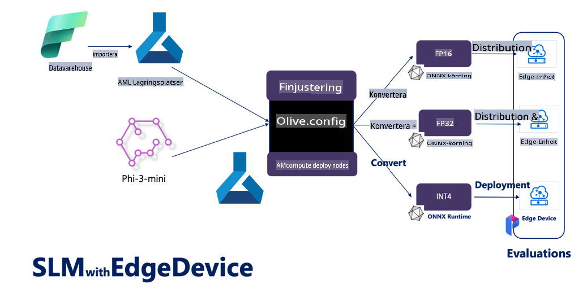

# **Finjustering av Phi-3 med Microsoft Olive**

[Olive](https://github.com/microsoft/OLive?WT.mc_id=aiml-138114-kinfeylo) är ett lättanvänt verktyg för hårdvaruoptimering av modeller som samlar branschledande tekniker för modellkompression, optimering och kompilation.

Det är utformat för att förenkla processen att optimera maskininlärningsmodeller, så att de kan utnyttja specifika hårdvaruarkitekturer så effektivt som möjligt.

Oavsett om du arbetar med molnbaserade applikationer eller enheter vid kanten, gör Olive det enkelt och effektivt att optimera dina modeller.

## Huvudfunktioner:
- Olive samlar och automatiserar optimeringstekniker för önskade hårdvarumål.
- Eftersom ingen enskild optimeringsteknik passar alla scenarier, möjliggör Olive flexibilitet genom att låta branschexperter integrera sina optimeringsinnovationer.

## Minska ingenjörsarbetet:
- Utvecklare behöver ofta lära sig och använda flera hårdvaruspecifika verktygskedjor för att förbereda och optimera tränade modeller för distribution.
- Olive förenklar denna process genom att automatisera optimeringstekniker för den önskade hårdvaran.

## Färdig E2E-optimeringslösning:

Genom att kombinera och finjustera integrerade tekniker erbjuder Olive en enhetlig lösning för end-to-end optimering.  
Den tar hänsyn till begränsningar som noggrannhet och latens under modelloptimeringen.

## Använda Microsoft Olive för finjustering

Microsoft Olive är ett mycket lättanvänt, öppen källkod-verktyg för modelloptimering som kan täcka både finjustering och referens inom generativ artificiell intelligens. Det kräver endast enkel konfiguration och kan användas med öppen källkod-språkmodeller och relaterade runtime-miljöer (AzureML / lokal GPU, CPU, DirectML). Du kan automatiskt optimera och finjustera modellen och hitta den bästa modellen för distribution i molnet eller på kantenheter. Detta gör det möjligt för företag att bygga sina egna branschspecifika modeller både lokalt och i molnet.


## Phi-3 Finjustering med Microsoft Olive 



## Phi-3 Olive Exempelkod och Exempel
I detta exempel kommer du att använda Olive för att:

- Finjustera en LoRA-adapter för att klassificera fraser i kategorierna Sorg, Glädje, Rädsla, Överraskning.
- Slå samman adaptervikterna med basmodellen.
- Optimera och kvantisera modellen till int4.

[Exempelkod](../../code/03.Finetuning/olive-ort-example/README.md)

### Installera Microsoft Olive

Installationen av Microsoft Olive är mycket enkel och kan göras för CPU, GPU, DirectML och Azure ML.

```bash
pip install olive-ai
```

Om du vill köra en ONNX-modell med en CPU kan du använda:

```bash
pip install olive-ai[cpu]
```

Om du vill köra en ONNX-modell med en GPU kan du använda:

```python
pip install olive-ai[gpu]
```

Om du vill använda Azure ML, använd:

```python
pip install git+https://github.com/microsoft/Olive#egg=olive-ai[azureml]
```

**Notera**  
Operativsystemskrav: Ubuntu 20.04 / 22.04  

### **Microsoft Olives Config.json**

Efter installationen kan du konfigurera olika modell-specifika inställningar genom Config-filen, inklusive data, beräkning, träning, distribution och modellgenerering.

**1. Data**

På Microsoft Olive kan träning ske på både lokal och molnbaserad data, och detta kan konfigureras i inställningarna.

*Lokala datainställningar*

Du kan enkelt ställa in den dataset som behöver tränas för finjustering, vanligtvis i json-format, och anpassa den med en datamall. Detta måste justeras baserat på modellens krav (t.ex. anpassas till formatet som krävs av Microsoft Phi-3-mini. Om du har andra modeller, vänligen se till de finjusteringsformat som krävs av dessa modeller).

```json

    "data_configs": [
        {
            "name": "dataset_default_train",
            "type": "HuggingfaceContainer",
            "load_dataset_config": {
                "params": {
                    "data_name": "json", 
                    "data_files":"dataset/dataset-classification.json",
                    "split": "train"
                }
            },
            "pre_process_data_config": {
                "params": {
                    "dataset_type": "corpus",
                    "text_cols": [
                            "phrase",
                            "tone"
                    ],
                    "text_template": "### Text: {phrase}\n### The tone is:\n{tone}",
                    "corpus_strategy": "join",
                    "source_max_len": 2048,
                    "pad_to_max_len": false,
                    "use_attention_mask": false
                }
            }
        }
    ],
```

**Inställningar för molndatakällor**

Genom att länka Azure AI Studios/Azure Machine Learning Services datalager kan du koppla data i molnet. Du kan välja att introducera olika datakällor till Azure AI Studio/Azure Machine Learning Service via Microsoft Fabric och Azure Data som stöd för att finjustera datan.

```json

    "data_configs": [
        {
            "name": "dataset_default_train",
            "type": "HuggingfaceContainer",
            "load_dataset_config": {
                "params": {
                    "data_name": "json", 
                    "data_files": {
                        "type": "azureml_datastore",
                        "config": {
                            "azureml_client": {
                                "subscription_id": "Your Azure Subscrition ID",
                                "resource_group": "Your Azure Resource Group",
                                "workspace_name": "Your Azure ML Workspaces name"
                            },
                            "datastore_name": "workspaceblobstore",
                            "relative_path": "Your train_data.json Azure ML Location"
                        }
                    },
                    "split": "train"
                }
            },
            "pre_process_data_config": {
                "params": {
                    "dataset_type": "corpus",
                    "text_cols": [
                            "Question",
                            "Best Answer"
                    ],
                    "text_template": "<|user|>\n{Question}<|end|>\n<|assistant|>\n{Best Answer}\n<|end|>",
                    "corpus_strategy": "join",
                    "source_max_len": 2048,
                    "pad_to_max_len": false,
                    "use_attention_mask": false
                }
            }
        }
    ],
    
```

**2. Beräkningskonfiguration**

Om du vill arbeta lokalt kan du använda lokala dataresurser direkt. Om du behöver använda resurser från Azure AI Studio / Azure Machine Learning Service måste du konfigurera relevanta Azure-parametrar, beräkningsnamn osv.

```json

    "systems": {
        "aml": {
            "type": "AzureML",
            "config": {
                "accelerators": ["gpu"],
                "hf_token": true,
                "aml_compute": "Your Azure AI Studio / Azure Machine Learning Service Compute Name",
                "aml_docker_config": {
                    "base_image": "Your Azure AI Studio / Azure Machine Learning Service docker",
                    "conda_file_path": "conda.yaml"
                }
            }
        },
        "azure_arc": {
            "type": "AzureML",
            "config": {
                "accelerators": ["gpu"],
                "aml_compute": "Your Azure AI Studio / Azure Machine Learning Service Compute Name",
                "aml_docker_config": {
                    "base_image": "Your Azure AI Studio / Azure Machine Learning Service docker",
                    "conda_file_path": "conda.yaml"
                }
            }
        }
    },
```

***Notera***

Eftersom körningen sker via en container på Azure AI Studio/Azure Machine Learning Service måste den nödvändiga miljön konfigureras. Detta görs i conda.yaml-miljön.

```yaml

name: project_environment
channels:
  - defaults
dependencies:
  - python=3.8.13
  - pip=22.3.1
  - pip:
      - einops
      - accelerate
      - azure-keyvault-secrets
      - azure-identity
      - bitsandbytes
      - datasets
      - huggingface_hub
      - peft
      - scipy
      - sentencepiece
      - torch>=2.2.0
      - transformers
      - git+https://github.com/microsoft/Olive@jiapli/mlflow_loading_fix#egg=olive-ai[gpu]
      - --extra-index-url https://aiinfra.pkgs.visualstudio.com/PublicPackages/_packaging/ORT-Nightly/pypi/simple/ 
      - ort-nightly-gpu==1.18.0.dev20240307004
      - --extra-index-url https://aiinfra.pkgs.visualstudio.com/PublicPackages/_packaging/onnxruntime-genai/pypi/simple/
      - onnxruntime-genai-cuda

    

```

**3. Välj din SLM**

Du kan använda modellen direkt från Hugging Face eller kombinera den med Model Catalog i Azure AI Studio / Azure Machine Learning för att välja vilken modell som ska användas. I kodexemplet nedan använder vi Microsoft Phi-3-mini som exempel.

Om du har modellen lokalt kan du använda denna metod:

```json

    "input_model":{
        "type": "PyTorchModel",
        "config": {
            "hf_config": {
                "model_name": "model-cache/microsoft/phi-3-mini",
                "task": "text-generation",
                "model_loading_args": {
                    "trust_remote_code": true
                }
            }
        }
    },
```

Om du vill använda en modell från Azure AI Studio / Azure Machine Learning Service kan du använda denna metod:

```json

    "input_model":{
        "type": "PyTorchModel",
        "config": {
            "model_path": {
                "type": "azureml_registry_model",
                "config": {
                    "name": "microsoft/Phi-3-mini-4k-instruct",
                    "registry_name": "azureml-msr",
                    "version": "11"
                }
            },
             "model_file_format": "PyTorch.MLflow",
             "hf_config": {
                "model_name": "microsoft/Phi-3-mini-4k-instruct",
                "task": "text-generation",
                "from_pretrained_args": {
                    "trust_remote_code": true
                }
            }
        }
    },
```

**Notera:**  
Vi måste integrera med Azure AI Studio / Azure Machine Learning Service, så när du ställer in modellen, se till att referera till versionsnummer och relaterade namn.

Alla modeller på Azure måste ställas in som PyTorch.MLflow.

Du behöver ett Hugging Face-konto och binda nyckeln till nyckelvärdet för Azure AI Studio / Azure Machine Learning.

**4. Algoritm**

Microsoft Olive har bra stöd för Lora- och QLora-finjuseringsalgoritmer. Du behöver bara konfigurera några relevanta parametrar. Här tar jag QLora som exempel.

```json
        "lora": {
            "type": "LoRA",
            "config": {
                "target_modules": [
                    "o_proj",
                    "qkv_proj"
                ],
                "double_quant": true,
                "lora_r": 64,
                "lora_alpha": 64,
                "lora_dropout": 0.1,
                "train_data_config": "dataset_default_train",
                "eval_dataset_size": 0.3,
                "training_args": {
                    "seed": 0,
                    "data_seed": 42,
                    "per_device_train_batch_size": 1,
                    "per_device_eval_batch_size": 1,
                    "gradient_accumulation_steps": 4,
                    "gradient_checkpointing": false,
                    "learning_rate": 0.0001,
                    "num_train_epochs": 3,
                    "max_steps": 10,
                    "logging_steps": 10,
                    "evaluation_strategy": "steps",
                    "eval_steps": 187,
                    "group_by_length": true,
                    "adam_beta2": 0.999,
                    "max_grad_norm": 0.3
                }
            }
        },
```

Om du vill göra en kvantiseringskonvertering stöder Microsoft Olive:s huvudgren redan metoden onnxruntime-genai. Du kan ställa in detta efter behov:

1. Slå samman adaptervikterna med basmodellen.
2. Konvertera modellen till en onnx-modell med önskad precision via ModelBuilder.

Till exempel konvertera till kvantiserad INT4:

```json

        "merge_adapter_weights": {
            "type": "MergeAdapterWeights"
        },
        "builder": {
            "type": "ModelBuilder",
            "config": {
                "precision": "int4"
            }
        }
```

**Notera**  
- Om du använder QLoRA stöds inte kvantiseringskonvertering med ONNXRuntime-genai för tillfället.

- Det bör påpekas att du kan ställa in ovanstående steg baserat på dina behov. Det är inte nödvändigt att konfigurera alla dessa steg. Beroende på behov kan du använda algoritmsteget direkt utan finjustering. Slutligen behöver du konfigurera relevanta motorer.

```json

    "engine": {
        "log_severity_level": 0,
        "host": "aml",
        "target": "aml",
        "search_strategy": false,
        "execution_providers": ["CUDAExecutionProvider"],
        "cache_dir": "../model-cache/models/phi3-finetuned/cache",
        "output_dir" : "../model-cache/models/phi3-finetuned"
    }
```

**5. Slutförd finjustering**

På kommandoraden, kör i katalogen för olive-config.json:

```bash
olive run --config olive-config.json  
```

**Ansvarsfriskrivning**:  
Detta dokument har översatts med hjälp av AI-baserade maskinöversättningstjänster. Även om vi strävar efter noggrannhet, vänligen observera att automatiserade översättningar kan innehålla fel eller brister. Det ursprungliga dokumentet på dess originalspråk bör betraktas som den auktoritativa källan. För kritisk information rekommenderas professionell mänsklig översättning. Vi ansvarar inte för eventuella missförstånd eller feltolkningar som uppstår vid användning av denna översättning.