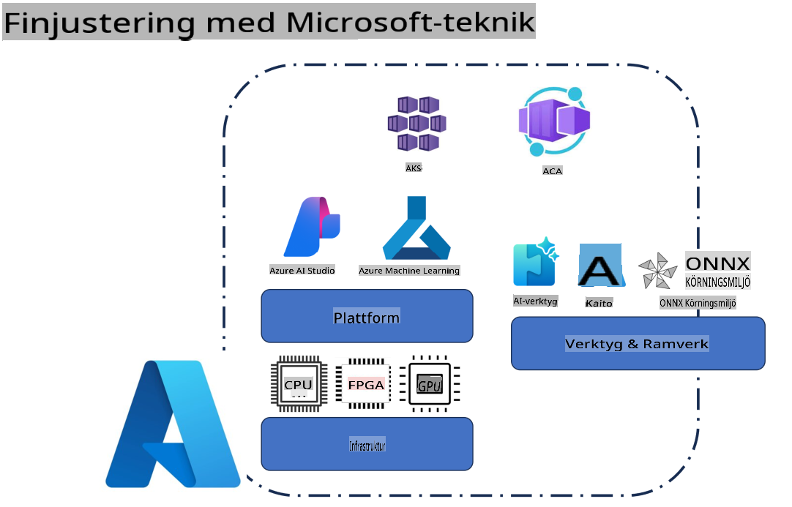
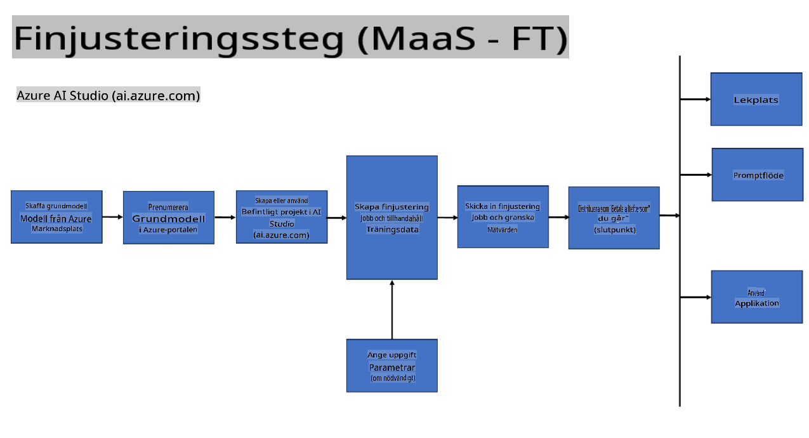
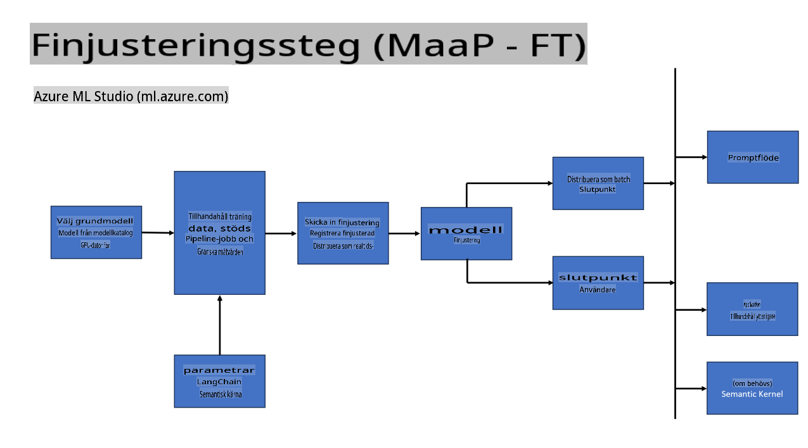
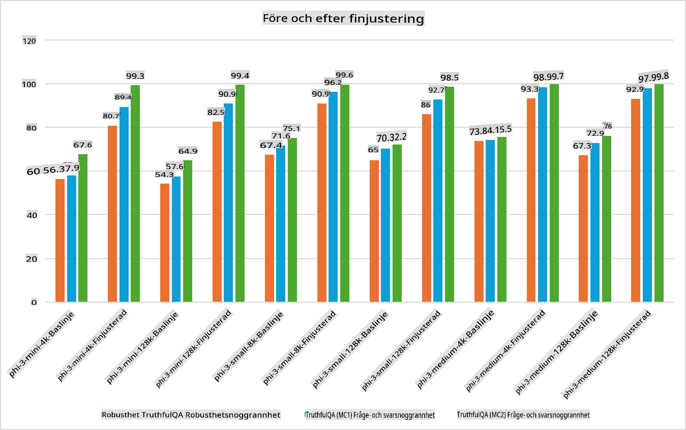

## Scenarier för Finjustering

**Plattform** Detta inkluderar olika teknologier som Azure AI Foundry, Azure Machine Learning, AI Tools, Kaito och ONNX Runtime. 

**Infrastruktur** Detta inkluderar CPU och FPGA, som är viktiga för finjusteringsprocessen. Här är ikonerna för varje av dessa teknologier.

**Verktyg & Ramverk** Detta inkluderar ONNX Runtime och ONNX Runtime. Här är ikonerna för varje av dessa teknologier.
[Infoga ikoner för ONNX Runtime och ONNX Runtime]

Finjusteringsprocessen med Microsoft-teknologier involverar olika komponenter och verktyg. Genom att förstå och använda dessa teknologier kan vi effektivt finjustera våra applikationer och skapa bättre lösningar. 

## Modell som Tjänst

Finjustera modellen med värdbaserad finjustering, utan att behöva skapa och hantera beräkningsresurser.

Serverlös finjustering är tillgänglig för modellerna Phi-3-mini och Phi-3-medium, vilket gör det möjligt för utvecklare att snabbt och enkelt anpassa modeller för moln- och edge-scenarier utan att behöva ordna beräkningsresurser. Vi har också meddelat att Phi-3-small nu är tillgänglig via vårt erbjudande Modell-som-en-Tjänst, så att utvecklare snabbt och enkelt kan komma igång med AI-utveckling utan att behöva hantera underliggande infrastruktur.

## Modell som en Plattform 

Användare hanterar sina egna beräkningsresurser för att finjustera sina modeller.

[Exempel på Finjustering](https://github.com/Azure/azureml-examples/blob/main/sdk/python/foundation-models/system/finetune/chat-completion/chat-completion.ipynb)

## Scenarier för Finjustering

| | | | | | | |
|-|-|-|-|-|-|-|
|Scenario|LoRA|QLoRA|PEFT|DeepSpeed|ZeRO|DORA|
|Anpassa förtränade LLMs till specifika uppgifter eller domäner|Ja|Ja|Ja|Ja|Ja|Ja|
|Finjustering för NLP-uppgifter som textklassificering, namngiven entity-igenkänning och maskinöversättning|Ja|Ja|Ja|Ja|Ja|Ja|
|Finjustering för QA-uppgifter|Ja|Ja|Ja|Ja|Ja|Ja|
|Finjustering för att generera mänskliga svar i chattbottar|Ja|Ja|Ja|Ja|Ja|Ja|
|Finjustering för att generera musik, konst eller andra kreativa former|Ja|Ja|Ja|Ja|Ja|Ja|
|Minska beräknings- och ekonomiska kostnader|Ja|Ja|Nej|Ja|Ja|Nej|
|Minska minnesanvändning|Nej|Ja|Nej|Ja|Ja|Ja|
|Använda färre parametrar för effektiv finjustering|Nej|Ja|Ja|Nej|Nej|Ja|
|Minneseffektiv form av dataparallellism som ger tillgång till den sammanlagda GPU-minneskapaciteten för alla tillgängliga GPU-enheter|Nej|Nej|Nej|Ja|Ja|Ja|

## Exempel på Prestanda för Finjustering

**Ansvarsfriskrivning**:  
Detta dokument har översatts med hjälp av maskinbaserade AI-översättningstjänster. Vi strävar efter noggrannhet, men var medveten om att automatiserade översättningar kan innehålla fel eller brister. Det ursprungliga dokumentet på dess originalspråk bör betraktas som den auktoritativa källan. För kritisk information rekommenderas professionell mänsklig översättning. Vi ansvarar inte för missförstånd eller feltolkningar som uppstår till följd av användningen av denna översättning.