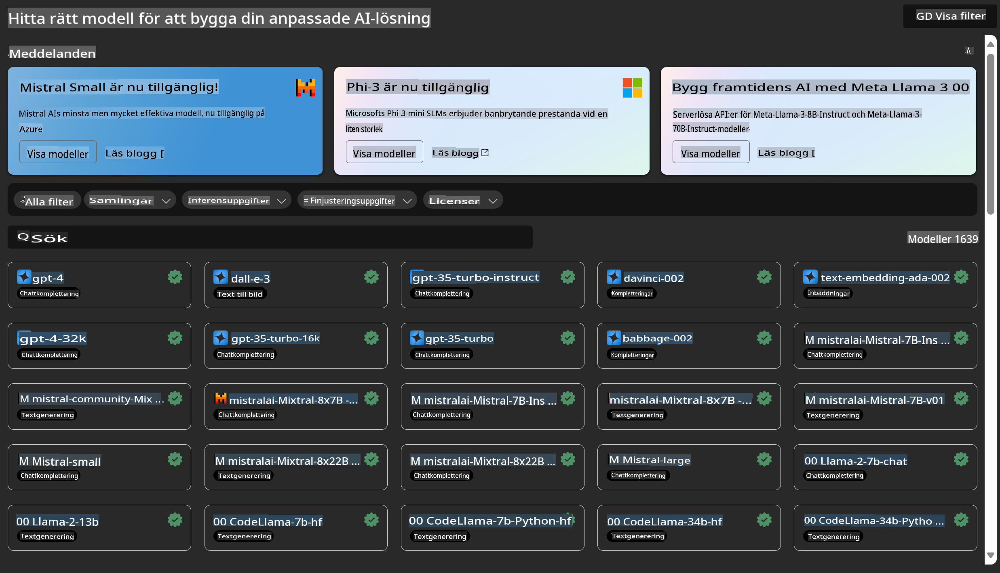

# **Introducera Azure Machine Learning-tjänsten**

[Azure Machine Learning](https://ml.azure.com?WT.mc_id=aiml-138114-kinfeylo) är en molntjänst för att påskynda och hantera livscykeln för maskininlärningsprojekt (ML).

ML-proffs, dataforskare och ingenjörer kan använda tjänsten i sina dagliga arbetsflöden för att:

- Träna och distribuera modeller.
- Hantera maskininlärningsoperationer (MLOps).
- Du kan skapa en modell i Azure Machine Learning eller använda en modell byggd från en öppen källkodsplattform, såsom PyTorch, TensorFlow eller scikit-learn.
- MLOps-verktyg hjälper dig att övervaka, träna om och distribuera modeller på nytt.

## Vem är Azure Machine Learning till för?

**Dataforskare och ML-ingenjörer**

De kan använda verktyg för att påskynda och automatisera sina dagliga arbetsflöden.  
Azure ML erbjuder funktioner för rättvisa, förklarbarhet, spårning och granskningsbarhet.  

**Applikationsutvecklare**

De kan enkelt integrera modeller i applikationer eller tjänster.

**Plattformsutvecklare**

De har tillgång till ett robust verktygssätt som stöds av hållbara Azure Resource Manager API:er.  
Dessa verktyg möjliggör skapandet av avancerade ML-verktyg.

**Företag**

Genom att arbeta i Microsoft Azure-molnet drar företag nytta av välbekant säkerhet och rollbaserad åtkomstkontroll.  
Skapa projekt för att kontrollera åtkomst till skyddad data och specifika operationer.

## Produktivitet för alla i teamet

ML-projekt kräver ofta ett team med varierande kompetenser för att bygga och underhålla.

Azure ML erbjuder verktyg som gör det möjligt för dig att:
- Samarbeta med ditt team via delade anteckningsböcker, beräkningsresurser, serverlös beräkning, data och miljöer.
- Utveckla modeller med rättvisa, förklarbarhet, spårning och granskningsbarhet för att uppfylla krav på spårbarhet och granskning.
- Snabbt och enkelt distribuera ML-modeller i stor skala samt effektivt hantera och styra dem med MLOps.
- Köra maskininlärningsarbetsbelastningar var som helst med inbyggd styrning, säkerhet och efterlevnad.

## Plattformverktyg med bred kompatibilitet

Alla i ett ML-team kan använda sina föredragna verktyg för att få jobbet gjort.  
Oavsett om du kör snabba experiment, hyperparametertuning, bygger pipelines eller hanterar inferenser, kan du använda välbekanta gränssnitt som:
- Azure Machine Learning Studio
- Python SDK (v2)
- Azure CLI (v2)
- Azure Resource Manager REST API:er

När du förfinar modeller och samarbetar under utvecklingscykeln kan du dela och hitta tillgångar, resurser och mätvärden i användargränssnittet för Azure Machine Learning Studio.

## **LLM/SLM i Azure ML**

Azure ML har lagt till många LLM/SLM-relaterade funktioner och kombinerar LLMOps och SLMOps för att skapa en plattform för generativ artificiell intelligens på företagsnivå.

### **Model Catalog**

Företagsanvändare kan distribuera olika modeller beroende på olika affärsscenarier via Model Catalog och tillhandahålla tjänster som Model as Service för att företagets utvecklare eller användare ska kunna få åtkomst.

Model Catalog i Azure Machine Learning Studio är navet för att upptäcka och använda en mängd olika modeller som gör det möjligt för dig att bygga generativa AI-applikationer. Modellkatalogen innehåller hundratals modeller från leverantörer som Azure OpenAI Service, Mistral, Meta, Cohere, Nvidia och Hugging Face, inklusive modeller tränade av Microsoft. Modeller från andra leverantörer än Microsoft är icke-Microsoft-produkter, enligt definitionen i Microsofts produktvillkor, och omfattas av de villkor som medföljer modellen.

### **Job Pipeline**

Kärnan i en maskininlärningspipeline är att dela upp en komplett maskininlärningsuppgift i ett arbetsflöde med flera steg. Varje steg är en hanterbar komponent som kan utvecklas, optimeras, konfigureras och automatiseras individuellt. Stegen är sammankopplade genom väldefinierade gränssnitt. Azure Machine Learning Pipeline-tjänsten orkestrerar automatiskt alla beroenden mellan pipelinestegen.

Vid finjustering av SLM / LLM kan vi hantera våra data, tränings- och genereringsprocesser genom Pipeline.

### **Prompt flow**

Fördelar med att använda Azure Machine Learning prompt flow  
Azure Machine Learning prompt flow erbjuder en rad fördelar som hjälper användare att gå från idé till experiment och slutligen till produktionsklara LLM-baserade applikationer:

**Agilitet inom prompt engineering**

- Interaktiv författarupplevelse: Azure Machine Learning prompt flow tillhandahåller en visuell representation av flödesstrukturen, vilket gör det enkelt för användare att förstå och navigera i sina projekt. Det erbjuder också en notebook-liknande kodupplevelse för effektiv flödesutveckling och felsökning.  
- Varianter för prompt-tuning: Användare kan skapa och jämföra flera varianter av prompts, vilket underlättar en iterativ förfiningsprocess.  
- Utvärdering: Inbyggda utvärderingsflöden gör det möjligt för användare att bedöma kvaliteten och effektiviteten hos sina prompts och flöden.  
- Omfattande resurser: Azure Machine Learning prompt flow inkluderar ett bibliotek med inbyggda verktyg, exempel och mallar som fungerar som en startpunkt för utveckling, inspirerar kreativitet och påskyndar processen.

**Företagsberedskap för LLM-baserade applikationer**

- Samarbete: Azure Machine Learning prompt flow stöder teamarbete, vilket gör det möjligt för flera användare att samarbeta i prompt engineering-projekt, dela kunskap och upprätthålla versionskontroll.  
- Allt-i-ett-plattform: Azure Machine Learning prompt flow effektiviserar hela prompt engineering-processen, från utveckling och utvärdering till distribution och övervakning. Användare kan enkelt distribuera sina flöden som Azure Machine Learning endpoints och övervaka deras prestanda i realtid, vilket säkerställer optimal drift och kontinuerlig förbättring.  
- Azure Machine Learning företagsberedskapslösningar: Prompt flow drar nytta av Azure Machine Learnings robusta företagsberedskapslösningar och tillhandahåller en säker, skalbar och pålitlig grund för utveckling, experimentering och distribution av flöden.

Med Azure Machine Learning prompt flow kan användare frigöra sin agilitet inom prompt engineering, samarbeta effektivt och utnyttja lösningar på företagsnivå för framgångsrik utveckling och distribution av LLM-baserade applikationer.

Genom att kombinera datorkraft, data och olika komponenter i Azure ML kan företagsutvecklare enkelt bygga sina egna artificiella intelligensapplikationer.

**Ansvarsfriskrivning**:  
Detta dokument har översatts med hjälp av maskinbaserade AI-översättningstjänster. Även om vi strävar efter noggrannhet, bör det noteras att automatiserade översättningar kan innehålla fel eller felaktigheter. Det ursprungliga dokumentet på sitt originalspråk bör betraktas som den auktoritativa källan. För kritisk information rekommenderas professionell mänsklig översättning. Vi tar inget ansvar för missförstånd eller feltolkningar som uppstår till följd av användningen av denna översättning.