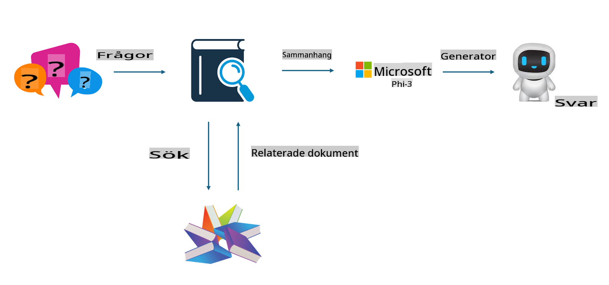
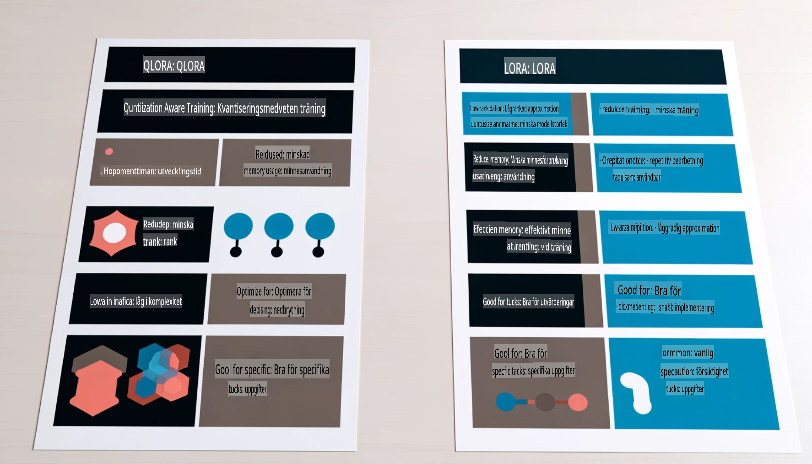

# **Låt Phi-3 bli en branschexpert**

För att använda Phi-3-modellen i en bransch behöver du lägga till branschspecifik affärsdata i Phi-3-modellen. Vi har två olika alternativ: det första är RAG (Retrieval Augmented Generation) och det andra är Fine Tuning.

## **RAG vs Fine-Tuning**

### **Retrieval Augmented Generation**

RAG är datainsamling + textgenerering. Företagets strukturerade och ostrukturerade data lagras i en vektordatabas. När relevant innehåll söks upp, hittas relevanta sammanfattningar och innehåll för att skapa en kontext, och LLM/SLM:s textgenereringskapacitet används för att skapa innehåll.

### **Fine-tuning**

Fine-tuning innebär att förbättra en viss modell. Det krävs inte att man börjar med modellens algoritm, men data behöver kontinuerligt ackumuleras. Om du vill ha mer exakt terminologi och språkbruk i branschtillämpningar är fine-tuning ett bättre val. Men om din data förändras ofta kan fine-tuning bli komplicerat.

### **Hur man väljer**

1. Om vårt svar kräver införande av extern data är RAG det bästa valet.

2. Om du behöver leverera stabil och exakt branschkunskap är fine-tuning ett bra alternativ. RAG prioriterar att hämta relevant innehåll men kanske inte alltid fånga de specialiserade nyanserna.

3. Fine-tuning kräver en högkvalitativ datamängd, och om det bara handlar om ett litet dataintervall kommer det inte att göra någon större skillnad. RAG är mer flexibelt.

4. Fine-tuning är en "black box", en slags metafysik, och det är svårt att förstå den interna mekanismen. Men RAG gör det enklare att spåra datakällan, vilket gör det lättare att justera felaktigheter eller innehållsfel och ger bättre transparens.

### **Scenarier**

1. Vertikala branscher som kräver specifik fackterminologi och uttryck: ***Fine-tuning*** är det bästa valet.

2. Fråge-/svarssystem som involverar syntes av olika kunskapspunkter: ***RAG*** är det bästa valet.

3. Kombinationen av automatiserade affärsflöden: ***RAG + Fine-tuning*** är det bästa valet.

## **Hur man använder RAG**

En vektordatabas är en samling data som lagras i matematisk form. Vektordatabaser gör det enklare för maskininlärningsmodeller att komma ihåg tidigare inmatningar, vilket möjliggör användning av maskininlärning för tillämpningar som sökning, rekommendationer och textgenerering. Data kan identifieras baserat på likhetsmått istället för exakta matchningar, vilket gör att datamodeller kan förstå sammanhanget.

Vektordatabasen är nyckeln till att förverkliga RAG. Vi kan konvertera data till vektorlager genom vektormodeller som text-embedding-3, jina-ai-embedding, etc.

Läs mer om hur du skapar en RAG-applikation [https://github.com/microsoft/Phi-3CookBook](https://github.com/microsoft/Phi-3CookBook?WT.mc_id=aiml-138114-kinfeylo)

## **Hur man använder Fine-tuning**

De vanligaste algoritmerna för Fine-tuning är Lora och QLora. Hur väljer man?
- [Lär dig mer med detta exempelblock](../../../../code/04.Finetuning/Phi_3_Inference_Finetuning.ipynb)
- [Exempel på Python FineTuning](../../../../code/04.Finetuning/FineTrainingScript.py)

### **Lora och QLora**

LoRA (Low-Rank Adaptation) och QLoRA (Quantized Low-Rank Adaptation) är båda tekniker som används för att finjustera stora språkmodeller (LLMs) med hjälp av Parameter Efficient Fine Tuning (PEFT). PEFT-tekniker är utformade för att träna modeller mer effektivt än traditionella metoder.  
LoRA är en fristående finjusteringsteknik som minskar minnesanvändningen genom att använda en låg-rang approximation till viktuppdateringsmatrisen. Det erbjuder snabba träningstider och bibehåller prestanda nära traditionella finjusteringsmetoder.

QLoRA är en utökad version av LoRA som införlivar kvantiseringstekniker för att ytterligare minska minnesanvändningen. QLoRA kvantiserar viktparametrarnas precision i den förtränade LLM:n till 4-bitars precision, vilket är mer minneseffektivt än LoRA. Dock är träning med QLoRA cirka 30 % långsammare än med LoRA på grund av de extra kvantiserings- och dekvantiseringsstegen.

QLoRA använder LoRA som ett tillbehör för att korrigera de fel som introduceras under kvantiseringen. QLoRA möjliggör finjustering av massiva modeller med miljarder parametrar på relativt små, lättillgängliga GPU:er. Till exempel kan QLoRA finjustera en modell med 70B parametrar som kräver 36 GPU:er med endast 2.

**Ansvarsfriskrivning**:  
Detta dokument har översatts med hjälp av AI-baserade maskinöversättningstjänster. Även om vi strävar efter noggrannhet, vänligen notera att automatiserade översättningar kan innehålla fel eller felaktigheter. Det ursprungliga dokumentet på dess originalspråk bör betraktas som den auktoritativa källan. För kritisk information rekommenderas professionell human översättning. Vi tar inget ansvar för missförstånd eller feltolkningar som uppstår till följd av användningen av denna översättning.