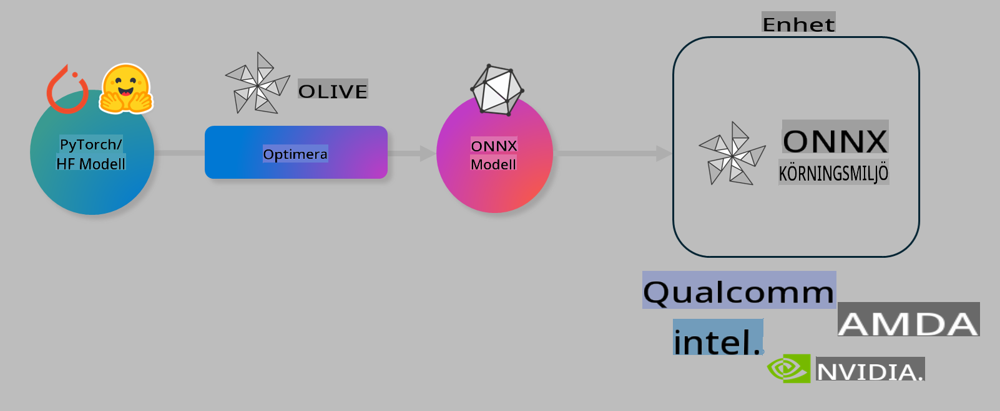

# Lab. Optimera AI-modeller för inferens på enheter

## Introduktion 

> [!IMPORTANT]
> Detta labb kräver en **Nvidia A10 eller A100 GPU** med tillhörande drivrutiner och CUDA toolkit (version 12+) installerat.

> [!NOTE]
> Detta är ett **35-minuters** labb som ger dig en praktisk introduktion till kärnkoncepten för att optimera modeller för inferens på enheter med hjälp av OLIVE.

## Lärandemål

Efter detta labb kommer du att kunna använda OLIVE för att:

- Kvantisera en AI-modell med hjälp av AWQ-kvantiseringsmetoden.
- Finjustera en AI-modell för en specifik uppgift.
- Generera LoRA-adaptrar (finjusterad modell) för effektiv inferens på enheter med ONNX Runtime.

### Vad är Olive

Olive (*O*NNX *live*) är ett verktyg för modelloptimering med tillhörande CLI som gör det möjligt att leverera modeller för ONNX runtime +++https://onnxruntime.ai+++ med hög kvalitet och prestanda.



Ingången till Olive är vanligtvis en PyTorch- eller Hugging Face-modell och utgången är en optimerad ONNX-modell som körs på en enhet (distributionsmål) med ONNX runtime. Olive optimerar modellen för distributionsmålets AI-accelerator (NPU, GPU, CPU) som tillhandahålls av en hårdvaruleverantör som Qualcomm, AMD, Nvidia eller Intel.

Olive kör ett *arbetsflöde*, som är en ordnad sekvens av individuella modelloptimeringsuppgifter kallade *pass* - exempel på pass inkluderar: modellkomprimering, grafinsamling, kvantisering, grafoptimering. Varje pass har en uppsättning parametrar som kan justeras för att uppnå bästa möjliga metrik, exempelvis noggrannhet och latens, som utvärderas av respektive utvärderare. Olive använder en sökstrategi med en sökalgoritm för att automatiskt finjustera varje pass enskilt eller flera pass tillsammans.

#### Fördelar med Olive

- **Minska frustration och tidsåtgång** vid manuell experimentering med olika tekniker för grafoptimering, komprimering och kvantisering. Definiera dina kvalitets- och prestandakrav och låt Olive automatiskt hitta den bästa modellen åt dig.
- **40+ inbyggda komponenter för modelloptimering** som täcker de senaste teknikerna inom kvantisering, komprimering, grafoptimering och finjustering.
- **Enkel CLI** för vanliga modelloptimeringsuppgifter. Till exempel: olive quantize, olive auto-opt, olive finetune.
- Inbyggd paketering och distribution av modeller.
- Stöd för att generera modeller för **Multi LoRA serving**.
- Bygg arbetsflöden med YAML/JSON för att orkestrera modelloptimerings- och distributionsuppgifter.
- Integration med **Hugging Face** och **Azure AI**.
- Inbyggd **caching**-mekanism för att **spara kostnader**.

## Labbinstruktioner
> [!NOTE]
> Se till att du har förberett din Azure AI Hub och projekt samt konfigurerat din A100-dator enligt Lab 1.

### Steg 0: Anslut till din Azure AI Compute

Du kommer att ansluta till Azure AI Compute med hjälp av fjärrfunktionen i **VS Code.** 

1. Öppna din **VS Code**-skrivbordsapplikation:
1. Öppna **kommandopaletten** med **Shift+Ctrl+P**.
1. Sök i kommandopaletten efter **AzureML - remote: Connect to compute instance in New Window**.
1. Följ instruktionerna på skärmen för att ansluta till Compute. Detta innebär att välja din Azure-prenumeration, resursgrupp, projekt och Compute-namn som du konfigurerade i Lab 1.
1. När du är ansluten till din Azure ML Compute-node visas detta i **nedre vänstra hörnet av Visual Code** `><Azure ML: Compute Name`

### Steg 1: Klona detta repo

I VS Code kan du öppna en ny terminal med **Ctrl+J** och klona detta repo:

I terminalen bör du se prompten

```
azureuser@computername:~/cloudfiles/code$ 
```
Klona lösningen 

```bash
cd ~/localfiles
git clone https://github.com/microsoft/phi-3cookbook.git
```

### Steg 2: Öppna mappen i VS Code

För att öppna VS Code i relevant mapp, kör följande kommando i terminalen, vilket öppnar ett nytt fönster:

```bash
code phi-3cookbook/code/04.Finetuning/Olive-lab
```

Alternativt kan du öppna mappen genom att välja **File** > **Open Folder**. 

### Steg 3: Beroenden

Öppna ett terminalfönster i VS Code på din Azure AI Compute-instans (tips: **Ctrl+J**) och kör följande kommandon för att installera beroendena:

```bash
conda create -n olive-ai python=3.11 -y
conda activate olive-ai
pip install -r requirements.txt
az extension remove -n azure-cli-ml
az extension add -n ml
```

> [!NOTE]
> Det tar ~5 minuter att installera alla beroenden.

I detta labb kommer du att ladda ner och ladda upp modeller till Azure AI Model-katalogen. För att kunna komma åt modellkatalogen måste du logga in på Azure med:

```bash
az login
```

> [!NOTE]
> Vid inloggning kommer du att bli ombedd att välja din prenumeration. Se till att välja den prenumeration som tillhandahålls för detta labb.

### Steg 4: Kör Olive-kommandon 

Öppna ett terminalfönster i VS Code på din Azure AI Compute-instans (tips: **Ctrl+J**) och se till att `olive-ai` conda-miljön är aktiverad:

```bash
conda activate olive-ai
```

Kör därefter följande Olive-kommandon i kommandoraden.

1. **Inspektera datan:** I detta exempel ska du finjustera Phi-3.5-Mini-modellen så att den specialiserar sig på att svara på resefrågor. Koden nedan visar de första posterna i datasetet, som är i JSON-lines-format:
   
    ```bash
    head data/data_sample_travel.jsonl
    ```
1. **Kvantisera modellen:** Innan du tränar modellen kvantiserar du den med följande kommando som använder en teknik kallad Active Aware Quantization (AWQ) +++https://arxiv.org/abs/2306.00978+++. AWQ kvantiserar vikterna i en modell genom att ta hänsyn till de aktiveringar som genereras under inferens. Detta innebär att kvantiseringsprocessen tar hänsyn till den faktiska datadistributionen i aktiveringarna, vilket leder till bättre bevarande av modellens noggrannhet jämfört med traditionella metoder för viktkvantisering.
    
    ```bash
    olive quantize \
       --model_name_or_path microsoft/Phi-3.5-mini-instruct \
       --trust_remote_code \
       --algorithm awq \
       --output_path models/phi/awq \
       --log_level 1
    ```
    
    Det tar **~8 minuter** att slutföra AWQ-kvantiseringen, vilket kommer att **minska modellstorleken från ~7,5 GB till ~2,5 GB**.
   
   I detta labb visar vi hur du kan mata in modeller från Hugging Face (till exempel: `microsoft/Phi-3.5-mini-instruct`). However, Olive also allows you to input models from the Azure AI catalog by updating the `model_name_or_path` argument to an Azure AI asset ID (for example:  `azureml://registries/azureml/models/Phi-3.5-mini-instruct/versions/4`). 

1. **Train the model:** Next, the `olive finetune`-kommandot finjusterar den kvantiserade modellen. Att kvantisera modellen *innan* finjustering istället för efteråt ger bättre noggrannhet eftersom finjusteringsprocessen återhämtar en del av förlusten från kvantiseringen.
    
    ```bash
    olive finetune \
        --method lora \
        --model_name_or_path models/phi/awq \
        --data_files "data/data_sample_travel.jsonl" \
        --data_name "json" \
        --text_template "<|user|>\n{prompt}<|end|>\n<|assistant|>\n{response}<|end|>" \
        --max_steps 100 \
        --output_path ./models/phi/ft \
        --log_level 1
    ```
    
    Det tar **~6 minuter** att slutföra finjusteringen (med 100 steg).

1. **Optimera:** När modellen är tränad optimerar du den nu med Olives `auto-opt` command, which will capture the ONNX graph and automatically perform a number of optimizations to improve the model performance for CPU by compressing the model and doing fusions. It should be noted, that you can also optimize for other devices such as NPU or GPU by just updating the `--device` and `--provider`-argument - men för detta labb använder vi CPU.

    ```bash
    olive auto-opt \
       --model_name_or_path models/phi/ft/model \
       --adapter_path models/phi/ft/adapter \
       --device cpu \
       --provider CPUExecutionProvider \
       --use_ort_genai \
       --output_path models/phi/onnx-ao \
       --log_level 1
    ```
    
    Det tar **~5 minuter** att slutföra optimeringen.

### Steg 5: Snabbtest av modellens inferens

För att testa inferens med modellen, skapa en Python-fil i din mapp som heter **app.py** och kopiera och klistra in följande kod:

```python
import onnxruntime_genai as og
import numpy as np

print("loading model and adapters...", end="", flush=True)
model = og.Model("models/phi/onnx-ao/model")
adapters = og.Adapters(model)
adapters.load("models/phi/onnx-ao/model/adapter_weights.onnx_adapter", "travel")
print("DONE!")

tokenizer = og.Tokenizer(model)
tokenizer_stream = tokenizer.create_stream()

params = og.GeneratorParams(model)
params.set_search_options(max_length=100, past_present_share_buffer=False)
user_input = "what is the best thing to see in chicago"
params.input_ids = tokenizer.encode(f"<|user|>\n{user_input}<|end|>\n<|assistant|>\n")

generator = og.Generator(model, params)

generator.set_active_adapter(adapters, "travel")

print(f"{user_input}")

while not generator.is_done():
    generator.compute_logits()
    generator.generate_next_token()

    new_token = generator.get_next_tokens()[0]
    print(tokenizer_stream.decode(new_token), end='', flush=True)

print("\n")
```

Kör koden med:

```bash
python app.py
```

### Steg 6: Ladda upp modellen till Azure AI

Genom att ladda upp modellen till ett Azure AI-modellregister gör du modellen delbar med andra medlemmar i ditt utvecklingsteam och hanterar också versionskontroll av modellen. För att ladda upp modellen, kör följande kommando:

> [!NOTE]
> Uppdatera `{}` placeholders with the name of your resource group and Azure AI Project Name. 

To find your resource group `"resourceGroup" och Azure AI-projektnamn, kör följande kommando 

```
az ml workspace show
```

Eller genom att gå till +++ai.azure.com+++ och välja **management center** **project** **overview**

Uppdatera `{}`-platshållarna med namnet på din resursgrupp och Azure AI-projektnamn.

```bash
az ml model create \
    --name ft-for-travel \
    --version 1 \
    --path ./models/phi/onnx-ao \
    --resource-group {RESOURCE_GROUP_NAME} \
    --workspace-name {PROJECT_NAME}
```
Du kan sedan se din uppladdade modell och distribuera din modell på https://ml.azure.com/model/list

**Ansvarsfriskrivning**:  
Detta dokument har översatts med maskinbaserade AI-översättningstjänster. Även om vi strävar efter noggrannhet, bör det noteras att automatiserade översättningar kan innehålla fel eller felaktigheter. Det ursprungliga dokumentet på dess originalspråk bör betraktas som den auktoritativa källan. För kritisk information rekommenderas professionell mänsklig översättning. Vi tar inget ansvar för eventuella missförstånd eller feltolkningar som uppstår vid användning av denna översättning.