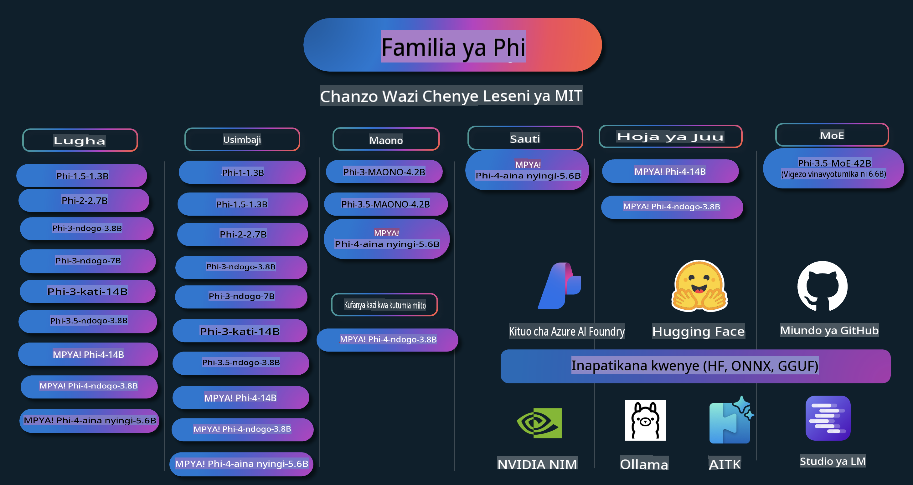

# Phi Cookbook: Mifano ya Vitendo na Miundo ya Phi ya Microsoft

  

  
  
  

  
  

Phi ni mfululizo wa miundo ya AI ya chanzo huria iliyotengenezwa na Microsoft.

Phi kwa sasa ni mfano wa lugha ndogo (SLM) wenye nguvu zaidi na wa gharama nafuu, ukiwa na viwango bora katika lugha nyingi, hoja, uzalishaji wa maandishi/mazungumzo, usimbaji, picha, sauti, na hali nyinginezo.

Unaweza kupeleka Phi kwenye wingu au vifaa vya ukingoni, na unaweza kwa urahisi kujenga programu za AI za kizazi kwa kutumia nguvu ndogo ya kompyuta.

Fuata hatua hizi kuanza kutumia rasilimali hizi:  
1. **Fork Hifadhi**: Bofya   
2. **Clone Hifadhi**: `git clone https://github.com/microsoft/PhiCookBook.git`  
3. [**Jiunge na Jamii ya Microsoft AI Discord na kutana na wataalamu na watengenezaji wenzako**](https://discord.com/invite/ByRwuEEgH4?WT.mc_id=aiml-137032-kinfeylo)

## Jedwali la Maudhui

- Utangulizi  
  - [Karibu kwenye Familia ya Phi](./md/01.Introduction/01/01.PhiFamily.md)  
  - [Kuweka Mazingira Yako](./md/01.Introduction/01/01.EnvironmentSetup.md)  
  - [Kuelewa Teknolojia Muhimu](./md/01.Introduction/01/01.Understandingtech.md)  
  - [Usalama wa AI kwa Miundo ya Phi](./md/01.Introduction/01/01.AISafety.md)  
  - [Msaada wa Vifaa vya Phi](./md/01.Introduction/01/01.Hardwaresupport.md)  
  - [Miundo ya Phi na Upatikanaji kwenye Majukwaa](./md/01.Introduction/01/01.Edgeandcloud.md)  
  - [Kutumia Guidance-ai na Phi](./md/01.Introduction/01/01.Guidance.md)  
  - [Miundo ya Soko la GitHub](https://github.com/marketplace/models)  
  - [Katalogi ya Miundo ya Azure AI](https://ai.azure.com)  

- Kufanya Inference ya Phi katika Mazingira Tofauti  
    - [Hugging face](./md/01.Introduction/02/01.HF.md)  
    - [Miundo ya GitHub](./md/01.Introduction/02/02.GitHubModel.md)  
    - [Katalogi ya Miundo ya Azure AI Foundry](./md/01.Introduction/02/03.AzureAIFoundry.md)  
    - [Ollama](./md/01.Introduction/02/04.Ollama.md)  
    - [AI Toolkit VSCode (AITK)](./md/01.Introduction/02/05.AITK.md)  
    - [NVIDIA NIM](./md/01.Introduction/02/06.NVIDIA.md)  

- Kufanya Inference ya Familia ya Phi  
    - [Inference ya Phi katika iOS](./md/01.Introduction/03/iOS_Inference.md)  
    - [Inference ya Phi katika Android](./md/01.Introduction/03/Android_Inference.md)  
- [Inference Phi katika Jetson](./md/01.Introduction/03/Jetson_Inference.md)  
    - [Inference Phi katika AI PC](./md/01.Introduction/03/AIPC_Inference.md)  
    - [Inference Phi na Apple MLX Framework](./md/01.Introduction/03/MLX_Inference.md)  
    - [Inference Phi katika Server ya Ndani](./md/01.Introduction/03/Local_Server_Inference.md)  
    - [Inference Phi katika Server ya Mbali kwa kutumia AI Toolkit](./md/01.Introduction/03/Remote_Interence.md)  
    - [Inference Phi na Rust](./md/01.Introduction/03/Rust_Inference.md)  
    - [Inference Phi--Vision katika Local](./md/01.Introduction/03/Vision_Inference.md)  
    - [Inference Phi na Kaito AKS, Azure Containers (msaada rasmi)](./md/01.Introduction/03/Kaito_Inference.md)  

- [Kuantifia Familia ya Phi](./md/01.Introduction/04/QuantifyingPhi.md)  
    - [Kuantifia Phi-3.5 / 4 kwa kutumia llama.cpp](./md/01.Introduction/04/UsingLlamacppQuantifyingPhi.md)  
    - [Kuantifia Phi-3.5 / 4 kwa kutumia viendelezi vya Generative AI kwa onnxruntime](./md/01.Introduction/04/UsingORTGenAIQuantifyingPhi.md)  
    - [Kuantifia Phi-3.5 / 4 kwa kutumia Intel OpenVINO](./md/01.Introduction/04/UsingIntelOpenVINOQuantifyingPhi.md)  
    - [Kuantifia Phi-3.5 / 4 kwa kutumia Apple MLX Framework](./md/01.Introduction/04/UsingAppleMLXQuantifyingPhi.md)  

- Tathmini ya Phi  
    - [AI Inayowajibika](./md/01.Introduction/05/ResponsibleAI.md)  
    - [Azure AI Foundry kwa Tathmini](./md/01.Introduction/05/AIFoundry.md)  
    - [Kutumia Promptflow kwa Tathmini](./md/01.Introduction/05/Promptflow.md)  

- RAG na Azure AI Search  
    - [Jinsi ya kutumia Phi-4-mini na Phi-4-multimodal (RAG) na Azure AI Search](https://github.com/microsoft/PhiCookBook/blob/main/code/06.E2E/E2E_Phi-4-RAG-Azure-AI-Search.ipynb)  

- Sampuli za Maendeleo ya Maombi ya Phi  
  - Maombi ya Maandishi na Gumzo  
    - Sampuli za Phi-4 🆕  
      - [📓] [Gumzo na Phi-4-mini ONNX Model](./md/02.Application/01.TextAndChat/Phi4/ChatWithPhi4ONNX/README.md)  
      - [Gumzo na Phi-4 local ONNX Model .NET](../../md/04.HOL/dotnet/src/LabsPhi4-Chat-01OnnxRuntime)  
      - [Gumzo .NET Console App na Phi-4 ONNX kwa kutumia Sementic Kernel](../../md/04.HOL/dotnet/src/LabsPhi4-Chat-02SK)  
    - Sampuli za Phi-3 / 3.5  
      - [Chatbot ya Ndani kwenye kivinjari kwa kutumia Phi3, ONNX Runtime Web na WebGPU](https://github.com/microsoft/onnxruntime-inference-examples/tree/main/js/chat)  
      - [OpenVino Chat](./md/02.Application/01.TextAndChat/Phi3/E2E_OpenVino_Chat.md)  
      - [Multi Model - Mawasiliano ya Phi-3-mini na OpenAI Whisper](./md/02.Application/01.TextAndChat/Phi3/E2E_Phi-3-mini_with_whisper.md)  
      - [MLFlow - Kujenga wrapper na kutumia Phi-3 na MLFlow](./md//02.Application/01.TextAndChat/Phi3/E2E_Phi-3-MLflow.md)  
      - [Uboreshaji wa Modeli - Jinsi ya kuboresha modeli ya Phi-3-min kwa ONNX Runtime Web na Olive](https://github.com/microsoft/Olive/tree/main/examples/phi3)  
      - [WinUI3 App na Phi-3 mini-4k-instruct-onnx](https://github.com/microsoft/Phi3-Chat-WinUI3-Sample/)  
      - [WinUI3 Multi Model AI Powered Notes App Sample](https://github.com/microsoft/ai-powered-notes-winui3-sample)  
      - [Kuboresha na Kujumuisha modeli maalum za Phi-3 na Prompt flow](./md/02.Application/01.TextAndChat/Phi3/E2E_Phi-3-FineTuning_PromptFlow_Integration.md)  
      - [Kuboresha na Kujumuisha modeli maalum za Phi-3 na Prompt flow katika Azure AI Foundry](./md/02.Application/01.TextAndChat/Phi3/E2E_Phi-3-FineTuning_PromptFlow_Integration_AIFoundry.md)  
      - [Tathmini ya Modeli Iliyoboreshwa ya Phi-3 / Phi-3.5 katika Azure AI Foundry kwa Kuzingatia Kanuni za Microsoft za AI Inayowajibika](./md/02.Application/01.TextAndChat/Phi3/E2E_Phi-3-Evaluation_AIFoundry.md)  
- [📓] [Mfano wa utabiri wa lugha wa Phi-3.5-mini-instruct (Kichina/Kiingereza)](../../md/02.Application/01.TextAndChat/Phi3/phi3-instruct-demo.ipynb)
      - [Chatbot ya Phi-3.5-Instruct WebGPU RAG](./md/02.Application/01.TextAndChat/Phi3/WebGPUWithPhi35Readme.md)
      - [Kutumia GPU ya Windows kuunda suluhisho la Prompt flow na Phi-3.5-Instruct ONNX](./md/02.Application/01.TextAndChat/Phi3/UsingPromptFlowWithONNX.md)
      - [Kutumia Microsoft Phi-3.5 tflite kuunda app ya Android](./md/02.Application/01.TextAndChat/Phi3/UsingPhi35TFLiteCreateAndroidApp.md)
      - [Mfano wa Maswali na Majibu (.NET) ukitumia Phi-3 ya ndani ya ONNX kupitia Microsoft.ML.OnnxRuntime](../../md/04.HOL/dotnet/src/LabsPhi301)
      - [Programu ya mazungumzo ya console (.NET) na Semantic Kernel na Phi-3](../../md/04.HOL/dotnet/src/LabsPhi302)

  - Sampuli za Azure AI Inference SDK zenye Msingi wa Msimbo  
    - Sampuli za Phi-4 🆕
      - [📓] [Kuzalisha msimbo wa mradi ukitumia Phi-4-multimodal](./md/02.Application/02.Code/Phi4/GenProjectCode/README.md)
    - Sampuli za Phi-3 / 3.5
      - [Jenga Visual Studio Code yako mwenyewe kwa GitHub Copilot Chat ukitumia Microsoft Phi-3 Family](./md/02.Application/02.Code/Phi3/VSCodeExt/README.md)
      - [Unda wakala wa mazungumzo wa Visual Studio Code ukitumia Phi-3.5 kwa kutumia GitHub Models](/md/02.Application/02.Code/Phi3/CreateVSCodeChatAgentWithGitHubModels.md)

  - Sampuli za Uamuzi wa Juu  
    - Sampuli za Phi-4 🆕
      - [📓] [Sampuli za Uamuzi wa Juu za Phi-4-mini](./md/02.Application/03.AdvancedReasoning/Phi4/AdvancedResoningPhi4mini/README.md)
  
  - Maonyesho  
      - [Maonyesho ya Phi-4-mini yanayohifadhiwa kwenye Hugging Face Spaces](https://huggingface.co/spaces/microsoft/phi-4-mini?WT.mc_id=aiml-137032-kinfeylo)
      - [Maonyesho ya Phi-4-multimodal yanayohifadhiwa kwenye Hugging Face Spaces](https://huggingface.co/spaces/microsoft/phi-4-multimodal?WT.mc_id=aiml-137032-kinfeylo)
  - Sampuli za Maono  
    - Sampuli za Phi-4 🆕
      - [📓] [Tumia Phi-4-multimodal kusoma picha na kuzalisha msimbo](./md/02.Application/04.Vision/Phi4/CreateFrontend/README.md) 
    - Sampuli za Phi-3 / 3.5
      - [📓][Phi-3-vision-Image text to text](../../md/02.Application/04.Vision/Phi3/E2E_Phi-3-vision-image-text-to-text-online-endpoint.ipynb)
      - [Phi-3-vision-ONNX](https://onnxruntime.ai/docs/genai/tutorials/phi3-v.html)
      - [📓][Phi-3-vision CLIP Embedding](../../md/02.Application/04.Vision/Phi3/E2E_Phi-3-vision-image-text-to-text-online-endpoint.ipynb)
      - [DEMO: Phi-3 Recycling](https://github.com/jennifermarsman/PhiRecycling/)
      - [Phi-3-vision - Msaidizi wa lugha ya kuona - na Phi3-Vision na OpenVINO](https://docs.openvino.ai/nightly/notebooks/phi-3-vision-with-output.html)
      - [Phi-3 Vision Nvidia NIM](./md/02.Application/04.Vision/Phi3/E2E_Nvidia_NIM_Vision.md)
      - [Phi-3 Vision OpenVino](./md/02.Application/04.Vision/Phi3/E2E_OpenVino_Phi3Vision.md)
      - [📓][Mfano wa Phi-3.5 Vision wa picha nyingi au fremu nyingi](../../md/02.Application/04.Vision/Phi3/phi3-vision-demo.ipynb)
      - [Mfano wa Phi-3 Vision wa ONNX ya ndani kupitia Microsoft.ML.OnnxRuntime .NET](../../md/04.HOL/dotnet/src/LabsPhi303)
      - [Mfano wa Phi-3 Vision wa ONNX ya ndani yenye menyu kupitia Microsoft.ML.OnnxRuntime .NET](../../md/04.HOL/dotnet/src/LabsPhi304)

  - Sampuli za Sauti  
    - Sampuli za Phi-4 🆕
      - [📓] [Kutafsiri sauti kwa maandishi ukitumia Phi-4-multimodal](./md/02.Application/05.Audio/Phi4/Transciption/README.md)
      - [📓] [Mfano wa Sauti wa Phi-4-multimodal](../../md/02.Application/05.Audio/Phi4/Siri/demo.ipynb)
      - [📓] [Mfano wa Tafsiri ya Hotuba ya Phi-4-multimodal](../../md/02.Application/05.Audio/Phi4/Translate/demo.ipynb)
      - [Programu ya console ya .NET ikitumia Phi-4-multimodal Audio kuchanganua faili ya sauti na kuzalisha maandishi](../../md/04.HOL/dotnet/src/LabsPhi4-MultiModal-02Audio)

  - Sampuli za MOE  
    - Sampuli za Phi-3 / 3.5
      - [📓] [Mfano wa MoEs wa Phi-3.5 (Mixture of Experts) kwa Mitandao ya Kijamii](../../md/02.Application/06.MoE/Phi3/phi3_moe_demo.ipynb)
      - [📓] [Kujenga RAG Pipeline (Retrieval-Augmented Generation) kwa NVIDIA NIM Phi-3 MOE, Azure AI Search, na LlamaIndex](../../md/02.Application/06.MoE/Phi3/azure-ai-search-nvidia-rag.ipynb)
  - Sampuli za Kuita Kazi  
    - Sampuli za Phi-4 🆕
      - [📓] [Kutumia Kuita Kazi na Phi-4-mini](./md/02.Application/07.FunctionCalling/Phi4/FunctionCallingBasic/README.md)
  - Sampuli za Kuchanganya Modalities  
    - Sampuli za Phi-4 🆕
-  [📓] [Kutumia Phi-4-multimodal kama mwandishi wa teknolojia](../../md/02.Application/08.Multimodel/Phi4/TechJournalist/phi_4_mm_audio_text_publish_news.ipynb)  
      - [Programu ya .NET console ikitumia Phi-4-multimodal kuchanganua picha](../../md/04.HOL/dotnet/src/LabsPhi4-MultiModal-01Images)  

- Kufanya Fine-tuning ya Sampuli za Phi  
  - [Mazingira ya Fine-tuning](./md/03.FineTuning/FineTuning_Scenarios.md)  
  - [Fine-tuning dhidi ya RAG](./md/03.FineTuning/FineTuning_vs_RAG.md)  
  - [Fine-tuning ili kumfanya Phi-3 kuwa mtaalamu wa sekta](./md/03.FineTuning/LetPhi3gotoIndustriy.md)  
  - [Fine-tuning Phi-3 kwa kutumia AI Toolkit ya VS Code](./md/03.FineTuning/Finetuning_VSCodeaitoolkit.md)  
  - [Fine-tuning Phi-3 kwa Azure Machine Learning Service](./md/03.FineTuning/Introduce_AzureML.md)  
  - [Fine-tuning Phi-3 kwa Lora](./md/03.FineTuning/FineTuning_Lora.md)  
  - [Fine-tuning Phi-3 kwa QLora](./md/03.FineTuning/FineTuning_Qlora.md)  
  - [Fine-tuning Phi-3 kwa Azure AI Foundry](./md/03.FineTuning/FineTuning_AIFoundry.md)  
  - [Fine-tuning Phi-3 kwa Azure ML CLI/SDK](./md/03.FineTuning/FineTuning_MLSDK.md)  
  - [Fine-tuning kwa Microsoft Olive](./md/03.FineTuning/FineTuning_MicrosoftOlive.md)  
  - [Fine-tuning kwa Microsoft Olive Hands-On Lab](./md/03.FineTuning/olive-lab/readme.md)  
  - [Fine-tuning Phi-3-vision kwa Weights and Bias](./md/03.FineTuning/FineTuning_Phi-3-visionWandB.md)  
  - [Fine-tuning Phi-3 kwa Apple MLX Framework](./md/03.FineTuning/FineTuning_MLX.md)  
  - [Fine-tuning Phi-3-vision (msaada rasmi)](./md/03.FineTuning/FineTuning_Vision.md)  
  - [Fine-Tuning Phi-3 na Kaito AKS, Azure Containers (msaada rasmi)](./md/03.FineTuning/FineTuning_Kaito.md)  
  - [Fine-Tuning Phi-3 na 3.5 Vision](https://github.com/2U1/Phi3-Vision-Finetune)  

- Maabara ya Vitendo  
  - [Kuchunguza mifano ya kisasa: LLMs, SLMs, maendeleo ya ndani na zaidi](https://github.com/microsoft/aitour-exploring-cutting-edge-models)  
  - [Kufungua Uwezo wa NLP: Fine-Tuning kwa Microsoft Olive](https://github.com/azure/Ignite_FineTuning_workshop)  

- Makala za Utafiti wa Kitaaluma na Machapisho  
  - [Vitabu vya Kawaida Pekee Ndio Unavyohitaji II: ripoti ya kiufundi ya phi-1.5](https://arxiv.org/abs/2309.05463)  
  - [Ripoti ya Kiufundi ya Phi-3: Mfano wa Lugha Yenye Uwezo Mkubwa Kwenye Simu Yako](https://arxiv.org/abs/2404.14219)  
  - [Ripoti ya Kiufundi ya Phi-4](https://arxiv.org/abs/2412.08905)  
  - [Kuboreshwa kwa Mifano Midogo ya Lugha kwa Kufanya Kazi Ndani ya Gari](https://arxiv.org/abs/2501.02342)  
  - [(WhyPHI) Fine-Tuning PHI-3 kwa Kujibu Maswali ya Chaguo Nyingi: Mbinu, Matokeo, na Changamoto](https://arxiv.org/abs/2501.01588)  

## Kutumia Mifano ya Phi  

### Phi kwenye Azure AI Foundry  

Unaweza kujifunza jinsi ya kutumia Microsoft Phi na jinsi ya kujenga suluhisho za mwisho hadi mwisho (E2E) kwenye vifaa vyako tofauti vya maunzi. Ili kupata uzoefu wa Phi mwenyewe, anza kwa kucheza na mifano na kubinafsisha Phi kwa hali zako kwa kutumia [Azure AI Foundry Azure AI Model Catalog](https://aka.ms/phi3-azure-ai). Unaweza kujifunza zaidi kwenye Kuanzisha na [Azure AI Foundry](/md/02.QuickStart/AzureAIFoundry_QuickStart.md)  

**Playground**  
Kila mfano una uwanja wa majaribio uliotengwa kwa ajili ya kujaribu mfano [Azure AI Playground](https://aka.ms/try-phi3).  

### Phi kwenye Mifano ya GitHub  

Unaweza kujifunza jinsi ya kutumia Microsoft Phi na jinsi ya kujenga suluhisho za mwisho hadi mwisho (E2E) kwenye vifaa vyako tofauti vya maunzi. Ili kupata uzoefu wa Phi mwenyewe, anza kwa kucheza na mfano na kubinafsisha Phi kwa hali zako kwa kutumia [GitHub Model Catalog](https://github.com/marketplace/models?WT.mc_id=aiml-137032-kinfeylo). Unaweza kujifunza zaidi kwenye Kuanzisha na [GitHub Model Catalog](/md/02.QuickStart/GitHubModel_QuickStart.md)  

**Playground**  
Kila mfano una [eneo la majaribio ya kujaribu mfano](/md/02.QuickStart/GitHubModel_QuickStart.md).

### Phi kwenye Hugging Face

Unaweza pia kupata mfano kwenye [Hugging Face](https://huggingface.co/microsoft)

**Eneo la majaribio**  
[Hugging Chat playground](https://huggingface.co/chat/models/microsoft/Phi-3-mini-4k-instruct)

## AI yenye Uwajibikaji  

Microsoft imejitolea kuwasaidia wateja wake kutumia bidhaa za AI kwa uwajibikaji, kushiriki maarifa yetu, na kujenga ushirikiano wa kuaminiana kupitia zana kama Maelezo ya Uwazi na Tathmini za Athari. Rasilimali nyingi zinaweza kupatikana kwenye [https://aka.ms/RAI](https://aka.ms/RAI).  
Mbinu ya Microsoft kuhusu AI yenye uwajibikaji inatokana na kanuni zetu za AI kuhusu usawa, kutegemewa na usalama, faragha na usalama, ujumuishi, uwazi, na uwajibikaji.

Mifano mikubwa ya lugha asilia, picha, na sauti - kama zile zinazotumika kwenye mfano huu - inaweza tabia kwa njia ambazo si za haki, hazitegemewi, au zinaudhi, na hivyo kusababisha madhara. Tafadhali soma [Maelezo ya Uwazi ya huduma ya Azure OpenAI](https://learn.microsoft.com/legal/cognitive-services/openai/transparency-note?tabs=text) ili kupata taarifa kuhusu hatari na vikwazo.

Njia inayopendekezwa ya kupunguza hatari hizi ni kujumuisha mfumo wa usalama kwenye usanifu wako unaoweza kugundua na kuzuia tabia hatarishi. [Azure AI Content Safety](https://learn.microsoft.com/azure/ai-services/content-safety/overview) hutoa safu huru ya ulinzi, yenye uwezo wa kugundua maudhui hatarishi yanayotokana na watumiaji au AI katika programu na huduma. Azure AI Content Safety inajumuisha API za maandishi na picha zinazokuwezesha kugundua nyenzo hatarishi. Ndani ya Azure AI Foundry, huduma ya Content Safety hukuruhusu kuona, kuchunguza na kujaribu mifano ya msimbo kwa ajili ya kugundua maudhui hatarishi kwenye njia tofauti. [Hati za kuanza haraka](https://learn.microsoft.com/azure/ai-services/content-safety/quickstart-text?tabs=visual-studio%2Clinux&pivots=programming-language-rest) hizi zinakuongoza jinsi ya kutuma maombi kwa huduma.

Jambo lingine la kuzingatia ni utendaji wa jumla wa programu. Katika programu za multi-modal na multi-models, tunachukulia utendaji kuwa ni mfumo kufanya kazi kama wewe na watumiaji wako mnavyotarajia, ikiwa ni pamoja na kutokuzalisha matokeo hatarishi. Ni muhimu kutathmini utendaji wa programu yako kwa ujumla kwa kutumia [Vipimaji vya Utendaji, Ubora, Hatari na Usalama](https://learn.microsoft.com/azure/ai-studio/concepts/evaluation-metrics-built-in). Unaweza pia kuunda na kutathmini kwa kutumia [vipimaji maalum](https://learn.microsoft.com/azure/ai-studio/how-to/develop/evaluate-sdk#custom-evaluators).

Unaweza kutathmini programu yako ya AI katika mazingira yako ya maendeleo kwa kutumia [Azure AI Evaluation SDK](https://microsoft.github.io/promptflow/index.html). Ukiwa na dataset ya majaribio au lengo, matokeo ya programu yako ya AI ya kizazi hupimwa kwa kiasi na vipimaji vilivyojengwa ndani au vipimaji maalum unavyopendelea. Ili kuanza na Azure AI Evaluation SDK kutathmini mfumo wako, unaweza kufuata [mwongozo wa kuanza haraka](https://learn.microsoft.com/azure/ai-studio/how-to/develop/flow-evaluate-sdk). Mara baada ya kutekeleza tathmini, unaweza [kuona matokeo kwenye Azure AI Foundry](https://learn.microsoft.com/azure/ai-studio/how-to/evaluate-flow-results).  

## Alama za Biashara  

Mradi huu unaweza kuwa na alama za biashara au nembo za miradi, bidhaa, au huduma. Matumizi yaliyoidhinishwa ya alama za biashara au nembo za Microsoft yanategemea na lazima yafuate [Miongozo ya Alama za Biashara na Nembo za Microsoft](https://www.microsoft.com/legal/intellectualproperty/trademarks/usage/general).  
Matumizi ya alama za biashara au nembo za Microsoft kwenye matoleo yaliyorekebishwa ya mradi huu hayapaswi kusababisha mkanganyiko au kuashiria udhamini wa Microsoft. Matumizi yoyote ya alama za biashara au nembo za wahusika wa tatu yanategemea sera za wahusika hao wa tatu.

**Kanusho**:  
Hati hii imetafsiriwa kwa kutumia huduma za kutafsiri za kiakili za mashine. Ingawa tunajitahidi kwa usahihi, tafadhali fahamu kuwa tafsiri za kiotomatiki zinaweza kuwa na makosa au kutokuwa sahihi. Hati ya asili katika lugha yake ya awali inapaswa kuzingatiwa kama chanzo cha mamlaka. Kwa habari muhimu, inashauriwa kutumia huduma za watafsiri wa kitaalamu wa kibinadamu. Hatutawajibika kwa kutokuelewana au tafsiri zisizo sahihi zinazotokana na matumizi ya tafsiri hii.