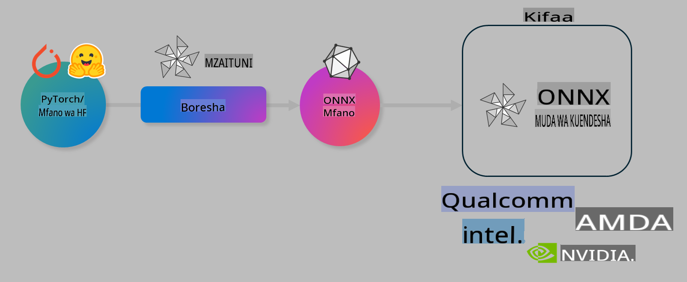

# Maabara: Kuboresha Miundo ya AI kwa Utambuzi wa Kifaa

## Utangulizi 

> [!IMPORTANT]
> Maabara hii inahitaji **GPU ya Nvidia A10 au A100** pamoja na madereva husika na zana ya CUDA (toleo la 12+).

> [!NOTE]
> Hii ni maabara ya **dakika 35** ambayo itakupa utangulizi wa vitendo kuhusu dhana kuu za kuboresha miundo kwa utambuzi wa kifaa kwa kutumia OLIVE.

## Malengo ya Kujifunza

Mwisho wa maabara hii, utaweza kutumia OLIVE kufanya:

- Kubana ukubwa wa mfano wa AI kwa kutumia mbinu ya AWQ.
- Kufinyanga upya mfano wa AI kwa kazi maalum.
- Kutoa adapta za LoRA (mfano ulioboreshwa) kwa utambuzi bora wa kifaa kwa kutumia ONNX Runtime.

### Olive ni nini

Olive (*O*NNX *live*) ni zana ya kuboresha miundo yenye CLI inayokuwezesha kupeleka miundo kwa ONNX runtime +++https://onnxruntime.ai+++ kwa ubora na utendaji bora.



Ingizo kwa Olive mara nyingi ni mfano wa PyTorch au Hugging Face, na matokeo ni mfano ulioboreshwa wa ONNX unaotekelezwa kwenye kifaa (lengo la utambuzi) linaloendesha ONNX runtime. Olive itaboresha mfano kulingana na kiboreshaji cha AI cha lengo la utambuzi (NPU, GPU, CPU) kilichotolewa na muuzaji wa vifaa kama Qualcomm, AMD, Nvidia au Intel.

Olive hufanya kazi kwa mtiririko, ambao ni mpangilio wa kazi za kuboresha miundo zinazoitwa *passes* - mfano wa passes ni: kubana mfano, kunasa grafu, kubana ukubwa wa grafu, na kuboresha grafu. Kila pass ina seti ya vigezo vinavyoweza kurekebishwa ili kufanikisha vipimo bora, kama usahihi na ucheleweshaji, ambavyo vinapimwa na kigezo husika. Olive hutumia mkakati wa kutafuta ambao hutumia algoriti ya kutafuta kuboresha kila pass moja baada ya nyingine au seti ya passes pamoja.

#### Faida za Olive

- **Punguza usumbufu na muda** wa majaribio ya mwongozo ya mbinu tofauti za kuboresha grafu, kubana ukubwa na kuboresha. Eleza vigezo vyako vya ubora na utendaji, na Olive itakutafutia mfano bora moja kwa moja.
- **Vipengele zaidi ya 40 vya kuboresha miundo** vinavyofunika mbinu za kisasa katika kubana ukubwa, kuboresha grafu na kufinyanga upya.
- **CLI rahisi kutumia** kwa kazi za kawaida za kuboresha miundo. Kwa mfano, `olive quantize`, `olive auto-opt`, `olive finetune`.
- Ufungaji na upelekaji wa miundo vimejumuishwa.
- Inaunga mkono kizazi cha miundo kwa **Multi LoRA serving**.
- Unda mtiririko wa kazi kwa kutumia YAML/JSON kwa ajili ya kupanga kazi za kuboresha na kupeleka miundo.
- Ujumuishaji wa **Hugging Face** na **Azure AI**.
- Mfumo wa **caching** uliojengwa ndani kuokoa gharama.

## Maelekezo ya Maabara
> [!NOTE]
> Tafadhali hakikisha umeanzisha Azure AI Hub yako na Mradi na umeweka A100 compute kama ilivyoelekezwa katika Maabara ya 1.

### Hatua ya 0: Unganisha na Azure AI Compute yako

Utaunganishwa na Azure AI compute kwa kutumia kipengele cha mbali katika **VS Code.** 

1. Fungua programu yako ya mezani ya **VS Code**:
1. Fungua **command palette** kwa kutumia **Shift+Ctrl+P**
1. Katika command palette tafuta **AzureML - remote: Connect to compute instance in New Window**.
1. Fuata maelekezo ya skrini kuunganishwa na Compute. Hii itajumuisha kuchagua Azure Subscription yako, Resource Group, Mradi na Jina la Compute uliloweka katika Maabara ya 1.
1. Ukishaunganishwa na Azure ML Compute yako, hii itaonyeshwa katika **kona ya chini kushoto ya Visual Code** `><Azure ML: Compute Name`

### Hatua ya 1: Clone repo hii

Katika VS Code, unaweza kufungua terminal mpya kwa kutumia **Ctrl+J** na clone repo hii:

Katika terminal utaona prompt

```
azureuser@computername:~/cloudfiles/code$ 
```
Clone suluhisho 

```bash
cd ~/localfiles
git clone https://github.com/microsoft/phi-3cookbook.git
```

### Hatua ya 2: Fungua Folda katika VS Code

Ili kufungua VS Code katika folda husika tekeleza amri ifuatayo katika terminal, ambayo itafungua dirisha jipya:

```bash
code phi-3cookbook/code/04.Finetuning/Olive-lab
```

Vinginevyo, unaweza kufungua folda kwa kuchagua **File** > **Open Folder**. 

### Hatua ya 3: Vitegemezi

Fungua dirisha la terminal katika VS Code katika Azure AI Compute Instance yako (kidokezo: **Ctrl+J**) na tekeleza amri zifuatazo ili kusakinisha vitegemezi:

```bash
conda create -n olive-ai python=3.11 -y
conda activate olive-ai
pip install -r requirements.txt
az extension remove -n azure-cli-ml
az extension add -n ml
```

> [!NOTE]
> Itachukua ~dakika 5 kusakinisha vitegemezi vyote.

Katika maabara hii utapakua na kupakia miundo kwenye orodha ya Azure AI Model. Ili kufikia orodha ya modeli, utahitaji kuingia kwenye Azure kwa kutumia:

```bash
az login
```

> [!NOTE]
> Wakati wa kuingia, utaulizwa kuchagua subscription yako. Hakikisha umechagua subscription iliyotolewa kwa maabara hii.

### Hatua ya 4: Tekeleza amri za Olive 

Fungua dirisha la terminal katika VS Code katika Azure AI Compute Instance yako (kidokezo: **Ctrl+J**) na hakikisha mazingira ya conda `olive-ai` yamewezeshwa:

```bash
conda activate olive-ai
```

Kisha, tekeleza amri zifuatazo za Olive katika mstari wa amri.

1. **Kagua data:** Katika mfano huu, utafinyanga upya mfano wa Phi-3.5-Mini ili uwe maalum katika kujibu maswali yanayohusiana na safari. Msimbo hapa chini unaonyesha rekodi chache za kwanza za dataset, ambazo ziko katika umbizo la JSON lines:
   
    ```bash
    head data/data_sample_travel.jsonl
    ```
1. **Kubana ukubwa wa mfano:** Kabla ya kufinyanga mfano, kwanza unabonyeza ukubwa wake kwa kutumia amri ifuatayo inayotumia mbinu inayoitwa Active Aware Quantization (AWQ) +++https://arxiv.org/abs/2306.00978+++. AWQ inabana uzito wa mfano kwa kuzingatia uanzishaji unaozalishwa wakati wa utambuzi. Hii inamaanisha kuwa mchakato wa kubana unazingatia usambazaji wa data halisi katika uanzishaji, na kusababisha uhifadhi bora wa usahihi wa mfano ukilinganisha na mbinu za jadi za kubana uzito.
    
    ```bash
    olive quantize \
       --model_name_or_path microsoft/Phi-3.5-mini-instruct \
       --trust_remote_code \
       --algorithm awq \
       --output_path models/phi/awq \
       --log_level 1
    ```
    
    Inachukua **~dakika 8** kukamilisha AWQ, ambayo itapunguza ukubwa wa mfano kutoka ~7.5GB hadi ~2.5GB.
   
   Katika maabara hii, tunakuonyesha jinsi ya kuingiza miundo kutoka Hugging Face (kwa mfano: `microsoft/Phi-3.5-mini-instruct`). However, Olive also allows you to input models from the Azure AI catalog by updating the `model_name_or_path` argument to an Azure AI asset ID (for example:  `azureml://registries/azureml/models/Phi-3.5-mini-instruct/versions/4`). 

1. **Train the model:** Next, the `olive finetune` amri inafinyanga mfano uliobana. Kubana mfano *kabla* ya kufinyanga badala ya baada ya hapo kunatoa usahihi bora kwani mchakato wa kufinyanga unarejesha baadhi ya hasara kutoka kwenye kubana.
    
    ```bash
    olive finetune \
        --method lora \
        --model_name_or_path models/phi/awq \
        --data_files "data/data_sample_travel.jsonl" \
        --data_name "json" \
        --text_template "<|user|>\n{prompt}<|end|>\n<|assistant|>\n{response}<|end|>" \
        --max_steps 100 \
        --output_path ./models/phi/ft \
        --log_level 1
    ```
    
    Inachukua **~dakika 6** kukamilisha kufinyanga (kwa hatua 100).

1. **Boresha:** Ukiwa na mfano ulioboreshwa, sasa unaboreshwa zaidi kwa kutumia Olive `auto-opt` command, which will capture the ONNX graph and automatically perform a number of optimizations to improve the model performance for CPU by compressing the model and doing fusions. It should be noted, that you can also optimize for other devices such as NPU or GPU by just updating the `--device` and `--provider` hoja - lakini kwa madhumuni ya maabara hii tutatumia CPU.

    ```bash
    olive auto-opt \
       --model_name_or_path models/phi/ft/model \
       --adapter_path models/phi/ft/adapter \
       --device cpu \
       --provider CPUExecutionProvider \
       --use_ort_genai \
       --output_path models/phi/onnx-ao \
       --log_level 1
    ```
    
    Inachukua **~dakika 5** kukamilisha uboreshaji.

### Hatua ya 5: Jaribio la haraka la utambuzi wa mfano

Ili kujaribu utambuzi wa mfano, unda faili ya Python kwenye folda yako iitwe **app.py** na nakili na ubandike msimbo ufuatao:

```python
import onnxruntime_genai as og
import numpy as np

print("loading model and adapters...", end="", flush=True)
model = og.Model("models/phi/onnx-ao/model")
adapters = og.Adapters(model)
adapters.load("models/phi/onnx-ao/model/adapter_weights.onnx_adapter", "travel")
print("DONE!")

tokenizer = og.Tokenizer(model)
tokenizer_stream = tokenizer.create_stream()

params = og.GeneratorParams(model)
params.set_search_options(max_length=100, past_present_share_buffer=False)
user_input = "what is the best thing to see in chicago"
params.input_ids = tokenizer.encode(f"<|user|>\n{user_input}<|end|>\n<|assistant|>\n")

generator = og.Generator(model, params)

generator.set_active_adapter(adapters, "travel")

print(f"{user_input}")

while not generator.is_done():
    generator.compute_logits()
    generator.generate_next_token()

    new_token = generator.get_next_tokens()[0]
    print(tokenizer_stream.decode(new_token), end='', flush=True)

print("\n")
```

Tekeleza msimbo kwa kutumia:

```bash
python app.py
```

### Hatua ya 6: Pakia mfano kwenye Azure AI

Kupakia mfano kwenye hifadhi ya Azure AI hufanya mfano uweze kushirikishwa na wanachama wengine wa timu yako ya maendeleo na pia hushughulikia udhibiti wa toleo la mfano. Ili kupakia mfano tekeleza amri ifuatayo:

> [!NOTE]
> Sasisha `{}` na jina la `resourceGroup` yako na jina la Mradi wa Azure AI, kisha tekeleza amri ifuatayo 

```
az ml workspace show
```

Au kwa kwenda +++ai.azure.com+++ na kuchagua **management center** **project** **overview**

Sasisha `{}` zilizopo na jina la resource group yako na jina la Mradi wa Azure AI.

```bash
az ml model create \
    --name ft-for-travel \
    --version 1 \
    --path ./models/phi/onnx-ao \
    --resource-group {RESOURCE_GROUP_NAME} \
    --workspace-name {PROJECT_NAME}
```
Kisha utaweza kuona mfano wako uliopakiwa na kupeleka mfano wako kwenye https://ml.azure.com/model/list

**Kanusho**:  
Hati hii imetafsiriwa kwa kutumia huduma za tafsiri za AI zinazotegemea mashine. Ingawa tunajitahidi kuhakikisha usahihi, tafadhali fahamu kuwa tafsiri za kiotomatiki zinaweza kuwa na makosa au kutokuwa sahihi. Hati ya asili katika lugha yake ya asili inapaswa kuzingatiwa kama chanzo cha kuaminika. Kwa taarifa muhimu, inashauriwa kutumia huduma za utafsiri wa kitaalamu wa kibinadamu. Hatutawajibika kwa kutoelewana au tafsiri potofu zinazotokana na matumizi ya tafsiri hii.