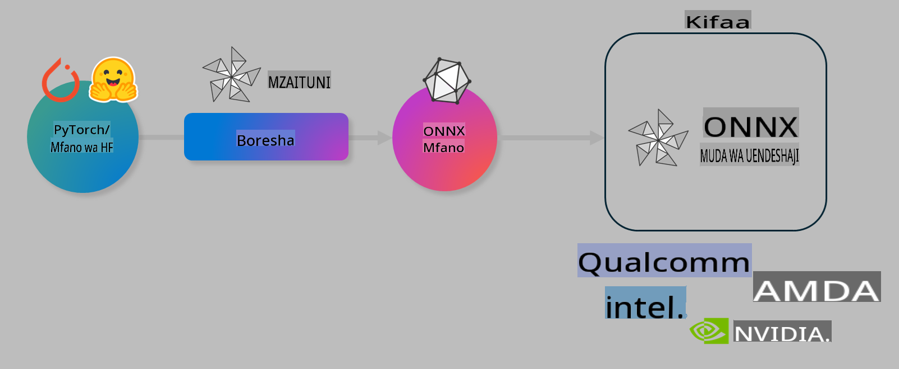

# Maabara. Boresha Miundo ya AI kwa Ufafanuzi wa Kifaa

## Utangulizi 

> [!IMPORTANT]
> Maabara hii inahitaji **GPU ya Nvidia A10 au A100** pamoja na madereva yanayohusiana na zana ya CUDA (toleo la 12+) iliyosakinishwa.

> [!NOTE]
> Hii ni maabara ya dakika **35** ambayo itakupa utangulizi wa vitendo kuhusu dhana za msingi za kuboresha miundo kwa ajili ya ufafanuzi wa kifaa kwa kutumia OLIVE.

## Malengo ya Kujifunza

Mwisho wa maabara hii, utaweza kutumia OLIVE kufanya:

- Kupunguza ukubwa wa mfano wa AI kwa kutumia mbinu ya AWQ.
- Kurekebisha mfano wa AI kwa kazi maalum.
- Kutengeneza adapta za LoRA (mfano uliorekebishwa) kwa ajili ya ufafanuzi wa kifaa kwa kutumia ONNX Runtime.

### Olive ni nini

Olive (*O*NNX *live*) ni zana ya kuboresha miundo yenye CLI inayosaidia ambayo hukuwezesha kupeleka miundo kwa ONNX runtime +++https://onnxruntime.ai+++ kwa ubora na utendaji.



Pato la Olive kwa kawaida ni mfano wa PyTorch au Hugging Face, na pato lake ni mfano ulioboreshwa wa ONNX unaotekelezwa kwenye kifaa (lengo la utekelezaji) linalotumia ONNX runtime. Olive itaboresha mfano kulingana na kiendeshaji cha AI cha lengo la utekelezaji (NPU, GPU, CPU) kinachotolewa na muuzaji wa vifaa kama Qualcomm, AMD, Nvidia au Intel.

Olive hutekeleza *workflow*, ambayo ni mlolongo wa kazi za kuboresha mfano zinazoitwa *passes* - mfano wa kazi ni pamoja na: kubana mfano, kukamata grafu, kupunguza ukubwa wa data, na kuboresha grafu. Kila kazi ina seti ya vigezo ambavyo vinaweza kurekebishwa ili kufanikisha viashiria bora, kama usahihi na muda wa kuchelewa, vinavyotathminiwa na tathmini husika. Olive hutumia mkakati wa kutafuta kwa kutumia algoriti ya kutafuta ili kurekebisha moja moja au seti ya kazi kwa pamoja.

#### Faida za Olive

- **Punguza usumbufu na muda** wa majaribio ya mikono kwa mbinu tofauti za kuboresha grafu, kubana na kupunguza ukubwa wa data. Eleza mipaka yako ya ubora na utendaji, na Olive itakutafutia mfano bora moja kwa moja.
- **Vipengele 40+ vya kuboresha miundo vilivyojengwa ndani** vinavyoshughulikia mbinu za kisasa katika kupunguza ukubwa wa data, kubana grafu, na kurekebisha.
- **CLI rahisi kutumia** kwa kazi za kawaida za kuboresha miundo. Kwa mfano, olive quantize, olive auto-opt, olive finetune.
- Ufungashaji wa miundo na utekelezaji vimejengwa ndani.
- Inasaidia kutengeneza miundo kwa **Huduma za LoRA nyingi**.
- Tengeneza workflow kwa kutumia YAML/JSON kuandaa kazi za kuboresha na kutekeleza miundo.
- **Ujumuishaji wa Hugging Face** na **Azure AI**.
- Mfumo wa **kache** uliojengwa ndani ili **kuokoa gharama**.

## Maelekezo ya Maabara
> [!NOTE]
> Tafadhali hakikisha umeandaa Azure AI Hub yako, Mradi, na umeweka A100 compute kama ilivyoelekezwa kwenye Maabara ya 1.

### Hatua ya 0: Unganisha na Azure AI Compute yako

Utaunganishwa na Azure AI compute kwa kutumia kipengele cha mbali cha **VS Code.** 

1. Fungua programu yako ya mezani ya **VS Code**:
1. Fungua **command palette** kwa kutumia **Shift+Ctrl+P**
1. Katika command palette tafuta **AzureML - remote: Connect to compute instance in New Window**.
1. Fuata maelekezo yanayoonekana kwenye skrini kuunganishwa na Compute. Hii itahusisha kuchagua Usajili wa Azure, Kundi la Rasilimali, Mradi, na Jina la Compute uliloweka kwenye Maabara ya 1.
1. Mara baada ya kuunganishwa na Azure ML Compute yako, hii itaonyeshwa kwenye **kona ya chini kushoto ya Visual Code** `><Azure ML: Compute Name`

### Hatua ya 1: Clone repo hii

Katika VS Code, unaweza kufungua terminal mpya kwa kutumia **Ctrl+J** na ku-clone repo hii:

Katika terminal utaona prompt

```
azureuser@computername:~/cloudfiles/code$ 
```
Clone suluhisho 

```bash
cd ~/localfiles
git clone https://github.com/microsoft/phi-3cookbook.git
```

### Hatua ya 2: Fungua Folda kwenye VS Code

Ili kufungua VS Code kwenye folda husika, tekeleza amri ifuatayo kwenye terminal, ambayo itafungua dirisha jipya:

```bash
code phi-3cookbook/code/04.Finetuning/Olive-lab
```

Vinginevyo, unaweza kufungua folda kwa kuchagua **File** > **Open Folder**. 

### Hatua ya 3: Vitegemezi

Fungua dirisha la terminal kwenye VS Code kwenye Azure AI Compute Instance yako (kidokezo: **Ctrl+J**) na tekeleza amri zifuatazo kusakinisha vitegemezi:

```bash
conda create -n olive-ai python=3.11 -y
conda activate olive-ai
pip install -r requirements.txt
az extension remove -n azure-cli-ml
az extension add -n ml
```

> [!NOTE]
> Itachukua ~dakika 5 kusakinisha vitegemezi vyote.

Katika maabara hii, utapakua na kupakia miundo kwenye katalogi ya Azure AI Model. Ili uweze kufikia katalogi ya miundo, utahitaji kuingia kwenye Azure kwa kutumia:

```bash
az login
```

> [!NOTE]
> Wakati wa kuingia, utaulizwa kuchagua usajili wako. Hakikisha umeweka usajili kwenye ule uliotolewa kwa maabara hii.

### Hatua ya 4: Tekeleza amri za Olive 

Fungua dirisha la terminal kwenye VS Code kwenye Azure AI Compute Instance yako (kidokezo: **Ctrl+J**) na hakikisha mazingira ya conda ya `olive-ai` yamewashwa:

```bash
conda activate olive-ai
```

Kisha, tekeleza amri zifuatazo za Olive kwenye mstari wa amri.

1. **Kagua data:** Katika mfano huu, utarekebisha mfano wa Phi-3.5-Mini ili uwe maalum katika kujibu maswali yanayohusiana na usafiri. Kanuni ifuatayo inaonyesha rekodi chache za kwanza za seti ya data, ambazo ziko katika muundo wa JSON lines:

    ```bash
    head data/data_sample_travel.jsonl
    ```
1. **Punguza ukubwa wa mfano:** Kabla ya kufundisha mfano, kwanza unapunguza ukubwa kwa kutumia amri ifuatayo ambayo hutumia mbinu inayoitwa Active Aware Quantization (AWQ) +++https://arxiv.org/abs/2306.00978+++. AWQ inapunguza ukubwa wa uzito wa mfano kwa kuzingatia uanzishaji unaozalishwa wakati wa ufafanuzi. Hii inamaanisha kuwa mchakato wa kupunguza ukubwa unazingatia usambazaji halisi wa data katika uanzishaji, na kusababisha uhifadhi bora wa usahihi wa mfano ikilinganishwa na mbinu za jadi za kupunguza ukubwa wa uzito.

    ```bash
    olive quantize \
       --model_name_or_path microsoft/Phi-3.5-mini-instruct \
       --trust_remote_code \
       --algorithm awq \
       --output_path models/phi/awq \
       --log_level 1
    ```
    
    Inachukua **~dakika 8** kukamilisha kupunguza ukubwa wa AWQ, ambayo itapunguza **ukubwa wa mfano kutoka ~7.5GB hadi ~2.5GB**.
   
   Katika maabara hii, tunakuonyesha jinsi ya kuingiza miundo kutoka Hugging Face (kwa mfano: `microsoft/Phi-3.5-mini-instruct`). However, Olive also allows you to input models from the Azure AI catalog by updating the `model_name_or_path` argument to an Azure AI asset ID (for example:  `azureml://registries/azureml/models/Phi-3.5-mini-instruct/versions/4`). 

1. **Train the model:** Next, the `olive finetune` amri inarekebisha mfano uliopunguzwa ukubwa. Kupunguza ukubwa wa mfano *kabla* ya kurekebisha badala ya baada ya hapo kunatoa usahihi bora kwani mchakato wa kurekebisha unarejesha baadhi ya hasara kutoka kwa kupunguza ukubwa.

    ```bash
    olive finetune \
        --method lora \
        --model_name_or_path models/phi/awq \
        --data_files "data/data_sample_travel.jsonl" \
        --data_name "json" \
        --text_template "<|user|>\n{prompt}<|end|>\n<|assistant|>\n{response}<|end|>" \
        --max_steps 100 \
        --output_path ./models/phi/ft \
        --log_level 1
    ```
    
    Inachukua **~dakika 6** kukamilisha kurekebisha (kwa hatua 100).

1. **Boresha:** Baada ya mfano kufundishwa, sasa unaboreshwa kwa kutumia amri ya `auto-opt` command, which will capture the ONNX graph and automatically perform a number of optimizations to improve the model performance for CPU by compressing the model and doing fusions. It should be noted, that you can also optimize for other devices such as NPU or GPU by just updating the `--device` and `--provider` ya Olive - lakini kwa madhumuni ya maabara hii tutatumia CPU.

    ```bash
    olive auto-opt \
       --model_name_or_path models/phi/ft/model \
       --adapter_path models/phi/ft/adapter \
       --device cpu \
       --provider CPUExecutionProvider \
       --use_ort_genai \
       --output_path models/phi/onnx-ao \
       --log_level 1
    ```
    
    Inachukua **~dakika 5** kukamilisha uboreshaji.

### Hatua ya 5: Jaribio la haraka la ufafanuzi wa mfano

Ili kujaribu mfano kwa ufafanuzi, tengeneza faili ya Python kwenye folda yako inayoitwa **app.py** na unakili-na-kubandika msimbo ufuatao:

```python
import onnxruntime_genai as og
import numpy as np

print("loading model and adapters...", end="", flush=True)
model = og.Model("models/phi/onnx-ao/model")
adapters = og.Adapters(model)
adapters.load("models/phi/onnx-ao/model/adapter_weights.onnx_adapter", "travel")
print("DONE!")

tokenizer = og.Tokenizer(model)
tokenizer_stream = tokenizer.create_stream()

params = og.GeneratorParams(model)
params.set_search_options(max_length=100, past_present_share_buffer=False)
user_input = "what is the best thing to see in chicago"
params.input_ids = tokenizer.encode(f"<|user|>\n{user_input}<|end|>\n<|assistant|>\n")

generator = og.Generator(model, params)

generator.set_active_adapter(adapters, "travel")

print(f"{user_input}")

while not generator.is_done():
    generator.compute_logits()
    generator.generate_next_token()

    new_token = generator.get_next_tokens()[0]
    print(tokenizer_stream.decode(new_token), end='', flush=True)

print("\n")
```

Tekeleza msimbo kwa kutumia:

```bash
python app.py
```

### Hatua ya 6: Pakia mfano kwenye Azure AI

Kupakia mfano kwenye hifadhi ya miundo ya Azure AI kunafanya mfano uweze kushirikishwa na wanachama wengine wa timu yako ya maendeleo na pia hushughulikia udhibiti wa toleo la mfano. Ili kupakia mfano, tekeleza amri ifuatayo:

> [!NOTE]
> Sasisha `{}` placeholders with the name of your resource group and Azure AI Project Name. 

To find your resource group `"resourceGroup" na jina la Mradi wa Azure AI, tekeleza amri ifuatayo 

```
az ml workspace show
```

Au kwa kwenda kwenye +++ai.azure.com+++ na kuchagua **management center** **project** **overview**

Sasisha nafasi za `{}` na jina la kundi lako la rasilimali na Jina la Mradi wa Azure AI.

```bash
az ml model create \
    --name ft-for-travel \
    --version 1 \
    --path ./models/phi/onnx-ao \
    --resource-group {RESOURCE_GROUP_NAME} \
    --workspace-name {PROJECT_NAME}
```
Kisha utaweza kuona mfano wako uliopakiwa na kuutekeleza kwenye https://ml.azure.com/model/list

**Kanusho**:  
Hati hii imetafsiriwa kwa kutumia huduma za kutafsiri za AI zinazotegemea mashine. Ingawa tunajitahidi kwa usahihi, tafadhali fahamu kuwa tafsiri za kiotomatiki zinaweza kuwa na makosa au kutokuwa sahihi. Hati ya asili katika lugha yake ya awali inapaswa kuzingatiwa kama chanzo rasmi. Kwa taarifa muhimu, inapendekezwa kutumia huduma za mtafsiri wa kitaalamu. Hatutawajibika kwa maelewano mabaya au tafsiri potofu zinazotokana na matumizi ya tafsiri hii.