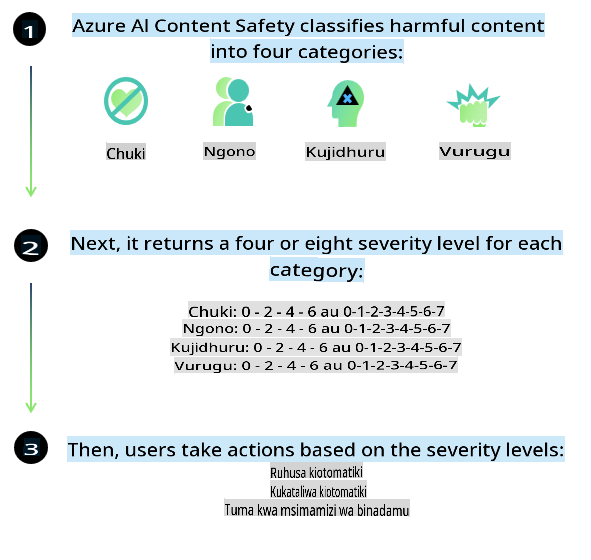
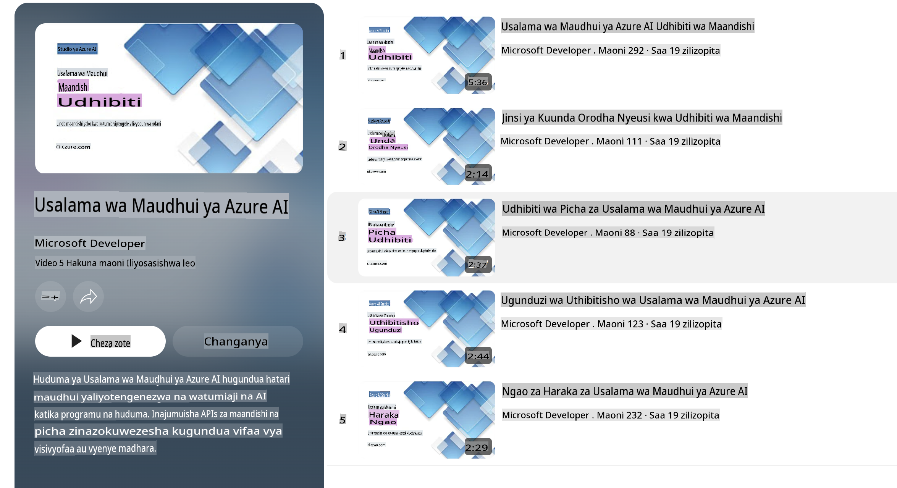

# Usalama wa AI kwa modeli za Phi

Familia ya modeli za Phi ilitengenezwa kwa mujibu wa [Microsoft Responsible AI Standard](https://query.prod.cms.rt.microsoft.com/cms/api/am/binary/RE5cmFl), ambayo ni seti ya mahitaji ya kampuni nzima inayotegemea kanuni sita: uwajibikaji, uwazi, haki, uaminifu na usalama, faragha na usalama, na ujumuishaji ambazo zinaunda [Kanuni za Microsoft za AI yenye Uwajibikaji](https://www.microsoft.com/ai/responsible-ai).

Kama modeli za awali za Phi, tathmini ya usalama yenye vipengele vingi na mbinu za mafunzo ya usalama baada ya utengenezaji zilifuatwa, huku hatua za ziada zikichukuliwa kuzingatia uwezo wa lugha nyingi wa toleo hili. Mbinu yetu ya mafunzo ya usalama na tathmini, ikiwa ni pamoja na majaribio katika lugha mbalimbali na makundi ya hatari, imeelezwa katika [Karatasi ya Usalama wa Phi Baada ya Mafunzo](https://arxiv.org/abs/2407.13833). Ingawa modeli za Phi zinanufaika na mbinu hii, watengenezaji wanapaswa kutumia mbinu bora za AI yenye uwajibikaji, ikiwa ni pamoja na kutambua, kupima, na kupunguza hatari zinazohusiana na matumizi yao maalum na muktadha wa kitamaduni na kilugha.

## Mbinu Bora

Kama modeli nyingine, familia ya modeli za Phi inaweza kuonyesha tabia zisizofaa kama kutokuwa na haki, kutokuwa na uaminifu, au kuwa na maudhui yanayokera.

Baadhi ya tabia zinazoweza kuwa na mapungufu ya SLM na LLM unazopaswa kuzingatia ni pamoja na:

- **Ubora wa Huduma:** Modeli za Phi zimefundishwa hasa kwa maandishi ya Kiingereza. Lugha zisizo za Kiingereza zitakuwa na utendaji duni. Lahaja za Kiingereza zenye uwakilishi mdogo katika data ya mafunzo zinaweza pia kuwa na utendaji duni ikilinganishwa na Kiingereza cha kawaida cha Marekani.
- **Uwakilishi wa Madhara na Kuendeleza Stereotypes:** Modeli hizi zinaweza kuwakilisha kupita kiasi au kupunguza uwakilishi wa makundi ya watu, kufuta uwakilishi wa makundi fulani, au kuimarisha dhana potofu za kudhalilisha au hasi. Licha ya mafunzo ya usalama baada ya utengenezaji, mapungufu haya yanaweza bado kuwepo kutokana na viwango tofauti vya uwakilishi wa makundi mbalimbali au mifano ya dhana potofu hasi katika data ya mafunzo inayoakisi mifumo halisi ya ulimwengu na upendeleo wa kijamii.
- **Maudhui Yasiyofaa au Yanayokera:** Modeli hizi zinaweza kutoa aina nyingine za maudhui yasiyofaa au yanayokera, ambayo yanaweza kufanya isiwe sahihi kuzitumia katika muktadha nyeti bila hatua za ziada za kupunguza hatari zinazofaa kwa matumizi husika.
- **Uaminifu wa Habari:** Modeli za lugha zinaweza kutoa maudhui yasiyo na maana au kuunda maudhui ambayo yanaweza kusikika kuwa ya busara lakini si sahihi au ni ya zamani.
- **Upeo Mdogo wa Msimbo:** Sehemu kubwa ya data ya mafunzo ya Phi-3 inategemea Python na inatumia pakiti za kawaida kama "typing, math, random, collections, datetime, itertools". Ikiwa modeli itazalisha misimbo ya Python inayotumia pakiti nyingine au misimbo katika lugha nyingine, tunapendekeza kwa nguvu kwamba watumiaji wahakiki kwa mkono matumizi yote ya API.

Watengenezaji wanapaswa kutumia mbinu bora za AI yenye uwajibikaji na wanawajibika kuhakikisha kuwa matumizi maalum yanakubaliana na sheria na kanuni husika (mfano: faragha, biashara, n.k.).

## Mazingatio ya AI Yenye Uwajibikaji

Kama modeli nyingine za lugha, modeli za mfululizo wa Phi zinaweza kuonyesha tabia zisizofaa kama kutokuwa na haki, kutokuwa na uaminifu, au kuwa na maudhui yanayokera. Baadhi ya tabia za mapungufu unazopaswa kuzingatia ni pamoja na:

**Ubora wa Huduma:** Modeli za Phi zimefundishwa hasa kwa maandishi ya Kiingereza. Lugha zisizo za Kiingereza zitakuwa na utendaji duni. Lahaja za Kiingereza zenye uwakilishi mdogo katika data ya mafunzo zinaweza pia kuwa na utendaji duni ikilinganishwa na Kiingereza cha kawaida cha Marekani.

**Uwakilishi wa Madhara na Kuendeleza Stereotypes:** Modeli hizi zinaweza kuwakilisha kupita kiasi au kupunguza uwakilishi wa makundi ya watu, kufuta uwakilishi wa makundi fulani, au kuimarisha dhana potofu za kudhalilisha au hasi. Licha ya mafunzo ya usalama baada ya utengenezaji, mapungufu haya yanaweza bado kuwepo kutokana na viwango tofauti vya uwakilishi wa makundi mbalimbali au mifano ya dhana potofu hasi katika data ya mafunzo inayoakisi mifumo halisi ya ulimwengu na upendeleo wa kijamii.

**Maudhui Yasiyofaa au Yanayokera:** Modeli hizi zinaweza kutoa aina nyingine za maudhui yasiyofaa au yanayokera, ambayo yanaweza kufanya isiwe sahihi kuzitumia katika muktadha nyeti bila hatua za ziada za kupunguza hatari zinazofaa kwa matumizi husika.

**Uaminifu wa Habari:** Modeli za lugha zinaweza kutoa maudhui yasiyo na maana au kuunda maudhui ambayo yanaweza kusikika kuwa ya busara lakini si sahihi au ni ya zamani.

**Upeo Mdogo wa Msimbo:** Sehemu kubwa ya data ya mafunzo ya Phi-3 inategemea Python na inatumia pakiti za kawaida kama "typing, math, random, collections, datetime, itertools". Ikiwa modeli itazalisha misimbo ya Python inayotumia pakiti nyingine au misimbo katika lugha nyingine, tunapendekeza kwa nguvu kwamba watumiaji wahakiki kwa mkono matumizi yote ya API.

Watengenezaji wanapaswa kutumia mbinu bora za AI yenye uwajibikaji na wanawajibika kuhakikisha kuwa matumizi maalum yanakubaliana na sheria na kanuni husika (mfano: faragha, biashara, n.k.). Maeneo muhimu ya kuzingatia ni pamoja na:

**Ugawaji:** Modeli zinaweza zisifae kwa hali ambazo zinaweza kuwa na athari kubwa kwa hali ya kisheria au ugawaji wa rasilimali au fursa za maisha (mfano: makazi, ajira, mikopo, n.k.) bila tathmini zaidi na mbinu za ziada za kupunguza upendeleo.

**Hali za Hatari ya Juu:** Watengenezaji wanapaswa kutathmini usahihi wa kutumia modeli katika hali za hatari ya juu ambapo matokeo yasiyo ya haki, yasiyo ya kuaminika, au yanayokera yanaweza kuwa na gharama kubwa au kusababisha madhara. Hii ni pamoja na kutoa ushauri katika maeneo nyeti au ya kitaalamu ambapo usahihi na uaminifu ni muhimu (mfano: ushauri wa kisheria au kiafya). Hatua za ziada za usalama zinapaswa kutekelezwa katika kiwango cha programu kulingana na muktadha wa matumizi.

**Habari za Uongo:** Modeli zinaweza kutoa habari zisizo sahihi. Watengenezaji wanapaswa kufuata mbinu bora za uwazi na kuwajulisha watumiaji wa mwisho kuwa wanashirikiana na mfumo wa AI. Katika kiwango cha programu, watengenezaji wanaweza kujenga mifumo ya maoni na mifumo ya kuthibitisha majibu katika muktadha maalum wa matumizi, mbinu inayojulikana kama Retrieval Augmented Generation (RAG).

**Uzalishaji wa Maudhui Hatari:** Watengenezaji wanapaswa kutathmini matokeo kwa muktadha wao na kutumia vifuatiliaji vya usalama vilivyopo au suluhisho maalum zinazofaa kwa matumizi yao.

**Matumizi Mabaya:** Aina nyingine za matumizi mabaya kama ulaghai, barua taka, au utengenezaji wa programu hasidi zinaweza kuwa zinawezekana, na watengenezaji wanapaswa kuhakikisha kuwa programu zao hazivunji sheria na kanuni zinazotumika.

### Kufinetuni na Usalama wa Maudhui ya AI

Baada ya kufinetuni modeli, tunapendekeza sana kutumia hatua za [Azure AI Content Safety](https://learn.microsoft.com/azure/ai-services/content-safety/overview) kufuatilia maudhui yanayotengenezwa na modeli, kutambua na kuzuia hatari, vitisho, na masuala ya ubora yanayoweza kutokea.

[Azure AI Content Safety](https://learn.microsoft.com/azure/ai-services/content-safety/overview) inaunga mkono maudhui ya maandishi na picha. Inaweza kutumika katika wingu, vyombo vilivyotenganishwa, na vifaa vya pembeni/vilivyopachikwa.

## Muhtasari wa Usalama wa Maudhui ya Azure AI

Usalama wa Maudhui ya Azure AI si suluhisho la kila kitu; inaweza kubinafsishwa ili kuendana na sera maalum za biashara. Aidha, modeli zake za lugha nyingi zinawezesha kuelewa lugha nyingi kwa wakati mmoja.

- **Usalama wa Maudhui ya Azure AI**
- **Msanidi wa Microsoft**
- **Video 5**

Huduma ya Usalama wa Maudhui ya Azure AI hutambua maudhui hatari yanayotengenezwa na watumiaji na AI katika programu na huduma. Inajumuisha API za maandishi na picha zinazokuwezesha kutambua nyenzo hatari au zisizofaa.

[Orodha ya Uchezaji ya Usalama wa Maudhui ya AI](https://www.youtube.com/playlist?list=PLlrxD0HtieHjaQ9bJjyp1T7FeCbmVcPkQ)

**Kanusho**:  
Hati hii imetafsiriwa kwa kutumia huduma za kutafsiri za AI zinazotumia mashine. Ingawa tunajitahidi kuhakikisha usahihi, tafadhali fahamu kuwa tafsiri za kiotomatiki zinaweza kuwa na makosa au kutokamilika. Hati ya asili katika lugha yake ya awali inapaswa kuchukuliwa kama chanzo rasmi. Kwa taarifa muhimu, inashauriwa kutumia huduma za utafsiri wa kibinadamu wa kitaalamu. Hatutawajibika kwa kutoelewana au tafsiri potofu zinazotokana na matumizi ya tafsiri hii.