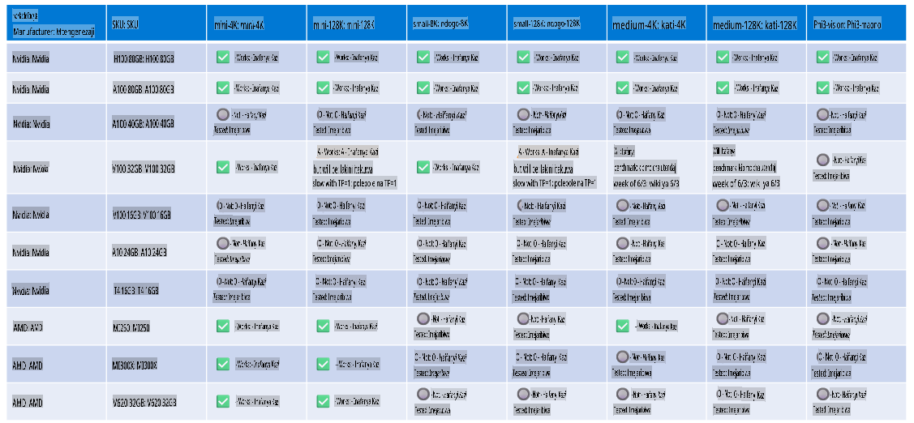

# Usaidizi wa Vifaa vya Phi

Microsoft Phi imeboreshwa kwa ONNX Runtime na inasaidia Windows DirectML. Inafanya kazi vizuri kwenye aina mbalimbali za vifaa, ikijumuisha GPUs, CPUs, na hata vifaa vya simu.

## Vifaa vya Kifaa
Hasa, vifaa vinavyoungwa mkono ni:

- GPU SKU: RTX 4090 (DirectML)
- GPU SKU: 1 A100 80GB (CUDA)
- CPU SKU: Standard F64s v2 (64 vCPUs, 128 GiB memory)

## SKU za Simu

- Android - Samsung Galaxy S21
- Apple iPhone 14 au zaidi, Prosesa A16/A17

## Maelezo ya Vifaa vya Phi

- Uwezo wa chini unaohitajika.
- Windows: GPU yenye uwezo wa DirectX 12 na angalau 4GB ya RAM iliyounganishwa

CUDA: NVIDIA GPU yenye Compute Capability >= 7.02



## Kuendesha onnxruntime kwenye GPUs nyingi

Hivi sasa, modeli za Phi ONNX zinazopatikana ni kwa ajili ya GPU moja tu. Inawezekana kusaidia GPU nyingi kwa modeli za Phi, lakini ORT na GPU mbili hazihakikishi kuwa itaongeza kasi ya usindikaji ikilinganishwa na matukio mawili ya ORT. Tafadhali angalia [ONNX Runtime](https://onnxruntime.ai/) kwa taarifa za hivi karibuni.

Katika [Build 2024, Timu ya GenAI ONNX](https://youtu.be/WLW4SE8M9i8?si=EtG04UwDvcjunyfC) ilitangaza kuwa wamewezesha matumizi ya matukio mengi badala ya GPU nyingi kwa modeli za Phi.

Kwa sasa, hii inakuruhusu kuendesha mfano mmoja wa onnxruntime au onnxruntime-genai na mazingira ya CUDA_VISIBLE_DEVICES kama ifuatavyo.

```Python
CUDA_VISIBLE_DEVICES=0 python infer.py
CUDA_VISIBLE_DEVICES=1 python infer.py
```

Jisikie huru kuchunguza zaidi Phi kupitia [Azure AI Foundry](https://ai.azure.com)

**Kanusho:**  
Hati hii imetafsiriwa kwa kutumia huduma za kutafsiri zinazotumia AI ya mashine. Ingawa tunajitahidi kwa usahihi, tafadhali fahamu kuwa tafsiri za kiotomatiki zinaweza kuwa na makosa au kutokuwa sahihi. Hati ya asili katika lugha yake ya awali inapaswa kuzingatiwa kama chanzo cha mamlaka. Kwa taarifa muhimu, inashauriwa kutumia huduma za watafsiri wa kibinadamu wenye taaluma. Hatutawajibika kwa kutoelewana au tafsiri zisizo sahihi zinazotokana na matumizi ya tafsiri hii.