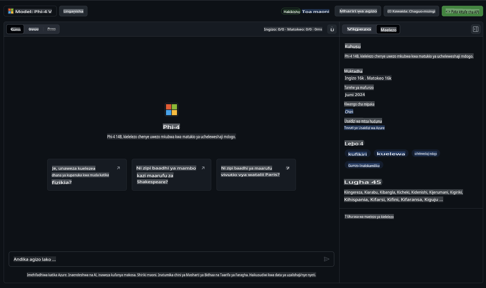

## Familia ya Phi katika GitHub Models

Karibu kwenye [GitHub Models](https://github.com/marketplace/models)! Tumekamilisha maandalizi yote ili uweze kuchunguza AI Models zinazohifadhiwa kwenye Azure AI.


Kwa maelezo zaidi kuhusu Models zinazopatikana kwenye GitHub Models, tembelea [GitHub Model Marketplace](https://github.com/marketplace/models)

## Models Zinazopatikana

Kila model ina uwanja wa majaribio na mfano wa msimbo wa kutumia.



### Familia ya Phi katika GitHub Model Catalog

- [Phi-4](https://github.com/marketplace/models/azureml/Phi-4)

- [Phi-3.5-MoE instruct (128k)](https://github.com/marketplace/models/azureml/Phi-3-5-MoE-instruct)

- [Phi-3.5-vision instruct (128k)](https://github.com/marketplace/models/azureml/Phi-3-5-vision-instruct)

- [Phi-3.5-mini instruct (128k)](https://github.com/marketplace/models/azureml/Phi-3-5-mini-instruct)

- [Phi-3-Medium-128k-Instruct](https://github.com/marketplace/models/azureml/Phi-3-medium-128k-instruct)

- [Phi-3-medium-4k-instruct](https://github.com/marketplace/models/azureml/Phi-3-medium-4k-instruct)

- [Phi-3-mini-128k-instruct](https://github.com/marketplace/models/azureml/Phi-3-mini-128k-instruct)

- [Phi-3-mini-4k-instruct](https://github.com/marketplace/models/azureml/Phi-3-mini-4k-instruct)

- [Phi-3-small-128k-instruct](https://github.com/marketplace/models/azureml/Phi-3-small-128k-instruct)

- [Phi-3-small-8k-instruct](https://github.com/marketplace/models/azureml/Phi-3-small-8k-instruct)

## Kuanza

Kuna mifano ya msingi ambayo iko tayari kuendeshwa. Unaweza kuipata katika saraka ya mifano. Ikiwa unataka moja kwa moja kwenda kwenye lugha unayoipenda, mifano inapatikana katika lugha zifuatazo:

- Python  
- JavaScript  
- C#  
- Java  
- cURL  

Kuna pia Mazingira maalum ya Codespaces kwa ajili ya kuendesha mifano na models.  


## Mfano wa Msimbo

Hapa chini kuna vipande vya msimbo wa mfano kwa matumizi kadhaa. Kwa maelezo zaidi kuhusu Azure AI Inference SDK, angalia nyaraka kamili na mifano.

## Maandalizi

1. Tengeneza tokeni ya ufikiaji wa kibinafsi  
Huna haja ya kutoa ruhusa yoyote kwa tokeni hiyo. Kumbuka kuwa tokeni itatumwa kwa huduma ya Microsoft.

Ili kutumia vipande vya msimbo vilivyo hapa chini, tengeneza mazingira ya kutaja tokeni yako kama ufunguo kwa msimbo wa mteja.

Ikiwa unatumia bash:  
```
export GITHUB_TOKEN="<your-github-token-goes-here>"
```  
Ikiwa uko kwenye powershell:  

```
$Env:GITHUB_TOKEN="<your-github-token-goes-here>"
```  

Ikiwa unatumia Windows command prompt:  

```
set GITHUB_TOKEN=<your-github-token-goes-here>
```  

## Mfano wa Python

### Sakinisha mahitaji  
Sakinisha Azure AI Inference SDK ukitumia pip (Inahitajika: Python >=3.8):  

```
pip install azure-ai-inference
```  

### Endesha mfano wa msingi wa msimbo  

Mfano huu unaonyesha wito wa msingi kwa API ya kukamilisha mazungumzo. Inatumia endpoint ya GitHub AI model inference na tokeni yako ya GitHub. Wito huu ni wa kulandana.  

```python
import os
from azure.ai.inference import ChatCompletionsClient
from azure.ai.inference.models import SystemMessage, UserMessage
from azure.core.credentials import AzureKeyCredential

endpoint = "https://models.inference.ai.azure.com"
model_name = "Phi-4"
token = os.environ["GITHUB_TOKEN"]

client = ChatCompletionsClient(
    endpoint=endpoint,
    credential=AzureKeyCredential(token),
)

response = client.complete(
    messages=[
        UserMessage(content="I have $20,000 in my savings account, where I receive a 4% profit per year and payments twice a year. Can you please tell me how long it will take for me to become a millionaire? Also, can you please explain the math step by step as if you were explaining it to an uneducated person?"),
    ],
    temperature=0.4,
    top_p=1.0,
    max_tokens=2048,
    model=model_name
)

print(response.choices[0].message.content)
```  

### Endesha mazungumzo ya hatua nyingi  

Mfano huu unaonyesha mazungumzo ya hatua nyingi na API ya kukamilisha mazungumzo. Unapotumia model kwa programu ya mazungumzo, utahitaji kusimamia historia ya mazungumzo hayo na kutuma ujumbe wa hivi karibuni kwa model.  

```
import os
from azure.ai.inference import ChatCompletionsClient
from azure.ai.inference.models import AssistantMessage, SystemMessage, UserMessage
from azure.core.credentials import AzureKeyCredential

token = os.environ["GITHUB_TOKEN"]
endpoint = "https://models.inference.ai.azure.com"
# Replace Model_Name
model_name = "Phi-4"

client = ChatCompletionsClient(
    endpoint=endpoint,
    credential=AzureKeyCredential(token),
)

messages = [
    SystemMessage(content="You are a helpful assistant."),
    UserMessage(content="What is the capital of France?"),
    AssistantMessage(content="The capital of France is Paris."),
    UserMessage(content="What about Spain?"),
]

response = client.complete(messages=messages, model=model_name)

print(response.choices[0].message.content)
```  

### Pitisha matokeo kwa mtiririko  

Kwa uzoefu bora wa mtumiaji, utataka kupitisha majibu ya model kwa mtiririko ili tokeni ya kwanza ionekane mapema na kuepuka kusubiri majibu marefu.  

```
import os
from azure.ai.inference import ChatCompletionsClient
from azure.ai.inference.models import SystemMessage, UserMessage
from azure.core.credentials import AzureKeyCredential

token = os.environ["GITHUB_TOKEN"]
endpoint = "https://models.inference.ai.azure.com"
# Replace Model_Name
model_name = "Phi-4"

client = ChatCompletionsClient(
    endpoint=endpoint,
    credential=AzureKeyCredential(token),
)

response = client.complete(
    stream=True,
    messages=[
        SystemMessage(content="You are a helpful assistant."),
        UserMessage(content="Give me 5 good reasons why I should exercise every day."),
    ],
    model=model_name,
)

for update in response:
    if update.choices:
        print(update.choices[0].delta.content or "", end="")

client.close()
```  

## Matumizi ya BURE na Vikomo vya GitHub Models  

  

[Vikomo vya kiwango cha juu vya matumizi ya playground na API ya bure](https://docs.github.com/en/github-models/prototyping-with-ai-models#rate-limits) vinalenga kukusaidia kujaribu models na kuunda programu yako ya AI. Kwa matumizi zaidi ya vikomo hivyo, na kuleta programu yako kwenye kiwango kikubwa, lazima utoe rasilimali kutoka kwa akaunti ya Azure, na uthibitishe kutoka huko badala ya tokeni yako ya kibinafsi ya GitHub. Huna haja ya kubadilisha kitu kingine chochote kwenye msimbo wako. Tumia kiungo hiki kugundua jinsi ya kwenda zaidi ya vikomo vya kiwango cha bure kwenye Azure AI.  

### Ufafanuzi  

Kumbuka unaposhirikiana na model unajaribu AI, kwa hivyo makosa ya maudhui yanaweza kutokea.  

Kipengele hiki kina vikomo mbalimbali (ikiwemo maombi kwa dakika, maombi kwa siku, tokeni kwa ombi, na maombi yanayoendelea) na hakijasanifiwa kwa matumizi ya uzalishaji.  

GitHub Models hutumia Azure AI Content Safety. Vichujio hivi haviwezi kuzimwa kama sehemu ya uzoefu wa GitHub Models. Ikiwa utaamua kutumia models kupitia huduma inayolipiwa, tafadhali sanidi vichujio vya maudhui ili kukidhi mahitaji yako.  

Huduma hii iko chini ya Masharti ya Awali ya GitHub.  

**Kanusho**:  
Hati hii imetafsiriwa kwa kutumia huduma za tafsiri za kimitambo zinazotumia AI. Ingawa tunajitahidi kwa usahihi, tafadhali fahamu kuwa tafsiri za kiotomatiki zinaweza kuwa na makosa au kutokuwa sahihi. Hati ya asili katika lugha yake ya asili inapaswa kuchukuliwa kama chanzo rasmi. Kwa taarifa muhimu, tafsiri ya kitaalamu ya kibinadamu inapendekezwa. Hatutawajibika kwa maelewano mabaya au tafsiri zisizo sahihi zinazotokana na matumizi ya tafsiri hii.