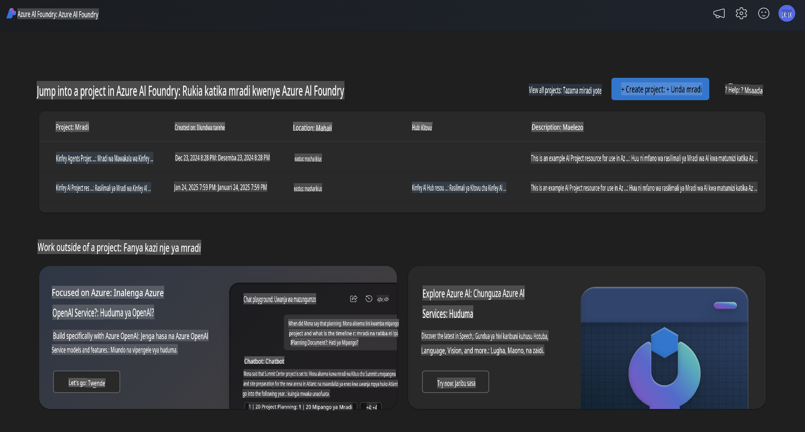
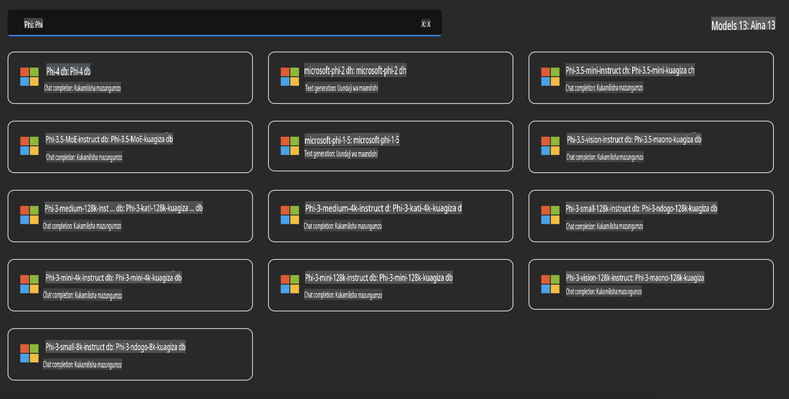
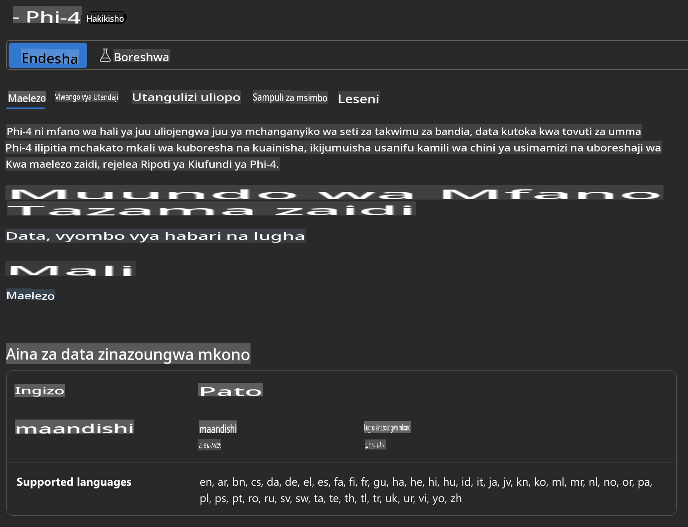
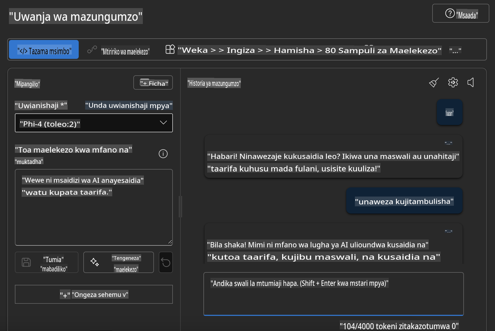

## Familia ya Phi katika Azure AI Foundry

[Azure AI Foundry](https://ai.azure.com) ni jukwaa linaloaminika ambalo linawawezesha watengenezaji kuendesha ubunifu na kuunda mustakabali na AI kwa njia salama, salihi, na yenye uwajibikaji.

[Azure AI Foundry](https://ai.azure.com) imeundwa kwa ajili ya watengenezaji ili:

- Kujenga programu za AI zinazozalisha kwenye jukwaa lenye kiwango cha daraja la biashara.
- Kuchunguza, kujenga, kujaribu, na kuweka programu kwa kutumia zana za AI za kisasa na modeli za ML, zikiwa zimejikita katika mazoea ya AI yenye uwajibikaji.
- Kushirikiana na timu kwa mzunguko mzima wa maisha wa maendeleo ya programu.

Kwa Azure AI Foundry, unaweza kuchunguza aina mbalimbali za modeli, huduma, na uwezo, na kuanza kujenga programu za AI zinazokidhi malengo yako. Jukwaa la Azure AI Foundry linatoa urahisi wa kupanua kutoka dhana ya awali hadi programu za uzalishaji kamili kwa urahisi. Ufuatiliaji wa mara kwa mara na uboreshaji unasaidia kufanikisha mafanikio ya muda mrefu.



Mbali na kutumia Huduma ya Azure AOAI ndani ya Azure AI Foundry, unaweza pia kutumia modeli za wahusika wa tatu kupitia Katalogi ya Modeli ya Azure AI Foundry. Hii ni chaguo bora ikiwa unataka kutumia Azure AI Foundry kama jukwaa lako la suluhisho la AI.

Tunaweza kupeleka haraka Modeli za Familia ya Phi kupitia Katalogi ya Modeli ndani ya Azure AI Foundry.



### **Kuweka Phi-4 katika Azure AI Foundry**



### **Kujaribu Phi-4 katika Azure AI Foundry Playground**



### **Kuendesha Msimbo wa Python kuwaita Azure AI Foundry Phi-4**

```python

import os  
import base64
from openai import AzureOpenAI  
from azure.identity import DefaultAzureCredential, get_bearer_token_provider  
        
endpoint = os.getenv("ENDPOINT_URL", "Your Azure AOAI Service Endpoint")  
deployment = os.getenv("DEPLOYMENT_NAME", "Phi-4")  
      
token_provider = get_bearer_token_provider(  
    DefaultAzureCredential(),  
    "https://cognitiveservices.azure.com/.default"  
)  
  
client = AzureOpenAI(  
    azure_endpoint=endpoint,  
    azure_ad_token_provider=token_provider,  
    api_version="2024-05-01-preview",  
)  
  

chat_prompt = [
    {
        "role": "system",
        "content": "You are an AI assistant that helps people find information."
    },
    {
        "role": "user",
        "content": "can you introduce yourself"
    }
] 
    
# Include speech result if speech is enabled  
messages = chat_prompt 

completion = client.chat.completions.create(  
    model=deployment,  
    messages=messages,
    max_tokens=800,  
    temperature=0.7,  
    top_p=0.95,  
    frequency_penalty=0,  
    presence_penalty=0,
    stop=None,  
    stream=False  
)  
  
print(completion.to_json())  

```

**Kanusho**:  
Hati hii imetafsiriwa kwa kutumia huduma za tafsiri za AI zinazotegemea mashine. Ingawa tunajitahidi kwa usahihi, tafadhali fahamu kuwa tafsiri za kiotomatiki zinaweza kuwa na makosa au kutokuwa sahihi. Hati ya asili katika lugha yake ya awali inapaswa kuchukuliwa kuwa chanzo cha mamlaka. Kwa taarifa muhimu, inashauriwa kutumia huduma za wataalamu wa tafsiri za kibinadamu. Hatutawajibika kwa kutoelewana au tafsiri potofu zinazotokana na matumizi ya tafsiri hii.