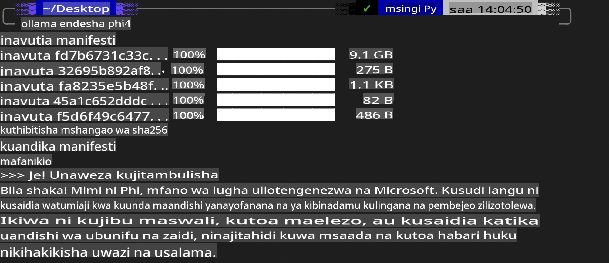
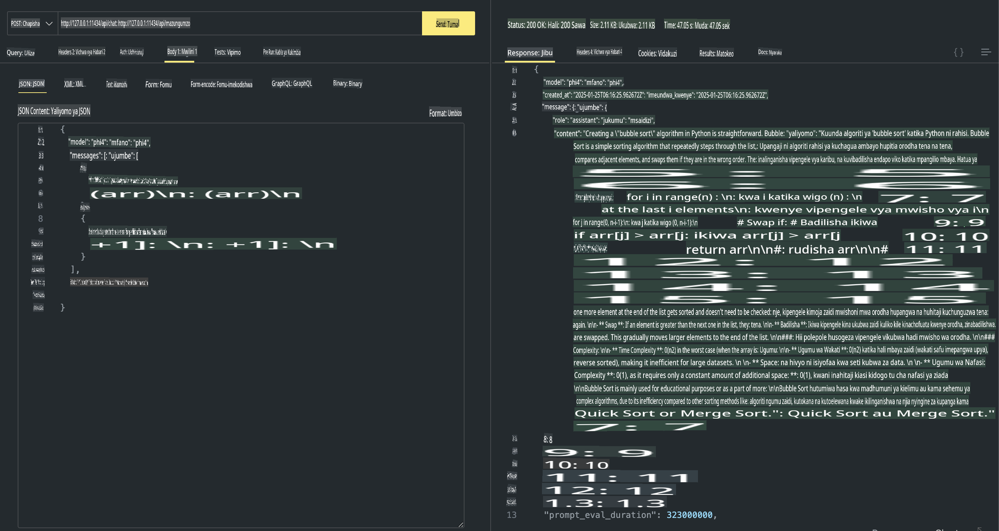

## Familia ya Phi katika Ollama

[Ollama](https://ollama.com) inawawezesha watu zaidi kupeleka moja kwa moja LLM au SLM za chanzo wazi kupitia maandiko rahisi, na pia inaweza kujenga API kusaidia katika matumizi ya Copilot ya ndani.

## **1. Ufungaji**

Ollama inasaidia kuendesha kwenye Windows, macOS, na Linux. Unaweza kusakinisha Ollama kupitia kiungo hiki ([https://ollama.com/download](https://ollama.com/download)). Baada ya usakinishaji kufanikiwa, unaweza moja kwa moja kutumia maandiko ya Ollama kuendesha Phi-3 kupitia dirisha la terminal. Unaweza kuona [maktaba zote zinazopatikana katika Ollama](https://ollama.com/library). Ukifungua hifadhi hii katika Codespace, tayari itakuwa na Ollama iliyosakinishwa.

```bash

ollama run phi4

```

> [!NOTE]
> Mfano utapakuliwa mara ya kwanza unapouendesha. Bila shaka, unaweza pia moja kwa moja kubainisha mfano wa Phi-4 uliopakuliwa. Tunachukua WSL kama mfano wa kuendesha amri. Baada ya mfano kupakuliwa kwa mafanikio, unaweza kuingiliana moja kwa moja kwenye terminal.



## **2. Kuita API ya phi-4 kutoka Ollama**

Ikiwa unataka kuita API ya Phi-4 inayozalishwa na Ollama, unaweza kutumia amri hii kwenye terminal kuanzisha seva ya Ollama.

```bash

ollama serve

```

> [!NOTE]
> Ikiwa unaendesha MacOS au Linux, tafadhali kumbuka kuwa unaweza kukutana na kosa lifuatalo **"Error: listen tcp 127.0.0.1:11434: bind: address already in use"**. Unaweza kupata kosa hili unapojaribu kuendesha amri. Unaweza kupuuza kosa hilo, kwa sababu mara nyingi linaonyesha kuwa seva tayari inaendesha, au unaweza kusimamisha na kuanzisha tena Ollama:

**macOS**

```bash

brew services restart ollama

```

**Linux**

```bash

sudo systemctl stop ollama

```

Ollama inasaidia API mbili: generate na chat. Unaweza kuita API ya mfano inayotolewa na Ollama kulingana na mahitaji yako, kwa kutuma maombi kwenye huduma ya ndani inayoendesha kwenye bandari 11434.

**Chat**

```bash

curl http://127.0.0.1:11434/api/chat -d '{
  "model": "phi3",
  "messages": [
    {
      "role": "system",
      "content": "Your are a python developer."
    },
    {
      "role": "user",
      "content": "Help me generate a bubble algorithm"
    }
  ],
  "stream": false
  
}'

This is the result in Postman



## Additional Resources

Check the list of available models in Ollama in [their library](https://ollama.com/library).

Pull your model from the Ollama server using this command

```bash
ollama pull phi4
```

Run the model using this command

```bash
ollama run phi4
```

***Note:*** Visit this link [https://github.com/ollama/ollama/blob/main/docs/api.md](https://github.com/ollama/ollama/blob/main/docs/api.md) to learn more

## Calling Ollama from Python

You can use `requests` or `urllib3` to make requests to the local server endpoints used above. However, a popular way to use Ollama in Python is via the [openai](https://pypi.org/project/openai/) SDK, since Ollama provides OpenAI-compatible server endpoints as well.

Here is an example for phi3-mini:

```python
import openai

client = openai.OpenAI(
    base_url="http://localhost:11434/v1",
    api_key="nokeyneeded",
)

response = client.chat.completions.create(
    model="phi4",
    temperature=0.7,
    n=1,
    messages=[
        {"role": "system", "content": "You are a helpful assistant."},
        {"role": "user", "content": "Write a haiku about a hungry cat"},
    ],
)

print("Response:")
print(response.choices[0].message.content)
```

## Calling Ollama from JavaScript 

```javascript
// Mfano wa Kuhitimisha faili kwa kutumia Phi-4
script({
    model: "ollama:phi4",
    title: "Summarize with Phi-4",
    system: ["system"],
})

// Mfano wa muhtasari
const file = def("FILE", env.files)
$`Summarize ${file} in a single paragraph.`
```

## Calling Ollama from C#

Create a new C# Console application and add the following NuGet package:

```bash
dotnet add package Microsoft.SemanticKernel --version 1.34.0
```

Then replace this code in the `Program.cs` file

```csharp
using Microsoft.SemanticKernel;
using Microsoft.SemanticKernel.ChatCompletion;

// ongeza huduma ya kukamilisha mazungumzo kwa kutumia mwisho wa seva ya ndani ya Ollama
#pragma warning disable SKEXP0001, SKEXP0003, SKEXP0010, SKEXP0011, SKEXP0050, SKEXP0052
builder.AddOpenAIChatCompletion(
    modelId: "phi4",
    endpoint: new Uri("http://localhost:11434/"),
    apiKey: "non required");

// toa ombi rahisi kwa huduma ya mazungumzo
string prompt = "Write a joke about kittens";
var response = await kernel.InvokePromptAsync(prompt);
Console.WriteLine(response.GetValue<string>());
```

Run the app with the command:

```bash
dotnet run

**Kanusho**:  
Hati hii imetafsiriwa kwa kutumia huduma za kutafsiri za AI zinazotegemea mashine. Ingawa tunajitahidi kwa usahihi, tafadhali fahamu kuwa tafsiri za kiotomatiki zinaweza kuwa na makosa au kutokuwa sahihi. Hati asilia katika lugha yake ya awali inapaswa kuchukuliwa kuwa chanzo rasmi. Kwa maelezo muhimu, inashauriwa kutumia tafsiri ya kitaalamu ya binadamu. Hatutawajibika kwa tafsiri zisizoeleweka au tafsiri potofu zinazotokana na matumizi ya tafsiri hii.