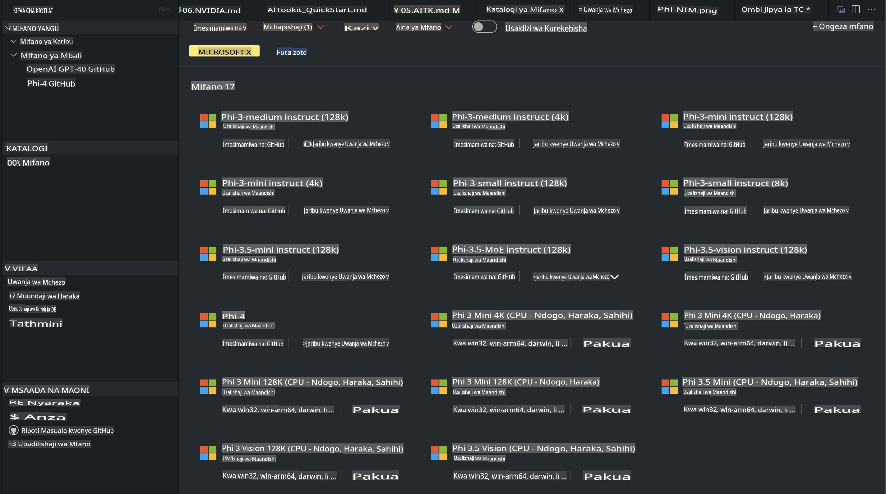
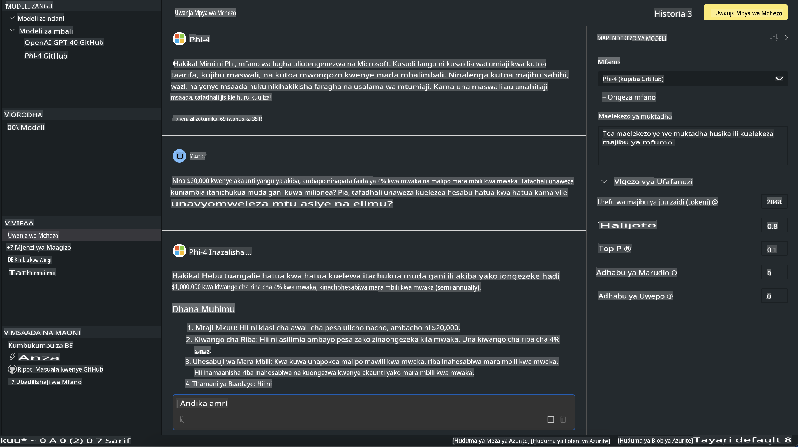

# Familia ya Phi katika AITK

[AI Toolkit kwa VS Code](https://marketplace.visualstudio.com/items?itemName=ms-windows-ai-studio.windows-ai-studio) hurahisisha maendeleo ya programu za AI zinazozalisha kwa kuunganisha zana za hali ya juu za maendeleo ya AI na mifano kutoka kwenye Azure AI Foundry Catalog na katalogi nyingine kama Hugging Face. Unaweza kuvinjari katalogi ya mifano ya AI inayowezeshwa na GitHub Models na Azure AI Foundry Model Catalogs, kuipakua ndani ya kifaa chako au kwa mbali, kurekebisha, kujaribu, na kuitumia katika programu yako.

AI Toolkit Preview itafanya kazi ndani ya kifaa chako. Uwezo wa kufanya inference au kurekebisha mfano hutegemea mfano uliouchagua; unaweza kuhitaji kuwa na GPU kama NVIDIA CUDA GPU. Unaweza pia kutumia GitHub Models moja kwa moja na AITK.

## Kuanza

[Jifunze zaidi jinsi ya kusakinisha mfumo wa Linux kwenye Windows](https://learn.microsoft.com/windows/wsl/install?WT.mc_id=aiml-137032-kinfeylo)

na [kubadilisha usambazaji chaguo-msingi](https://learn.microsoft.com/windows/wsl/install#change-the-default-linux-distribution-installed).

[AI Toolkit GitHub Repo](https://github.com/microsoft/vscode-ai-toolkit/)

- Windows, Linux, macOS
  
- Kwa marekebisho ya mifano kwenye Windows na Linux, utahitaji Nvidia GPU. Kwa kuongeza, **Windows** inahitaji mfumo wa Linux na Ubuntu distro 18.4 au zaidi. [Jifunze zaidi jinsi ya kusakinisha mfumo wa Linux kwenye Windows](https://learn.microsoft.com/windows/wsl/install) na [kubadilisha usambazaji chaguo-msingi](https://learn.microsoft.com/windows/wsl/install#change-the-default-linux-distribution-installed).

### Sakinisha AI Toolkit

AI Toolkit inapatikana kama [Kiendelezi cha Visual Studio Code](https://code.visualstudio.com/docs/setup/additional-components#_vs-code-extensions), kwa hivyo unahitaji kusakinisha [VS Code](https://code.visualstudio.com/docs/setup/windows?WT.mc_id=aiml-137032-kinfeylo) kwanza, na kupakua AI Toolkit kutoka [VS Marketplace](https://marketplace.visualstudio.com/items?itemName=ms-windows-ai-studio.windows-ai-studio). 
[AI Toolkit inapatikana katika Visual Studio Marketplace](https://marketplace.visualstudio.com/items?itemName=ms-windows-ai-studio.windows-ai-studio) na inaweza kusakinishwa kama kiendelezi kingine chochote cha VS Code.

Ikiwa hujui jinsi ya kusakinisha viendelezi vya VS Code, fuata hatua hizi:

### Ingia

1. Katika Activity Bar ya VS Code chagua **Extensions**
1. Katika sehemu ya utafutaji ya Extensions andika "AI Toolkit"
1. Chagua "AI Toolkit for Visual Studio Code"
1. Chagua **Install**

Sasa, uko tayari kutumia kiendelezi hiki!

Utaombwa kuingia kwenye GitHub, kwa hivyo tafadhali bofya "Allow" kuendelea. Utaelekezwa kwenye ukurasa wa kuingia wa GitHub.

Tafadhali ingia na fuata hatua za mchakato. Baada ya kukamilisha kwa mafanikio, utaelekezwa tena kwenye VS Code.

Baada ya kiendelezi kusakinishwa, utaona ikoni ya AI Toolkit ikitokea kwenye Activity Bar yako.

Hebu tuchunguze hatua zinazopatikana!

### Hatua Zinazopatikana

Upau wa upande wa AI Toolkit umeandaliwa katika  

- **Models**
- **Resources**
- **Playground**  
- **Fine-tuning**
- **Evaluation**

Zinapatikana katika sehemu ya Resources. Ili kuanza, chagua **Model Catalog**.

### Pakua mfano kutoka kwenye katalogi

Baada ya kuzindua AI Toolkit kutoka upande wa VS Code, unaweza kuchagua kutoka kwenye chaguo zifuatazo:



- Tafuta mfano unaoungwa mkono kutoka **Model Catalog** na upakue ndani ya kifaa chako
- Jaribu inference ya mfano kwenye **Model Playground**
- Rekebisha mfano ndani ya kifaa chako au kwa mbali kwenye **Model Fine-tuning**
- Peleka mifano iliyorekebishwa kwenye wingu kupitia command palette ya AI Toolkit
- Tathmini mifano

> [!NOTE]
>
> **GPU Vs CPU**
>
> Utagundua kwamba kadi za mfano zinaonyesha ukubwa wa mfano, jukwaa, na aina ya accelerator (CPU, GPU). Kwa utendaji bora kwenye **vifaa vya Windows vyenye angalau GPU moja**, chagua matoleo ya mifano yanayolenga Windows pekee.
>
> Hii inahakikisha unayo mfano ulioboreshwa kwa DirectML accelerator.
>
> Majina ya mifano yako katika muundo wa
>
> - `{model_name}-{accelerator}-{quantization}-{format}`.
>
>Kuthibitisha kama una GPU kwenye kifaa chako cha Windows, fungua **Task Manager** kisha uchague kichupo cha **Performance**. Ikiwa una GPU, zitaorodheshwa chini ya majina kama "GPU 0" au "GPU 1".

### Endesha mfano kwenye playground

Baada ya vigezo vyote kuwekwa, bofya **Generate Project**.

Baada ya mfano wako kupakuliwa, chagua **Load in Playground** kwenye kadi ya mfano kwenye katalogi:

- Anzisha upakuaji wa mfano
- Sakinisha mahitaji yote na utegemezi
- Unda workspace ya VS Code



### Tumia REST API kwenye programu yako

AI Toolkit inakuja na seva ya ndani ya REST API **kwenye port 5272** inayotumia [muundo wa OpenAI chat completions](https://platform.openai.com/docs/api-reference/chat/create).

Hii inakuwezesha kujaribu programu yako ndani ya kifaa chako bila kutegemea huduma ya mfano wa AI kwenye wingu. Kwa mfano, faili ifuatayo ya JSON inaonyesha jinsi ya kusanidi mwili wa ombi:

```json
{
    "model": "Phi-4",
    "messages": [
        {
            "role": "user",
            "content": "what is the golden ratio?"
        }
    ],
    "temperature": 0.7,
    "top_p": 1,
    "top_k": 10,
    "max_tokens": 100,
    "stream": true
}
```

Unaweza kujaribu REST API ukitumia (kwa mfano) [Postman](https://www.postman.com/) au kifaa cha CURL (Client URL):

```bash
curl -vX POST http://127.0.0.1:5272/v1/chat/completions -H 'Content-Type: application/json' -d @body.json
```

### Kutumia maktaba ya mteja wa OpenAI kwa Python

```python
from openai import OpenAI

client = OpenAI(
    base_url="http://127.0.0.1:5272/v1/", 
    api_key="x" # required for the API but not used
)

chat_completion = client.chat.completions.create(
    messages=[
        {
            "role": "user",
            "content": "what is the golden ratio?",
        }
    ],
    model="Phi-4",
)

print(chat_completion.choices[0].message.content)
```

### Kutumia maktaba ya mteja wa Azure OpenAI kwa .NET

Ongeza [maktaba ya mteja wa Azure OpenAI kwa .NET](https://www.nuget.org/packages/Azure.AI.OpenAI/) kwenye mradi wako ukitumia NuGet:

```bash
dotnet add {project_name} package Azure.AI.OpenAI --version 1.0.0-beta.17
```

Ongeza faili ya C# inayoitwa **OverridePolicy.cs** kwenye mradi wako na ubandike msimbo ufuatao:

```csharp
// OverridePolicy.cs
using Azure.Core.Pipeline;
using Azure.Core;

internal partial class OverrideRequestUriPolicy(Uri overrideUri)
    : HttpPipelineSynchronousPolicy
{
    private readonly Uri _overrideUri = overrideUri;

    public override void OnSendingRequest(HttpMessage message)
    {
        message.Request.Uri.Reset(_overrideUri);
    }
}
```

Kisha, bandika msimbo ufuatao kwenye faili yako ya **Program.cs**:

```csharp
// Program.cs
using Azure.AI.OpenAI;

Uri localhostUri = new("http://localhost:5272/v1/chat/completions");

OpenAIClientOptions clientOptions = new();
clientOptions.AddPolicy(
    new OverrideRequestUriPolicy(localhostUri),
    Azure.Core.HttpPipelinePosition.BeforeTransport);
OpenAIClient client = new(openAIApiKey: "unused", clientOptions);

ChatCompletionsOptions options = new()
{
    DeploymentName = "Phi-4",
    Messages =
    {
        new ChatRequestSystemMessage("You are a helpful assistant. Be brief and succinct."),
        new ChatRequestUserMessage("What is the golden ratio?"),
    }
};

StreamingResponse<StreamingChatCompletionsUpdate> streamingChatResponse
    = await client.GetChatCompletionsStreamingAsync(options);

await foreach (StreamingChatCompletionsUpdate chatChunk in streamingChatResponse)
{
    Console.Write(chatChunk.ContentUpdate);
}
```

## Marekebisho na AI Toolkit

- Anza na ugunduzi wa mifano na playground.
- Marekebisho ya mifano na inference ukitumia rasilimali za ndani za kompyuta.
- Marekebisho ya mbali na inference ukitumia rasilimali za Azure.

[Marekebisho na AI Toolkit](../../03.FineTuning/Finetuning_VSCodeaitoolkit.md)

## Rasilimali za Maswali na Majibu ya AI Toolkit

Tafadhali rejelea [ukurasa wetu wa Maswali na Majibu](https://github.com/microsoft/vscode-ai-toolkit/blob/main/archive/QA.md) kwa masuala ya kawaida na suluhisho.

**Kanusho**:  
Hati hii imetafsiriwa kwa kutumia huduma za tafsiri za AI zinazotegemea mashine. Ingawa tunajitahidi kwa usahihi, tafadhali fahamu kuwa tafsiri za kiotomatiki zinaweza kuwa na makosa au kutokuwa sahihi. Hati asilia katika lugha yake ya awali inapaswa kuchukuliwa kama chanzo cha mamlaka. Kwa taarifa muhimu, inashauriwa kutumia tafsiri ya kitaalamu ya binadamu. Hatutawajibika kwa maelewano mabaya au tafsiri zisizo sahihi zinazotokana na matumizi ya tafsiri hii.