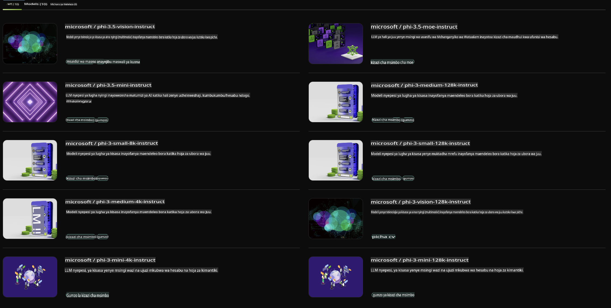

## Familia ya Phi katika NVIDIA NIM

NVIDIA NIM ni seti ya huduma ndogo ndogo rahisi kutumia zilizoundwa kuharakisha usambazaji wa mifano ya AI generative kwenye wingu, kituo cha data, na vituo vya kazi. NIM zimepangwa kulingana na familia ya mfano na msingi wa kila mfano. Kwa mfano, NVIDIA NIM kwa mifano mikubwa ya lugha (LLMs) inaleta nguvu ya LLM za hali ya juu kwenye programu za biashara, ikitoa uwezo wa usindikaji wa lugha ya asili na uelewa usio na kifani.

NIM hufanya iwe rahisi kwa timu za IT na DevOps kuendesha wenyewe mifano mikubwa ya lugha (LLMs) katika mazingira yao waliyoisimamia huku bado zikiwapa watengenezaji APIs za viwango vya sekta zinazowawezesha kujenga copilots zenye nguvu, chatbots, na wasaidizi wa AI wanaoweza kubadilisha biashara zao. Kwa kutumia kasi ya GPU ya NVIDIA na usambazaji unaoweza kupanuliwa, NIM inatoa njia ya haraka zaidi ya kufikia inference kwa utendaji wa hali ya juu.

Unaweza kutumia NVIDIA NIM kufanya inference kwa Familia ya Mifano ya Phi.



### **Mifano - Phi-3-Vision katika NVIDIA NIM**

Fikiria una picha (`demo.png`) na unataka kuzalisha msimbo wa Python ambao unashughulikia picha hii na kuhifadhi toleo jipya lake (`phi-3-vision.jpg`).

Msimbo hapo juu unarahisisha mchakato huu kwa:

1. Kuandaa mazingira na mipangilio muhimu.
2. Kuunda prompt inayomwelekeza mfano kuzalisha msimbo wa Python unaohitajika.
3. Kutuma prompt kwa mfano na kukusanya msimbo uliotengenezwa.
4. Kutoa na kuendesha msimbo uliotengenezwa.
5. Kuonyesha picha ya awali na iliyoshughulikiwa.

Njia hii inatumia nguvu ya AI kurahisisha kazi za usindikaji wa picha, na kufanya iwe rahisi na haraka kufanikisha malengo yako.

[Sample Code Solution](../../../../../code/06.E2E/E2E_Nvidia_NIM_Phi3_Vision.ipynb)

Hebu tuchambue kile msimbo mzima unafanya hatua kwa hatua:

1. **Sakinisha Kifurushi Kinachohitajika**:
    ```python
    !pip install langchain_nvidia_ai_endpoints -U
    ```
    Amri hii inasakinisha kifurushi cha `langchain_nvidia_ai_endpoints`, kuhakikisha ni toleo la hivi karibuni.

2. **Ingiza Moduli Zinazohitajika**:
    ```python
    from langchain_nvidia_ai_endpoints import ChatNVIDIA
    import getpass
    import os
    import base64
    ```
    Hizi huleta moduli zinazohitajika kwa kuwasiliana na NVIDIA AI endpoints, kushughulikia nywila kwa usalama, kuingiliana na mfumo wa uendeshaji, na kusimba/kuondoa data kwa muundo wa base64.

3. **Sanidi API Key**:
    ```python
    if not os.getenv("NVIDIA_API_KEY"):
        os.environ["NVIDIA_API_KEY"] = getpass.getpass("Enter your NVIDIA API key: ")
    ```
    Msimbo huu hukagua kama mazingira ya `NVIDIA_API_KEY` yamewekwa. Ikiwa hayajafanywa, humwomba mtumiaji kuingiza API key yao kwa usalama.

4. **Fafanua Modeli na Njia ya Picha**:
    ```python
    model = 'microsoft/phi-3-vision-128k-instruct'
    chat = ChatNVIDIA(model=model)
    img_path = './imgs/demo.png'
    ```
    Hii huweka mfano wa kutumika, huunda mfano wa `ChatNVIDIA` na mfano uliobainishwa, na kufafanua njia ya faili ya picha.

5. **Unda Prompt ya Maandishi**:
    ```python
    text = "Please create Python code for image, and use plt to save the new picture under imgs/ and name it phi-3-vision.jpg."
    ```
    Hii hufafanua prompt ya maandishi inayomwelekeza mfano kuzalisha msimbo wa Python wa kushughulikia picha.

6. **Fanya Picha Kuwa Base64**:
    ```python
    with open(img_path, "rb") as f:
        image_b64 = base64.b64encode(f.read()).decode()
    image = f''
    ```
    Msimbo huu unasoma faili ya picha, kuisimba kwa base64, na kuunda tagi ya picha ya HTML na data iliyosimbwa.

7. **Changanya Maandishi na Picha katika Prompt**:
    ```python
    prompt = f"{text} {image}"
    ```
    Hii inachanganya prompt ya maandishi na tagi ya picha ya HTML kuwa kamba moja.

8. **Zalisha Msimbo kwa Kutumia ChatNVIDIA**:
    ```python
    code = ""
    for chunk in chat.stream(prompt):
        print(chunk.content, end="")
        code += chunk.content
    ```
    Msimbo huu hutuma prompt kwa `ChatNVIDIA` model and collects the generated code in chunks, printing and appending each chunk to the `code` string.

9. **Toa Msimbo wa Python kutoka kwa Maudhui Yaliyotengenezwa**:
    ```python
    begin = code.index('```python') + 9
    code = code[begin:]
    end = code.index('```')
    code = code[:end]
    ```
    Hii hutoa msimbo halisi wa Python kutoka kwa maudhui yaliyotengenezwa kwa kuondoa muundo wa markdown.

10. **Endesha Msimbo Uliotengenezwa**:
    ```python
    import subprocess
    result = subprocess.run(["python", "-c", code], capture_output=True)
    ```
    Hii inaendesha msimbo wa Python uliotolewa kama subprocess na kunasa matokeo yake.

11. **Onyesha Picha**:
    ```python
    from IPython.display import Image, display
    display(Image(filename='./imgs/phi-3-vision.jpg'))
    display(Image(filename='./imgs/demo.png'))
    ```
    Mistari hii inaonyesha picha kwa kutumia moduli ya `IPython.display`.

**Kanusho**:  
Hati hii imetafsiriwa kwa kutumia huduma za tafsiri za AI zinazotegemea mashine. Ingawa tunajitahidi kwa usahihi, tafadhali fahamu kuwa tafsiri za kiotomatiki zinaweza kuwa na makosa au kutokuwa sahihi. Hati ya asili katika lugha yake ya awali inapaswa kuchukuliwa kuwa chanzo cha mamlaka. Kwa taarifa muhimu, inashauriwa kutumia huduma za wataalamu wa tafsiri za kibinadamu. Hatutawajibika kwa maelewano mabaya au tafsiri zisizo sahihi zinazotokana na matumizi ya tafsiri hii.