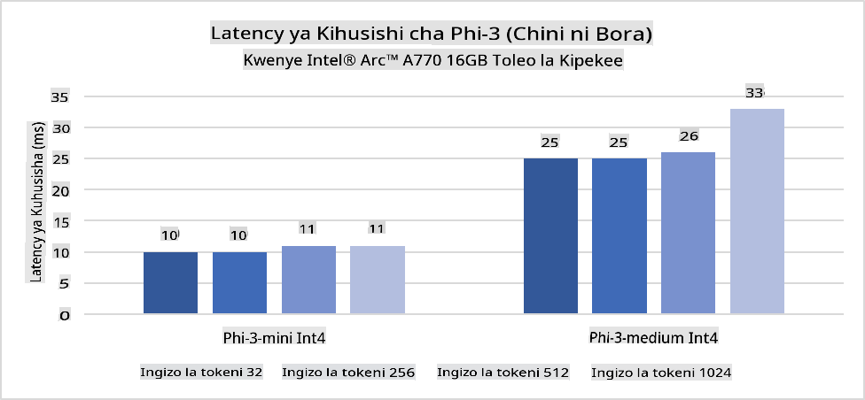
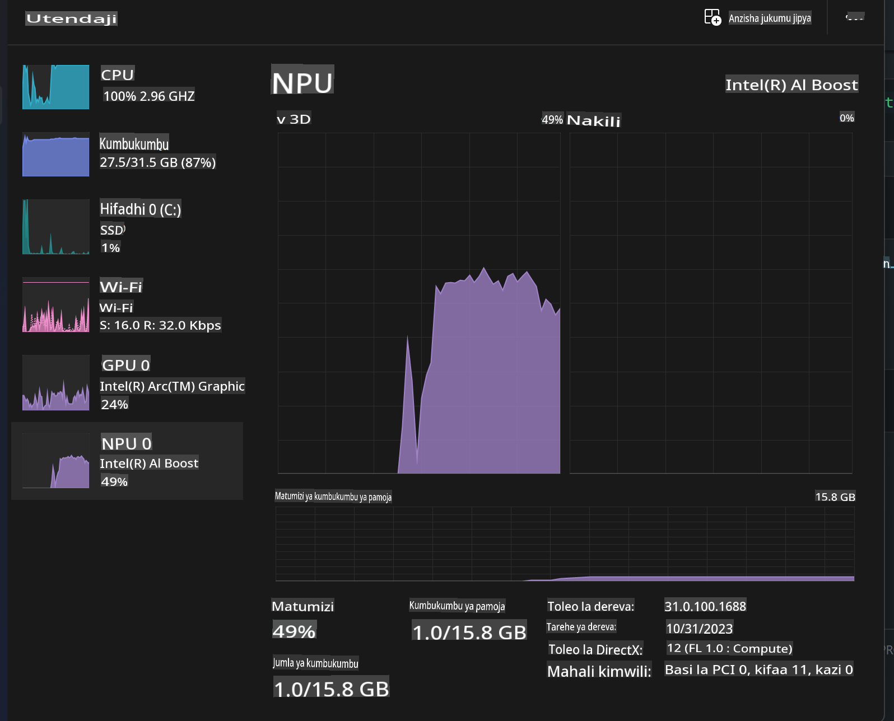
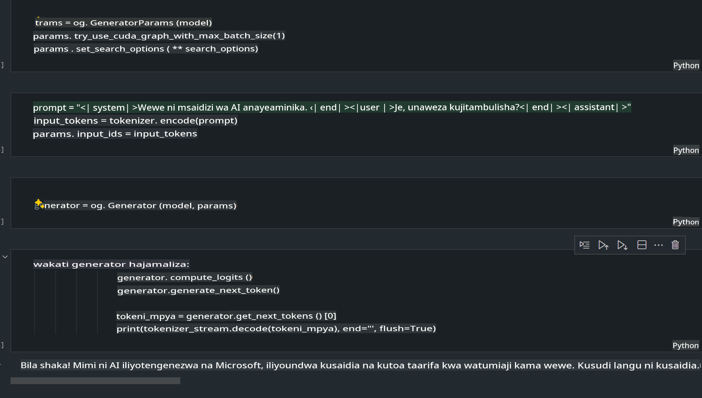
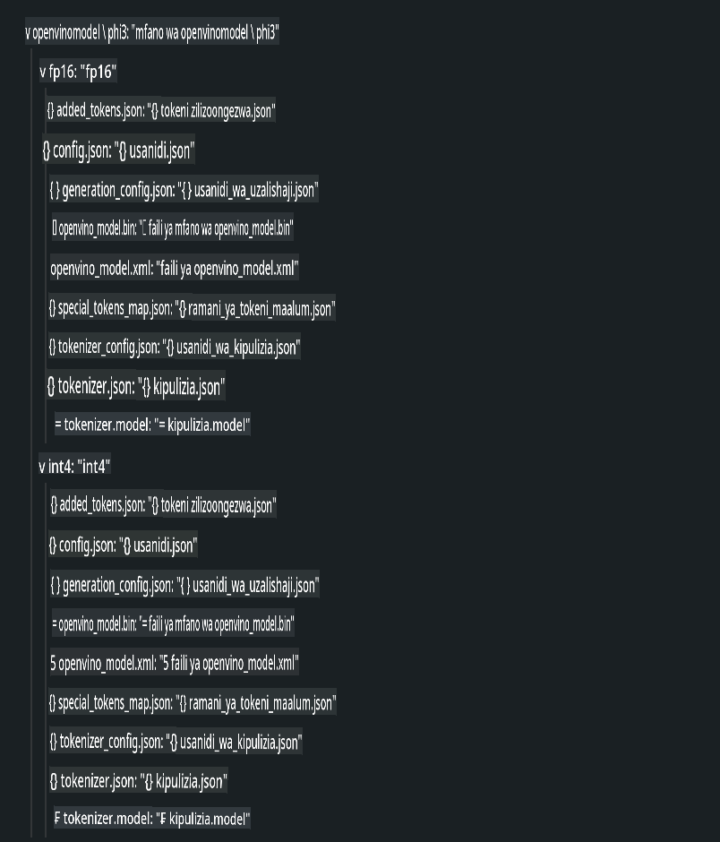
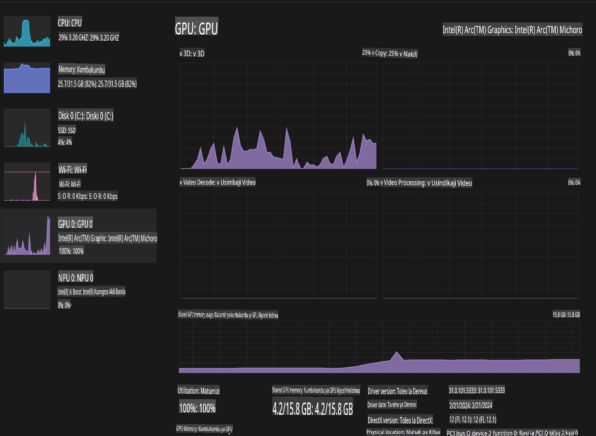

# **Utekelezaji wa Phi-3 kwenye AI PC**

Kwa maendeleo ya AI inayozalisha na maboresho katika uwezo wa vifaa vya edge, idadi inayoongezeka ya mifano ya AI inayozalisha sasa inaweza kuunganishwa kwenye vifaa vya Bring Your Own Device (BYOD) vya watumiaji. AI PC ni mojawapo ya mifano hii. Kuanzia mwaka 2024, Intel, AMD, na Qualcomm wameungana na watengenezaji wa PC kuanzisha AI PC ambazo zinawezesha utekelezaji wa mifano ya AI inayozalisha kwa njia za ndani kupitia mabadiliko ya vifaa. Katika mjadala huu, tutaangazia Intel AI PC na kuchunguza jinsi ya kutekeleza Phi-3 kwenye Intel AI PC.

### NPU ni nini?

NPU (Neural Processing Unit) ni processor maalum au kitengo cha usindikaji kwenye SoC kubwa iliyoundwa mahsusi kwa ajili ya kuharakisha shughuli za neural network na kazi za AI. Tofauti na CPU na GPU za matumizi ya jumla, NPU zimeboreshwa kwa usindikaji wa data sambamba, na kuzifanya kuwa bora sana katika kushughulikia data kubwa ya multimedia kama video na picha na kuchakata data kwa ajili ya neural networks. Zinapendelewa hasa kwa kazi zinazohusiana na AI, kama utambuzi wa sauti, kufuta mandharinyuma kwenye simu za video, na michakato ya kuhariri picha au video kama kugundua vitu.

## NPU dhidi ya GPU

Ingawa kazi nyingi za AI na machine learning zinaendeshwa kwenye GPU, kuna tofauti muhimu kati ya GPU na NPU.  
GPU zinajulikana kwa uwezo wao wa usindikaji sambamba, lakini si GPU zote zina ufanisi sawa zaidi ya usindikaji wa picha. NPU, kwa upande mwingine, zimeundwa mahsusi kwa mahesabu magumu yanayohusisha shughuli za neural network, na kuzifanya kuwa bora sana kwa kazi za AI.

Kwa kifupi, NPU ni wataalamu wa hisabati wanaoongeza kasi ya mahesabu ya AI, na zinachukua jukumu muhimu katika enzi mpya ya AI PC!

***Mfano huu unategemea Processor ya hivi karibuni ya Intel Core Ultra***

## **1. Kutumia NPU kuendesha mfano wa Phi-3**

Kifaa cha Intel® NPU ni kiendeshi cha inference ya AI kilichounganishwa na CPU za wateja wa Intel, kuanzia kizazi cha CPU za Intel® Core™ Ultra (zamani zikijulikana kama Meteor Lake). Kinawezesha utekelezaji wa kazi za neural network kwa ufanisi wa nishati.




**Maktaba ya Intel NPU Acceleration**

Maktaba ya Intel NPU Acceleration [https://github.com/intel/intel-npu-acceleration-library](https://github.com/intel/intel-npu-acceleration-library) ni maktaba ya Python iliyoundwa kuongeza ufanisi wa programu zako kwa kutumia nguvu ya Intel Neural Processing Unit (NPU) kufanya mahesabu ya kasi ya juu kwenye vifaa vinavyooana.

Mfano wa Phi-3-mini kwenye AI PC inayotumia processor za Intel® Core™ Ultra.


Funga Maktaba ya Python kwa kutumia pip

```bash

   pip install intel-npu-acceleration-library

```

***Kumbuka*** Mradi bado uko katika maendeleo, lakini mfano wa kumbukumbu tayari umekamilika sana.

### **Kuendesha Phi-3 kwa kutumia Maktaba ya Intel NPU Acceleration**

Kwa kutumia kasi ya Intel NPU, maktaba hii haiathiri mchakato wa kawaida wa encoding. Unachohitaji ni kutumia maktaba hii kuquantize mfano asili wa Phi-3, kama FP16, INT8, INT4, kama 

```python
from transformers import AutoTokenizer, pipeline,TextStreamer
from intel_npu_acceleration_library import NPUModelForCausalLM, int4
from intel_npu_acceleration_library.compiler import CompilerConfig
import warnings

model_id = "microsoft/Phi-3-mini-4k-instruct"

compiler_conf = CompilerConfig(dtype=int4)
model = NPUModelForCausalLM.from_pretrained(
    model_id, use_cache=True, config=compiler_conf, attn_implementation="sdpa"
).eval()

tokenizer = AutoTokenizer.from_pretrained(model_id)

text_streamer = TextStreamer(tokenizer, skip_prompt=True)
```

Baada ya quantization kufanikiwa, endelea na utekelezaji wa kuita NPU kuendesha mfano wa Phi-3.

```python
generation_args = {
   "max_new_tokens": 1024,
   "return_full_text": False,
   "temperature": 0.3,
   "do_sample": False,
   "streamer": text_streamer,
}

pipe = pipeline(
   "text-generation",
   model=model,
   tokenizer=tokenizer,
)

query = "<|system|>You are a helpful AI assistant.<|end|><|user|>Can you introduce yourself?<|end|><|assistant|>"

with warnings.catch_warnings():
    warnings.simplefilter("ignore")
    pipe(query, **generation_args)
```

Wakati wa kutekeleza msimbo, tunaweza kuona hali ya uendeshaji wa NPU kupitia Task Manager.



***Mifano*** : [AIPC_NPU_DEMO.ipynb](../../../../../code/03.Inference/AIPC/AIPC_NPU_DEMO.ipynb)

## **2. Kutumia DirectML + ONNX Runtime kuendesha mfano wa Phi-3**

### **DirectML ni nini**

[DirectML](https://github.com/microsoft/DirectML) ni maktaba ya DirectX 12 ya utendakazi wa juu, inayoharakishwa na vifaa kwa ajili ya machine learning. DirectML hutoa kasi ya GPU kwa kazi za kawaida za machine learning kwenye vifaa mbalimbali vinavyooana na madereva, ikijumuisha GPU zote zinazooana na DirectX 12 kutoka kwa wauzaji kama AMD, Intel, NVIDIA, na Qualcomm.

Inapotumiwa pekee, API ya DirectML ni maktaba ya kiwango cha chini ya DirectX 12 na inafaa kwa programu za utendakazi wa juu, latency ya chini kama frameworks, michezo, na programu zingine za wakati halisi. Utangamano wa DirectML na Direct3D 12 pamoja na ufanisi wake mdogo na usahihi katika vifaa tofauti huifanya kuwa bora kwa kuharakisha machine learning pale ambapo utendakazi wa juu na uhakika wa matokeo across hardware ni muhimu.

***Kumbuka*** : DirectML ya hivi karibuni tayari inasaidia NPU(https://devblogs.microsoft.com/directx/introducing-neural-processor-unit-npu-support-in-directml-developer-preview/)

### DirectML na CUDA kwa uwezo na utendakazi:

**DirectML** ni maktaba ya machine learning iliyotengenezwa na Microsoft. Imeundwa kuharakisha kazi za machine learning kwenye vifaa vya Windows, ikijumuisha desktops, laptops, na vifaa vya edge.  
- **DX12-Based**: DirectML imejengwa juu ya DirectX 12 (DX12), ambayo hutoa msaada mpana wa vifaa across GPUs, ikijumuisha NVIDIA na AMD.  
- **Msaada Mpana**: Kwa kuwa inatumia DX12, DirectML inaweza kufanya kazi na GPU yoyote inayooana na DX12, hata GPUs zilizounganishwa.  
- **Usindikaji wa Picha**: DirectML inachakata picha na data nyingine kwa kutumia neural networks, na kuifanya kufaa kwa kazi kama utambuzi wa picha, kugundua vitu, na zaidi.  
- **Urahisi wa Kuweka**: Kuweka DirectML ni rahisi, na haihitaji SDK au maktaba maalum kutoka kwa watengenezaji wa GPU.  
- **Utendakazi**: Katika baadhi ya matukio, DirectML hufanya kazi vizuri na inaweza kuwa haraka kuliko CUDA, hasa kwa kazi fulani.  
- **Mipaka**: Hata hivyo, kuna matukio ambapo DirectML inaweza kuwa polepole, hasa kwa float16 na saizi kubwa za batch.  

**CUDA** ni jukwaa la usindikaji sambamba na mfano wa programu kutoka NVIDIA. Inawawezesha watengenezaji kutumia nguvu za GPU za NVIDIA kwa usindikaji wa jumla, ikijumuisha machine learning na simulation za kisayansi.  
- **Mahsusi kwa NVIDIA**: CUDA imeunganishwa kwa karibu na GPU za NVIDIA na imeundwa mahsusi kwa ajili yake.  
- **Imeboreshwa Sana**: Inatoa utendakazi bora kwa kazi za kuharakishwa na GPU, hasa wakati wa kutumia GPU za NVIDIA.  
- **Inayotumika Sana**: Frameworks nyingi za machine learning na maktaba (kama TensorFlow na PyTorch) zina msaada wa CUDA.  
- **Uwekaji Maalum**: Watengenezaji wanaweza kurekebisha mipangilio ya CUDA kwa kazi maalum, ambayo inaweza kusababisha utendakazi bora.  
- **Mipaka**: Hata hivyo, utegemezi wa CUDA kwenye vifaa vya NVIDIA unaweza kuwa kikwazo ikiwa unahitaji utangamano mpana across GPUs tofauti.  

### Kuchagua Kati ya DirectML na CUDA

Uchaguzi kati ya DirectML na CUDA unategemea kesi yako maalum, upatikanaji wa vifaa, na upendeleo wako.  
Ikiwa unatafuta utangamano mpana na urahisi wa kuweka, DirectML inaweza kuwa chaguo nzuri. Hata hivyo, ikiwa una GPU za NVIDIA na unahitaji utendakazi ulioboreshwa sana, CUDA bado ni chaguo imara. Kwa kifupi, DirectML na CUDA zote zina nguvu na udhaifu wao, hivyo zingatia mahitaji yako na vifaa vilivyopo wakati wa kufanya uamuzi.  

### **Generative AI na ONNX Runtime**

Katika enzi ya AI, uwezo wa kubebeka kwa mifano ya AI ni muhimu sana. ONNX Runtime inaweza kwa urahisi kutekeleza mifano iliyofunzwa kwenye vifaa tofauti. Watengenezaji hawahitaji kuzingatia framework ya inference na wanaweza kutumia API moja kukamilisha inference ya mfano. Katika enzi ya generative AI, ONNX Runtime pia imefanya uboreshaji wa msimbo (https://onnxruntime.ai/docs/genai/). Kupitia ONNX Runtime iliyoboreshwa, mfano wa generative AI uliokwisha quantize unaweza kufanywa inference kwenye vifaa tofauti. Katika Generative AI na ONNX Runtime, unaweza kufanya inference ya API ya mfano wa AI kupitia Python, C#, C / C++. Bila shaka, utekelezaji kwenye iPhone unaweza kutumia API ya Generative AI ya ONNX Runtime kwa C++.  

[Mfano wa Msimbo](https://github.com/Azure-Samples/Phi-3MiniSamples/tree/main/onnx)

***compile generative AI with ONNX Runtime library***

```bash

winget install --id=Kitware.CMake  -e

git clone https://github.com/microsoft/onnxruntime.git

cd .\onnxruntime\

./build.bat --build_shared_lib --skip_tests --parallel --use_dml --config Release

cd ../

git clone https://github.com/microsoft/onnxruntime-genai.git

cd .\onnxruntime-genai\

mkdir ort

cd ort

mkdir include

mkdir lib

copy ..\onnxruntime\include\onnxruntime\core\providers\dml\dml_provider_factory.h ort\include

copy ..\onnxruntime\include\onnxruntime\core\session\onnxruntime_c_api.h ort\include

copy ..\onnxruntime\build\Windows\Release\Release\*.dll ort\lib

copy ..\onnxruntime\build\Windows\Release\Release\onnxruntime.lib ort\lib

python build.py --use_dml


```

**Funga maktaba**

```bash

pip install .\onnxruntime_genai_directml-0.3.0.dev0-cp310-cp310-win_amd64.whl

```

Huu ndio matokeo ya utekelezaji.



***Mifano*** : [AIPC_DirectML_DEMO.ipynb](../../../../../code/03.Inference/AIPC/AIPC_DirectML_DEMO.ipynb)

## **3. Kutumia Intel OpenVino kuendesha mfano wa Phi-3**

### **OpenVINO ni nini**

[OpenVINO](https://github.com/openvinotoolkit/openvino) ni toolkit ya chanzo huria kwa ajili ya kuboresha na kutekeleza mifano ya deep learning. Inatoa utendakazi bora wa deep learning kwa mifano ya maono, sauti, na lugha kutoka kwenye frameworks maarufu kama TensorFlow, PyTorch, na zaidi. Anza kutumia OpenVINO. OpenVINO inaweza pia kutumika kwa pamoja na CPU na GPU kuendesha mfano wa Phi-3.

***Kumbuka***: Hivi sasa, OpenVINO haiaungi mkono NPU.

### **Funga Maktaba ya OpenVINO**

```bash

 pip install git+https://github.com/huggingface/optimum-intel.git

 pip install git+https://github.com/openvinotoolkit/nncf.git

 pip install openvino-nightly

```

### **Kuendesha Phi-3 kwa kutumia OpenVINO**

Kama NPU, OpenVINO hukamilisha mwito wa mifano ya generative AI kwa kuendesha mifano iliyokwisha quantize. Tunahitaji kwanza kuquantize mfano wa Phi-3 na kukamilisha quantization ya mfano kupitia optimum-cli kwenye command line.

**INT4**

```bash

optimum-cli export openvino --model "microsoft/Phi-3-mini-4k-instruct" --task text-generation-with-past --weight-format int4 --group-size 128 --ratio 0.6  --sym  --trust-remote-code ./openvinomodel/phi3/int4

```

**FP16**

```bash

optimum-cli export openvino --model "microsoft/Phi-3-mini-4k-instruct" --task text-generation-with-past --weight-format fp16 --trust-remote-code ./openvinomodel/phi3/fp16

```

Muundo uliobadilishwa, kama hivi



Pakia njia za mfano (model_dir), mipangilio husika (ov_config = {"PERFORMANCE_HINT": "LATENCY", "NUM_STREAMS": "1", "CACHE_DIR": ""}), na vifaa vinavyoharakishwa na GPU (GPU.0) kupitia OVModelForCausalLM.

```python

ov_model = OVModelForCausalLM.from_pretrained(
     model_dir,
     device='GPU.0',
     ov_config=ov_config,
     config=AutoConfig.from_pretrained(model_dir, trust_remote_code=True),
     trust_remote_code=True,
)

```

Wakati wa kutekeleza msimbo, tunaweza kuona hali ya uendeshaji wa GPU kupitia Task Manager.



***Mifano*** : [AIPC_OpenVino_Demo.ipynb](../../../../../code/03.Inference/AIPC/AIPC_OpenVino_Demo.ipynb)

### ***Kumbuka*** : Njia tatu zilizotajwa hapo juu kila moja ina faida zake, lakini inashauriwa kutumia kasi ya NPU kwa inference ya AI PC.

**Kanusho**:  
Hati hii imetafsiriwa kwa kutumia huduma za kutafsiri za AI zinazotegemea mashine. Ingawa tunajitahidi kwa usahihi, tafadhali fahamu kuwa tafsiri za kiotomatiki zinaweza kuwa na makosa au kutokuwa sahihi. Hati ya asili katika lugha yake ya awali inapaswa kuzingatiwa kama chanzo cha kuaminika. Kwa taarifa muhimu, inashauriwa kutumia huduma za wataalamu wa tafsiri za binadamu. Hatutawajibika kwa kutoelewana au tafsiri zisizo sahihi zinazotokana na matumizi ya tafsiri hii.