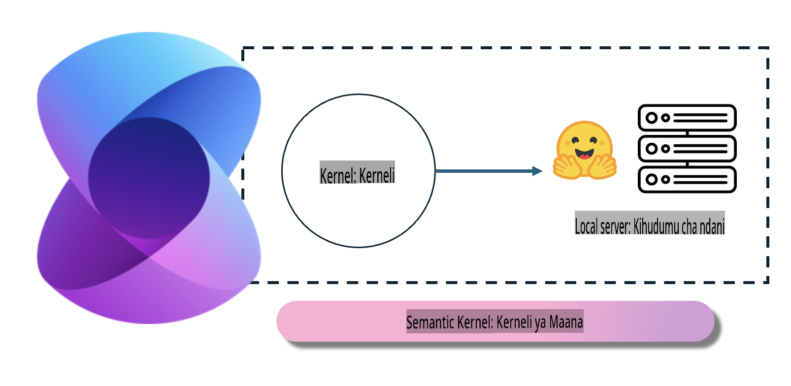
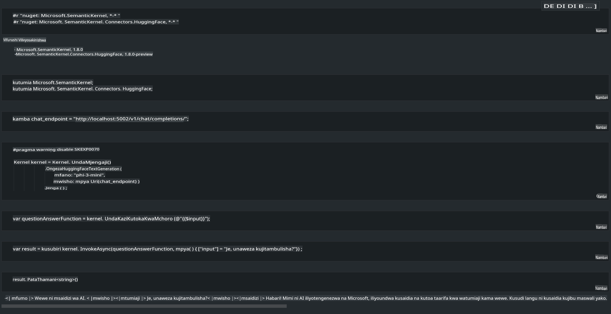

# **Inference Phi-3 katika Seva ya Ndani**

Tunaweza kupeleka Phi-3 kwenye seva ya ndani. Watumiaji wanaweza kuchagua suluhisho za [Ollama](https://ollama.com) au [LM Studio](https://llamaedge.com), au wanaweza kuandika msimbo wao wenyewe. Unaweza kuunganisha huduma za ndani za Phi-3 kupitia [Semantic Kernel](https://github.com/microsoft/semantic-kernel?WT.mc_id=aiml-138114-kinfeylo) au [Langchain](https://www.langchain.com/) ili kujenga programu za Copilot.

## **Kutumia Semantic Kernel kufikia Phi-3-mini**

Katika programu ya Copilot, tunaunda programu kupitia Semantic Kernel / LangChain. Mfumo huu wa programu kwa ujumla unalingana na Azure OpenAI Service / OpenAI models, na pia unaweza kusaidia modeli za chanzo huria kwenye Hugging Face na modeli za ndani. Tunapaswa kufanya nini ikiwa tunataka kutumia Semantic Kernel kufikia Phi-3-mini? Tukitumia .NET kama mfano, tunaweza kuichanganya na Hugging Face Connector ndani ya Semantic Kernel. Kwa chaguo-msingi, inaweza kuendana na id ya modeli kwenye Hugging Face (mara ya kwanza unapotumia, modeli itapakuliwa kutoka Hugging Face, ambayo huchukua muda mrefu). Unaweza pia kuunganisha kwenye huduma ya ndani iliyojengwa. Tukilinganisha kati ya hizo mbili, tunapendekeza kutumia njia ya pili kwa sababu ina kiwango cha juu cha uhuru, hasa katika programu za kibiashara.

Kutoka kwenye mchoro, kufikia huduma za ndani kupitia Semantic Kernel kunaweza kuunganisha kwa urahisi seva ya modeli ya Phi-3-mini iliyojengwa. Hapa kuna matokeo ya uendeshaji.

***Msimbo wa Mfano*** https://github.com/kinfey/Phi3MiniSamples/tree/main/semantickernel

**Kanusho**:  
Hati hii imetafsiriwa kwa kutumia huduma za kutafsiri za AI zinazotegemea mashine. Ingawa tunajitahidi kwa usahihi, tafadhali fahamu kuwa tafsiri za kiotomatiki zinaweza kuwa na makosa au kutokuwa sahihi. Hati ya asili katika lugha yake ya kiasili inapaswa kuchukuliwa kama chanzo rasmi. Kwa taarifa muhimu, tafsiri ya kitaalamu ya kibinadamu inapendekezwa. Hatutawajibika kwa kutoelewana au tafsiri zisizo sahihi zinazotokana na matumizi ya tafsiri hii.