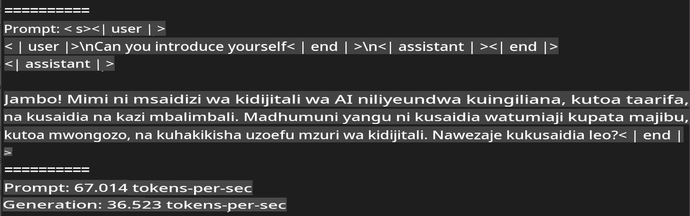
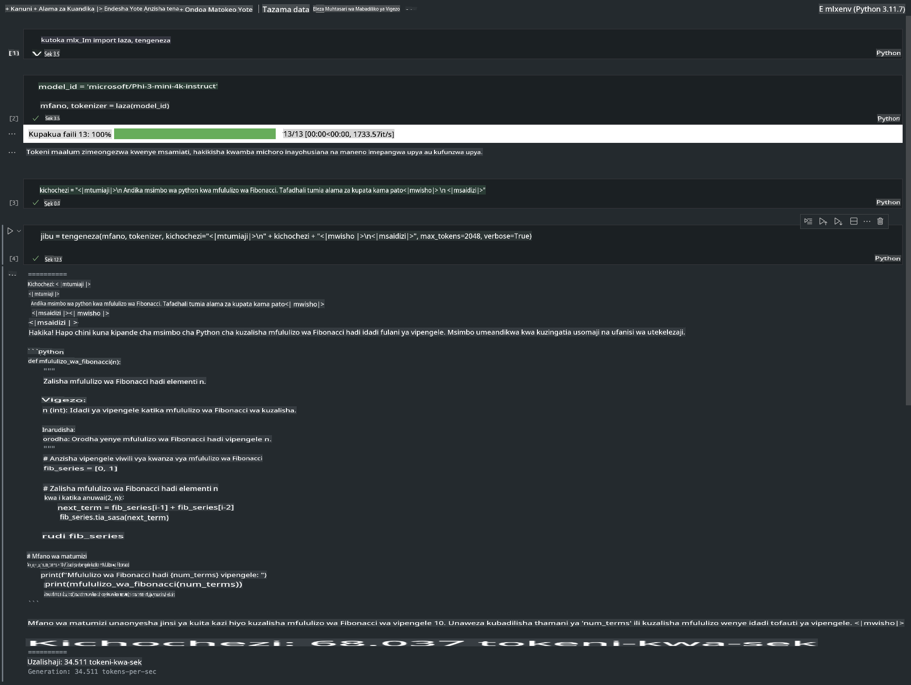

# **Kutumia Phi-3 na Mfumo wa Apple MLX**

## **MLX Framework ni nini**

MLX ni mfumo wa safu kwa ajili ya utafiti wa ujifunzaji wa mashine kwenye vifaa vya Apple silicon, unaotolewa na utafiti wa ujifunzaji wa mashine wa Apple.

MLX umetengenezwa na watafiti wa ujifunzaji wa mashine kwa ajili ya watafiti wa ujifunzaji wa mashine. Mfumo huu umekusudiwa kuwa rahisi kutumia, lakini bado unafaa kwa kufundisha na kutekeleza mifano. Ubunifu wa mfumo wenyewe pia ni rahisi kueleweka. Tunakusudia kuufanya uwe rahisi kwa watafiti kuupanua na kuuboresha MLX kwa lengo la kuchunguza haraka mawazo mapya.

LLMs zinaweza kuharakishwa kwenye vifaa vya Apple Silicon kupitia MLX, na mifano inaweza kuendeshwa kwa urahisi ndani ya kifaa chako.

## **Kutumia MLX kufanya inference ya Phi-3-mini**

### **1. Sanidi mazingira yako ya MLX**

1. Python 3.11.x  
2. Sakinisha Maktaba ya MLX  

```bash

pip install mlx-lm

```

### **2. Kuendesha Phi-3-mini kwenye Terminal kwa kutumia MLX**

```bash

python -m mlx_lm.generate --model microsoft/Phi-3-mini-4k-instruct --max-token 2048 --prompt  "<|user|>\nCan you introduce yourself<|end|>\n<|assistant|>"

```

Matokeo (mazingira yangu ni Apple M1 Max, 64GB) ni  



### **3. Kubadilisha Phi-3-mini kuwa Quantized kwa MLX kwenye Terminal**

```bash

python -m mlx_lm.convert --hf-path microsoft/Phi-3-mini-4k-instruct

```

***Kumbuka:*** Mfano unaweza kubadilishwa kuwa quantized kupitia mlx_lm.convert, na quantization ya chaguo-msingi ni INT4. Mfano huu unabadilisha Phi-3-mini kuwa INT4.

Mfano unaweza kubadilishwa kuwa quantized kupitia mlx_lm.convert, na quantization ya chaguo-msingi ni INT4. Mfano huu ni wa kubadilisha Phi-3-mini kuwa INT4. Baada ya quantization, utawekwa kwenye saraka ya chaguo-msingi ./mlx_model.

Tunaweza kujaribu mfano uliobadilishwa kwa MLX kutoka terminal.  

```bash

python -m mlx_lm.generate --model ./mlx_model/ --max-token 2048 --prompt  "<|user|>\nCan you introduce yourself<|end|>\n<|assistant|>"

```

Matokeo ni  


### **4. Kuendesha Phi-3-mini kwa MLX kwenye Jupyter Notebook**



***Kumbuka:*** Tafadhali soma mfano huu [bonyeza kiungo hiki](../../../../../code/03.Inference/MLX/MLX_DEMO.ipynb)

## **Rasilimali**

1. Jifunze kuhusu Mfumo wa Apple MLX [https://ml-explore.github.io](https://ml-explore.github.io/mlx/build/html/index.html)

2. Hifadhi ya GitHub ya Apple MLX [https://github.com/ml-explore](https://github.com/ml-explore)

**Kanusho:**  
Hati hii imetafsiriwa kwa kutumia huduma za tafsiri za mashine za AI. Ingawa tunajitahidi kwa usahihi, tafadhali fahamu kuwa tafsiri za kiotomatiki zinaweza kuwa na makosa au kutokuwa sahihi. Hati asili katika lugha yake ya awali inapaswa kuzingatiwa kama chanzo rasmi. Kwa taarifa muhimu, inashauriwa kutumia huduma za tafsiri za kibinadamu za kitaalamu. Hatutawajibika kwa kutokuelewana au tafsiri zisizo sahihi zinazotokana na matumizi ya tafsiri hii.