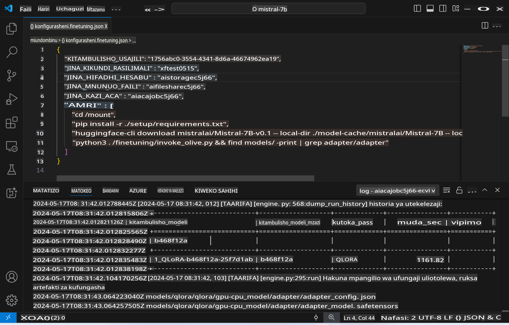
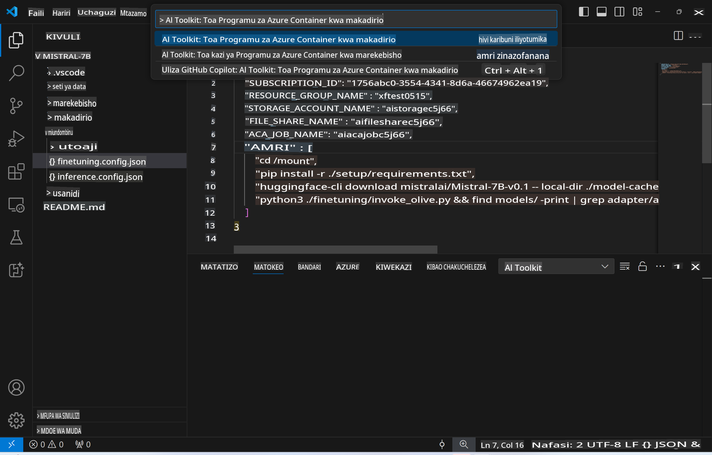
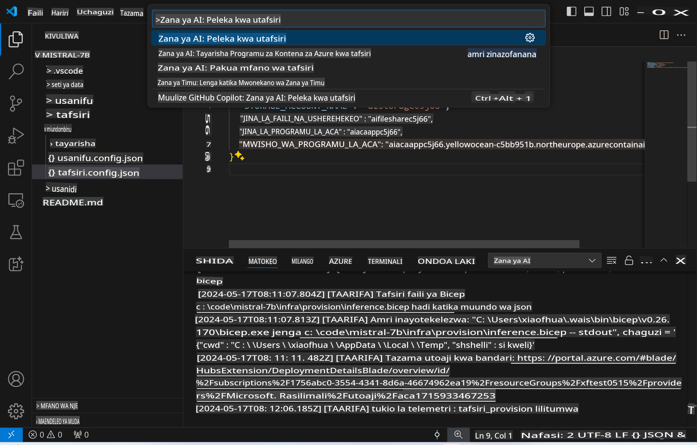
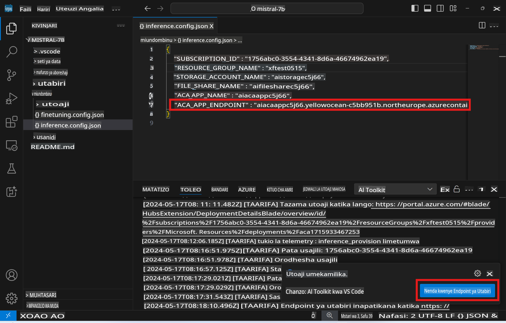

# Kufanya Uchanganuzi wa Mbali kwa Kutumia Modeli Iliyoboreshwa

Baada ya adapta kufundishwa katika mazingira ya mbali, tumia programu rahisi ya Gradio kuingiliana na modeli.



### Kuandaa Rasilimali za Azure
Unahitaji kuandaa Rasilimali za Azure kwa uchanganuzi wa mbali kwa kutekeleza `AI Toolkit: Provision Azure Container Apps for inference` kutoka kwenye menyu ya amri. Wakati wa mchakato huu, utaombwa kuchagua Usajili wako wa Azure na kikundi cha rasilimali.  


Kwa kawaida, usajili na kikundi cha rasilimali kwa uchanganuzi kinapaswa kufanana na vile vilivyotumika kwa uboreshaji. Uchanganuzi utatumia Mazingira sawa ya Azure Container App na kufikia modeli na adapta za modeli zilizohifadhiwa kwenye Azure Files, ambazo ziliundwa wakati wa hatua ya uboreshaji.

## Kutumia AI Toolkit

### Uwekaji kwa Uchanganuzi  
Ikiwa unataka kuhariri msimbo wa uchanganuzi au kupakia tena modeli ya uchanganuzi, tafadhali tekeleza amri ya `AI Toolkit: Deploy for inference`. Hii itasawazisha msimbo wako wa hivi karibuni na ACA na kuanzisha upya nakala.



Baada ya uwekaji kukamilika kwa mafanikio, modeli sasa iko tayari kutathminiwa kwa kutumia kiungo hiki.

### Kufikia API ya Uchanganuzi

Unaweza kufikia API ya uchanganuzi kwa kubofya kitufe cha "*Nenda kwa Kiungo cha Uchanganuzi*" kinachoonekana kwenye taarifa ya VSCode. Vinginevyo, kiungo cha API ya mtandao kinaweza kupatikana chini ya `ACA_APP_ENDPOINT` katika `./infra/inference.config.json` na kwenye jopo la matokeo.



> **Kumbuka:** Kiungo cha uchanganuzi kinaweza kuchukua dakika chache kuwa tayari kikamilifu.

## Vipengele vya Uchanganuzi Vilivyojumuishwa Kwenye Kiolezo

| Folda | Maudhui |
| ------ |--------- |
| `infra` | Inajumuisha mipangilio yote muhimu kwa shughuli za mbali. |
| `infra/provision/inference.parameters.json` | Ina vigezo vya templeti za bicep, vinavyotumika kuandaa rasilimali za Azure kwa uchanganuzi. |
| `infra/provision/inference.bicep` | Inajumuisha templeti za kuandaa rasilimali za Azure kwa uchanganuzi. |
| `infra/inference.config.json` | Faili ya mipangilio, iliyotengenezwa na amri ya `AI Toolkit: Provision Azure Container Apps for inference`. Inatumika kama pembejeo kwa menyu nyingine za amri za mbali. |

### Kutumia AI Toolkit kwa Kuandaa Rasilimali za Azure
Sanidi [AI Toolkit](https://marketplace.visualstudio.com/items?itemName=ms-windows-ai-studio.windows-ai-studio)

Andaa Azure Container Apps kwa uchanganuzi ` command.

You can find configuration parameters in `./infra/provision/inference.parameters.json` file. Here are the details:
| Parameter | Description |
| --------- |------------ |
| `defaultCommands` | This is the commands to initiate a web API. |
| `maximumInstanceCount` | This parameter sets the maximum capacity of GPU instances. |
| `location` | This is the location where Azure resources are provisioned. The default value is the same as the chosen resource group's location. |
| `storageAccountName`, `fileShareName` `acaEnvironmentName`, `acaEnvironmentStorageName`, `acaAppName`,  `acaLogAnalyticsName` | These parameters are used to name the Azure resources for provision. By default, they will be same to the fine-tuning resource name. You can input a new, unused resource name to create your own custom-named resources, or you can input the name of an already existing Azure resource if you'd prefer to use that. For details, refer to the section [Using existing Azure Resources](../../../../../md/01.Introduction/03). |

### Using Existing Azure Resources

By default, the inference provision use the same Azure Container App Environment, Storage Account, Azure File Share, and Azure Log Analytics that were used for fine-tuning. A separate Azure Container App is created solely for the inference API. 

If you have customized the Azure resources during the fine-tuning step or want to use your own existing Azure resources for inference, specify their names in the `./infra/inference.parameters.json` faili. Kisha, tekeleza amri ya `AI Toolkit: Provision Azure Container Apps for inference` kutoka kwenye menyu ya amri. Hii inasasisha rasilimali zozote zilizoainishwa na kuunda zile ambazo hazipo.

Kwa mfano, ikiwa tayari una mazingira ya kontena la Azure, faili yako `./infra/finetuning.parameters.json` inapaswa kuonekana hivi:

```json
{
    "$schema": "https://schema.management.azure.com/schemas/2019-04-01/deploymentParameters.json#",
    "contentVersion": "1.0.0.0",
    "parameters": {
      ...
      "acaEnvironmentName": {
        "value": "<your-aca-env-name>"
      },
      "acaEnvironmentStorageName": {
        "value": null
      },
      ...
    }
  }
```

### Uandaaji wa Mwongozo  
Ikiwa unapendelea kusanidi rasilimali za Azure mwenyewe, unaweza kutumia faili za bicep zilizotolewa katika `./infra/provision` folders. If you have already set up and configured all the Azure resources without using the AI Toolkit command palette, you can simply enter the resource names in the `inference.config.json` faili.

Kwa mfano:

```json
{
  "SUBSCRIPTION_ID": "<your-subscription-id>",
  "RESOURCE_GROUP_NAME": "<your-resource-group-name>",
  "STORAGE_ACCOUNT_NAME": "<your-storage-account-name>",
  "FILE_SHARE_NAME": "<your-file-share-name>",
  "ACA_APP_NAME": "<your-aca-name>",
  "ACA_APP_ENDPOINT": "<your-aca-endpoint>"
}
```

**Kanusho:**  
Hati hii imetafsiriwa kwa kutumia huduma za tafsiri za AI zinazotumia mashine. Ingawa tunajitahidi kuhakikisha usahihi, tafadhali fahamu kuwa tafsiri za kiotomatiki zinaweza kuwa na makosa au kutokuwa sahihi. Hati ya asili katika lugha yake ya kiasili inapaswa kuchukuliwa kuwa chanzo cha mamlaka. Kwa habari muhimu, inashauriwa kutumia tafsiri ya kitaalamu ya binadamu. Hatutawajibika kwa maelewano mabaya au tafsiri zisizo sahihi zinazotokana na matumizi ya tafsiri hii.