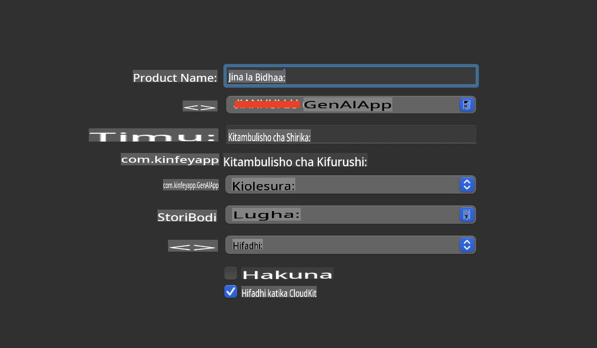
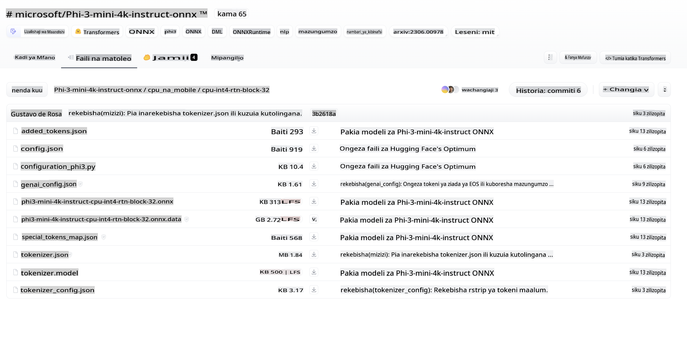
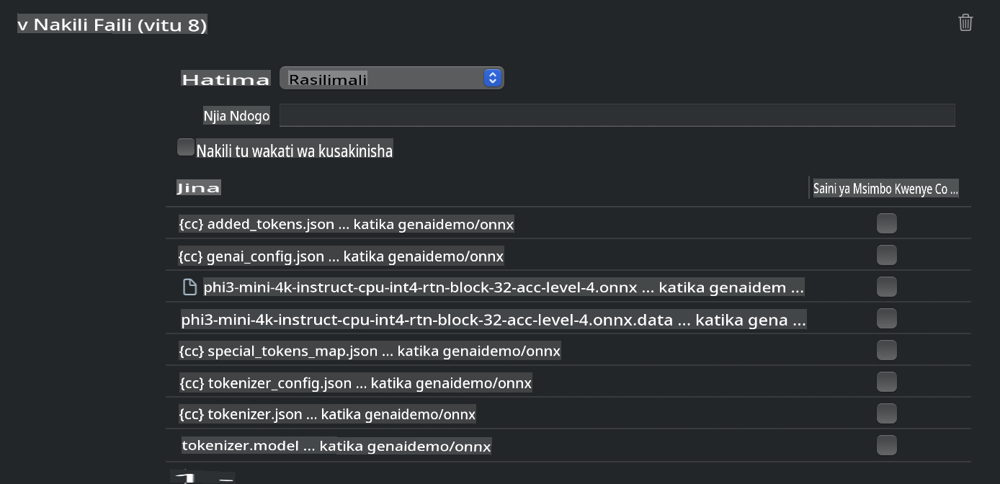
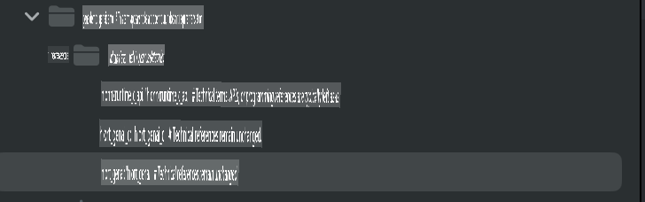
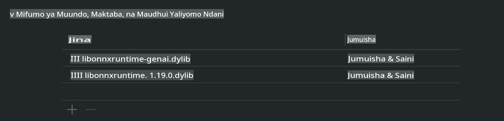
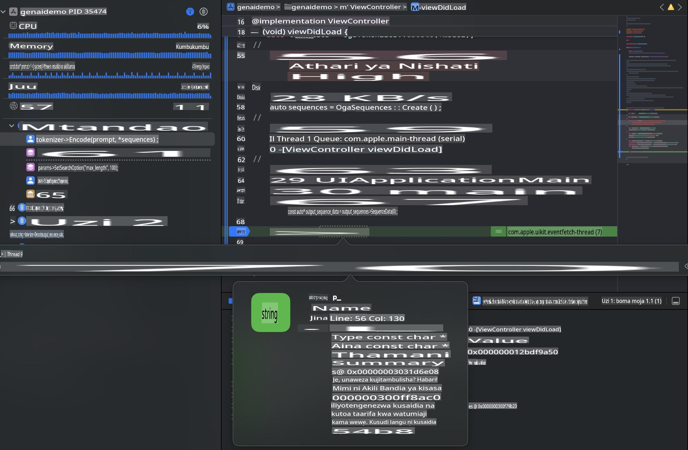

# **Inference Phi-3 kwenye iOS**

Phi-3-mini ni mfululizo mpya wa modeli kutoka Microsoft unaowezesha utekelezaji wa Large Language Models (LLMs) kwenye vifaa vya edge na vifaa vya IoT. Phi-3-mini inapatikana kwa iOS, Android, na vifaa vya Edge, ikiruhusu AI ya kizazi kutumika katika mazingira ya BYOD. Mfano ufuatao unaonyesha jinsi ya kutekeleza Phi-3-mini kwenye iOS.

## **1. Maandalizi**

- **a.** macOS 14+
- **b.** Xcode 15+
- **c.** iOS SDK 17.x (iPhone 14 A16 au zaidi)
- **d.** Sakinisha Python 3.10+ (Inapendekezwa kutumia Conda)
- **e.** Sakinisha maktaba ya Python: `python-flatbuffers`
- **f.** Sakinisha CMake

### Semantic Kernel na Inference

Semantic Kernel ni mfumo wa programu unaokuwezesha kuunda programu zinazooana na Azure OpenAI Service, modeli za OpenAI, na hata modeli za ndani. Kupitia Semantic Kernel, unaweza kufikia huduma za ndani kwa urahisi na kuunganisha na seva yako mwenyewe ya modeli ya Phi-3-mini.

### Kuita Modeli Zilizopunguzwa kwa Ollama au LlamaEdge

Watumiaji wengi wanapendelea kutumia modeli zilizopunguzwa ili kuendesha modeli ndani ya nchi. [Ollama](https://ollama.com) na [LlamaEdge](https://llamaedge.com) zinakuruhusu kuita modeli tofauti zilizopunguzwa:

#### **Ollama**

Unaweza kuendesha `ollama run phi3` moja kwa moja au kuisanidi nje ya mtandao. Tengeneza Modelfile na njia ya faili yako ya `gguf`. Mfano wa msimbo wa kuendesha modeli iliyopunguzwa ya Phi-3-mini:

```gguf
FROM {Add your gguf file path}
TEMPLATE \"\"\"<|user|> .Prompt<|end|> <|assistant|>\"\"\"
PARAMETER stop <|end|>
PARAMETER num_ctx 4096
```

#### **LlamaEdge**

Ikiwa unataka kutumia `gguf` kwenye vifaa vya wingu na edge kwa wakati mmoja, LlamaEdge ni chaguo zuri.

## **2. Kukusanya ONNX Runtime kwa iOS**

```bash

git clone https://github.com/microsoft/onnxruntime.git

cd onnxruntime

./build.sh --build_shared_lib --ios --skip_tests --parallel --build_dir ./build_ios --ios --apple_sysroot iphoneos --osx_arch arm64 --apple_deploy_target 17.5 --cmake_generator Xcode --config Release

cd ../

```

### **Angalizo**

- **a.** Kabla ya kukusanya, hakikisha kuwa Xcode imewekwa vizuri na iwekwe kama eneo kazi la msanidi programu kwenye terminal:

    ```bash
    sudo xcode-select -switch /Applications/Xcode.app/Contents/Developer
    ```

- **b.** ONNX Runtime inahitaji kukusanywa kwa majukwaa tofauti. Kwa iOS, unaweza kukusanya kwa `arm64` or `x86_64`.

- **c.** Inapendekezwa kutumia iOS SDK ya hivi karibuni kwa ajili ya kukusanya. Hata hivyo, unaweza pia kutumia toleo la zamani ikiwa unahitaji utangamano na SDK za awali.

## **3. Kukusanya Generative AI na ONNX Runtime kwa iOS**

> **Angalizo:** Kwa kuwa Generative AI na ONNX Runtime bado iko katika awamu ya majaribio, tafadhali fahamu mabadiliko yanayoweza kutokea.

```bash

git clone https://github.com/microsoft/onnxruntime-genai
 
cd onnxruntime-genai
 
mkdir ort
 
cd ort
 
mkdir include
 
mkdir lib
 
cd ../
 
cp ../onnxruntime/include/onnxruntime/core/session/onnxruntime_c_api.h ort/include
 
cp ../onnxruntime/build_ios/Release/Release-iphoneos/libonnxruntime*.dylib* ort/lib
 
export OPENCV_SKIP_XCODEBUILD_FORCE_TRYCOMPILE_DEBUG=1
 
python3 build.py --parallel --build_dir ./build_ios --ios --ios_sysroot iphoneos --ios_arch arm64 --ios_deployment_target 17.5 --cmake_generator Xcode --cmake_extra_defines CMAKE_XCODE_ATTRIBUTE_CODE_SIGNING_ALLOWED=NO

```

## **4. Unda programu ya App kwenye Xcode**

Nilichagua Objective-C kama mbinu ya maendeleo ya App, kwa sababu kutumia Generative AI na ONNX Runtime C++ API, Objective-C ina utangamano bora. Bila shaka, unaweza pia kukamilisha miito inayohusiana kupitia Swift bridging.



## **5. Nakili modeli ya ONNX iliyopunguzwa INT4 kwenye mradi wa programu ya App**

Tunapaswa kuingiza modeli ya INT4 ya quantization katika muundo wa ONNX, ambayo inahitaji kupakuliwa kwanza.



Baada ya kupakua, unahitaji kuiweka kwenye saraka ya Resources ya mradi kwenye Xcode.



## **6. Kuongeza C++ API kwenye ViewControllers**

> **Angalizo:**

- **a.** Ongeza faili za kichwa za C++ zinazohusiana kwenye mradi.

  

- **b.** Jumuisha `onnxruntime-genai` dynamic library in Xcode.

  

- **c.** Use the C Samples code for testing. You can also add additional features like ChatUI for more functionality.

- **d.** Since you need to use C++ in your project, rename `ViewController.m` to `ViewController.mm` ili kuwezesha msaada wa Objective-C++.

```objc

    NSString *llmPath = [[NSBundle mainBundle] resourcePath];
    char const *modelPath = llmPath.cString;

    auto model =  OgaModel::Create(modelPath);

    auto tokenizer = OgaTokenizer::Create(*model);

    const char* prompt = "<|system|>You are a helpful AI assistant.<|end|><|user|>Can you introduce yourself?<|end|><|assistant|>";

    auto sequences = OgaSequences::Create();
    tokenizer->Encode(prompt, *sequences);

    auto params = OgaGeneratorParams::Create(*model);
    params->SetSearchOption("max_length", 100);
    params->SetInputSequences(*sequences);

    auto output_sequences = model->Generate(*params);
    const auto output_sequence_length = output_sequences->SequenceCount(0);
    const auto* output_sequence_data = output_sequences->SequenceData(0);
    auto out_string = tokenizer->Decode(output_sequence_data, output_sequence_length);
    
    auto tmp = out_string;

```

## **7. Kuendesha Programu**

Mara baada ya usanidi kukamilika, unaweza kuendesha programu ili kuona matokeo ya inference ya modeli ya Phi-3-mini.



Kwa msimbo wa ziada wa mfano na maelekezo ya kina, tembelea [Phi-3 Mini Samples repository](https://github.com/Azure-Samples/Phi-3MiniSamples/tree/main/ios).

**Kanusho:**  
Hati hii imetafsiriwa kwa kutumia huduma za kutafsiri za AI zinazotegemea mashine. Ingawa tunajitahidi kwa usahihi, tafadhali fahamu kuwa tafsiri za kiotomatiki zinaweza kuwa na makosa au kutokuwa sahihi. Hati ya asili katika lugha yake ya awali inapaswa kuchukuliwa kama chanzo cha mamlaka. Kwa taarifa muhimu, inashauriwa kutumia huduma za watafsiri wa kibinadamu wenye ujuzi. Hatutawajibika kwa kutoelewana au tafsiri zisizo sahihi zinazotokana na matumizi ya tafsiri hii.