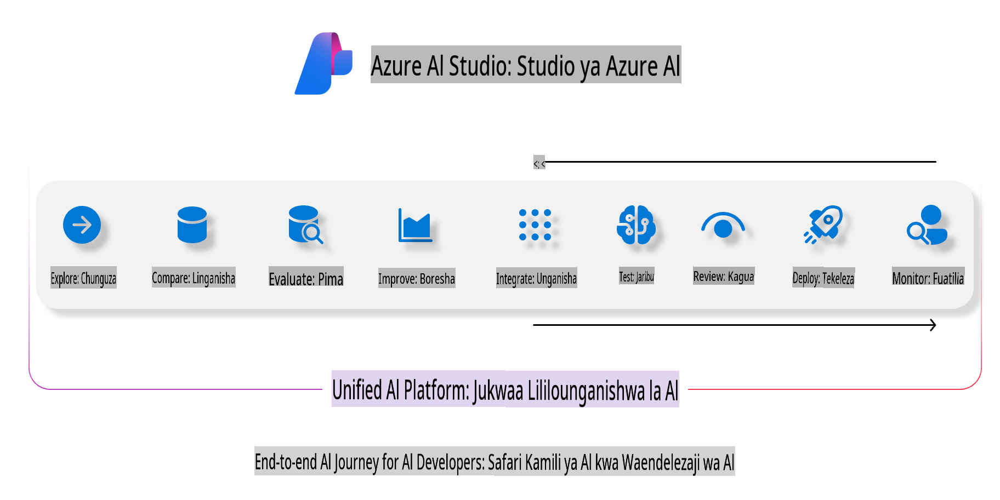
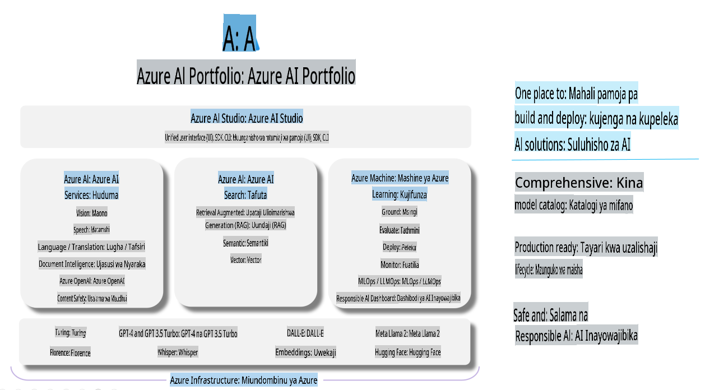

# **Kutumia Azure AI Foundry kwa tathmini**

Jinsi ya kutathmini programu yako ya AI generative kwa kutumia [Azure AI Foundry](https://ai.azure.com?WT.mc_id=aiml-138114-kinfeylo). Iwe unakagua mazungumzo ya mzunguko mmoja au wa mizunguko mingi, Azure AI Foundry inatoa zana za kutathmini utendaji na usalama wa modeli. 

## Jinsi ya kutathmini programu za AI generative kwa Azure AI Foundry
Kwa maelezo zaidi, angalia [Hati za Azure AI Foundry](https://learn.microsoft.com/azure/ai-studio/how-to/evaluate-generative-ai-app?WT.mc_id=aiml-138114-kinfeylo)

Hapa kuna hatua za kuanza:

## Kutathmini Modeli za AI Generative kwenye Azure AI Foundry

**Mahitaji ya Awali**

- Seti ya data ya majaribio katika umbizo la CSV au JSON.
- Modeli ya AI generative iliyowekwa (kama vile Phi-3, GPT 3.5, GPT 4, au modeli za Davinci).
- Mazingira ya kukimbia na mfano wa hesabu ili kuendesha tathmini.

## Vipimo vya Tathmini Vilivyojengwa Ndani

Azure AI Foundry hukuwezesha kutathmini mazungumzo ya mzunguko mmoja na yale ya mizunguko mingi, yenye changamoto zaidi.
Kwa hali za Retrieval Augmented Generation (RAG), ambapo modeli inategemea data maalum, unaweza kutathmini utendaji kwa kutumia vipimo vya tathmini vilivyojengwa ndani.
Zaidi ya hayo, unaweza kutathmini hali za kawaida za kujibu maswali ya mzunguko mmoja (zisizo za RAG).

## Kuunda Mchakato wa Tathmini

Kutoka kwenye UI ya Azure AI Foundry, nenda kwenye ukurasa wa Evaluate au Prompt Flow.
Fuata mwongozo wa uundaji wa tathmini ili kuanzisha mchakato wa tathmini. Toa jina la hiari kwa tathmini yako.
Chagua hali inayolingana na malengo ya programu yako.
Chagua kipimo kimoja au zaidi cha tathmini ili kutathmini matokeo ya modeli.

## Mchakato wa Tathmini Maalum (Hiari)

Kwa kubadilika zaidi, unaweza kuanzisha mchakato wa tathmini maalum. Badilisha mchakato wa tathmini kulingana na mahitaji yako maalum.

## Kutazama Matokeo

Baada ya kuendesha tathmini, ingia, tazama, na uchanganue vipimo vya tathmini kwa kina kwenye Azure AI Foundry. Pata maarifa kuhusu uwezo na mapungufu ya programu yako.

**Kumbuka** Azure AI Foundry kwa sasa iko kwenye hakikisho la umma, kwa hivyo itumie kwa madhumuni ya majaribio na maendeleo. Kwa kazi za uzalishaji, zingatia chaguo zingine. Chunguza [hati rasmi za AI Foundry](https://learn.microsoft.com/azure/ai-studio/?WT.mc_id=aiml-138114-kinfeylo) kwa maelezo zaidi na maelekezo ya hatua kwa hatua.

**Kanusho**:  
Hati hii imetafsiriwa kwa kutumia huduma za tafsiri za AI zinazotegemea mashine. Ingawa tunajitahidi kuhakikisha usahihi, tafadhali fahamu kuwa tafsiri za kiotomatiki zinaweza kuwa na makosa au kutokuwepo kwa usahihi. Hati asilia katika lugha yake ya awali inapaswa kuzingatiwa kama chanzo cha mamlaka. Kwa taarifa muhimu, tafsiri ya kibinadamu ya kitaalamu inapendekezwa. Hatutawajibika kwa kutoelewana au tafsiri potofu zinazotokana na matumizi ya tafsiri hii.