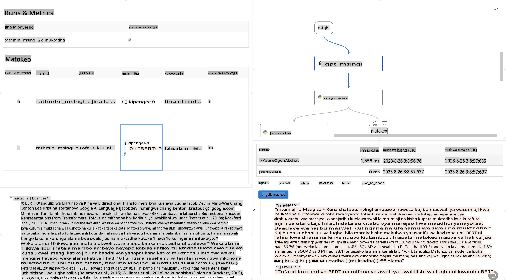

# **Tambulisha Promptflow**

[Microsoft Prompt Flow](https://microsoft.github.io/promptflow/index.html?WT.mc_id=aiml-138114-kinfeylo) ni chombo cha kuona cha kiotomatiki kinachoruhusu watumiaji kuunda michakato ya kiotomatiki kwa kutumia templeti zilizojengwa tayari na viunganishi maalum. Imeundwa kuwezesha wasanidi programu na wachambuzi wa biashara kujenga haraka michakato ya kiotomatiki kwa kazi kama usimamizi wa data, ushirikiano, na uboreshaji wa mchakato. Kwa kutumia Prompt Flow, watumiaji wanaweza kuunganisha huduma, programu, na mifumo tofauti kwa urahisi, na kuendesha michakato changamano ya biashara kiotomatiki.

Microsoft Prompt Flow imeundwa kurahisisha mzunguko mzima wa maendeleo ya programu za AI zinazoendeshwa na Large Language Models (LLMs). Iwe unabuni, unafanya majaribio, unakagua, au unapeleka programu za LLM, Prompt Flow hurahisisha mchakato na hukuwezesha kujenga programu za LLM zenye ubora wa uzalishaji.

## Hizi hapa ni sifa kuu na faida za kutumia Microsoft Prompt Flow:

**Uzoefu wa Uandishi wa Kuingiliana**

Prompt Flow hutoa mwonekano wa kimuundo wa mtiririko wako, na kufanya iwe rahisi kuelewa na kuvinjari miradi yako.  
Inatoa uzoefu wa uandishi wa kanuni kama daftari kwa maendeleo na urekebishaji wa mtiririko kwa ufanisi.

**Toleo la Vidokezo na Uboreshaji**

Unda na linganisha matoleo tofauti ya vidokezo ili kuwezesha mchakato wa uboreshaji wa hatua kwa hatua.  
Kagua utendaji wa vidokezo tofauti na uchague vyenye ufanisi zaidi.

**Mtiririko wa Tathmini Uliojengwa Ndani**  
Pima ubora na ufanisi wa vidokezo na mtiririko wako kwa kutumia zana za tathmini zilizojengwa ndani.  
Elewa jinsi programu zako za msingi wa LLM zinavyofanya kazi.

**Rasilimali Kamili**

Prompt Flow inajumuisha maktaba ya zana, sampuli, na templeti zilizojengwa ndani.  
Rasilimali hizi ni sehemu ya kuanzia maendeleo, kuchochea ubunifu, na kuharakisha mchakato.

**Ushirikiano na Utayari wa Biashara**

Saidia ushirikiano wa timu kwa kuruhusu watumiaji wengi kufanya kazi pamoja kwenye miradi ya uhandisi wa vidokezo.  
Dhibiti matoleo na shiriki maarifa kwa ufanisi.  
Rahisisha mchakato mzima wa uhandisi wa vidokezo, kutoka maendeleo na tathmini hadi upelekaji na ufuatiliaji.

## Tathmini katika Prompt Flow  

Katika Microsoft Prompt Flow, tathmini ina jukumu muhimu katika kupima jinsi mifano yako ya AI inavyofanya kazi. Hebu tuchunguze jinsi unavyoweza kubinafsisha mitiririko ya tathmini na vipimo ndani ya Prompt Flow:

**Kuelewa Tathmini katika Prompt Flow**

Katika Prompt Flow, mtiririko unawakilisha mlolongo wa nodi zinazochakata pembejeo na kutoa matokeo.  
Mtiririko wa tathmini ni aina maalum ya mtiririko iliyoundwa kupima utendaji wa mchakato kulingana na vigezo na malengo maalum.

**Sifa kuu za mitiririko ya tathmini**

Kwa kawaida huendeshwa baada ya mtiririko unaojaribiwa, kwa kutumia matokeo yake.  
Hupima alama au vipimo ili kupima utendaji wa mtiririko uliopimwa.  
Vipimo vinaweza kujumuisha usahihi, alama za umuhimu, au vipimo vingine vinavyofaa.

### Kubinafsisha Mitiririko ya Tathmini

**Kufafanua Pembejeo**

Mitiririko ya tathmini inahitaji kuchukua matokeo ya mchakato unaojaribiwa.  
Fafanua pembejeo kwa njia sawa na mitiririko ya kawaida.  
Kwa mfano, ikiwa unakagua mtiririko wa QnA, taja pembejeo kama "jibu."  
Ikiwa unakagua mtiririko wa uainishaji, taja pembejeo kama "kategoria."  
Pembejeo za ukweli wa msingi (mfano, lebo halisi) pia zinaweza kuhitajika.

**Matokeo na Vipimo**

Mitiririko ya tathmini huzalisha matokeo yanayopima utendaji wa mtiririko uliopimwa.  
Vipimo vinaweza kuhesabiwa kwa kutumia Python au LLM (Large Language Models).  
Tumia kazi ya log_metric() kurekodi vipimo vinavyohusika.

**Kutumia Mitiririko ya Tathmini Iliyobinafsishwa**

Tengeneza mtiririko wako wa tathmini kulingana na kazi zako maalum na malengo.  
Binafsisha vipimo kulingana na malengo yako ya tathmini.  
Tumia mtiririko huu wa tathmini kwa mizunguko ya kundi kwa majaribio ya kiwango kikubwa.

## Njia za Tathmini Zilizojengwa Ndani  

Prompt Flow pia inatoa njia za tathmini zilizojengwa ndani.  
Unaweza kuwasilisha mizunguko ya kundi na kutumia njia hizi kupima jinsi mtiririko wako unavyofanya kazi na seti kubwa za data.  
Angalia matokeo ya tathmini, linganisha vipimo, na fanya maboresho inapohitajika.  
Kumbuka, tathmini ni muhimu kuhakikisha mifano yako ya AI inakidhi vigezo na malengo yaliyotarajiwa.  
Chunguza nyaraka rasmi kwa maelekezo ya kina kuhusu jinsi ya kuendeleza na kutumia mitiririko ya tathmini ndani ya Microsoft Prompt Flow.

Kwa muhtasari, Microsoft Prompt Flow huwapa wasanidi programu uwezo wa kuunda programu za LLM zenye ubora wa hali ya juu kwa kurahisisha uhandisi wa vidokezo na kutoa mazingira dhabiti ya maendeleo. Ikiwa unafanya kazi na LLMs, Prompt Flow ni zana ya thamani kuchunguza. Chunguza [Nyaraka za Tathmini za Prompt Flow](https://learn.microsoft.com/azure/machine-learning/prompt-flow/how-to-develop-an-evaluation-flow?view=azureml-api-2?WT.mc_id=aiml-138114-kinfeylo) kwa maelekezo ya kina juu ya kuendeleza na kutumia mitiririko ya tathmini ndani ya Microsoft Prompt Flow.

**Kanusho**:  
Hati hii imetafsiriwa kwa kutumia huduma za tafsiri za kiotomatiki zinazotegemea AI. Ingawa tunajitahidi kwa usahihi, tafadhali fahamu kuwa tafsiri za kiotomatiki zinaweza kuwa na makosa au kutokuwa sahihi. Hati asilia katika lugha yake ya awali inapaswa kuzingatiwa kama chanzo cha kuaminika. Kwa taarifa muhimu, inashauriwa kutumia huduma za utafsiri wa kibinadamu wa kitaalamu. Hatutawajibika kwa kutoelewana au tafsiri potofu zinazotokana na matumizi ya tafsiri hii.