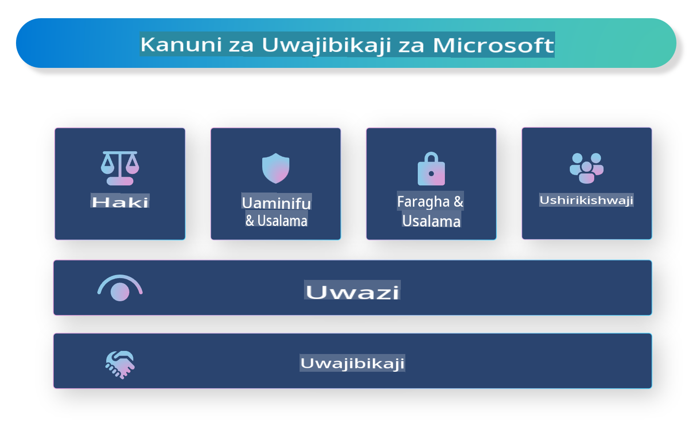

# **Tambulisha AI Inayowajibika**

[Microsoft Responsible AI](https://www.microsoft.com/ai/responsible-ai?WT.mc_id=aiml-138114-kinfeylo) ni mpango unaolenga kusaidia watengenezaji na mashirika kujenga mifumo ya AI ambayo ni wazi, inayotegemewa, na inayowajibika. Mpango huu hutoa mwongozo na rasilimali kwa ajili ya kuunda suluhisho za AI zinazowajibika zinazolingana na kanuni za kimaadili, kama faragha, usawa, na uwazi. Tutachunguza pia changamoto na mbinu bora zinazohusiana na ujenzi wa mifumo ya AI inayowajibika.

## Muhtasari wa Microsoft Responsible AI 

**Kanuni za kimaadili** 

Microsoft Responsible AI inaongozwa na seti ya kanuni za kimaadili, kama faragha, usawa, uwazi, uwajibikaji, na usalama. Kanuni hizi zimeundwa ili kuhakikisha kwamba mifumo ya AI inatengenezwa kwa njia ya kimaadili na inayowajibika.

**AI yenye uwazi**

Microsoft Responsible AI inasisitiza umuhimu wa uwazi katika mifumo ya AI. Hii inajumuisha kutoa maelezo ya wazi kuhusu jinsi mifano ya AI inavyofanya kazi, pamoja na kuhakikisha kuwa vyanzo vya data na algorithimu vinapatikana kwa umma.

**AI inayowajibika** 

[Microsoft Responsible AI](https://www.microsoft.com/ai/responsible-ai?WT.mc_id=aiml-138114-kinfeylo) inahimiza maendeleo ya mifumo ya AI inayowajibika, ambayo inaweza kutoa maarifa kuhusu jinsi mifano ya AI inavyofanya maamuzi. Hii inaweza kusaidia watumiaji kuelewa na kuamini matokeo ya mifumo ya AI.

**Kujumuisha wote** 

Mifumo ya AI inapaswa kubuniwa kwa manufaa ya kila mtu. Microsoft inalenga kuunda AI jumuishi inayozingatia mitazamo mbalimbali na kuepuka upendeleo au ubaguzi.

**Utegemevu na Usalama**

 Kuhakikisha kwamba mifumo ya AI ni ya kutegemewa na salama ni jambo muhimu. Microsoft inazingatia kujenga mifano imara inayofanya kazi kwa uthabiti na kuepuka matokeo mabaya.

**Usawa katika AI** 

Microsoft Responsible AI inatambua kwamba mifumo ya AI inaweza kuendeleza upendeleo ikiwa imefunzwa kwa data au algorithimu zenye upendeleo. Mpango huu hutoa mwongozo wa kuunda mifumo ya AI yenye usawa ambayo haibagui kwa misingi kama rangi, jinsia, au umri.

**Faragha na usalama** 

Microsoft Responsible AI inasisitiza umuhimu wa kulinda faragha ya watumiaji na usalama wa data katika mifumo ya AI. Hii inajumuisha utekelezaji wa usimbaji wa data wenye nguvu na udhibiti wa ufikiaji, pamoja na kufanya ukaguzi wa mara kwa mara wa mifumo ya AI kwa udhaifu.

**Uwajibikaji na jukumu** 

Microsoft Responsible AI inahimiza uwajibikaji na jukumu katika maendeleo na matumizi ya AI. Hii inajumuisha kuhakikisha kuwa watengenezaji na mashirika yanatambua hatari zinazoweza kuambatana na mifumo ya AI, na kuchukua hatua za kupunguza hatari hizo.

## Mbinu bora za kujenga mifumo ya AI inayowajibika

**Tengeneza mifano ya AI kwa kutumia seti za data mbalimbali** 

Ili kuepuka upendeleo katika mifumo ya AI, ni muhimu kutumia seti za data mbalimbali zinazowakilisha mitazamo na uzoefu tofauti.

**Tumia mbinu za AI zinazoeleweka** 

Mbinu za AI zinazoeleweka zinaweza kusaidia watumiaji kuelewa jinsi mifano ya AI inavyofanya maamuzi, jambo ambalo linaweza kuongeza uaminifu kwenye mfumo.

**Fanya ukaguzi wa mara kwa mara wa mifumo ya AI kwa udhaifu** 

Ukaguzi wa mara kwa mara wa mifumo ya AI unaweza kusaidia kutambua hatari na udhaifu unaohitaji kushughulikiwa.

**Tekeleza usimbaji wa data wenye nguvu na udhibiti wa ufikiaji** 

Usimbaji wa data na udhibiti wa ufikiaji vinaweza kusaidia kulinda faragha na usalama wa watumiaji katika mifumo ya AI.

**Fuata kanuni za kimaadili katika maendeleo ya AI** 

Kufuata kanuni za kimaadili, kama usawa, uwazi, na uwajibikaji, kunaweza kusaidia kujenga uaminifu katika mifumo ya AI na kuhakikisha kuwa inatengenezwa kwa njia inayowajibika.

## Kutumia AI Foundry kwa AI Inayowajibika 

[Azure AI Foundry](https://ai.azure.com?WT.mc_id=aiml-138114-kinfeylo) ni jukwaa lenye nguvu linalowezesha watengenezaji na mashirika kuunda haraka programu za kisasa, zenye akili, zinazowajibika, na tayari kwa soko. Hizi hapa ni baadhi ya vipengele na uwezo muhimu wa Azure AI Foundry:

**APIs na Mifano Iliyotayarishwa Tayari** 

Azure AI Foundry inatoa APIs na mifano iliyojengwa tayari na inayoweza kubadilishwa. Hii inashughulikia kazi mbalimbali za AI, ikijumuisha AI ya kizazi, usindikaji wa lugha asilia kwa mazungumzo, utafutaji, ufuatiliaji, tafsiri, sauti, maono, na maamuzi.

**Prompt Flow** 

Prompt flow katika Azure AI Foundry hukuwezesha kuunda uzoefu wa AI wa mazungumzo. Inakuruhusu kubuni na kusimamia mchakato wa mazungumzo, na kufanya iwe rahisi kujenga chatbots, wasaidizi pepe, na programu zingine za maingiliano.

**Retrieval Augmented Generation (RAG)** 

RAG ni mbinu inayochanganya njia za utafutaji na kizazi. Inaboresha ubora wa majibu yanayotolewa kwa kutumia maarifa yaliyopo (utafutaji) na kizazi cha ubunifu (kizazi).

**Metriki za Tathmini na Ufuatiliaji kwa AI ya Kizazi** 

Azure AI Foundry inatoa zana za kutathmini na kufuatilia mifano ya AI ya kizazi. Unaweza kutathmini utendaji wake, usawa, na metriki nyingine muhimu ili kuhakikisha matumizi yanayowajibika. Aidha, ikiwa umeunda dashibodi, unaweza kutumia UI isiyo na msimbo katika Azure Machine Learning Studio kubinafsisha na kuunda Dashibodi ya AI Inayowajibika na kadi ya alama inayohusiana kulingana na [Responsible AI Toolbox](https://responsibleaitoolbox.ai/?WT.mc_id=aiml-138114-kinfeylo) Python Libraries. Kadi hii ya alama hukusaidia kushiriki maarifa muhimu yanayohusiana na usawa, umuhimu wa vipengele, na mambo mengine ya matumizi yanayowajibika kwa wadau wa kiufundi na wasiokuwa wa kiufundi.

Ili kutumia AI Foundry kwa AI inayowajibika, unaweza kufuata mbinu hizi bora:

**Taja tatizo na malengo ya mfumo wako wa AI**

Kabla ya kuanza mchakato wa maendeleo, ni muhimu kufafanua wazi tatizo au lengo ambalo mfumo wako wa AI unalenga kutatua. Hii itakusaidia kutambua data, algorithimu, na rasilimali zinazohitajika kujenga mfano bora.

**Kusanya na kuchakata data husika** 

Ubora na wingi wa data inayotumika katika kufundisha mfumo wa AI vinaweza kuwa na athari kubwa kwenye utendaji wake. Kwa hivyo, ni muhimu kukusanya data husika, kuisafisha, kuichakata, na kuhakikisha kuwa inawakilisha idadi ya watu au tatizo unalolenga kutatua.

**Chagua tathmini inayofaa** 

Kuna algorithimu mbalimbali za tathmini zinazopatikana. Ni muhimu kuchagua algorithimu inayofaa zaidi kulingana na data yako na tatizo.

**Tathmini na tafsiri mfano** 

Baada ya kujenga mfano wa AI, ni muhimu kutathmini utendaji wake kwa kutumia metriki zinazofaa na kutafsiri matokeo kwa uwazi. Hii itakusaidia kutambua upendeleo au mapungufu yoyote kwenye mfano na kufanya maboresho inapohitajika.

**Hakikisha uwazi na kueleweka** 

Mifumo ya AI inapaswa kuwa wazi na kueleweka ili watumiaji waweze kuelewa jinsi inavyofanya kazi na jinsi maamuzi yanavyotolewa. Hili ni muhimu hasa kwa programu zinazokuwa na athari kubwa kwenye maisha ya watu, kama huduma za afya, fedha, na mifumo ya sheria.

**Fuatilia na sasisha mfano** 

Mifumo ya AI inapaswa kufuatiliwa na kusasishwa mara kwa mara ili kuhakikisha kuwa inabaki sahihi na yenye ufanisi kwa muda. Hii inahitaji matengenezo endelevu, majaribio, na mafunzo upya ya mfano.

Kwa kumalizia, Microsoft Responsible AI ni mpango unaolenga kusaidia watengenezaji na mashirika kujenga mifumo ya AI ambayo ni wazi, inayotegemewa, na inayowajibika. Kumbuka kuwa utekelezaji wa AI inayowajibika ni muhimu, na Azure AI Foundry inalenga kuifanya iwe rahisi kwa mashirika. Kwa kufuata kanuni za kimaadili na mbinu bora, tunaweza kuhakikisha kuwa mifumo ya AI inatengenezwa na kutumika kwa njia inayowajibika ambayo inanufaisha jamii kwa ujumla.

**Kanusho**:  
Hati hii imetafsiriwa kwa kutumia huduma za tafsiri za AI zinazotegemea mashine. Ingawa tunajitahidi kwa usahihi, tafadhali fahamu kuwa tafsiri za kiotomatiki zinaweza kuwa na makosa au kutokuwa sahihi. Hati ya asili katika lugha yake ya awali inapaswa kuzingatiwa kama chanzo rasmi. Kwa taarifa muhimu, tafsiri ya kibinadamu ya kitaalamu inapendekezwa. Hatutawajibika kwa kutoelewana au tafsiri zisizo sahihi zinazotokana na matumizi ya tafsiri hii.