# Kutathmini Modeli Iliyoboreshwa ya Phi-3 / Phi-3.5 Katika Azure AI Foundry kwa Kuzingatia Kanuni za Microsoft za AI Inayowajibika

Mfano huu wa mwisho hadi mwisho (E2E) unategemea mwongozo "[Kutathmini Modeli Iliyoboreshwa ya Phi-3 / 3.5 Katika Azure AI Foundry kwa Kuzingatia AI Inayowajibika ya Microsoft](https://techcommunity.microsoft.com/t5/educator-developer-blog/evaluate-fine-tuned-phi-3-3-5-models-in-azure-ai-studio-focusing/ba-p/4227850?WT.mc_id=aiml-137032-kinfeylo)" kutoka kwa Jumuiya ya Microsoft Tech.

## Muhtasari

### Unawezaje kutathmini usalama na utendaji wa modeli iliyoboreshwa ya Phi-3 / Phi-3.5 katika Azure AI Foundry?

Kuboresha modeli kunaweza mara nyingine kusababisha majibu yasiyotarajiwa au yasiyotakiwa. Ili kuhakikisha kuwa modeli inabaki salama na yenye ufanisi, ni muhimu kutathmini uwezo wake wa kutoa maudhui hatarishi na uwezo wake wa kutoa majibu sahihi, yanayofaa, na yenye mshikamano. Katika mafunzo haya, utajifunza jinsi ya kutathmini usalama na utendaji wa modeli iliyoboreshwa ya Phi-3 / Phi-3.5 iliyounganishwa na Prompt flow katika Azure AI Foundry.

Hapa kuna mchakato wa tathmini wa Azure AI Foundry.

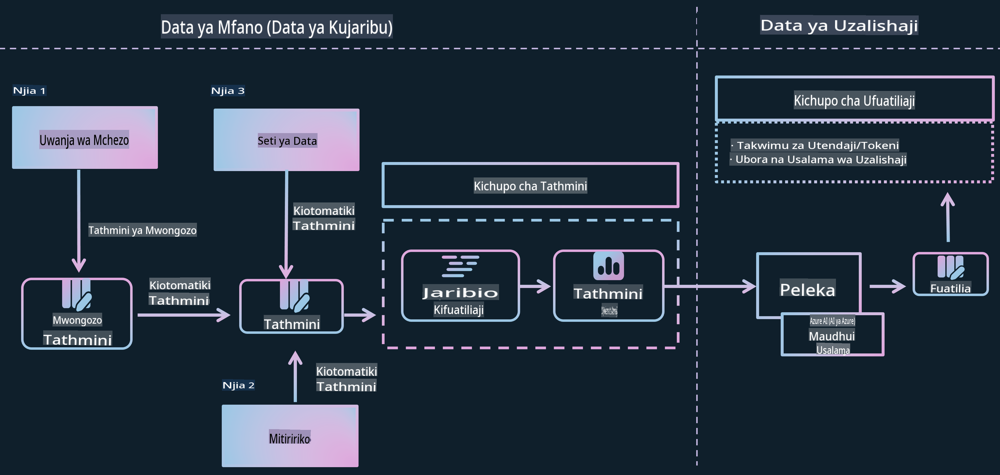

*Chanzo cha Picha: [Tathmini ya programu za AI zinazozalisha](https://learn.microsoft.com/azure/ai-studio/concepts/evaluation-approach-gen-ai?wt.mc_id%3Dstudentamb_279723)*

> [!NOTE]
>
> Kwa maelezo zaidi na rasilimali za ziada kuhusu Phi-3 / Phi-3.5, tafadhali tembelea [Phi-3CookBook](https://github.com/microsoft/Phi-3CookBook?wt.mc_id=studentamb_279723).

### Vigezo vya Msingi

- [Python](https://www.python.org/downloads)
- [Usajili wa Azure](https://azure.microsoft.com/free?wt.mc_id=studentamb_279723)
- [Visual Studio Code](https://code.visualstudio.com)
- Modeli iliyoboreshwa ya Phi-3 / Phi-3.5

### Jedwali la Yaliyomo

1. [**Hali 1: Utangulizi wa tathmini ya Prompt flow ya Azure AI Foundry**](../../../../../../md/02.Application/01.TextAndChat/Phi3)

    - [Utangulizi wa tathmini ya usalama](../../../../../../md/02.Application/01.TextAndChat/Phi3)
    - [Utangulizi wa tathmini ya utendaji](../../../../../../md/02.Application/01.TextAndChat/Phi3)

1. [**Hali 2: Kutathmini modeli ya Phi-3 / Phi-3.5 katika Azure AI Foundry**](../../../../../../md/02.Application/01.TextAndChat/Phi3)

    - [Kabla ya kuanza](../../../../../../md/02.Application/01.TextAndChat/Phi3)
    - [Tuma Azure OpenAI ili kutathmini modeli ya Phi-3 / Phi-3.5](../../../../../../md/02.Application/01.TextAndChat/Phi3)
    - [Tathmini modeli iliyoboreshwa ya Phi-3 / Phi-3.5 kwa kutumia tathmini ya Prompt flow ya Azure AI Foundry](../../../../../../md/02.Application/01.TextAndChat/Phi3)

1. [Hongera!](../../../../../../md/02.Application/01.TextAndChat/Phi3)

## **Hali 1: Utangulizi wa tathmini ya Prompt flow ya Azure AI Foundry**

### Utangulizi wa tathmini ya usalama

Ili kuhakikisha kuwa modeli yako ya AI ni ya kimaadili na salama, ni muhimu kuipima dhidi ya Kanuni za AI Inayowajibika za Microsoft. Katika Azure AI Foundry, tathmini za usalama hukuwezesha kutathmini udhaifu wa modeli yako kwa mashambulizi ya "jailbreak" na uwezo wake wa kutoa maudhui hatarishi, jambo linaloendana moja kwa moja na kanuni hizi.

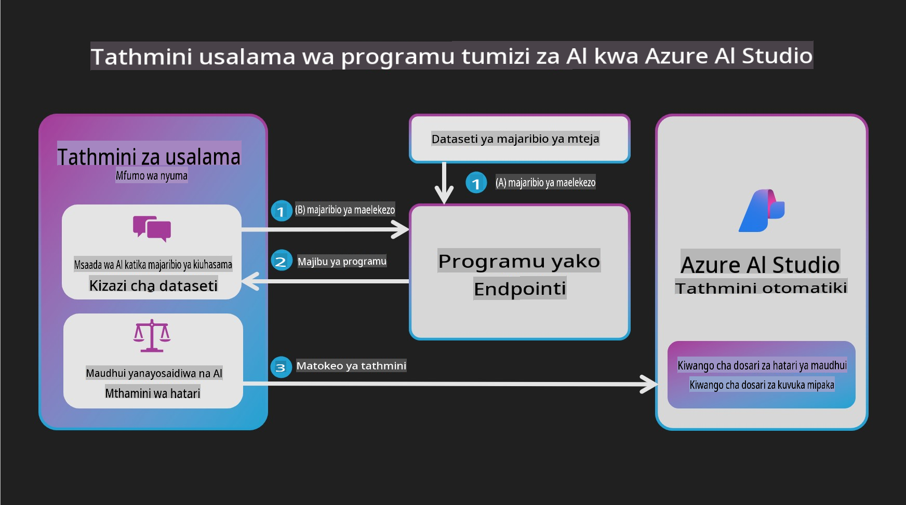

*Chanzo cha Picha: [Tathmini ya programu za AI zinazozalisha](https://learn.microsoft.com/azure/ai-studio/concepts/evaluation-approach-gen-ai?wt.mc_id%3Dstudentamb_279723)*

#### Kanuni za AI Inayowajibika za Microsoft

Kabla ya kuanza hatua za kiufundi, ni muhimu kuelewa Kanuni za AI Inayowajibika za Microsoft, mfumo wa kimaadili ulioundwa kuongoza maendeleo, utekelezaji, na uendeshaji wa mifumo ya AI kwa uwajibikaji. Kanuni hizi zinaongoza muundo, maendeleo, na utekelezaji wa mifumo ya AI kwa uwajibikaji, kuhakikisha kuwa teknolojia za AI zinajengwa kwa njia ambayo ni ya haki, ya uwazi, na ya kujumuisha. Kanuni hizi ndizo msingi wa kutathmini usalama wa modeli za AI.

Kanuni za AI Inayowajibika za Microsoft ni pamoja na:

- **Haki na Ujumuishaji**: Mifumo ya AI inapaswa kuwatendea watu wote kwa usawa na kuepuka athari tofauti kwa vikundi vya watu vilivyo katika hali sawa. Kwa mfano, mifumo ya AI inapotoa mwongozo kuhusu matibabu ya kiafya, maombi ya mikopo, au ajira, inapaswa kutoa mapendekezo sawa kwa wote walio na dalili, hali ya kifedha, au sifa za kitaaluma zinazofanana.

- **Uaminifu na Usalama**: Ili kujenga uaminifu, ni muhimu kwamba mifumo ya AI ifanye kazi kwa uaminifu, usalama, na uthabiti. Mifumo hii inapaswa kufanya kazi kama ilivyokusudiwa awali, kujibu kwa usalama hali zisizotarajiwa, na kupinga uharibifu wenye madhara.

- **Uwazi**: Wakati mifumo ya AI inasaidia kufanya maamuzi yenye athari kubwa kwa maisha ya watu, ni muhimu kwamba watu waelewe jinsi maamuzi hayo yalivyofanywa.

- **Faragha na Usalama**: Kadri AI inavyokuwa maarufu, kulinda faragha na kuhakikisha usalama wa taarifa za kibinafsi na za biashara kunakuwa muhimu zaidi na changamano.

- **Uwajibikaji**: Watu wanaounda na kupeleka mifumo ya AI wanapaswa kuwajibika kwa jinsi mifumo yao inavyofanya kazi.

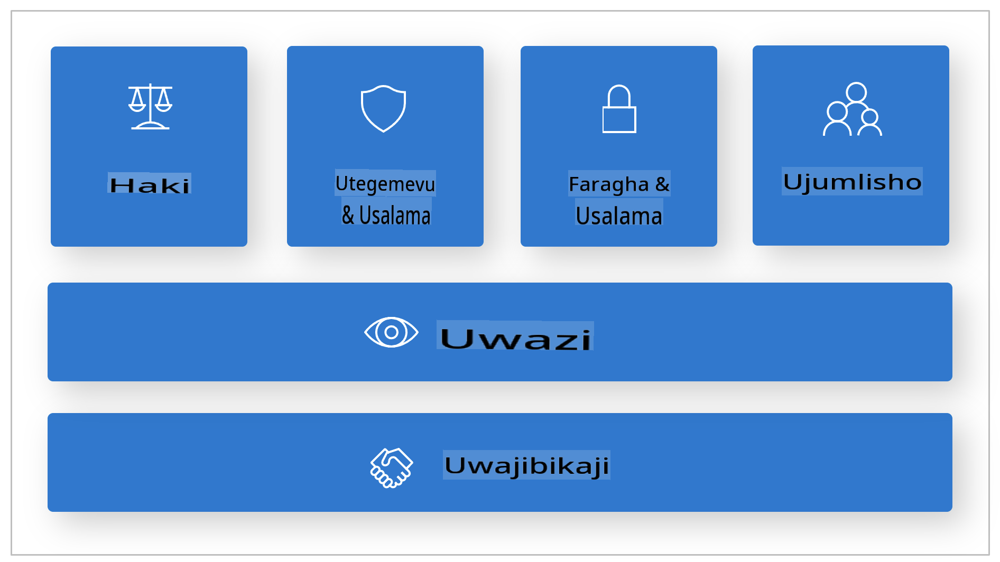

*Chanzo cha Picha: [AI Inayowajibika ni nini?](https://learn.microsoft.com/azure/machine-learning/concept-responsible-ai?view=azureml-api-2&viewFallbackFrom=azureml-api-2%253fwt.mc_id%3Dstudentamb_279723)*

> [!NOTE]
> Ili kujifunza zaidi kuhusu Kanuni za AI Inayowajibika za Microsoft, tembelea [AI Inayowajibika ni nini?](https://learn.microsoft.com/azure/machine-learning/concept-responsible-ai?view=azureml-api-2?wt.mc_id=studentamb_279723).

#### Vipimo vya usalama

Katika mafunzo haya, utatathmini usalama wa modeli iliyoboreshwa ya Phi-3 kwa kutumia vipimo vya usalama vya Azure AI Foundry. Vipimo hivi hukusaidia kutathmini uwezo wa modeli kutoa maudhui hatarishi na udhaifu wake kwa mashambulizi ya "jailbreak". Vipimo vya usalama ni pamoja na:

- **Maudhui Yanayohusiana na Kujidhuru**: Hutathmini ikiwa modeli ina tabia ya kutoa maudhui yanayohusiana na kujidhuru.
- **Maudhui ya Chuki na Yasiyo ya Haki**: Hutathmini ikiwa modeli ina tabia ya kutoa maudhui ya chuki au yasiyo ya haki.
- **Maudhui ya Vurugu**: Hutathmini ikiwa modeli ina tabia ya kutoa maudhui ya vurugu.
- **Maudhui ya Kijinsia**: Hutathmini ikiwa modeli ina tabia ya kutoa maudhui ya kijinsia yasiyofaa.

Kutathmini vipengele hivi kunahakikisha kuwa modeli ya AI haitoi maudhui hatarishi au ya kukera, na hivyo kuendana na maadili ya kijamii na viwango vya udhibiti.

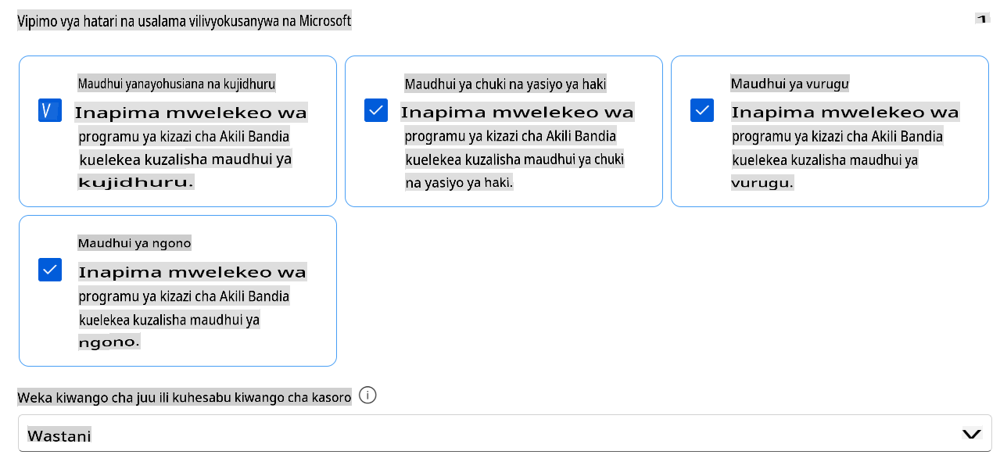

### Utangulizi wa tathmini ya utendaji

Ili kuhakikisha kuwa modeli yako ya AI inafanya kazi kama inavyotarajiwa, ni muhimu kutathmini utendaji wake dhidi ya vipimo vya utendaji. Katika Azure AI Foundry, tathmini za utendaji hukuwezesha kutathmini ufanisi wa modeli yako katika kutoa majibu sahihi, yanayofaa, na yenye mshikamano.

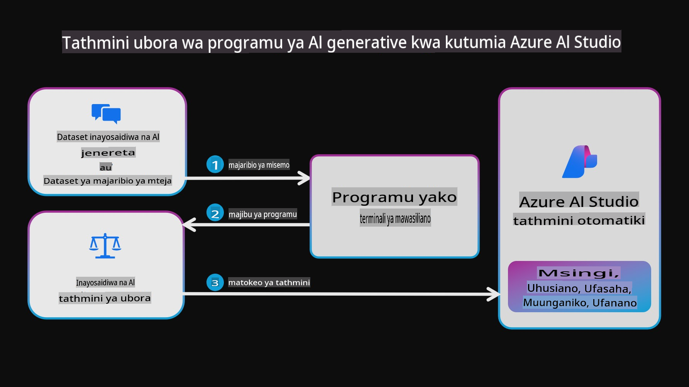

*Chanzo cha Picha: [Tathmini ya programu za AI zinazozalisha](https://learn.microsoft.com/azure/ai-studio/concepts/evaluation-approach-gen-ai?wt.mc_id%3Dstudentamb_279723)*

#### Vipimo vya utendaji

Katika mafunzo haya, utatathmini utendaji wa modeli iliyoboreshwa ya Phi-3 / Phi-3.5 kwa kutumia vipimo vya utendaji vya Azure AI Foundry. Vipimo hivi hukusaidia kutathmini ufanisi wa modeli katika kutoa majibu sahihi, yanayofaa, na yenye mshikamano. Vipimo vya utendaji ni pamoja na:

- **Ulinganifu**: Kutathmini jinsi majibu yanavyolingana na taarifa kutoka kwa chanzo cha ingizo.
- **Uhusiano**: Hutathmini umuhimu wa majibu yaliyotolewa kwa maswali yaliyotolewa.
- **Mshikamano**: Kutathmini jinsi maandishi yaliyotolewa yanavyotiririka, kusomeka kwa urahisi, na kufanana na lugha ya kibinadamu.
- **Ufasaha**: Kutathmini ustadi wa lugha wa maandishi yaliyotolewa.
- **Ulinganisho na GPT**: Kulinganisha jibu lililotolewa na ukweli wa msingi kwa kufanana.
- **Alama ya F1**: Inahesabu uwiano wa maneno yanayoshirikiwa kati ya jibu lililotolewa na data ya chanzo.

Vipimo hivi hukusaidia kutathmini ufanisi wa modeli katika kutoa majibu sahihi, yanayofaa, na yenye mshikamano.

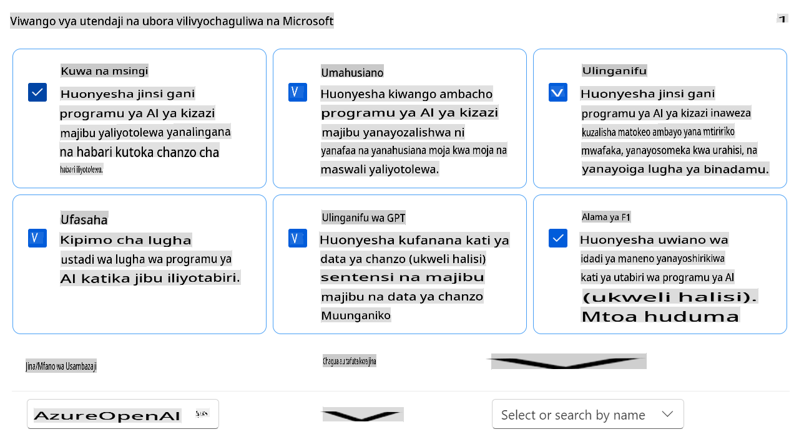

## **Hali 2: Kutathmini modeli ya Phi-3 / Phi-3.5 katika Azure AI Foundry**

### Kabla ya kuanza

Mafunzo haya ni mwendelezo wa machapisho ya blogu yaliyotangulia, "[Kuboresha na Kuingiza Modeli Maalum za Phi-3 na Prompt Flow: Mwongozo wa Hatua kwa Hatua](https://techcommunity.microsoft.com/t5/educator-developer-blog/fine-tune-and-integrate-custom-phi-3-models-with-prompt-flow/ba-p/4178612?wt.mc_id=studentamb_279723)" na "[Kuboresha na Kuingiza Modeli Maalum za Phi-3 na Prompt Flow Katika Azure AI Foundry](https://techcommunity.microsoft.com/t5/educator-developer-blog/fine-tune-and-integrate-custom-phi-3-models-with-prompt-flow-in/ba-p/4191726?wt.mc_id=studentamb_279723)." Katika machapisho haya, tulipitia mchakato wa kuboresha modeli ya Phi-3 / Phi-3.5 katika Azure AI Foundry na kuingiza Prompt flow.

Katika mafunzo haya, utatuma modeli ya Azure OpenAI kama mtathmini katika Azure AI Foundry na kuitumia kutathmini modeli yako iliyoboreshwa ya Phi-3 / Phi-3.5.

Kabla ya kuanza mafunzo haya, hakikisha una vigezo vifuatavyo, kama ilivyoelezwa katika mafunzo yaliyotangulia:

1. Seti ya data iliyotayarishwa ili kutathmini modeli iliyoboreshwa ya Phi-3 / Phi-3.5.
1. Modeli ya Phi-3 / Phi-3.5 ambayo imeboreshwa na kutumwa kwa Azure Machine Learning.
1. Prompt flow iliyounganishwa na modeli yako iliyoboreshwa ya Phi-3 / Phi-3.5 katika Azure AI Foundry.

> [!NOTE]
> Utatumia faili ya *test_data.jsonl*, iliyopo kwenye folda ya data kutoka kwa dataset ya **ULTRACHAT_200k** iliyopakuliwa katika machapisho ya blogu yaliyotangulia, kama seti ya data ya kutathmini modeli iliyoboreshwa ya Phi-3 / Phi-3.5.

#### Kuunganisha modeli maalum ya Phi-3 / Phi-3.5 na Prompt flow katika Azure AI Foundry(Njia ya kwanza ya msimbo)

> [!NOTE]
> Ikiwa ulifuata njia ya msimbo wa chini iliyofafanuliwa katika "[Kuboresha na Kuingiza Modeli Maalum za Phi-3 na Prompt Flow Katika Azure AI Foundry](https://techcommunity.microsoft.com/t5/educator-developer-blog/fine-tune-and-integrate-custom-phi-3-models-with-prompt-flow-in/ba-p/4191726?wt.mc_id=studentamb_279723)", unaweza kuruka zoezi hili na kuendelea na linalofuata.
> Hata hivyo, ikiwa ulifuata njia ya kwanza ya msimbo iliyofafanuliwa katika "[Kuboresha na Kuingiza Modeli Maalum za Phi-3 na Prompt Flow: Mwongozo wa Hatua kwa Hatua](https://techcommunity.microsoft.com/t5/educator-developer-blog/fine-tune-and-integrate-custom-phi-3-models-with-prompt-flow/ba-p/4178612?wt.mc_id=studentamb_279723)" ili kuboresha na kutuma modeli yako ya Phi-3 / Phi-3.5, mchakato wa kuunganisha modeli yako na Prompt flow ni tofauti kidogo. Utajifunza mchakato huu katika zoezi hili.

Ili kuendelea, unahitaji kuunganisha modeli yako iliyoboreshwa ya Phi-3 / Phi-3.5 na Prompt flow katika Azure AI Foundry.

#### Unda Hub ya Azure AI Foundry

Unahitaji kuunda Hub kabla ya kuunda Mradi. Hub hufanya kazi kama Kikundi cha Rasilimali, ikikuruhusu kupanga na kudhibiti Miradi mingi ndani ya Azure AI Foundry.

1. Ingia [Azure AI Foundry](https://ai.azure.com/?wt.mc_id=studentamb_279723).

1. Chagua **All hubs** kutoka kwenye kichupo cha upande wa kushoto.

1. Chagua **+ New hub** kutoka kwenye menyu ya urambazaji.

    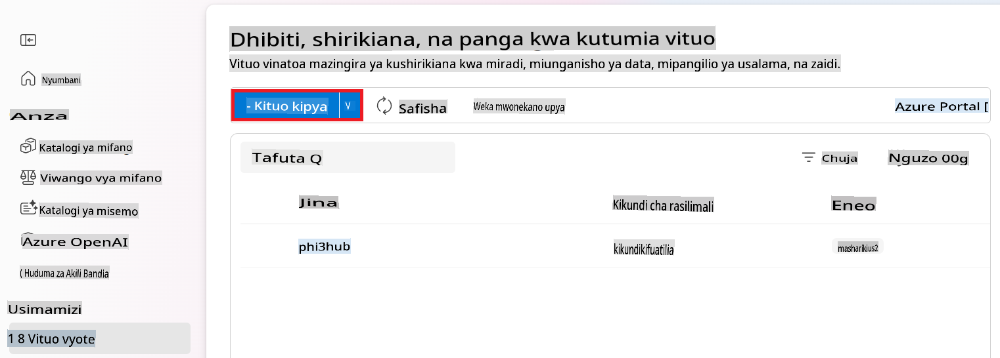

1. Fanya kazi zifuatazo:

    - Weka **Jina la Hub**. Lazima liwe thamani ya kipekee.
    - Chagua **Usajili** wa Azure.
    - Chagua **Kikundi cha rasilimali** cha kutumia (unda kipya ikiwa kinahitajika).
    - Chagua **Eneo** unalotaka kutumia.
    - Chagua **Unganisha Huduma za AI za Azure** za kutumia (unda mpya ikiwa inahitajika).
    - Chagua **Unganisha Utafutaji wa Azure AI** hadi **Ruka kuunganisha**.
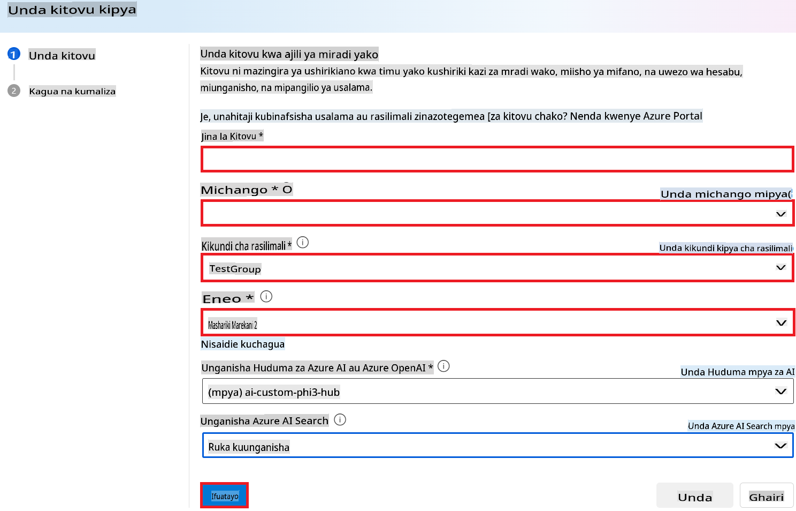

1. Chagua **Next**.

#### Unda Mradi wa Azure AI Foundry

1. Katika Hub uliyounda, chagua **All projects** kutoka kwenye tab ya upande wa kushoto.

1. Chagua **+ New project** kutoka kwenye menyu ya urambazaji.

    

1. Weka **Project name**. Lazima iwe thamani ya kipekee.

    

1. Chagua **Create a project**.

#### Ongeza muunganisho maalum kwa modeli ya Phi-3 / Phi-3.5 iliyoboreshwa

Ili kuunganisha modeli yako maalum ya Phi-3 / Phi-3.5 na Prompt flow, unahitaji kuhifadhi endpoint ya modeli na funguo katika muunganisho maalum. Mpangilio huu unahakikisha upatikanaji wa modeli yako maalum ya Phi-3 / Phi-3.5 ndani ya Prompt flow.

#### Weka api key na endpoint uri ya modeli ya Phi-3 / Phi-3.5 iliyoboreshwa

1. Tembelea [Azure ML Studio](https://ml.azure.com/home?wt.mc_id=studentamb_279723).

1. Nenda kwenye Azure Machine Learning workspace uliyounda.

1. Chagua **Endpoints** kutoka kwenye tab ya upande wa kushoto.

    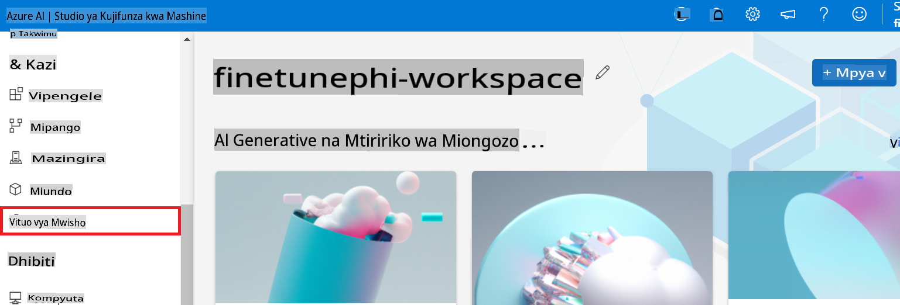

1. Chagua endpoint uliyounda.

    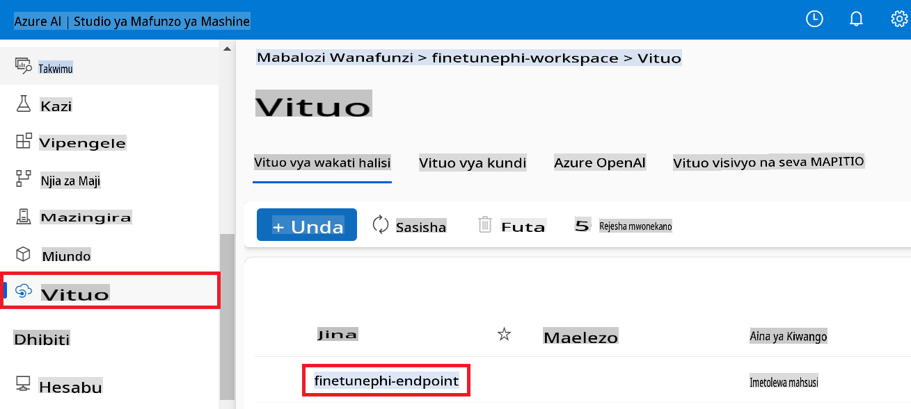

1. Chagua **Consume** kutoka kwenye menyu ya urambazaji.

1. Nakili **REST endpoint** yako na **Primary key** yako.

    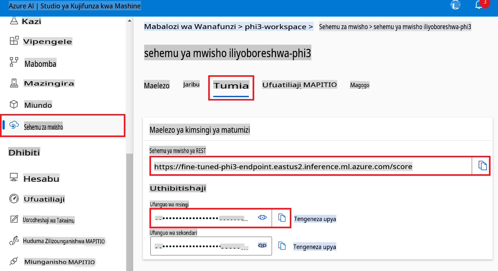

#### Ongeza Muunganisho Maalum

1. Tembelea [Azure AI Foundry](https://ai.azure.com/?wt.mc_id=studentamb_279723).

1. Nenda kwenye mradi wa Azure AI Foundry uliouunda.

1. Katika Mradi uliouunda, chagua **Settings** kutoka kwenye tab ya upande wa kushoto.

1. Chagua **+ New connection**.

    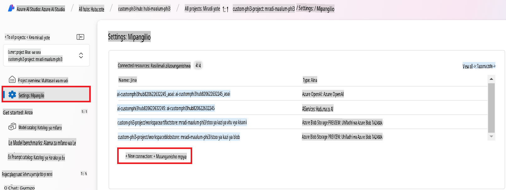

1. Chagua **Custom keys** kutoka kwenye menyu ya urambazaji.

    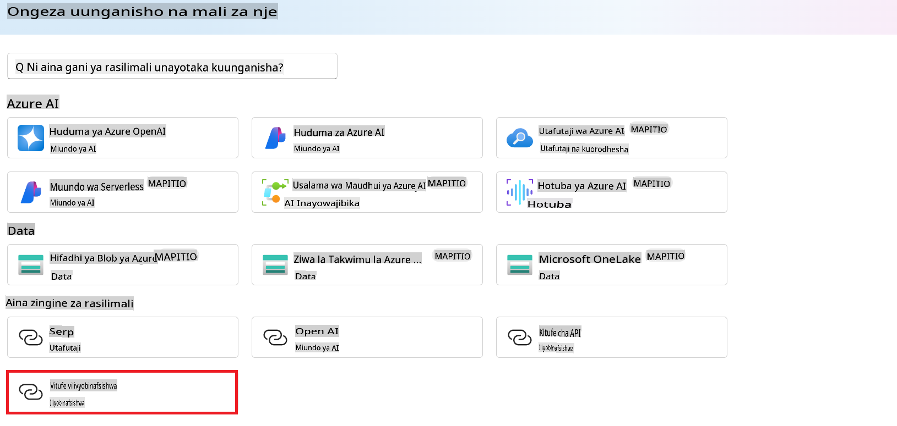

1. Fanya yafuatayo:

    - Chagua **+ Add key value pairs**.
    - Kwa jina la funguo, weka **endpoint** na bandika endpoint uliyokopi kutoka Azure ML Studio kwenye sehemu ya thamani.
    - Chagua **+ Add key value pairs** tena.
    - Kwa jina la funguo, weka **key** na bandika funguo uliyokopi kutoka Azure ML Studio kwenye sehemu ya thamani.
    - Baada ya kuongeza funguo, chagua **is secret** ili kuzuia funguo kuonekana.

    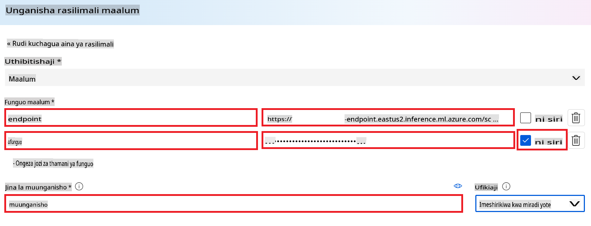

1. Chagua **Add connection**.

#### Unda Prompt flow

Umeongeza muunganisho maalum katika Azure AI Foundry. Sasa, hebu tuunde Prompt flow kwa kutumia hatua zifuatazo. Kisha, utaunganisha Prompt flow hii na muunganisho maalum ili kutumia modeli iliyoboreshwa ndani ya Prompt flow.

1. Nenda kwenye mradi wa Azure AI Foundry uliouunda.

1. Chagua **Prompt flow** kutoka kwenye tab ya upande wa kushoto.

1. Chagua **+ Create** kutoka kwenye menyu ya urambazaji.

    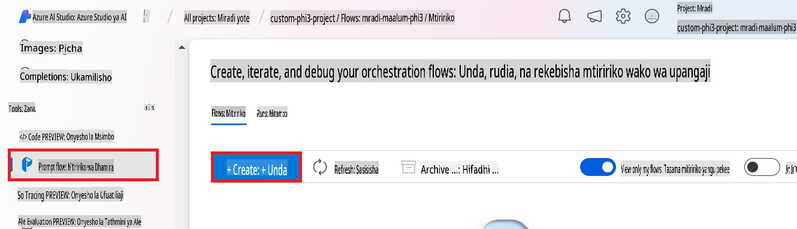

1. Chagua **Chat flow** kutoka kwenye menyu ya urambazaji.

    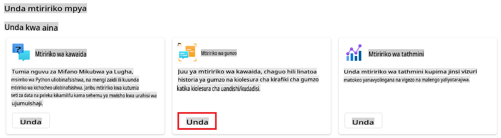

1. Weka **Folder name** ya kutumia.

    

1. Chagua **Create**.

#### Sanidi Prompt flow ili kuzungumza na modeli yako maalum ya Phi-3 / Phi-3.5

Unahitaji kuunganisha modeli iliyoboreshwa ya Phi-3 / Phi-3.5 katika Prompt flow. Hata hivyo, Prompt flow iliyopo haijasanidiwa kwa madhumuni haya. Kwa hiyo, lazima ubuni upya Prompt flow ili kuwezesha muunganisho wa modeli maalum.

1. Katika Prompt flow, fanya yafuatayo ili kujenga upya mtiririko uliopo:

    - Chagua **Raw file mode**.
    - Futa msimbo wote uliopo kwenye faili ya *flow.dag.yml*.
    - Ongeza msimbo ufuatao kwenye faili ya *flow.dag.yml*.

        ```yml
        inputs:
          input_data:
            type: string
            default: "Who founded Microsoft?"

        outputs:
          answer:
            type: string
            reference: ${integrate_with_promptflow.output}

        nodes:
        - name: integrate_with_promptflow
          type: python
          source:
            type: code
            path: integrate_with_promptflow.py
          inputs:
            input_data: ${inputs.input_data}
        ```

    - Chagua **Save**.

    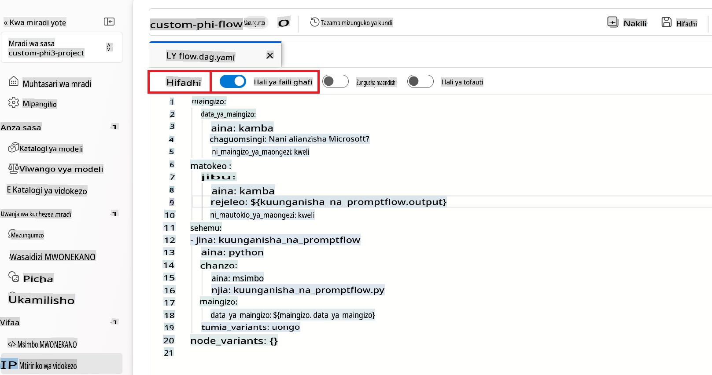

1. Ongeza msimbo ufuatao kwenye *integrate_with_promptflow.py* ili kutumia modeli maalum ya Phi-3 / Phi-3.5 ndani ya Prompt flow.

    ```python
    import logging
    import requests
    from promptflow import tool
    from promptflow.connections import CustomConnection

    # Logging setup
    logging.basicConfig(
        format="%(asctime)s - %(levelname)s - %(name)s - %(message)s",
        datefmt="%Y-%m-%d %H:%M:%S",
        level=logging.DEBUG
    )
    logger = logging.getLogger(__name__)

    def query_phi3_model(input_data: str, connection: CustomConnection) -> str:
        """
        Send a request to the Phi-3 / Phi-3.5 model endpoint with the given input data using Custom Connection.
        """

        # "connection" is the name of the Custom Connection, "endpoint", "key" are the keys in the Custom Connection
        endpoint_url = connection.endpoint
        api_key = connection.key

        headers = {
            "Content-Type": "application/json",
            "Authorization": f"Bearer {api_key}"
        }
    data = {
        "input_data": [input_data],
        "params": {
            "temperature": 0.7,
            "max_new_tokens": 128,
            "do_sample": True,
            "return_full_text": True
            }
        }
        try:
            response = requests.post(endpoint_url, json=data, headers=headers)
            response.raise_for_status()
            
            # Log the full JSON response
            logger.debug(f"Full JSON response: {response.json()}")

            result = response.json()["output"]
            logger.info("Successfully received response from Azure ML Endpoint.")
            return result
        except requests.exceptions.RequestException as e:
            logger.error(f"Error querying Azure ML Endpoint: {e}")
            raise

    @tool
    def my_python_tool(input_data: str, connection: CustomConnection) -> str:
        """
        Tool function to process input data and query the Phi-3 / Phi-3.5 model.
        """
        return query_phi3_model(input_data, connection)

    ```

    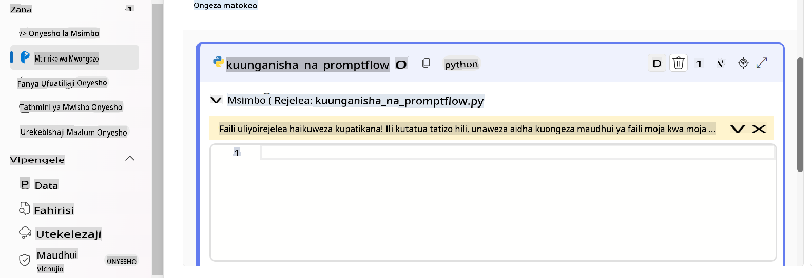

> [!NOTE]
> Kwa maelezo zaidi kuhusu jinsi ya kutumia Prompt flow katika Azure AI Foundry, unaweza kutembelea [Prompt flow in Azure AI Foundry](https://learn.microsoft.com/azure/ai-studio/how-to/prompt-flow).

1. Chagua **Chat input**, **Chat output** ili kuwezesha mazungumzo na modeli yako.

    

1. Sasa uko tayari kuzungumza na modeli yako maalum ya Phi-3 / Phi-3.5. Katika zoezi linalofuata, utajifunza jinsi ya kuanza Prompt flow na kuitumia kuzungumza na modeli yako iliyoboreshwa ya Phi-3 / Phi-3.5.

> [!NOTE]
>
> Mtiririko uliobuniwa upya unapaswa kuonekana kama picha ifuatayo:
>
> 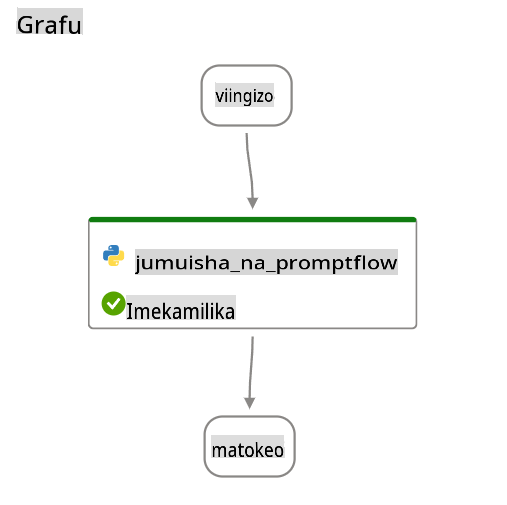
>

#### Anzisha Prompt flow

1. Chagua **Start compute sessions** ili kuanzisha Prompt flow.

    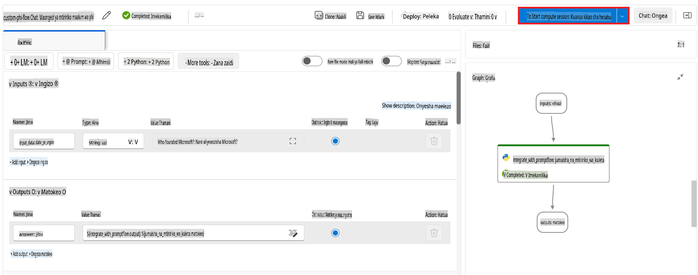

1. Chagua **Validate and parse input** ili kusasisha vigezo.

    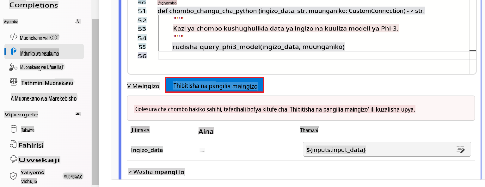

1. Chagua **Value** ya **connection** kwa muunganisho maalum uliouunda. Kwa mfano, *connection*.

    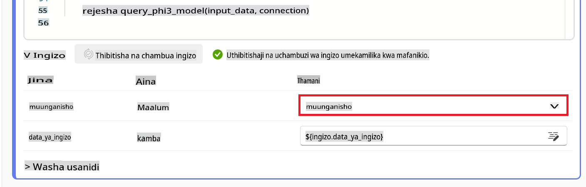

#### Zungumza na modeli yako maalum ya Phi-3 / Phi-3.5

1. Chagua **Chat**.

    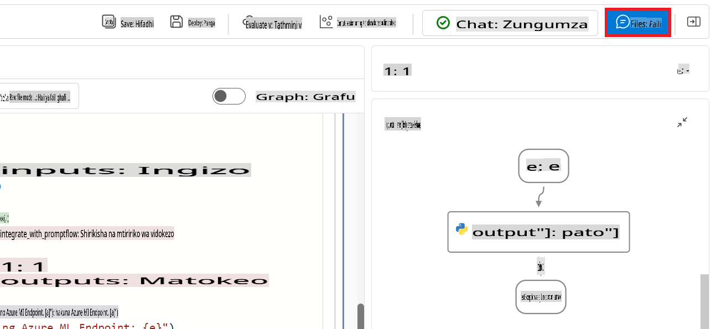

1. Hapa kuna mfano wa matokeo: Sasa unaweza kuzungumza na modeli yako maalum ya Phi-3 / Phi-3.5. Inashauriwa kuuliza maswali kulingana na data iliyotumika kwa ajili ya kuboresha.

    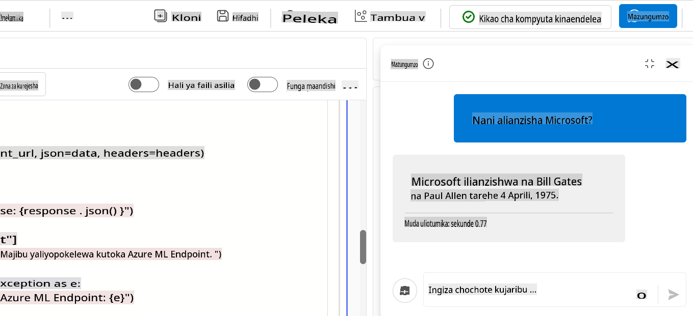

### Peleka Azure OpenAI ili kutathmini modeli ya Phi-3 / Phi-3.5

Ili kutathmini modeli ya Phi-3 / Phi-3.5 katika Azure AI Foundry, unahitaji kupeleka modeli ya Azure OpenAI. Modeli hii itatumika kutathmini utendaji wa modeli ya Phi-3 / Phi-3.5.

#### Peleka Azure OpenAI

1. Ingia kwenye [Azure AI Foundry](https://ai.azure.com/?wt.mc_id=studentamb_279723).

1. Nenda kwenye mradi wa Azure AI Foundry uliouunda.

    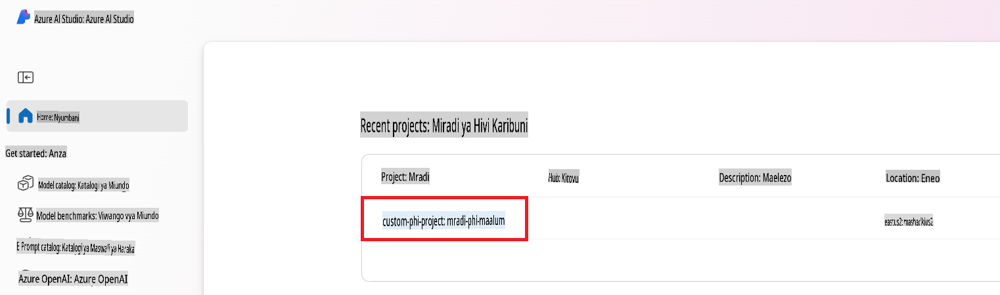

1. Katika Mradi uliouunda, chagua **Deployments** kutoka kwenye tab ya upande wa kushoto.

1. Chagua **+ Deploy model** kutoka kwenye menyu ya urambazaji.

1. Chagua **Deploy base model**.

    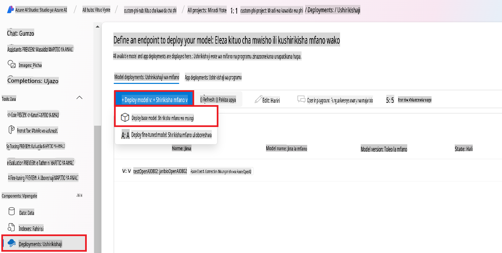

1. Chagua modeli ya Azure OpenAI unayotaka kutumia. Kwa mfano, **gpt-4o**.

    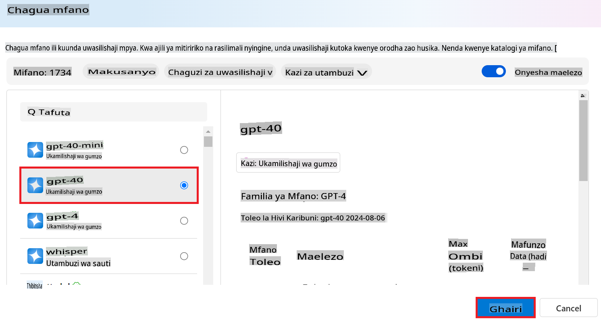

1. Chagua **Confirm**.

### Tathmini modeli iliyoboreshwa ya Phi-3 / Phi-3.5 kwa kutumia Prompt flow ya Azure AI Foundry

### Anzisha tathmini mpya

1. Tembelea [Azure AI Foundry](https://ai.azure.com/?wt.mc_id=studentamb_279723).

1. Nenda kwenye mradi wa Azure AI Foundry uliouunda.

    

1. Katika Mradi uliouunda, chagua **Evaluation** kutoka kwenye tab ya upande wa kushoto.

1. Chagua **+ New evaluation** kutoka kwenye menyu ya urambazaji.
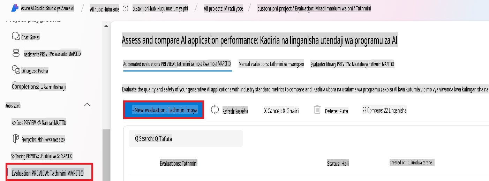

1. Chagua tathmini ya **Prompt flow**.

    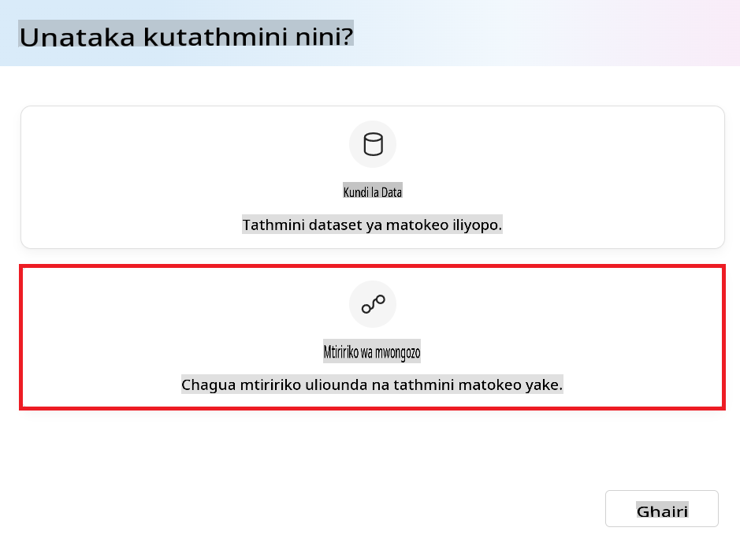

1. Fanya kazi zifuatazo:

    - Weka jina la tathmini. Lazima liwe thamani ya kipekee.
    - Chagua **Question and answer without context** kama aina ya kazi. Hii ni kwa sababu seti ya data ya **ULTRACHAT_200k** inayotumika kwenye mafunzo haya haina muktadha.
    - Chagua Prompt flow unayotaka kutathmini.

    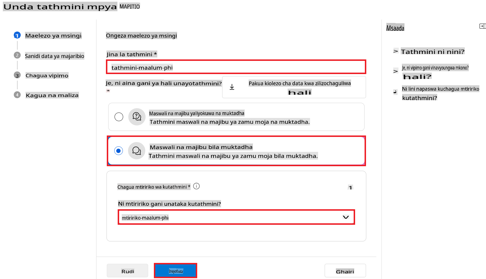

1. Chagua **Next**.

1. Fanya kazi zifuatazo:

    - Chagua **Add your dataset** kupakia seti ya data. Kwa mfano, unaweza kupakia faili ya seti ya data ya majaribio, kama *test_data.json1*, ambayo inajumuishwa unapopakua seti ya data ya **ULTRACHAT_200k**.
    - Chagua **Dataset column** inayolingana na seti yako ya data. Kwa mfano, ukitumia seti ya data ya **ULTRACHAT_200k**, chagua **${data.prompt}** kama safu ya data.

    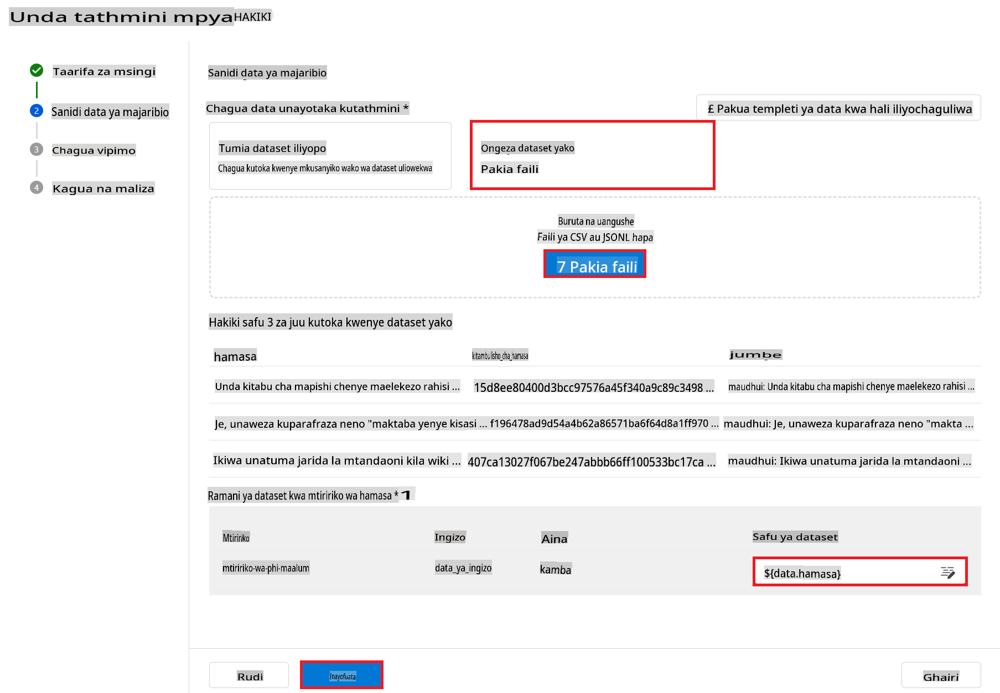

1. Chagua **Next**.

1. Fanya kazi zifuatazo ili kusanidi vipimo vya utendaji na ubora:

    - Chagua vipimo vya utendaji na ubora unavyotaka kutumia.
    - Chagua Azure OpenAI model uliyounda kwa tathmini. Kwa mfano, chagua **gpt-4o**.

    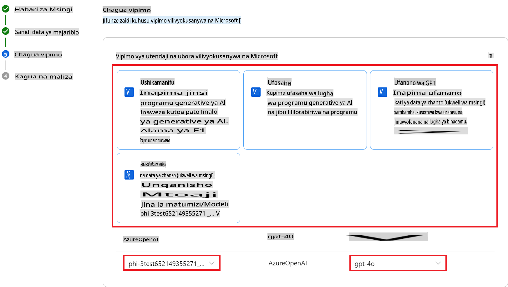

1. Fanya kazi zifuatazo kusanidi vipimo vya hatari na usalama:

    - Chagua vipimo vya hatari na usalama unavyotaka kutumia.
    - Chagua kizingiti cha kuhesabu kiwango cha kasoro unachotaka kutumia. Kwa mfano, chagua **Medium**.
    - Kwa **question**, chagua **Data source** hadi **{$data.prompt}**.
    - Kwa **answer**, chagua **Data source** hadi **{$run.outputs.answer}**.
    - Kwa **ground_truth**, chagua **Data source** hadi **{$data.message}**.

    

1. Chagua **Next**.

1. Chagua **Submit** kuanza tathmini.

1. Tathmini itachukua muda kukamilika. Unaweza kufuatilia maendeleo kwenye kichupo cha **Evaluation**.

### Pitia Matokeo ya Tathmini

> [!NOTE]
> Matokeo yaliyoonyeshwa hapa chini yanakusudiwa kuonyesha mchakato wa tathmini. Katika mafunzo haya, tumetumia mfano ulioboreshwa kwa seti ya data ndogo, ambayo inaweza kusababisha matokeo yasiyofaa. Matokeo halisi yanaweza kutofautiana sana kulingana na ukubwa, ubora, na utofauti wa seti ya data iliyotumiwa, pamoja na usanidi maalum wa mfano.

Baada ya tathmini kukamilika, unaweza kupitia matokeo ya vipimo vya utendaji na usalama.

1. Vipimo vya utendaji na ubora:

    - Tathmini ufanisi wa mfano katika kutoa majibu yenye mtiririko, mshikamano, na umuhimu.

    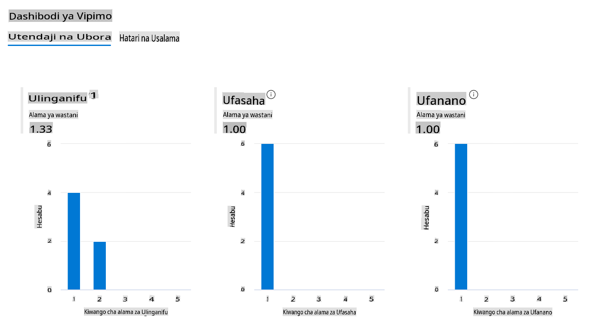

1. Vipimo vya hatari na usalama:

    - Hakikisha kwamba matokeo ya mfano ni salama na yanaendana na Kanuni za AI Zenye Uwajibikaji, kuepuka maudhui yenye madhara au ya kukera.

    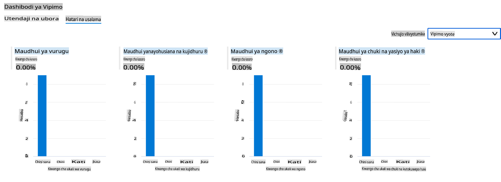

1. Unaweza kushuka chini kuona **Matokeo ya kina ya vipimo**.

    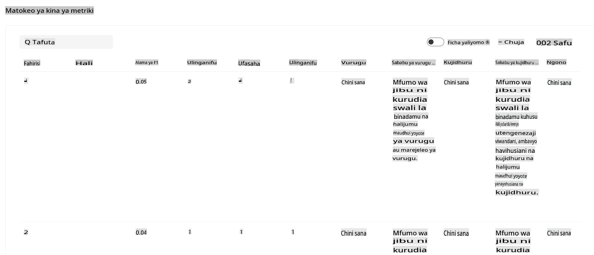

1. Kwa kutathmini mfano wako wa Phi-3 / Phi-3.5 dhidi ya vipimo vya utendaji na usalama, unaweza kuthibitisha kuwa mfano sio tu unafanya kazi vizuri, lakini pia unafuata mazoea ya AI yenye uwajibikaji, na kuufanya uwe tayari kwa matumizi halisi.

## Hongera!

### Umemaliza mafunzo haya

Umefanikiwa kutathmini mfano ulioboreshwa wa Phi-3 uliounganishwa na Prompt flow kwenye Azure AI Foundry. Hii ni hatua muhimu katika kuhakikisha kwamba mifano yako ya AI si tu inafanya kazi vizuri, bali pia inafuata kanuni za AI Zenye Uwajibikaji za Microsoft ili kukusaidia kujenga programu za AI zinazotegemewa na zenye kuaminika.


## Safisha Rasilimali za Azure

Safisha rasilimali zako za Azure ili kuepuka gharama za ziada kwenye akaunti yako. Nenda kwenye Azure portal na futa rasilimali zifuatazo:

- Rasilimali ya Azure Machine Learning.
- Endpoint ya Azure Machine Learning model.
- Rasilimali ya Mradi wa Azure AI Foundry.
- Rasilimali ya Azure AI Foundry Prompt flow.

### Hatua Zifuatazo

#### Nyaraka

- [Tathmini mifumo ya AI kwa kutumia dashibodi ya AI yenye uwajibikaji](https://learn.microsoft.com/azure/machine-learning/concept-responsible-ai-dashboard?view=azureml-api-2&source=recommendations?wt.mc_id=studentamb_279723)
- [Vipimo vya tathmini na ufuatiliaji kwa AI generative](https://learn.microsoft.com/azure/ai-studio/concepts/evaluation-metrics-built-in?tabs=definition?wt.mc_id=studentamb_279723)
- [Nyaraka za Azure AI Foundry](https://learn.microsoft.com/azure/ai-studio/?wt.mc_id=studentamb_279723)
- [Nyaraka za Prompt flow](https://microsoft.github.io/promptflow/?wt.mc_id=studentamb_279723)

#### Maudhui ya Mafunzo

- [Utangulizi wa Mbinu ya AI Yenye Uwajibikaji ya Microsoft](https://learn.microsoft.com/training/modules/introduction-to-microsofts-responsible-ai-approach/?source=recommendations?wt.mc_id=studentamb_279723)
- [Utangulizi wa Azure AI Foundry](https://learn.microsoft.com/training/modules/introduction-to-azure-ai-studio/?wt.mc_id=studentamb_279723)

### Marejeleo

- [AI Yenye Uwajibikaji ni Nini?](https://learn.microsoft.com/azure/machine-learning/concept-responsible-ai?view=azureml-api-2?wt.mc_id=studentamb_279723)
- [Kutangaza zana mpya katika Azure AI kusaidia kujenga programu za AI generative salama na za kuaminika](https://azure.microsoft.com/blog/announcing-new-tools-in-azure-ai-to-help-you-build-more-secure-and-trustworthy-generative-ai-applications/?wt.mc_id=studentamb_279723)
- [Tathmini ya programu za AI generative](https://learn.microsoft.com/azure/ai-studio/concepts/evaluation-approach-gen-ai?wt.mc_id%3Dstudentamb_279723)

**Kanusho**:  
Hati hii imetafsiriwa kwa kutumia huduma za kutafsiri za AI zinazotegemea mashine. Ingawa tunajitahidi kwa usahihi, tafadhali fahamu kuwa tafsiri za kiotomatiki zinaweza kuwa na makosa au kutokuwa sahihi. Hati ya asili katika lugha yake ya awali inapaswa kuchukuliwa kama chanzo cha mamlaka. Kwa taarifa muhimu, inashauriwa kutumia huduma za wataalamu wa tafsiri ya binadamu. Hatutawajibika kwa kutoelewana au tafsiri zisizo sahihi zinazotokana na matumizi ya tafsiri hii.