# Rekebisha na Unganisha modeli maalum za Phi-3 na Prompt flow

Mfano huu wa mwisho hadi mwisho (E2E) umetokana na mwongozo "[Rekebisha na Unganisha Modeli Maalum za Phi-3 na Prompt Flow: Mwongozo Hatua kwa Hatua](https://techcommunity.microsoft.com/t5/educator-developer-blog/fine-tune-and-integrate-custom-phi-3-models-with-prompt-flow/ba-p/4178612?WT.mc_id=aiml-137032-kinfeylo)" kutoka Microsoft Tech Community. Inatoa maelezo ya mchakato wa kurekebisha, kupeleka, na kuunganisha modeli maalum za Phi-3 na Prompt flow.

## Muhtasari

Katika mfano huu wa E2E, utajifunza jinsi ya kurekebisha modeli ya Phi-3 na kuiunganisha na Prompt flow. Kwa kutumia Azure Machine Learning na Prompt flow, utaanzisha mtiririko wa kazi wa kupeleka na kutumia modeli za AI maalum. Mfano huu wa E2E umegawanywa katika hali tatu:

**Hali ya 1: Sanidi rasilimali za Azure na Jiandae kwa kurekebisha**

**Hali ya 2: Rekebisha modeli ya Phi-3 na Upeleke katika Azure Machine Learning Studio**

**Hali ya 3: Unganisha na Prompt flow na Ongea na modeli yako maalum**

Hapa kuna muhtasari wa mfano huu wa E2E.

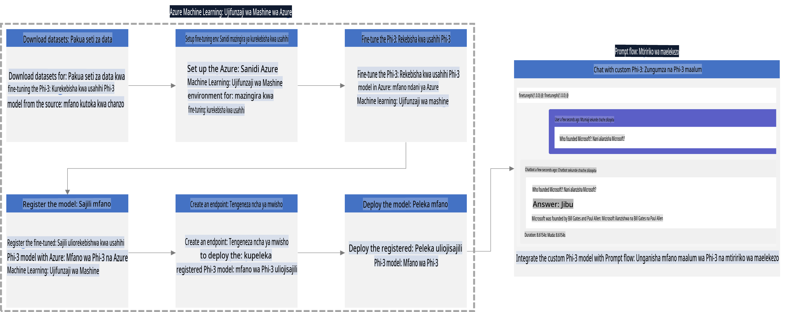

### Jedwali la Yaliyomo

1. **[Hali ya 1: Sanidi rasilimali za Azure na Jiandae kwa kurekebisha](../../../../../../md/02.Application/01.TextAndChat/Phi3)**
    - [Unda Azure Machine Learning Workspace](../../../../../../md/02.Application/01.TextAndChat/Phi3)
    - [Omba mgao wa GPU katika Usajili wa Azure](../../../../../../md/02.Application/01.TextAndChat/Phi3)
    - [Ongeza mgawo wa jukumu](../../../../../../md/02.Application/01.TextAndChat/Phi3)
    - [Sanidi mradi](../../../../../../md/02.Application/01.TextAndChat/Phi3)
    - [Andaa seti ya data kwa kurekebisha](../../../../../../md/02.Application/01.TextAndChat/Phi3)

1. **[Hali ya 2: Rekebisha modeli ya Phi-3 na Upeleke katika Azure Machine Learning Studio](../../../../../../md/02.Application/01.TextAndChat/Phi3)**
    - [Sanidi Azure CLI](../../../../../../md/02.Application/01.TextAndChat/Phi3)
    - [Rekebisha modeli ya Phi-3](../../../../../../md/02.Application/01.TextAndChat/Phi3)
    - [Peleka modeli iliyorekebishwa](../../../../../../md/02.Application/01.TextAndChat/Phi3)

1. **[Hali ya 3: Unganisha na Prompt flow na Ongea na modeli yako maalum](../../../../../../md/02.Application/01.TextAndChat/Phi3)**
    - [Unganisha modeli maalum ya Phi-3 na Prompt flow](../../../../../../md/02.Application/01.TextAndChat/Phi3)
    - [Ongea na modeli yako maalum](../../../../../../md/02.Application/01.TextAndChat/Phi3)

## Hali ya 1: Sanidi rasilimali za Azure na Jiandae kwa kurekebisha

### Unda Azure Machine Learning Workspace

1. Andika *azure machine learning* kwenye **upau wa utafutaji** juu ya ukurasa wa portal na uchague **Azure Machine Learning** kutoka kwenye chaguo zinazojitokeza.

    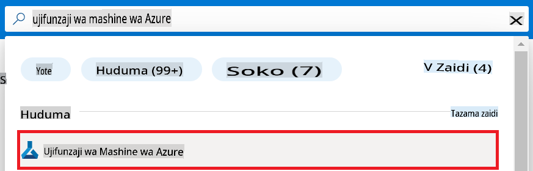

1. Chagua **+ Create** kutoka kwenye menyu ya urambazaji.

1. Chagua **New workspace** kutoka kwenye menyu ya urambazaji.

    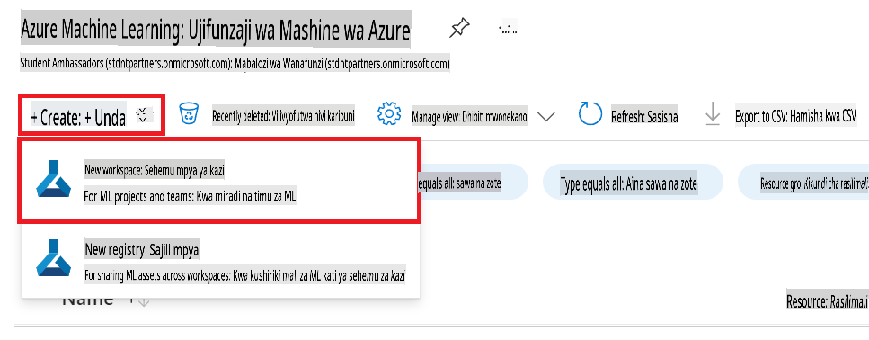

1. Fanya kazi zifuatazo:

    - Chagua **Subscription** yako ya Azure.
    - Chagua **Resource group** ya kutumia (unda mpya ikiwa inahitajika).
    - Ingiza **Workspace Name**. Lazima iwe ya kipekee.
    - Chagua **Region** unayopenda kutumia.
    - Chagua **Storage account** ya kutumia (unda mpya ikiwa inahitajika).
    - Chagua **Key vault** ya kutumia (unda mpya ikiwa inahitajika).
    - Chagua **Application insights** ya kutumia (unda mpya ikiwa inahitajika).
    - Chagua **Container registry** ya kutumia (unda mpya ikiwa inahitajika).

    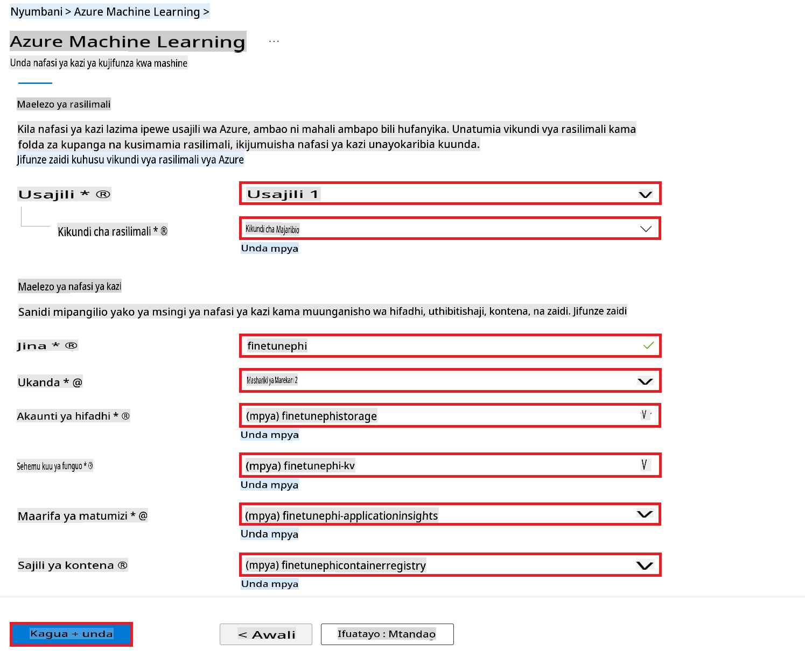

1. Chagua **Review + Create**.

1. Chagua **Create**.

### Omba mgao wa GPU katika Usajili wa Azure

Katika mfano huu wa E2E, utatumia *Standard_NC24ads_A100_v4 GPU* kwa kurekebisha, ambayo inahitaji ombi la mgao, na *Standard_E4s_v3* CPU kwa kupeleka, ambayo haihitaji ombi la mgao.

> [!NOTE]
>
> Ni usajili wa Pay-As-You-Go pekee (aina ya kawaida ya usajili) ndio unastahiki mgao wa GPU; usajili wa faida kwa sasa hauungwa mkono.
>
> Kwa wale wanaotumia usajili wa faida (kama vile Visual Studio Enterprise Subscription) au wale wanaotaka kujaribu haraka mchakato wa kurekebisha na kupeleka, mafunzo haya pia yanatoa mwongozo wa kurekebisha kwa seti ndogo ya data kwa kutumia CPU. Hata hivyo, ni muhimu kufahamu kuwa matokeo ya kurekebisha ni bora zaidi wakati wa kutumia GPU na seti kubwa za data.

1. Tembelea [Azure ML Studio](https://ml.azure.com/home?wt.mc_id=studentamb_279723).

1. Fanya kazi zifuatazo ili kuomba mgao wa *Standard NCADSA100v4 Family*:

    - Chagua **Quota** kutoka kwenye kichupo cha upande wa kushoto.
    - Chagua **Virtual machine family** ya kutumia. Kwa mfano, chagua **Standard NCADSA100v4 Family Cluster Dedicated vCPUs**, ambayo inajumuisha *Standard_NC24ads_A100_v4* GPU.
    - Chagua **Request quota** kutoka kwenye menyu ya urambazaji.

        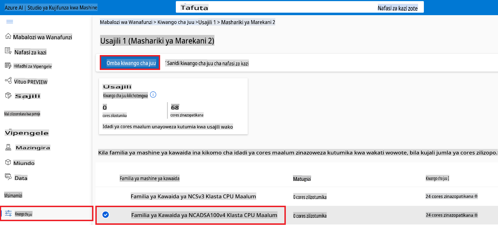

    - Ndani ya ukurasa wa Request quota, ingiza **New cores limit** unayotaka kutumia. Kwa mfano, 24.
    - Ndani ya ukurasa wa Request quota, chagua **Submit** kuomba mgao wa GPU.

> [!NOTE]
> Unaweza kuchagua GPU au CPU inayofaa kwa mahitaji yako kwa kurejelea hati ya [Sizes for Virtual Machines in Azure](https://learn.microsoft.com/azure/virtual-machines/sizes/overview?tabs=breakdownseries%2Cgeneralsizelist%2Ccomputesizelist%2Cmemorysizelist%2Cstoragesizelist%2Cgpusizelist%2Cfpgasizelist%2Chpcsizelist).

### Ongeza mgawo wa jukumu

Ili kurekebisha na kupeleka modeli zako, lazima kwanza uunde User Assigned Managed Identity (UAI) na uipe ruhusa zinazofaa. UAI hii itatumika kwa uthibitishaji wakati wa kupeleka.

#### Unda User Assigned Managed Identity (UAI)

1. Andika *managed identities* kwenye **upau wa utafutaji** juu ya ukurasa wa portal na uchague **Managed Identities** kutoka kwenye chaguo zinazojitokeza.

    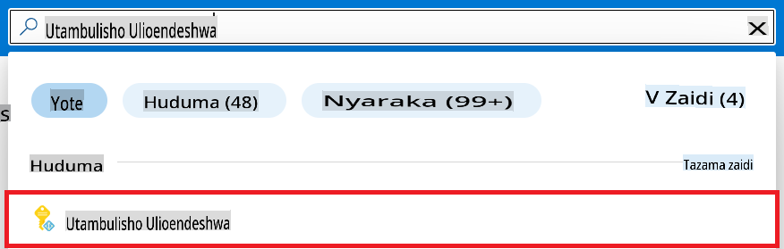

1. Chagua **+ Create**.

    

1. Fanya kazi zifuatazo:

    - Chagua **Subscription** yako ya Azure.
    - Chagua **Resource group** ya kutumia (unda mpya ikiwa inahitajika).
    - Chagua **Region** unayopenda kutumia.
    - Ingiza **Name**. Lazima iwe ya kipekee.

1. Chagua **Review + create**.

1. Chagua **+ Create**.

#### Ongeza mgawo wa jukumu la Contributor kwa Managed Identity

1. Nenda kwenye rasilimali ya Managed Identity uliyoitengeneza.

1. Chagua **Azure role assignments** kutoka kwenye kichupo cha upande wa kushoto.

1. Chagua **+Add role assignment** kutoka kwenye menyu ya urambazaji.

1. Ndani ya ukurasa wa Add role assignment, fanya kazi zifuatazo:
    - Chagua **Scope** hadi **Resource group**.
    - Chagua **Subscription** yako ya Azure.
    - Chagua **Resource group** ya kutumia.
    - Chagua **Role** hadi **Contributor**.

    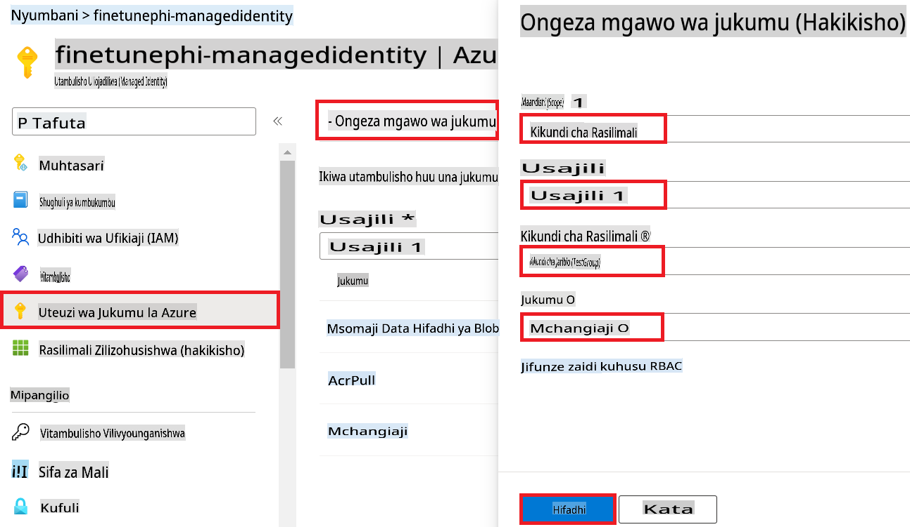

1. Chagua **Save**.

#### Ongeza mgawo wa jukumu la Storage Blob Data Reader kwa Managed Identity

1. Andika *storage accounts* kwenye **upau wa utafutaji** juu ya ukurasa wa portal na uchague **Storage accounts** kutoka kwenye chaguo zinazojitokeza.

    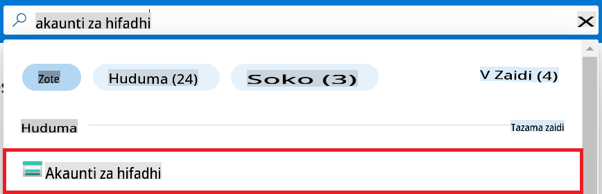

1. Chagua akaunti ya hifadhi inayohusiana na Azure Machine Learning workspace uliyoitengeneza. Kwa mfano, *finetunephistorage*.

1. Fanya kazi zifuatazo ili kufikia ukurasa wa Add role assignment:

    - Nenda kwenye akaunti ya hifadhi ya Azure uliyoitengeneza.
    - Chagua **Access Control (IAM)** kutoka kwenye kichupo cha upande wa kushoto.
    - Chagua **+ Add** kutoka kwenye menyu ya urambazaji.
    - Chagua **Add role assignment** kutoka kwenye menyu ya urambazaji.

    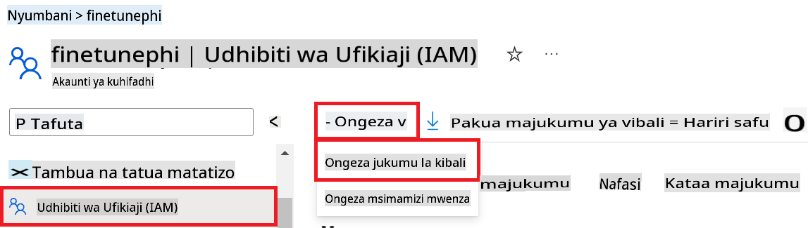

1. Ndani ya ukurasa wa Add role assignment, fanya kazi zifuatazo:

    - Ndani ya ukurasa wa Role, andika *Storage Blob Data Reader* kwenye **upau wa utafutaji** na uchague **Storage Blob Data Reader** kutoka kwenye chaguo zinazojitokeza.
    - Ndani ya ukurasa wa Role, chagua **Next**.
    - Ndani ya ukurasa wa Members, chagua **Assign access to** **Managed identity**.
    - Ndani ya ukurasa wa Members, chagua **+ Select members**.
    - Ndani ya ukurasa wa Select managed identities, chagua **Subscription** yako ya Azure.
    - Ndani ya ukurasa wa Select managed identities, chagua **Managed identity** hadi **Manage Identity**.
    - Ndani ya ukurasa wa Select managed identities, chagua Managed Identity uliyoitengeneza. Kwa mfano, *finetunephi-managedidentity*.
    - Ndani ya ukurasa wa Select managed identities, chagua **Select**.

    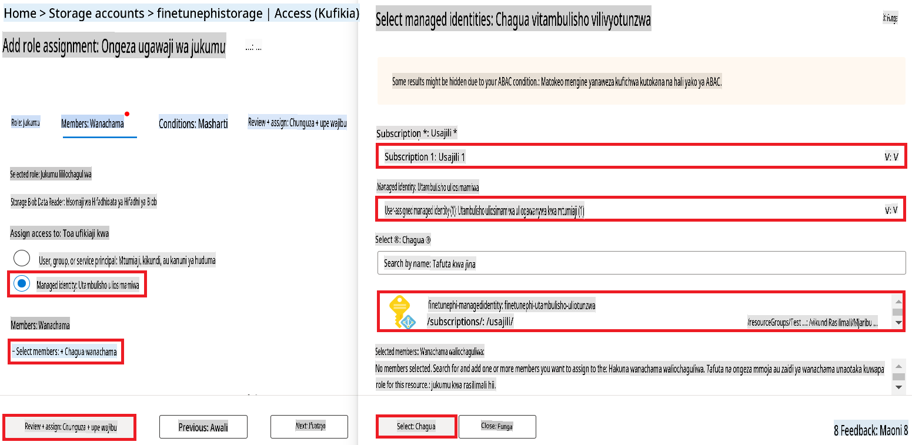

1. Chagua **Review + assign**.

#### Ongeza mgawo wa jukumu la AcrPull kwa Managed Identity

1. Andika *container registries* kwenye **upau wa utafutaji** juu ya ukurasa wa portal na uchague **Container registries** kutoka kwenye chaguo zinazojitokeza.

    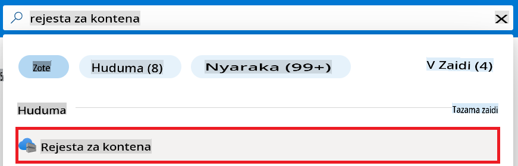

1. Chagua hifadhi ya kontena inayohusiana na Azure Machine Learning workspace. Kwa mfano, *finetunephicontainerregistries*

1. Fanya kazi zifuatazo ili kufikia ukurasa wa Add role assignment:

    - Chagua **Access Control (IAM)** kutoka kwenye kichupo cha upande wa kushoto.
    - Chagua **+ Add** kutoka kwenye menyu ya urambazaji.
    - Chagua **Add role assignment** kutoka kwenye menyu ya urambazaji.

1. Ndani ya ukurasa wa Add role assignment, fanya kazi zifuatazo:

    - Ndani ya ukurasa wa Role, andika *AcrPull* kwenye **upau wa utafutaji** na uchague **AcrPull** kutoka kwenye chaguo zinazojitokeza.
    - Ndani ya ukurasa wa Role, chagua **Next**.
    - Ndani ya ukurasa wa Members, chagua **Assign access to** **Managed identity**.
    - Ndani ya ukurasa wa Members, chagua **+ Select members**.
    - Ndani ya ukurasa wa Select managed identities, chagua **Subscription** yako ya Azure.
    - Ndani ya ukurasa wa Select managed identities, chagua **Managed identity** hadi **Manage Identity**.
    - Ndani ya ukurasa wa Select managed identities, chagua Managed Identity uliyoitengeneza. Kwa mfano, *finetunephi-managedidentity*.
    - Ndani ya ukurasa wa Select managed identities, chagua **Select**.
    - Chagua **Review + assign**.

### Sanidi mradi

Sasa, utaunda folda ya kufanyia kazi na kusanidi mazingira ya kawaida ya kuendeleza programu inayoshirikiana na watumiaji na kutumia historia ya mazungumzo iliyohifadhiwa kutoka Azure Cosmos DB kuarifu majibu yake.

#### Unda folda ya kufanyia kazi ndani yake

1. Fungua dirisha la terminal na andika amri ifuatayo kuunda folda inayoitwa *finetune-phi* kwenye njia chaguo-msingi.

    ```console
    mkdir finetune-phi
    ```

1. Andika amri ifuatayo ndani ya terminal yako ili kuingia kwenye folda ya *finetune-phi* uliyounda.

    ```console
    cd finetune-phi
    ```

#### Unda mazingira ya kawaida

1. Andika amri ifuatayo ndani ya terminal yako ili kuunda mazingira ya kawaida yanayoitwa *.venv*.

    ```console
    python -m venv .venv
    ```

1. Andika amri ifuatayo ndani ya terminal yako ili kuamsha mazingira ya kawaida.

    ```console
    .venv\Scripts\activate.bat
    ```

> [!NOTE]
>
> Ikiwa imefanikiwa, unapaswa kuona *(.venv)* kabla ya prompt ya amri.

#### Sakinisha vifurushi vinavyohitajika

1. Andika amri zifuatazo ndani ya terminal yako ili kusakinisha vifurushi vinavyohitajika.

    ```console
    pip install datasets==2.19.1
    pip install transformers==4.41.1
    pip install azure-ai-ml==1.16.0
    pip install torch==2.3.1
    pip install trl==0.9.4
    pip install promptflow==1.12.0
    ```

#### Unda faili za mradi

Katika zoezi hili, utaunda faili muhimu kwa ajili ya mradi wetu. Faili hizi zinajumuisha maandishi ya kupakua seti ya data, kusanidi mazingira ya Azure Machine Learning, kurekebisha modeli ya Phi-3, na kupeleka modeli iliyorekebishwa. Pia utaunda faili ya *conda.yml* ili kusanidi mazingira ya kurekebisha.

Katika zoezi hili, utafanya:

- Unda faili ya *download_dataset.py* ili kupakua seti ya data.
- Unda faili ya *setup_ml.py* ili kusanidi mazingira ya Azure Machine Learning.
- Unda faili ya *fine_tune.py* ndani ya folda ya *finetuning_dir* ili kurekebisha modeli ya Phi-3 kwa kutumia seti ya data.
- Unda faili ya *conda.yml* ili kusanidi mazingira ya kurekebisha.
- Unda faili ya *deploy_model.py* ili kupeleka modeli iliyorekebishwa.
- Unda faili ya *integrate_with_promptflow.py*, ili kuunganisha modeli iliyorekebishwa na kutekeleza modeli kwa kutumia Prompt flow.
- Unda faili ya *flow.dag.yml* ili kusanidi muundo wa mtiririko wa Prompt flow.
- Unda faili ya *config.py* ili kuingiza taarifa za Azure.

> [!NOTE]
>
> Muundo kamili wa folda:
>
> ```text
> └── YourUserName
> .    └── finetune-phi
> .        ├── finetuning_dir
> .        │      └── fine_tune.py
> .        ├── conda.yml
> .        ├── config.py
> .        ├── deploy_model.py
> .        ├── download_dataset.py
> .        ├── flow.dag.yml
> .        ├── integrate_with_promptflow.py
> .        └── setup_ml.py
> ```

1. Fungua **Visual Studio Code**.

1. Chagua **File** kutoka kwenye menyu ya juu.

1. Chagua **Open Folder**.

1. Chagua folda ya *finetune-phi* uliyounda, ambayo iko kwenye *C:\Users\yourUserName\finetune-phi*.

    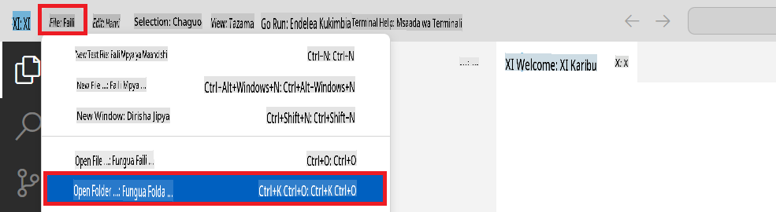

1. Katika paneli ya kushoto ya Visual Studio Code, bofya kulia na uchague **New File** ili kuunda faili mpya inayoitwa *download_dataset.py*.

1. Katika paneli ya kushoto ya Visual Studio Code, bofya kulia na uchague **New File** ili kuunda faili mpya inayoitwa *setup_ml.py*.

1. Katika paneli ya kushoto ya Visual Studio Code, bofya kulia na uchague **New File** ili kuunda faili mpya inayoitwa *deploy_model.py*.

    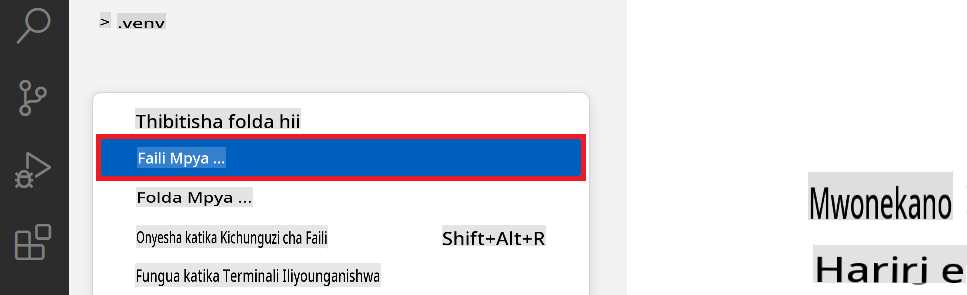

1. Katika paneli ya kushoto ya Visual Studio Code, bofya kulia na uchague **New Folder** ili kuunda folda mpya inayoitwa *finetuning_dir*.

1. Ndani ya folda ya *finetuning_dir*, unda faili mpya inayoitwa *fine_tune.py*.

#### Unda na Sanidi faili ya *conda.yml*

1. Katika paneli ya kushoto ya Visual Studio Code, bofya kulia na uchague **New File** ili kuunda faili mpya inayoitwa *conda.yml*.

1. Ongeza msimbo ufuatao kwenye faili ya *conda.yml* ili kusanidi mazingira ya kurekebisha modeli ya Phi-3.

    ```yml
    name: phi-3-training-env
    channels:
      - defaults
      - conda-forge
    dependencies:
      - python=3.10
      - pip
      - numpy<2.0
      - pip:
          - torch==2.4.0
          - torchvision==0.19.0
          - trl==0.8.6
          - transformers==4.41
          - datasets==2.21.0
          - azureml-core==1.57.0
          - azure-storage-blob==12.19.0
          - azure-ai-ml==1.16
          - azure-identity==1.17.1
          - accelerate==0.33.0
          - mlflow==2.15.1
          - azureml-mlflow==1.57.0
    ```

#### Unda na Sanidi faili ya *config.py*

1. Katika paneli ya
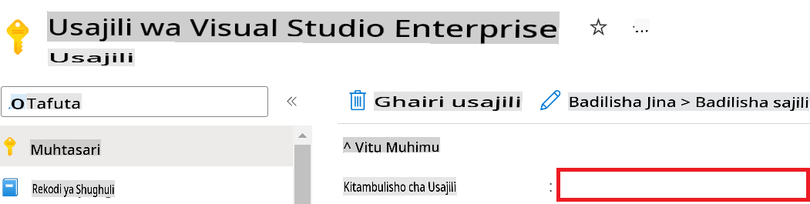

1. Fanya kazi zifuatazo ili kuongeza Jina la Azure Workspace:

   - Nenda kwenye rasilimali ya Azure Machine Learning uliyoiunda.
   - Nakili na ubandike jina la akaunti yako kwenye faili *config.py*.

   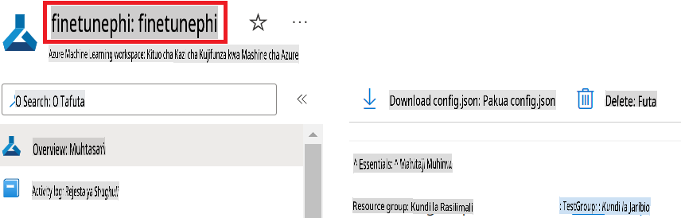

1. Fanya kazi zifuatazo ili kuongeza Jina la Kikundi cha Rasilimali cha Azure:

   - Nenda kwenye rasilimali ya Azure Machine Learning uliyoiunda.
   - Nakili na ubandike Jina la Kikundi cha Rasilimali cha Azure kwenye faili *config.py*.

   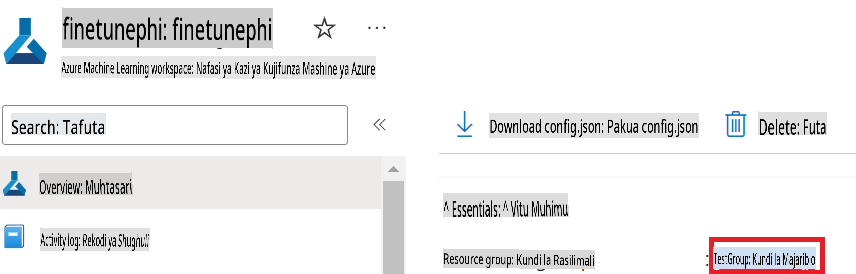

2. Fanya kazi zifuatazo ili kuongeza jina la Azure Managed Identity:

   - Nenda kwenye rasilimali ya Managed Identities uliyoiunda.
   - Nakili na ubandike jina la Azure Managed Identity kwenye faili *config.py*.

   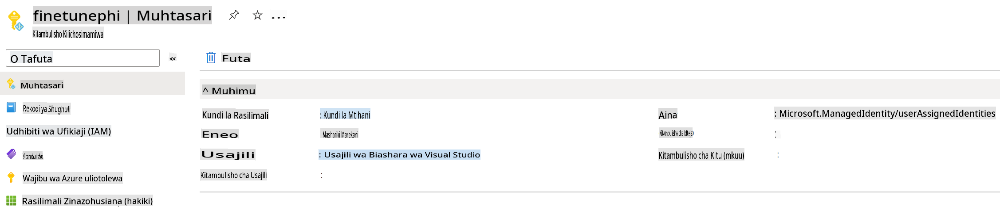

### Andaa seti ya data kwa ajili ya kufundisha upya

Katika zoezi hili, utaendesha faili ya *download_dataset.py* kupakua seti ya data ya *ULTRACHAT_200k* kwenye mazingira yako ya ndani. Kisha utatumia seti hii ya data kufundisha upya mfano wa Phi-3 kwenye Azure Machine Learning.

#### Pakua seti ya data kwa kutumia *download_dataset.py*

1. Fungua faili *download_dataset.py* katika Visual Studio Code.

1. Ongeza msimbo ufuatao kwenye *download_dataset.py*.

   ```python
    import json
    import os
    from datasets import load_dataset
    from config import (
        TRAIN_DATA_PATH,
        TEST_DATA_PATH)

    def load_and_split_dataset(dataset_name, config_name, split_ratio):
        """
        Load and split a dataset.
        """
        # Load the dataset with the specified name, configuration, and split ratio
        dataset = load_dataset(dataset_name, config_name, split=split_ratio)
        print(f"Original dataset size: {len(dataset)}")
        
        # Split the dataset into train and test sets (80% train, 20% test)
        split_dataset = dataset.train_test_split(test_size=0.2)
        print(f"Train dataset size: {len(split_dataset['train'])}")
        print(f"Test dataset size: {len(split_dataset['test'])}")
        
        return split_dataset

    def save_dataset_to_jsonl(dataset, filepath):
        """
        Save a dataset to a JSONL file.
        """
        # Create the directory if it does not exist
        os.makedirs(os.path.dirname(filepath), exist_ok=True)
        
        # Open the file in write mode
        with open(filepath, 'w', encoding='utf-8') as f:
            # Iterate over each record in the dataset
            for record in dataset:
                # Dump the record as a JSON object and write it to the file
                json.dump(record, f)
                # Write a newline character to separate records
                f.write('\n')
        
        print(f"Dataset saved to {filepath}")

    def main():
        """
        Main function to load, split, and save the dataset.
        """
        # Load and split the ULTRACHAT_200k dataset with a specific configuration and split ratio
        dataset = load_and_split_dataset("HuggingFaceH4/ultrachat_200k", 'default', 'train_sft[:1%]')
        
        # Extract the train and test datasets from the split
        train_dataset = dataset['train']
        test_dataset = dataset['test']

        # Save the train dataset to a JSONL file
        save_dataset_to_jsonl(train_dataset, TRAIN_DATA_PATH)
        
        # Save the test dataset to a separate JSONL file
        save_dataset_to_jsonl(test_dataset, TEST_DATA_PATH)

    if __name__ == "__main__":
        main()

    ```

> [!TIP]
>
> **Mwongozo wa kufundisha upya na seti ndogo ya data kwa kutumia CPU**
>
> Ikiwa unataka kutumia CPU kwa kufundisha upya, njia hii ni bora kwa wale walio na usajili wa faida (kama vile Visual Studio Enterprise Subscription) au kwa majaribio ya haraka ya mchakato wa kufundisha na kuweka mfano.
>
> Badilisha `dataset = load_and_split_dataset("HuggingFaceH4/ultrachat_200k", 'default', 'train_sft[:1%]')` with `dataset = load_and_split_dataset("HuggingFaceH4/ultrachat_200k", 'default', 'train_sft[:10]')`
>

1. Andika amri ifuatayo kwenye terminal yako kuendesha script na kupakua seti ya data kwenye mazingira yako ya ndani.

   ```console
    python download_data.py
    ```

1. Hakikisha kuwa seti ya data imehifadhiwa kwa mafanikio kwenye saraka yako ya ndani ya *finetune-phi/data*.

> [!NOTE]
>
> **Ukubwa wa seti ya data na muda wa kufundisha upya**
>
> Katika sampuli hii ya mwisho hadi mwisho (E2E), unatumia tu 1% ya seti ya data (`train_sft[:1%]`). Hii inapunguza kwa kiasi kikubwa kiasi cha data, na hivyo kuharakisha mchakato wa kupakia na kufundisha upya. Unaweza kurekebisha asilimia ili kupata usawa sahihi kati ya muda wa kufundisha na utendaji wa mfano. Kutumia sehemu ndogo ya seti ya data hupunguza muda unaohitajika kwa kufundisha upya, na kufanya mchakato kuwa rahisi kudhibiti.

## Hali ya 2: Fundisha upya mfano wa Phi-3 na Uweke katika Azure Machine Learning Studio

### Sanidi Azure CLI

Unahitaji kusanidi Azure CLI ili kuthibitisha mazingira yako. Azure CLI hukuruhusu kudhibiti rasilimali za Azure moja kwa moja kutoka kwenye mstari wa amri na hutoa hati zinazohitajika kwa Azure Machine Learning kufikia rasilimali hizi. Ili kuanza, sakinisha [Azure CLI](https://learn.microsoft.com/cli/azure/install-azure-cli)

1. Fungua dirisha la terminal na andika amri ifuatayo ili kuingia kwenye akaunti yako ya Azure.

   ```console
    az login
    ```

1. Chagua akaunti yako ya Azure ya kutumia.

1. Chagua usajili wako wa Azure wa kutumia.

   

> [!TIP]
>
> Ikiwa unakutana na matatizo ya kuingia kwenye Azure, jaribu kutumia msimbo wa kifaa. Fungua dirisha la terminal na andika amri ifuatayo ili kuingia kwenye akaunti yako ya Azure:
>
> ```console
> az login --use-device-code
> ```
>

### Fundisha upya mfano wa Phi-3

Katika zoezi hili, utafundisha upya mfano wa Phi-3 kwa kutumia seti ya data uliyopewa. Kwanza, utafafanua mchakato wa kufundisha upya katika faili ya *fine_tune.py*. Kisha, utasanidi mazingira ya Azure Machine Learning na kuanzisha mchakato wa kufundisha upya kwa kuendesha faili ya *setup_ml.py*. Script hii inahakikisha kuwa kufundisha upya kunafanyika ndani ya mazingira ya Azure Machine Learning.

Kwa kuendesha *setup_ml.py*, utaendesha mchakato wa kufundisha upya katika mazingira ya Azure Machine Learning.

#### Ongeza msimbo kwenye faili ya *fine_tune.py*

1. Nenda kwenye folda ya *finetuning_dir* na fungua faili ya *fine_tune.py* katika Visual Studio Code.

1. Ongeza msimbo ufuatao kwenye *fine_tune.py*.

   ```python
    import argparse
    import sys
    import logging
    import os
    from datasets import load_dataset
    import torch
    import mlflow
    from transformers import AutoModelForCausalLM, AutoTokenizer, TrainingArguments
    from trl import SFTTrainer

    # To avoid the INVALID_PARAMETER_VALUE error in MLflow, disable MLflow integration
    os.environ["DISABLE_MLFLOW_INTEGRATION"] = "True"

    # Logging setup
    logging.basicConfig(
        format="%(asctime)s - %(levelname)s - %(name)s - %(message)s",
        datefmt="%Y-%m-%d %H:%M:%S",
        handlers=[logging.StreamHandler(sys.stdout)],
        level=logging.WARNING
    )
    logger = logging.getLogger(__name__)

    def initialize_model_and_tokenizer(model_name, model_kwargs):
        """
        Initialize the model and tokenizer with the given pretrained model name and arguments.
        """
        model = AutoModelForCausalLM.from_pretrained(model_name, **model_kwargs)
        tokenizer = AutoTokenizer.from_pretrained(model_name)
        tokenizer.model_max_length = 2048
        tokenizer.pad_token = tokenizer.unk_token
        tokenizer.pad_token_id = tokenizer.convert_tokens_to_ids(tokenizer.pad_token)
        tokenizer.padding_side = 'right'
        return model, tokenizer

    def apply_chat_template(example, tokenizer):
        """
        Apply a chat template to tokenize messages in the example.
        """
        messages = example["messages"]
        if messages[0]["role"] != "system":
            messages.insert(0, {"role": "system", "content": ""})
        example["text"] = tokenizer.apply_chat_template(
            messages, tokenize=False, add_generation_prompt=False
        )
        return example

    def load_and_preprocess_data(train_filepath, test_filepath, tokenizer):
        """
        Load and preprocess the dataset.
        """
        train_dataset = load_dataset('json', data_files=train_filepath, split='train')
        test_dataset = load_dataset('json', data_files=test_filepath, split='train')
        column_names = list(train_dataset.features)

        train_dataset = train_dataset.map(
            apply_chat_template,
            fn_kwargs={"tokenizer": tokenizer},
            num_proc=10,
            remove_columns=column_names,
            desc="Applying chat template to train dataset",
        )

        test_dataset = test_dataset.map(
            apply_chat_template,
            fn_kwargs={"tokenizer": tokenizer},
            num_proc=10,
            remove_columns=column_names,
            desc="Applying chat template to test dataset",
        )

        return train_dataset, test_dataset

    def train_and_evaluate_model(train_dataset, test_dataset, model, tokenizer, output_dir):
        """
        Train and evaluate the model.
        """
        training_args = TrainingArguments(
            bf16=True,
            do_eval=True,
            output_dir=output_dir,
            eval_strategy="epoch",
            learning_rate=5.0e-06,
            logging_steps=20,
            lr_scheduler_type="cosine",
            num_train_epochs=3,
            overwrite_output_dir=True,
            per_device_eval_batch_size=4,
            per_device_train_batch_size=4,
            remove_unused_columns=True,
            save_steps=500,
            seed=0,
            gradient_checkpointing=True,
            gradient_accumulation_steps=1,
            warmup_ratio=0.2,
        )

        trainer = SFTTrainer(
            model=model,
            args=training_args,
            train_dataset=train_dataset,
            eval_dataset=test_dataset,
            max_seq_length=2048,
            dataset_text_field="text",
            tokenizer=tokenizer,
            packing=True
        )

        train_result = trainer.train()
        trainer.log_metrics("train", train_result.metrics)

        mlflow.transformers.log_model(
            transformers_model={"model": trainer.model, "tokenizer": tokenizer},
            artifact_path=output_dir,
        )

        tokenizer.padding_side = 'left'
        eval_metrics = trainer.evaluate()
        eval_metrics["eval_samples"] = len(test_dataset)
        trainer.log_metrics("eval", eval_metrics)

    def main(train_file, eval_file, model_output_dir):
        """
        Main function to fine-tune the model.
        """
        model_kwargs = {
            "use_cache": False,
            "trust_remote_code": True,
            "torch_dtype": torch.bfloat16,
            "device_map": None,
            "attn_implementation": "eager"
        }

        # pretrained_model_name = "microsoft/Phi-3-mini-4k-instruct"
        pretrained_model_name = "microsoft/Phi-3.5-mini-instruct"

        with mlflow.start_run():
            model, tokenizer = initialize_model_and_tokenizer(pretrained_model_name, model_kwargs)
            train_dataset, test_dataset = load_and_preprocess_data(train_file, eval_file, tokenizer)
            train_and_evaluate_model(train_dataset, test_dataset, model, tokenizer, model_output_dir)

    if __name__ == "__main__":
        parser = argparse.ArgumentParser()
        parser.add_argument("--train-file", type=str, required=True, help="Path to the training data")
        parser.add_argument("--eval-file", type=str, required=True, help="Path to the evaluation data")
        parser.add_argument("--model_output_dir", type=str, required=True, help="Directory to save the fine-tuned model")
        args = parser.parse_args()
        main(args.train_file, args.eval_file, args.model_output_dir)

    ```

1. Hifadhi na ufunge faili ya *fine_tune.py*.

> [!TIP]
> **Unaweza kufundisha upya mfano wa Phi-3.5**
>
> Katika faili ya *fine_tune.py*, unaweza kubadilisha sehemu ya `pretrained_model_name` from `"microsoft/Phi-3-mini-4k-instruct"` to any model you want to fine-tune. For example, if you change it to `"microsoft/Phi-3.5-mini-instruct"`, you'll be using the Phi-3.5-mini-instruct model for fine-tuning. To find and use the model name you prefer, visit [Hugging Face](https://huggingface.co/), search for the model you're interested in, and then copy and paste its name into the `pretrained_model_name` katika script yako.
>
> :::image type="content" source="../../imgs/03/FineTuning-PromptFlow/finetunephi3.5.png" alt-text="Fundisha upya Phi-3.5.":::
>

#### Ongeza msimbo kwenye faili ya *setup_ml.py*

1. Fungua faili ya *setup_ml.py* katika Visual Studio Code.

1. Ongeza msimbo ufuatao kwenye *setup_ml.py*.

   ```python
    import logging
    from azure.ai.ml import MLClient, command, Input
    from azure.ai.ml.entities import Environment, AmlCompute
    from azure.identity import AzureCliCredential
    from config import (
        AZURE_SUBSCRIPTION_ID,
        AZURE_RESOURCE_GROUP_NAME,
        AZURE_ML_WORKSPACE_NAME,
        TRAIN_DATA_PATH,
        TEST_DATA_PATH
    )

    # Constants

    # Uncomment the following lines to use a CPU instance for training
    # COMPUTE_INSTANCE_TYPE = "Standard_E16s_v3" # cpu
    # COMPUTE_NAME = "cpu-e16s-v3"
    # DOCKER_IMAGE_NAME = "mcr.microsoft.com/azureml/openmpi4.1.0-ubuntu20.04:latest"

    # Uncomment the following lines to use a GPU instance for training
    COMPUTE_INSTANCE_TYPE = "Standard_NC24ads_A100_v4"
    COMPUTE_NAME = "gpu-nc24s-a100-v4"
    DOCKER_IMAGE_NAME = "mcr.microsoft.com/azureml/curated/acft-hf-nlp-gpu:59"

    CONDA_FILE = "conda.yml"
    LOCATION = "eastus2" # Replace with the location of your compute cluster
    FINETUNING_DIR = "./finetuning_dir" # Path to the fine-tuning script
    TRAINING_ENV_NAME = "phi-3-training-environment" # Name of the training environment
    MODEL_OUTPUT_DIR = "./model_output" # Path to the model output directory in azure ml

    # Logging setup to track the process
    logger = logging.getLogger(__name__)
    logging.basicConfig(
        format="%(asctime)s - %(levelname)s - %(name)s - %(message)s",
        datefmt="%Y-%m-%d %H:%M:%S",
        level=logging.WARNING
    )

    def get_ml_client():
        """
        Initialize the ML Client using Azure CLI credentials.
        """
        credential = AzureCliCredential()
        return MLClient(credential, AZURE_SUBSCRIPTION_ID, AZURE_RESOURCE_GROUP_NAME, AZURE_ML_WORKSPACE_NAME)

    def create_or_get_environment(ml_client):
        """
        Create or update the training environment in Azure ML.
        """
        env = Environment(
            image=DOCKER_IMAGE_NAME,  # Docker image for the environment
            conda_file=CONDA_FILE,  # Conda environment file
            name=TRAINING_ENV_NAME,  # Name of the environment
        )
        return ml_client.environments.create_or_update(env)

    def create_or_get_compute_cluster(ml_client, compute_name, COMPUTE_INSTANCE_TYPE, location):
        """
        Create or update the compute cluster in Azure ML.
        """
        try:
            compute_cluster = ml_client.compute.get(compute_name)
            logger.info(f"Compute cluster '{compute_name}' already exists. Reusing it for the current run.")
        except Exception:
            logger.info(f"Compute cluster '{compute_name}' does not exist. Creating a new one with size {COMPUTE_INSTANCE_TYPE}.")
            compute_cluster = AmlCompute(
                name=compute_name,
                size=COMPUTE_INSTANCE_TYPE,
                location=location,
                tier="Dedicated",  # Tier of the compute cluster
                min_instances=0,  # Minimum number of instances
                max_instances=1  # Maximum number of instances
            )
            ml_client.compute.begin_create_or_update(compute_cluster).wait()  # Wait for the cluster to be created
        return compute_cluster

    def create_fine_tuning_job(env, compute_name):
        """
        Set up the fine-tuning job in Azure ML.
        """
        return command(
            code=FINETUNING_DIR,  # Path to fine_tune.py
            command=(
                "python fine_tune.py "
                "--train-file ${{inputs.train_file}} "
                "--eval-file ${{inputs.eval_file}} "
                "--model_output_dir ${{inputs.model_output}}"
            ),
            environment=env,  # Training environment
            compute=compute_name,  # Compute cluster to use
            inputs={
                "train_file": Input(type="uri_file", path=TRAIN_DATA_PATH),  # Path to the training data file
                "eval_file": Input(type="uri_file", path=TEST_DATA_PATH),  # Path to the evaluation data file
                "model_output": MODEL_OUTPUT_DIR
            }
        )

    def main():
        """
        Main function to set up and run the fine-tuning job in Azure ML.
        """
        # Initialize ML Client
        ml_client = get_ml_client()

        # Create Environment
        env = create_or_get_environment(ml_client)
        
        # Create or get existing compute cluster
        create_or_get_compute_cluster(ml_client, COMPUTE_NAME, COMPUTE_INSTANCE_TYPE, LOCATION)

        # Create and Submit Fine-Tuning Job
        job = create_fine_tuning_job(env, COMPUTE_NAME)
        returned_job = ml_client.jobs.create_or_update(job)  # Submit the job
        ml_client.jobs.stream(returned_job.name)  # Stream the job logs
        
        # Capture the job name
        job_name = returned_job.name
        print(f"Job name: {job_name}")

    if __name__ == "__main__":
        main()

    ```

1. Badilisha `COMPUTE_INSTANCE_TYPE`, `COMPUTE_NAME`, and `LOCATION` na maelezo yako mahususi.

   ```python
   # Uncomment the following lines to use a GPU instance for training
    COMPUTE_INSTANCE_TYPE = "Standard_NC24ads_A100_v4"
    COMPUTE_NAME = "gpu-nc24s-a100-v4"
    ...
    LOCATION = "eastus2" # Replace with the location of your compute cluster
    ```

> [!TIP]
>
> **Mwongozo wa kufundisha upya na seti ndogo ya data kwa kutumia CPU**
>
> Ikiwa unataka kutumia CPU kwa kufundisha upya, njia hii ni bora kwa wale walio na usajili wa faida (kama vile Visual Studio Enterprise Subscription) au kwa majaribio ya haraka ya mchakato wa kufundisha na kuweka mfano.
>
> 1. Fungua faili ya *setup_ml*.
> 1. Badilisha `COMPUTE_INSTANCE_TYPE`, `COMPUTE_NAME`, and `DOCKER_IMAGE_NAME` with the following. If you do not have access to *Standard_E16s_v3*, you can use an equivalent CPU instance or request a new quota.
> 1. Replace `LOCATION` na maelezo yako mahususi.
>
>    ```python
>    # Uncomment the following lines to use a CPU instance for training
>    COMPUTE_INSTANCE_TYPE = "Standard_E16s_v3" # cpu
>    COMPUTE_NAME = "cpu-e16s-v3"
>    DOCKER_IMAGE_NAME = "mcr.microsoft.com/azureml/openmpi4.1.0-ubuntu20.04:latest"
>    LOCATION = "eastus2" # Replace with the location of your compute cluster
>    ```
>

1. Andika amri ifuatayo ili kuendesha script ya *setup_ml.py* na kuanzisha mchakato wa kufundisha upya katika Azure Machine Learning.

   ```python
    python setup_ml.py
    ```

1. Katika zoezi hili, umefanikiwa kufundisha upya mfano wa Phi-3 kwa kutumia Azure Machine Learning. Kwa kuendesha script ya *setup_ml.py*, umeweka mazingira ya Azure Machine Learning na kuanzisha mchakato wa kufundisha upya uliofafanuliwa kwenye faili ya *fine_tune.py*. Tafadhali kumbuka kuwa mchakato wa kufundisha upya unaweza kuchukua muda mrefu. Baada ya kuendesha `python setup_ml.py` command, you need to wait for the process to complete. You can monitor the status of the fine-tuning job by following the link provided in the terminal to the Azure Machine Learning portal.

    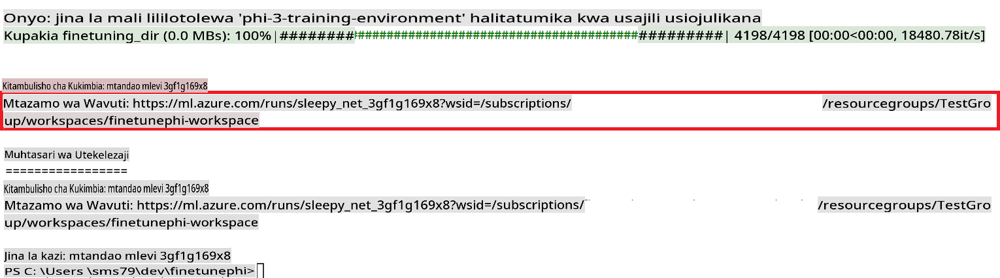

### Deploy the fine-tuned model

To integrate the fine-tuned Phi-3 model with Prompt Flow, you need to deploy the model to make it accessible for real-time inference. This process involves registering the model, creating an online endpoint, and deploying the model.

#### Set the model name, endpoint name, and deployment name for deployment

1. Open *config.py* file.

1. Replace `AZURE_MODEL_NAME = "your_fine_tuned_model_name"` with the desired name for your model.

1. Replace `AZURE_ENDPOINT_NAME = "your_fine_tuned_model_endpoint_name"` with the desired name for your endpoint.

1. Replace `AZURE_DEPLOYMENT_NAME = "your_fine_tuned_model_deployment_name"` na jina unalotaka kwa ajili ya uwekaji wako.

#### Ongeza msimbo kwenye faili ya *deploy_model.py*

Kuendesha faili ya *deploy_model.py* kunarahisisha mchakato mzima wa uwekaji. Inasajili mfano, inaunda endpoint, na inatekeleza uwekaji kulingana na mipangilio iliyobainishwa katika faili ya config.py, ambayo inajumuisha jina la mfano, jina la endpoint, na jina la uwekaji.

1. Fungua faili ya *deploy_model.py* katika Visual Studio Code.

1. Ongeza msimbo ufuatao kwenye *deploy_model.py*.

   ```python
    import logging
    from azure.identity import AzureCliCredential
    from azure.ai.ml import MLClient
    from azure.ai.ml.entities import Model, ProbeSettings, ManagedOnlineEndpoint, ManagedOnlineDeployment, IdentityConfiguration, ManagedIdentityConfiguration, OnlineRequestSettings
    from azure.ai.ml.constants import AssetTypes

    # Configuration imports
    from config import (
        AZURE_SUBSCRIPTION_ID,
        AZURE_RESOURCE_GROUP_NAME,
        AZURE_ML_WORKSPACE_NAME,
        AZURE_MANAGED_IDENTITY_RESOURCE_ID,
        AZURE_MANAGED_IDENTITY_CLIENT_ID,
        AZURE_MODEL_NAME,
        AZURE_ENDPOINT_NAME,
        AZURE_DEPLOYMENT_NAME
    )

    # Constants
    JOB_NAME = "your-job-name"
    COMPUTE_INSTANCE_TYPE = "Standard_E4s_v3"

    deployment_env_vars = {
        "SUBSCRIPTION_ID": AZURE_SUBSCRIPTION_ID,
        "RESOURCE_GROUP_NAME": AZURE_RESOURCE_GROUP_NAME,
        "UAI_CLIENT_ID": AZURE_MANAGED_IDENTITY_CLIENT_ID,
    }

    # Logging setup
    logging.basicConfig(
        format="%(asctime)s - %(levelname)s - %(name)s - %(message)s",
        datefmt="%Y-%m-%d %H:%M:%S",
        level=logging.DEBUG
    )
    logger = logging.getLogger(__name__)

    def get_ml_client():
        """Initialize and return the ML Client."""
        credential = AzureCliCredential()
        return MLClient(credential, AZURE_SUBSCRIPTION_ID, AZURE_RESOURCE_GROUP_NAME, AZURE_ML_WORKSPACE_NAME)

    def register_model(ml_client, model_name, job_name):
        """Register a new model."""
        model_path = f"azureml://jobs/{job_name}/outputs/artifacts/paths/model_output"
        logger.info(f"Registering model {model_name} from job {job_name} at path {model_path}.")
        run_model = Model(
            path=model_path,
            name=model_name,
            description="Model created from run.",
            type=AssetTypes.MLFLOW_MODEL,
        )
        model = ml_client.models.create_or_update(run_model)
        logger.info(f"Registered model ID: {model.id}")
        return model

    def delete_existing_endpoint(ml_client, endpoint_name):
        """Delete existing endpoint if it exists."""
        try:
            endpoint_result = ml_client.online_endpoints.get(name=endpoint_name)
            logger.info(f"Deleting existing endpoint {endpoint_name}.")
            ml_client.online_endpoints.begin_delete(name=endpoint_name).result()
            logger.info(f"Deleted existing endpoint {endpoint_name}.")
        except Exception as e:
            logger.info(f"No existing endpoint {endpoint_name} found to delete: {e}")

    def create_or_update_endpoint(ml_client, endpoint_name, description=""):
        """Create or update an endpoint."""
        delete_existing_endpoint(ml_client, endpoint_name)
        logger.info(f"Creating new endpoint {endpoint_name}.")
        endpoint = ManagedOnlineEndpoint(
            name=endpoint_name,
            description=description,
            identity=IdentityConfiguration(
                type="user_assigned",
                user_assigned_identities=[ManagedIdentityConfiguration(resource_id=AZURE_MANAGED_IDENTITY_RESOURCE_ID)]
            )
        )
        endpoint_result = ml_client.online_endpoints.begin_create_or_update(endpoint).result()
        logger.info(f"Created new endpoint {endpoint_name}.")
        return endpoint_result

    def create_or_update_deployment(ml_client, endpoint_name, deployment_name, model):
        """Create or update a deployment."""

        logger.info(f"Creating deployment {deployment_name} for endpoint {endpoint_name}.")
        deployment = ManagedOnlineDeployment(
            name=deployment_name,
            endpoint_name=endpoint_name,
            model=model.id,
            instance_type=COMPUTE_INSTANCE_TYPE,
            instance_count=1,
            environment_variables=deployment_env_vars,
            request_settings=OnlineRequestSettings(
                max_concurrent_requests_per_instance=3,
                request_timeout_ms=180000,
                max_queue_wait_ms=120000
            ),
            liveness_probe=ProbeSettings(
                failure_threshold=30,
                success_threshold=1,
                period=100,
                initial_delay=500,
            ),
            readiness_probe=ProbeSettings(
                failure_threshold=30,
                success_threshold=1,
                period=100,
                initial_delay=500,
            ),
        )
        deployment_result = ml_client.online_deployments.begin_create_or_update(deployment).result()
        logger.info(f"Created deployment {deployment.name} for endpoint {endpoint_name}.")
        return deployment_result

    def set_traffic_to_deployment(ml_client, endpoint_name, deployment_name):
        """Set traffic to the specified deployment."""
        try:
            # Fetch the current endpoint details
            endpoint = ml_client.online_endpoints.get(name=endpoint_name)
            
            # Log the current traffic allocation for debugging
            logger.info(f"Current traffic allocation: {endpoint.traffic}")
            
            # Set the traffic allocation for the deployment
            endpoint.traffic = {deployment_name: 100}
            
            # Update the endpoint with the new traffic allocation
            endpoint_poller = ml_client.online_endpoints.begin_create_or_update(endpoint)
            updated_endpoint = endpoint_poller.result()
            
            # Log the updated traffic allocation for debugging
            logger.info(f"Updated traffic allocation: {updated_endpoint.traffic}")
            logger.info(f"Set traffic to deployment {deployment_name} at endpoint {endpoint_name}.")
            return updated_endpoint
        except Exception as e:
            # Log any errors that occur during the process
            logger.error(f"Failed to set traffic to deployment: {e}")
            raise


    def main():
        ml_client = get_ml_client()

        registered_model = register_model(ml_client, AZURE_MODEL_NAME, JOB_NAME)
        logger.info(f"Registered model ID: {registered_model.id}")

        endpoint = create_or_update_endpoint(ml_client, AZURE_ENDPOINT_NAME, "Endpoint for finetuned Phi-3 model")
        logger.info(f"Endpoint {AZURE_ENDPOINT_NAME} is ready.")

        try:
            deployment = create_or_update_deployment(ml_client, AZURE_ENDPOINT_NAME, AZURE_DEPLOYMENT_NAME, registered_model)
            logger.info(f"Deployment {AZURE_DEPLOYMENT_NAME} is created for endpoint {AZURE_ENDPOINT_NAME}.")

            set_traffic_to_deployment(ml_client, AZURE_ENDPOINT_NAME, AZURE_DEPLOYMENT_NAME)
            logger.info(f"Traffic is set to deployment {AZURE_DEPLOYMENT_NAME} at endpoint {AZURE_ENDPOINT_NAME}.")
        except Exception as e:
            logger.error(f"Failed to create or update deployment: {e}")

    if __name__ == "__main__":
        main()

    ```

1. Fanya kazi zifuatazo ili kupata `JOB_NAME`:

    - Navigate to Azure Machine Learning resource that you created.
    - Select **Studio web URL** to open the Azure Machine Learning workspace.
    - Select **Jobs** from the left side tab.
    - Select the experiment for fine-tuning. For example, *finetunephi*.
    - Select the job that you created.
    - Copy and paste your job Name into the `JOB_NAME = "your-job-name"` in *deploy_model.py* file.

1. Replace `COMPUTE_INSTANCE_TYPE` na maelezo yako mahususi.

1. Andika amri ifuatayo ili kuendesha script ya *deploy_model.py* na kuanzisha mchakato wa uwekaji katika Azure Machine Learning.

   ```python
    python deploy_model.py
    ```

> [!WARNING]
> Ili kuepuka gharama za ziada kwenye akaunti yako, hakikisha kufuta endpoint iliyoundwa katika workspace ya Azure Machine Learning.
>

#### Angalia hali ya uwekaji katika Workspace ya Azure Machine Learning

1. Tembelea [Azure ML Studio](https://ml.azure.com/home?wt.mc_id=studentamb_279723).

1. Nenda kwenye workspace ya Azure Machine Learning uliyoiunda.

1. Chagua **Studio web URL** kufungua workspace ya Azure Machine Learning.

1. Chagua **Endpoints** kutoka kwenye tabo ya upande wa kushoto.

   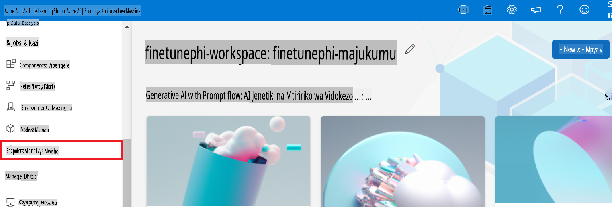

2. Chagua endpoint uliyoiunda.

   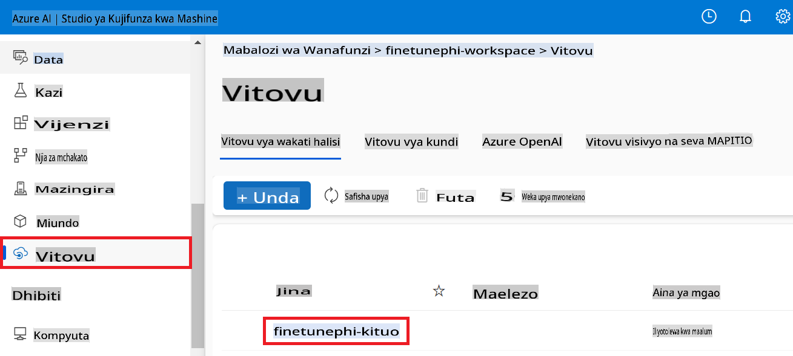

3. Kwenye ukurasa huu, unaweza kudhibiti endpoints zilizoundwa wakati wa mchakato wa uwekaji.

## Hali ya 3: Jumuisha na Prompt Flow na Uzungumze na mfano wako maalum

### Jumuisha mfano maalum wa Phi-3 na Prompt Flow

Baada ya kufanikiwa kuweka mfano wako ulioboreshwa, sasa unaweza kuujumuisha na Prompt Flow ili kutumia mfano wako katika programu za wakati halisi, kuwezesha aina mbalimbali za kazi za maingiliano na mfano wako maalum wa Phi-3.

#### Weka api key na endpoint uri ya mfano ulioboreshwa wa Phi-3

1. Nenda kwenye workspace ya Azure Machine Learning uliyoiunda.
1. Chagua **Endpoints** kutoka kwenye tabo ya upande wa kushoto.
1. Chagua endpoint uliyoiunda.
1. Chagua **Consume** kutoka kwenye menyu ya urambazaji.
1. Nakili na ubandike **REST endpoint** yako kwenye faili ya *config.py*, ukibadilisha `AZURE_ML_ENDPOINT = "your_fine_tuned_model_endpoint_uri"` with your **REST endpoint**.
1. Copy and paste your **Primary key** into the *config.py* file, replacing `AZURE_ML_API_KEY = "your_fine_tuned_model_api_key"` na **Primary key** yako.

   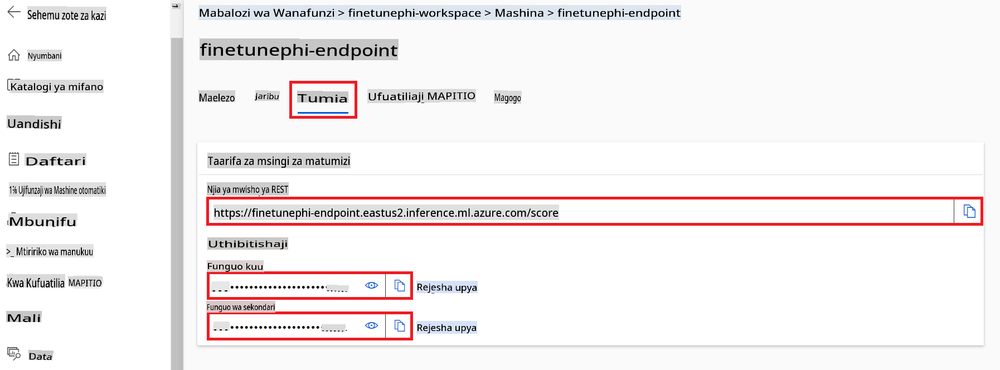

#### Ongeza msimbo kwenye faili ya *flow.dag.yml*

1. Fungua faili ya *flow.dag.yml* katika Visual Studio Code.

1. Ongeza msimbo ufuatao kwenye *flow.dag.yml*.

   ```yml
    inputs:
      input_data:
        type: string
        default: "Who founded Microsoft?"

    outputs:
      answer:
        type: string
        reference: ${integrate_with_promptflow.output}

    nodes:
    - name: integrate_with_promptflow
      type: python
      source:
        type: code
        path: integrate_with_promptflow.py
      inputs:
        input_data: ${inputs.input_data}
    ```

#### Ongeza msimbo kwenye faili ya *integrate_with_promptflow.py*

1. Fungua faili ya *integrate_with_promptflow.py* katika Visual Studio Code.

1. Ongeza msimbo ufuatao kwenye *integrate_with_promptflow.py*.

   ```python
    import logging
    import requests
    from promptflow.core import tool
    import asyncio
    import platform
    from config import (
        AZURE_ML_ENDPOINT,
        AZURE_ML_API_KEY
    )

    # Logging setup
    logging.basicConfig(
        format="%(asctime)s - %(levelname)s - %(name)s - %(message)s",
        datefmt="%Y-%m-%d %H:%M:%S",
        level=logging.DEBUG
    )
    logger = logging.getLogger(__name__)

    def query_azml_endpoint(input_data: list, endpoint_url: str, api_key: str) -> str:
        """
        Send a request to the Azure ML endpoint with the given input data.
        """
        headers = {
            "Content-Type": "application/json",
            "Authorization": f"Bearer {api_key}"
        }
        data = {
            "input_data": [input_data],
            "params": {
                "temperature": 0.7,
                "max_new_tokens": 128,
                "do_sample": True,
                "return_full_text": True
            }
        }
        try:
            response = requests.post(endpoint_url, json=data, headers=headers)
            response.raise_for_status()
            result = response.json()[0]
            logger.info("Successfully received response from Azure ML Endpoint.")
            return result
        except requests.exceptions.RequestException as e:
            logger.error(f"Error querying Azure ML Endpoint: {e}")
            raise

    def setup_asyncio_policy():
        """
        Setup asyncio event loop policy for Windows.
        """
        if platform.system() == 'Windows':
            asyncio.set_event_loop_policy(asyncio.WindowsSelectorEventLoopPolicy())
            logger.info("Set Windows asyncio event loop policy.")

    @tool
    def my_python_tool(input_data: str) -> str:
        """
        Tool function to process input data and query the Azure ML endpoint.
        """
        setup_asyncio_policy()
        return query_azml_endpoint(input_data, AZURE_ML_ENDPOINT, AZURE_ML_API_KEY)

    ```

### Zungumza na mfano wako maalum

1. Andika amri ifuatayo ili kuendesha script ya *deploy_model.py* na kuanzisha mchakato wa uwekaji katika Azure Machine Learning.

   ```python
    pf flow serve --source ./ --port 8080 --host localhost
    ```

1. Hapa kuna mfano wa matokeo: Sasa unaweza kuzungumza na mfano wako maalum wa Phi-3. Inapendekezwa kuuliza maswali kulingana na data iliyotumika katika kufundisha upya.

   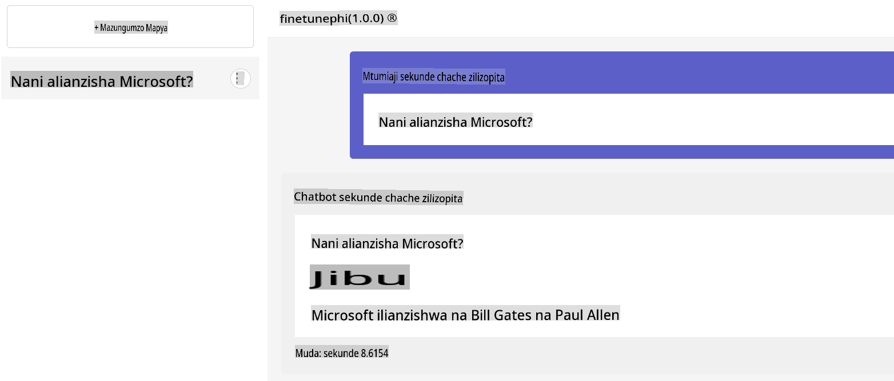

**Kanusho**:  
Hati hii imetafsiriwa kwa kutumia huduma za tafsiri za AI zinazotegemea mashine. Ingawa tunajitahidi kuhakikisha usahihi, tafadhali fahamu kuwa tafsiri za kiotomatiki zinaweza kuwa na makosa au kutokuwa sahihi. Hati asili katika lugha yake ya awali inapaswa kuchukuliwa kama chanzo rasmi. Kwa taarifa muhimu, inashauriwa kutumia huduma za utafsiri wa kibinadamu za kitaalamu. Hatutawajibika kwa kutoelewana au tafsiri zisizo sahihi zinazotokana na matumizi ya tafsiri hii.