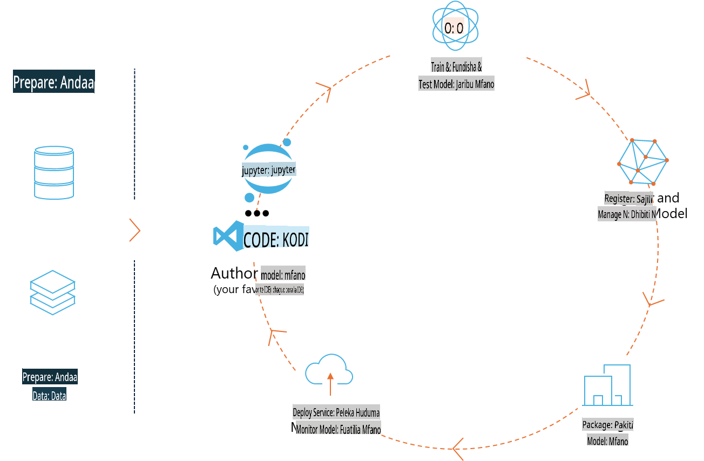
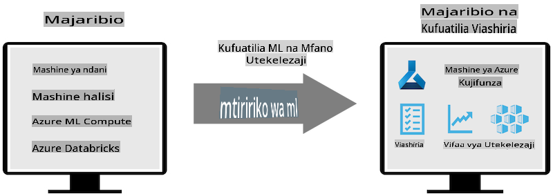
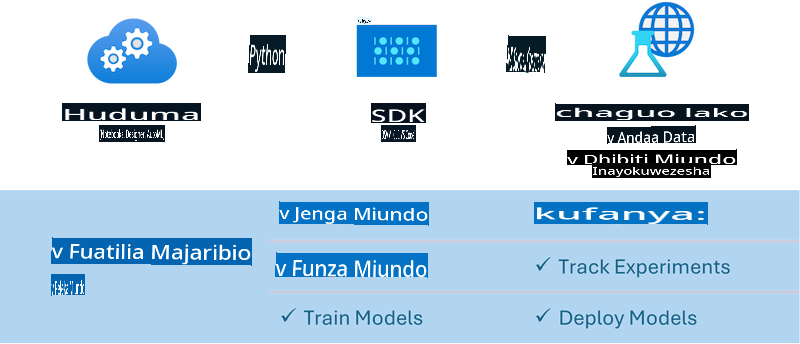

# MLflow

[MLflow](https://mlflow.org/) ni jukwaa la chanzo huria lililoundwa kusimamia mzunguko mzima wa maisha ya ujifunzaji wa mashine.



MLFlow hutumika kusimamia mzunguko wa maisha wa ML, ikijumuisha majaribio, urudufishaji, usambazaji, na rejista kuu ya modeli. Hivi sasa MLFlow inatoa vipengele vinne:

- **MLflow Tracking:** Rekodi na uliza majaribio, msimbo, usanidi wa data, na matokeo.
- **MLflow Projects:** Funga msimbo wa sayansi ya data katika muundo wa kuendesha tena kwenye jukwaa lolote.
- **MLflow Models:** Sambaza modeli za ujifunzaji wa mashine katika mazingira tofauti ya utoaji huduma.
- **Model Registry:** Hifadhi, toa maelezo, na simamia modeli katika hifadhi kuu.

Inajumuisha uwezo wa kufuatilia majaribio, kufunga msimbo katika njia zinazoweza kurudiwa, na kushiriki na kusambaza modeli. MLFlow imeunganishwa kwenye Databricks na inasaidia maktaba mbalimbali za ML, hivyo ni huru kwa maktaba yoyote. Inaweza kutumika na maktaba yoyote ya ujifunzaji wa mashine na katika lugha yoyote ya programu, kwani hutoa REST API na CLI kwa urahisi.



Vipengele muhimu vya MLFlow ni pamoja na:

- **Experiment Tracking:** Rekodi na linganisha vigezo na matokeo.
- **Model Management:** Sambaza modeli kwenye majukwaa mbalimbali ya utoaji na utabiri.
- **Model Registry:** Simamia kwa kushirikiana mzunguko wa maisha wa modeli za MLflow, ikijumuisha matoleo na maelezo.
- **Projects:** Funga msimbo wa ML kwa ajili ya kushiriki au matumizi ya uzalishaji.

MLFlow pia inasaidia mzunguko wa MLOps, ambao unajumuisha kuandaa data, kusajili na kusimamia modeli, kufunga modeli kwa utekelezaji, kusambaza huduma, na kufuatilia modeli. Lengo lake ni kurahisisha mchakato wa kutoka kwa mfano wa majaribio hadi kazi ya uzalishaji, hasa katika mazingira ya wingu na makali.

## Muktadha wa Mwisho hadi Mwisho (E2E) - Kujenga wrapper na kutumia Phi-3 kama modeli ya MLFlow

Katika mfano huu wa E2E tutaonyesha njia mbili tofauti za kujenga wrapper kuzunguka modeli ndogo ya lugha ya Phi-3 (SLM) na kisha kuiendesha kama modeli ya MLFlow iwe ni ndani ya nchi au katika wingu, mfano, katika mazingira ya Azure Machine Learning.



| Mradi | Maelezo | Mahali |
| ------------ | ----------- | -------- |
| Transformer Pipeline | Transformer Pipeline ni chaguo rahisi zaidi la kujenga wrapper ikiwa unataka kutumia modeli ya HuggingFace na ladha ya majaribio ya MLFlow ya transformers. | [**TransformerPipeline.ipynb**](../../../../../../code/06.E2E/E2E_Phi-3-MLflow_TransformerPipeline.ipynb) |
| Custom Python Wrapper | Wakati wa kuandika, transformer pipeline haikuunga mkono kizazi cha wrapper cha MLFlow kwa modeli za HuggingFace katika muundo wa ONNX, hata kwa kifurushi cha majaribio cha optimum Python. Kwa kesi kama hizi, unaweza kujenga wrapper yako ya kawaida ya Python kwa modi ya MLFlow. | [**CustomPythonWrapper.ipynb**](../../../../../../code/06.E2E/E2E_Phi-3-MLflow_CustomPythonWrapper.ipynb) |

## Mradi: Transformer Pipeline

1. Utahitaji vifurushi muhimu vya Python kutoka MLFlow na HuggingFace:

    ``` Python
    import mlflow
    import transformers
    ```

2. Kisha, unapaswa kuanzisha transformer pipeline kwa kurejelea modeli ya Phi-3 inayolengwa katika rejista ya HuggingFace. Kama inavyoonekana kwenye kadi ya modeli ya _Phi-3-mini-4k-instruct_, kazi yake ni aina ya "Text Generation":

    ``` Python
    pipeline = transformers.pipeline(
        task = "text-generation",
        model = "microsoft/Phi-3-mini-4k-instruct"
    )
    ```

3. Sasa unaweza kuhifadhi transformer pipeline ya modeli yako ya Phi-3 katika muundo wa MLFlow na kutoa maelezo ya ziada kama njia ya artifacts inayolengwa, mipangilio maalum ya usanidi wa modeli, na aina ya API ya utabiri:

    ``` Python
    model_info = mlflow.transformers.log_model(
        transformers_model = pipeline,
        artifact_path = "phi3-mlflow-model",
        model_config = model_config,
        task = "llm/v1/chat"
    )
    ```

## Mradi: Custom Python Wrapper

1. Tunaweza kutumia hapa [ONNX Runtime generate() API](https://github.com/microsoft/onnxruntime-genai) ya Microsoft kwa utabiri wa modeli ya ONNX na usimbaji/ufutaji wa tokeni. Lazima uchague kifurushi cha _onnxruntime_genai_ kwa kompyuta yako lengwa, na mfano hapa unalenga CPU:

    ``` Python
    import mlflow
    from mlflow.models import infer_signature
    import onnxruntime_genai as og
    ```

1. Darasa letu maalum linatekeleza mbinu mbili: _load_context()_ kwa kuanzisha **modeli ya ONNX** ya Phi-3 Mini 4K Instruct, **vigezo vya jenereta**, na **tokenizer**; na _predict()_ kwa kuzalisha tokeni za matokeo kwa maelezo yaliyotolewa:

    ``` Python
    class Phi3Model(mlflow.pyfunc.PythonModel):
        def load_context(self, context):
            # Retrieving model from the artifacts
            model_path = context.artifacts["phi3-mini-onnx"]
            model_options = {
                 "max_length": 300,
                 "temperature": 0.2,         
            }
        
            # Defining the model
            self.phi3_model = og.Model(model_path)
            self.params = og.GeneratorParams(self.phi3_model)
            self.params.set_search_options(**model_options)
            
            # Defining the tokenizer
            self.tokenizer = og.Tokenizer(self.phi3_model)
    
        def predict(self, context, model_input):
            # Retrieving prompt from the input
            prompt = model_input["prompt"][0]
            self.params.input_ids = self.tokenizer.encode(prompt)
    
            # Generating the model's response
            response = self.phi3_model.generate(self.params)
    
            return self.tokenizer.decode(response[0][len(self.params.input_ids):])
    ```

1. Sasa unaweza kutumia kazi ya _mlflow.pyfunc.log_model()_ kuzalisha wrapper ya kawaida ya Python (katika muundo wa pickle) kwa modeli ya Phi-3, pamoja na modeli ya asili ya ONNX na utegemezi unaohitajika:

    ``` Python
    model_info = mlflow.pyfunc.log_model(
        artifact_path = artifact_path,
        python_model = Phi3Model(),
        artifacts = {
            "phi3-mini-onnx": "cpu_and_mobile/cpu-int4-rtn-block-32-acc-level-4",
        },
        input_example = input_example,
        signature = infer_signature(input_example, ["Run"]),
        extra_pip_requirements = ["torch", "onnxruntime_genai", "numpy"],
    )
    ```

## Saini za modeli za MLFlow zilizozalishwa

1. Katika hatua ya 3 ya mradi wa Transformer Pipeline hapo juu, tuliweka kazi ya modeli ya MLFlow kuwa "_llm/v1/chat_". Maelekezo haya huzalisha wrapper ya API ya modeli, inayooana na API ya Chat ya OpenAI kama inavyoonyeshwa hapa chini:

    ``` Python
    {inputs: 
      ['messages': Array({content: string (required), name: string (optional), role: string (required)}) (required), 'temperature': double (optional), 'max_tokens': long (optional), 'stop': Array(string) (optional), 'n': long (optional), 'stream': boolean (optional)],
    outputs: 
      ['id': string (required), 'object': string (required), 'created': long (required), 'model': string (required), 'choices': Array({finish_reason: string (required), index: long (required), message: {content: string (required), name: string (optional), role: string (required)} (required)}) (required), 'usage': {completion_tokens: long (required), prompt_tokens: long (required), total_tokens: long (required)} (required)],
    params: 
      None}
    ```

1. Matokeo yake, unaweza kuwasilisha maelezo yako kwa muundo ufuatao:

    ``` Python
    messages = [{"role": "user", "content": "What is the capital of Spain?"}]
    ```

1. Kisha, tumia usindikaji wa baada ya API ya OpenAI, mfano, _response[0][‘choices’][0][‘message’][‘content’]_, kuboresha matokeo yako hadi kitu kama hiki:

    ``` JSON
    Question: What is the capital of Spain?
    
    Answer: The capital of Spain is Madrid. It is the largest city in Spain and serves as the political, economic, and cultural center of the country. Madrid is located in the center of the Iberian Peninsula and is known for its rich history, art, and architecture, including the Royal Palace, the Prado Museum, and the Plaza Mayor.
    
    Usage: {'prompt_tokens': 11, 'completion_tokens': 73, 'total_tokens': 84}
    ```

1. Katika hatua ya 3 ya mradi wa Custom Python Wrapper hapo juu, tuliruhusu kifurushi cha MLFlow kuzalisha saini ya modeli kutoka kwa mfano wa pembejeo uliotolewa. Saini ya wrapper ya MLFlow yetu itaonekana kama hii:

    ``` Python
    {inputs: 
      ['prompt': string (required)],
    outputs: 
      [string (required)],
    params: 
      None}
    ```

1. Kwa hivyo, maelezo yetu yanahitaji kuwa na kitufe cha kamusi "prompt", kama hivi:

    ``` Python
    {"prompt": "<|system|>You are a stand-up comedian.<|end|><|user|>Tell me a joke about atom<|end|><|assistant|>",}
    ```

1. Matokeo ya modeli yatatolewa kisha katika muundo wa string:

    ``` JSON
    Alright, here's a little atom-related joke for you!
    
    Why don't electrons ever play hide and seek with protons?
    
    Because good luck finding them when they're always "sharing" their electrons!
    
    Remember, this is all in good fun, and we're just having a little atomic-level humor!
    ```

**Kanusho:**  
Hati hii imetafsiriwa kwa kutumia huduma za kutafsiri za AI zinazotumia mashine. Ingawa tunajitahidi kwa usahihi, tafadhali fahamu kuwa tafsiri za kiotomatiki zinaweza kuwa na makosa au kutokuwa sahihi. Hati ya asili katika lugha yake ya awali inapaswa kuzingatiwa kama chanzo cha mamlaka. Kwa taarifa muhimu, inashauriwa kutumia huduma za watafsiri wa kibinadamu wenye taaluma. Hatutawajibika kwa kutoelewana au tafsiri zisizo sahihi zinazotokana na matumizi ya tafsiri hii.