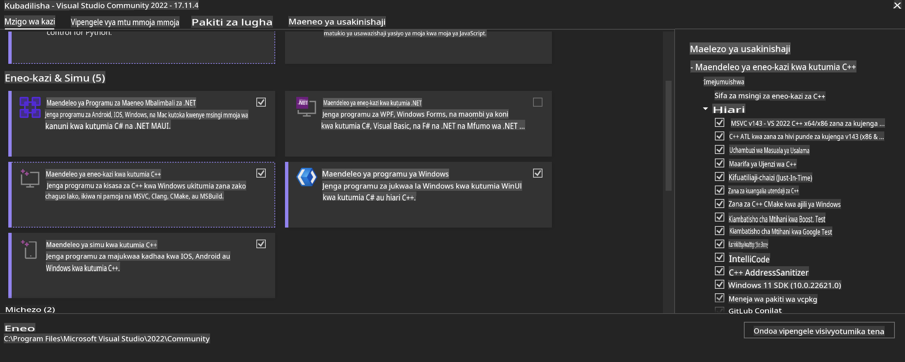
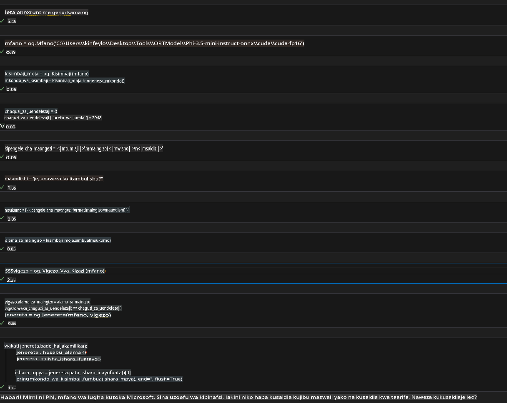
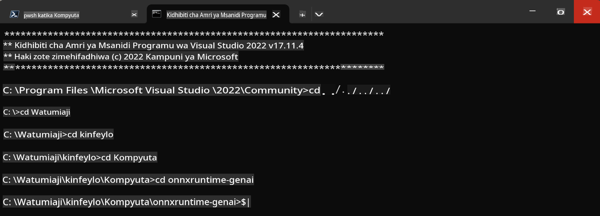

# **Mwongozo wa OnnxRuntime GenAI Windows GPU**

Mwongozo huu unatoa hatua za kuanzisha na kutumia ONNX Runtime (ORT) na GPU kwenye Windows. Umeundwa kukusaidia kutumia uwezo wa GPU ili kuharakisha mifano yako, kuboresha utendaji na ufanisi.

Hati hii inaelezea:

- Kuanzisha Mazingira: Maelekezo ya kusakinisha mahitaji muhimu kama CUDA, cuDNN, na ONNX Runtime.
- Usanidi: Jinsi ya kusanidi mazingira na ONNX Runtime ili kutumia rasilimali za GPU kwa ufanisi.
- Vidokezo vya Uboreshaji: Ushauri wa jinsi ya kurekebisha mipangilio ya GPU kwa utendaji bora.

### **1. Python 3.10.x /3.11.8**

   ***Kumbuka*** Inapendekezwa kutumia [miniforge](https://github.com/conda-forge/miniforge/releases/latest/download/Miniforge3-Windows-x86_64.exe) kama mazingira yako ya Python.

   ```bash

   conda create -n pydev python==3.11.8

   conda activate pydev

   ```

   ***Kumbusho*** Ikiwa tayari umesakinisha maktaba yoyote ya Python ONNX, tafadhali iondoe.

### **2. Sakinisha CMake kwa kutumia winget**

   ```bash

   winget install -e --id Kitware.CMake

   ```

### **3. Sakinisha Visual Studio 2022 - Desktop Development with C++**

   ***Kumbuka*** Ikiwa hutaki kuunda (compile), unaweza kuruka hatua hii.



### **4. Sakinisha Dereva za NVIDIA**

1. **Dereva ya NVIDIA GPU**  [https://www.nvidia.com/en-us/drivers/](https://www.nvidia.com/en-us/drivers/)

2. **NVIDIA CUDA 12.4** [https://developer.nvidia.com/cuda-12-4-0-download-archive](https://developer.nvidia.com/cuda-12-4-0-download-archive)

3. **NVIDIA CUDNN 9.4**  [https://developer.nvidia.com/cudnn-downloads](https://developer.nvidia.com/cudnn-downloads)

***Kumbusho*** Tafadhali tumia mipangilio chaguo-msingi wakati wa mchakato wa usakinishaji.

### **5. Sanidi Mazingira ya NVIDIA**

Nakili maktaba, bin, na include za NVIDIA CUDNN 9.4 kwenye maktaba, bin, na include za NVIDIA CUDA 12.4.

- nakili faili za *'C:\Program Files\NVIDIA\CUDNN\v9.4\bin\12.6'* kwenda *'C:\Program Files\NVIDIA GPU Computing Toolkit\CUDA\v12.4\bin*

- nakili faili za *'C:\Program Files\NVIDIA\CUDNN\v9.4\include\12.6'* kwenda *'C:\Program Files\NVIDIA GPU Computing Toolkit\CUDA\v12.4\include*

- nakili faili za *'C:\Program Files\NVIDIA\CUDNN\v9.4\lib\12.6'* kwenda *'C:\Program Files\NVIDIA GPU Computing Toolkit\CUDA\v12.4\lib\x64'*

### **6. Pakua Phi-3.5-mini-instruct-onnx**

   ```bash

   winget install -e --id Git.Git

   winget install -e --id GitHub.GitLFS

   git lfs install

   git clone https://huggingface.co/microsoft/Phi-3.5-mini-instruct-onnx

   ```

### **7. Endesha InferencePhi35Instruct.ipynb**

   Fungua [Notebook](../../../../../../code/09.UpdateSamples/Aug/ortgpu-phi35-instruct.ipynb) na uitekeleze.



### **8. Unda (Compile) ORT GenAI GPU**

   ***Kumbuka*** 
   
   1. Tafadhali ondoa maktaba zote zinazohusiana na onnx, onnxruntime, na onnxruntime-genai kwanza.

   ```bash

   pip list 
   
   ```

   Kisha ondoa maktaba zote za onnxruntime kama vile:

   ```bash

   pip uninstall onnxruntime

   pip uninstall onnxruntime-genai

   pip uninstall onnxruntume-genai-cuda
   
   ```

   2. Hakikisha Visual Studio Extension inasaidiwa.

   Angalia C:\Program Files\NVIDIA GPU Computing Toolkit\CUDA\v12.4\extras kuhakikisha C:\Program Files\NVIDIA GPU Computing Toolkit\CUDA\v12.4\extras\visual_studio_integration ipo. 

   Ikiwa haipo, angalia folda nyingine za dereva za Cuda toolkit na nakili folda ya visual_studio_integration na yaliyomo kwenda C:\Program Files\NVIDIA GPU Computing Toolkit\CUDA\v12.4\extras\visual_studio_integration.

   - Ikiwa hutaki kuunda (compile), unaweza kuruka hatua hii.

   ```bash

   git clone https://github.com/microsoft/onnxruntime-genai

   ```

   - Pakua [https://github.com/microsoft/onnxruntime/releases/download/v1.19.2/onnxruntime-win-x64-gpu-1.19.2.zip](https://github.com/microsoft/onnxruntime/releases/download/v1.19.2/onnxruntime-win-x64-gpu-1.19.2.zip)

   - Fungua (unzip) onnxruntime-win-x64-gpu-1.19.2.zip, na uipe jina **ort**, kisha nakili folda ya ort kwenda onnxruntime-genai.

   - Tumia Windows Terminal, nenda kwenye Developer Command Prompt for VS 2022 na uelekee kwenye onnxruntime-genai.



   - Iunde (Compile) kwa kutumia mazingira yako ya Python.

   ```bash

   cd onnxruntime-genai

   python build.py --use_cuda  --cuda_home "C:\Program Files\NVIDIA GPU Computing Toolkit\CUDA\v12.4" --config Release
 

   cd build/Windows/Release/Wheel

   pip install .whl

   ```

**Kanusho**:  
Hati hii imetafsiriwa kwa kutumia huduma za tafsiri za mashine zinazotumia AI. Ingawa tunajitahidi kwa usahihi, tafadhali fahamu kuwa tafsiri za kiotomatiki zinaweza kuwa na makosa au kutokuwa sahihi. Hati ya asili katika lugha yake ya awali inapaswa kuchukuliwa kama chanzo rasmi. Kwa maelezo muhimu, tafsiri ya kitaalamu ya binadamu inapendekezwa. Hatutawajibika kwa kutoelewana au tafsiri zisizo sahihi zinazotokana na matumizi ya tafsiri hii.