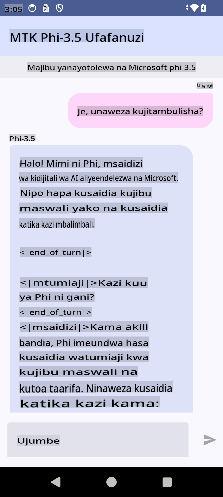

# **Kutumia Microsoft Phi-3.5 tflite kuunda programu ya Android**

Hii ni mfano wa Android unaotumia mifano ya Microsoft Phi-3.5 tflite.

## **📚 Maarifa**

Android LLM Inference API hukuruhusu kuendesha mifano mikubwa ya lugha (LLMs) moja kwa moja kwenye kifaa kwa ajili ya programu za Android. Unaweza kuitumia kufanya kazi mbalimbali, kama vile kuzalisha maandishi, kupata taarifa kwa lugha ya kawaida, na kuhakiki nyaraka. Kazi hii inatoa msaada wa ndani kwa mifano mingi ya lugha kubwa ya maandishi-kwa-maandishi, hivyo unaweza kutumia mifano ya hivi karibuni ya AI inayozalisha moja kwa moja kwenye programu zako za Android.

Googld AI Edge Torch ni maktaba ya Python inayosaidia kubadilisha mifano ya PyTorch kuwa muundo wa .tflite, ambao unaweza kuendeshwa kwa kutumia TensorFlow Lite na MediaPipe. Hii inaruhusu programu za Android, iOS, na IoT kuendesha mifano moja kwa moja kwenye kifaa. AI Edge Torch inatoa msaada mpana wa CPU, na msaada wa awali wa GPU na NPU. AI Edge Torch inalenga kuunganishwa kwa karibu na PyTorch, ikijengwa juu ya torch.export() na kutoa msaada mzuri kwa waendeshaji wa msingi wa Core ATen.

## **🪬 Mwongozo**

### **🔥 Kubadilisha Microsoft Phi-3.5 kuwa tflite**

0. Mfano huu ni kwa Android 14+

1. Weka Python 3.10.12

***Pendekezo:*** tumia conda kusanidi mazingira yako ya Python

2. Ubuntu 20.04 / 22.04 (tafadhali zingatia [google ai-edge-torch](https://github.com/google-ai-edge/ai-edge-torch))

***Pendekezo:*** Tumia Azure Linux VM au VM ya wingu ya mtu wa tatu kuunda mazingira yako

3. Nenda kwenye bash yako ya Linux, usakinishe maktaba ya Python

```bash

git clone https://github.com/google-ai-edge/ai-edge-torch.git

cd ai-edge-torch

pip install -r requirements.txt -U 

pip install tensorflow-cpu -U

pip install -e .

```

4. Pakua Microsoft-3.5-Instruct kutoka Hugging face

```bash

git lfs install

git clone  https://huggingface.co/microsoft/Phi-3.5-mini-instruct

```

5. Badilisha Microsoft Phi-3.5 kuwa tflite

```bash

python ai-edge-torch/ai_edge_torch/generative/examples/phi/convert_phi3_to_tflite.py --checkpoint_path  Your Microsoft Phi-3.5-mini-instruct path --tflite_path Your Microsoft Phi-3.5-mini-instruct tflite path  --prefill_seq_len 1024 --kv_cache_max_len 1280 --quantize True

```

### **🔥 Kubadilisha Microsoft Phi-3.5 kuwa Android Mediapipe Bundle**

Tafadhali sakinisha mediapipe kwanza

```bash

pip install mediapipe

```

endesha msimbo huu kwenye [daftari lako](../../../../../../code/09.UpdateSamples/Aug/Android/convert/convert_phi.ipynb)

```python

import mediapipe as mp
from mediapipe.tasks.python.genai import bundler

config = bundler.BundleConfig(
    tflite_model='Your Phi-3.5 tflite model path',
    tokenizer_model='Your Phi-3.5 tokenizer model path',
    start_token='start_token',
    stop_tokens=[STOP_TOKENS],
    output_filename='Your Phi-3.5 task model path',
    enable_bytes_to_unicode_mapping=True or Flase,
)
bundler.create_bundle(config)

```

### **🔥 Kutumia adb kupakia mfano wa kazi kwenye njia ya kifaa chako cha Android**

```bash

adb shell rm -r /data/local/tmp/llm/ # Remove any previously loaded models

adb shell mkdir -p /data/local/tmp/llm/

adb push 'Your Phi-3.5 task model path' /data/local/tmp/llm/phi3.task

```

### **🔥 Kuendesha msimbo wako wa Android**



**Kanusho**:  
Hati hii imetafsiriwa kwa kutumia huduma za kutafsiri za AI zinazotegemea mashine. Ingawa tunajitahidi kwa usahihi, tafadhali fahamu kuwa tafsiri za kiotomatiki zinaweza kuwa na makosa au kutokuwa sahihi. Hati asili katika lugha yake ya awali inapaswa kuzingatiwa kama chanzo rasmi. Kwa taarifa muhimu, tafsiri ya kitaalamu ya binadamu inapendekezwa. Hatutawajibika kwa kutoelewana au tafsiri zisizo sahihi zinazotokana na matumizi ya tafsiri hii.