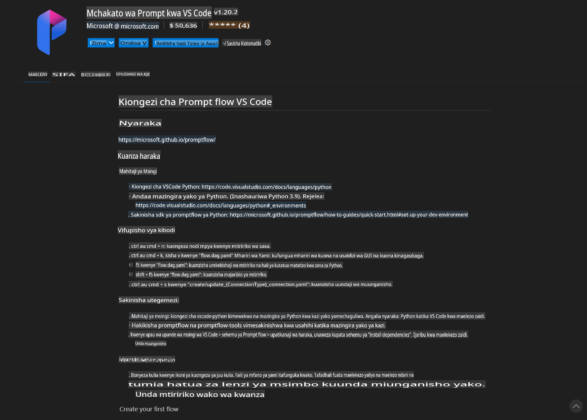
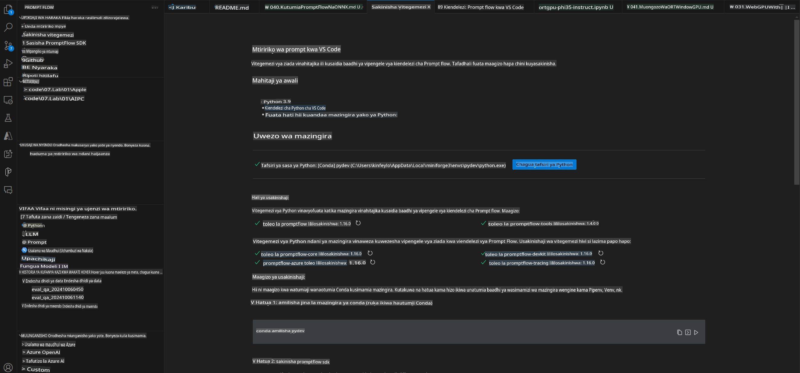
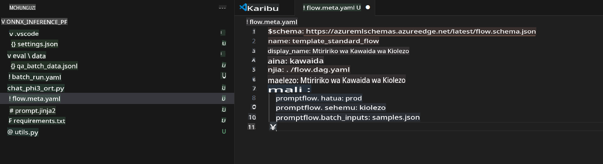
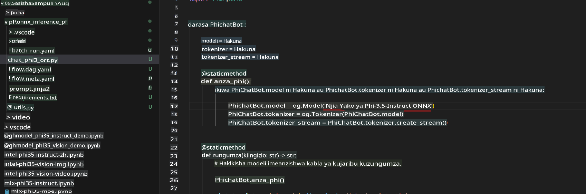
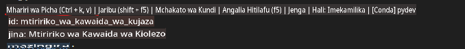
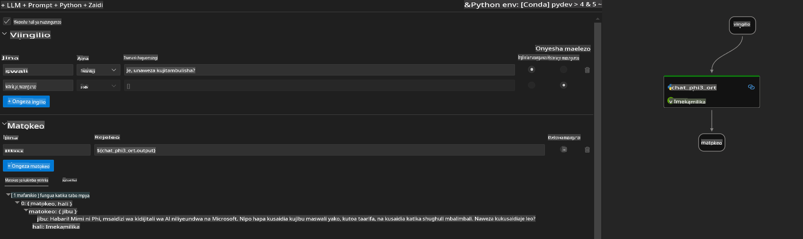
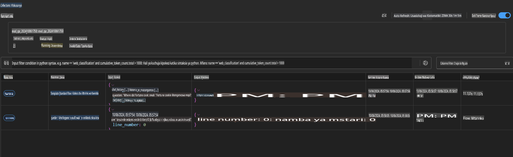

# Kutumia Windows GPU kuunda suluhisho la Prompt flow na Phi-3.5-Instruct ONNX 

Hati ifuatayo ni mfano wa jinsi ya kutumia PromptFlow na ONNX (Open Neural Network Exchange) kwa ajili ya kuunda programu za AI zinazotegemea modeli za Phi-3.

PromptFlow ni seti ya zana za maendeleo iliyoundwa kurahisisha mzunguko mzima wa maendeleo ya programu za AI zinazotegemea LLM (Large Language Model), kuanzia mawazo na utengenezaji wa prototaipu hadi majaribio na tathmini.

Kwa kuunganisha PromptFlow na ONNX, watengenezaji wanaweza:

- **Kuboresha Utendaji wa Modeli:** Tumia ONNX kwa ufanisi wa maelekezo ya modeli na utekelezaji.
- **Kurahisisha Maendeleo:** Tumia PromptFlow kusimamia mtiririko wa kazi na kuendesha kazi zinazojirudia.
- **Kuboresha Ushirikiano:** Rahisisha ushirikiano kati ya wanachama wa timu kwa kutoa mazingira ya maendeleo yaliyounganishwa.

**Prompt flow** ni seti ya zana za maendeleo iliyoundwa kurahisisha mzunguko mzima wa maendeleo ya programu za AI zinazotegemea LLM, kuanzia mawazo, utengenezaji wa prototaipu, majaribio, tathmini hadi utekelezaji wa uzalishaji na ufuatiliaji. Inafanya uhandisi wa maelekezo kuwa rahisi zaidi na inakuwezesha kujenga programu za LLM zenye ubora wa uzalishaji.

Prompt flow inaweza kuunganishwa na OpenAI, Azure OpenAI Service, na modeli zinazoweza kubadilishwa (Huggingface, LLM/SLM za ndani). Tunatarajia kutekeleza modeli ya Phi-3.5 iliyokokotolewa (quantized) ya ONNX kwenye programu za ndani. Prompt flow inaweza kutusaidia kupanga biashara yetu vyema na kukamilisha suluhisho za ndani zinazotegemea Phi-3.5. Katika mfano huu, tutaunganisha Maktaba ya ONNX Runtime GenAI kukamilisha suluhisho la Prompt flow linalotegemea Windows GPU.

## **Usakinishaji**

### **ONNX Runtime GenAI kwa Windows GPU**

Soma mwongozo huu wa kusakinisha ONNX Runtime GenAI kwa Windows GPU [bonyeza hapa](./ORTWindowGPUGuideline.md)

### **Sanidi Prompt flow kwenye VSCode**

1. Sakinisha Kiendelezi cha Prompt flow cha VS Code



2. Baada ya kusakinisha Kiendelezi cha Prompt flow cha VS Code, bofya kiendelezi hicho, na uchague **Installation dependencies** kisha fuata mwongozo huu kusakinisha Prompt flow SDK kwenye mazingira yako



3. Pakua [Msimbo wa Mfano](../../../../../../code/09.UpdateSamples/Aug/pf/onnx_inference_pf) na tumia VS Code kufungua mfano huu



4. Fungua **flow.dag.yaml** kuchagua mazingira yako ya Python


   Fungua **chat_phi3_ort.py** kubadilisha eneo la modeli yako ya Phi-3.5-instruct ONNX



5. Endesha Prompt flow yako kwa majaribio

Fungua **flow.dag.yaml** kisha bofya mhariri wa kuona (visual editor)



Baada ya kubofya hapo, endesha ili kujaribu



1. Unaweza kuendesha kundi (batch) kwenye terminal ili kuona matokeo zaidi

```bash

pf run create --file batch_run.yaml --stream --name 'Your eval qa name'    

```

Unaweza kuangalia matokeo kwenye kivinjari chako chaguo-msingi



**Kanusho**:  
Hati hii imetafsiriwa kwa kutumia huduma za tafsiri za AI zinazotegemea mashine. Ingawa tunajitahidi kwa usahihi, tafadhali fahamu kuwa tafsiri za kiotomatiki zinaweza kuwa na makosa au kutokuwa sahihi. Hati ya asili katika lugha yake ya awali inapaswa kuchukuliwa kuwa chanzo cha mamlaka. Kwa taarifa muhimu, inashauriwa kutumia huduma za mtafsiri wa kibinadamu mtaalamu. Hatutawajibika kwa kutoelewana au tafsiri zisizo sahihi zinazotokana na matumizi ya tafsiri hii.