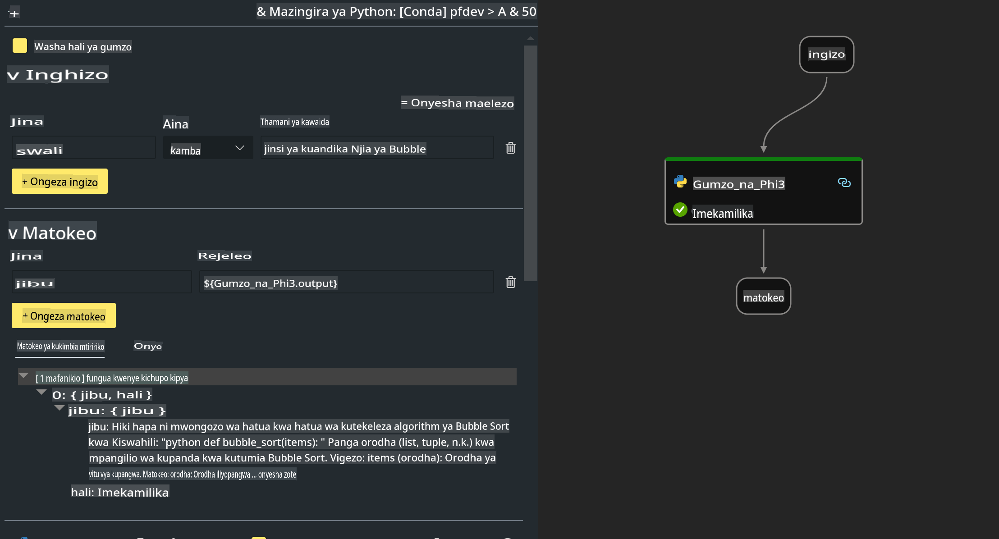

# **Maabara ya 2 - Kuendesha Prompt flow na Phi-3-mini katika AIPC**

## **Prompt flow ni nini**

Prompt flow ni seti ya zana za maendeleo zilizoundwa kurahisisha mchakato mzima wa maendeleo wa programu za AI zinazotegemea LLM, kuanzia mawazo, prototyping, majaribio, tathmini hadi utekelezaji wa uzalishaji na ufuatiliaji. Inarahisisha uhandisi wa prompt na hukuwezesha kujenga programu za LLM zenye ubora wa uzalishaji.

Kwa kutumia Prompt flow, utaweza:

- Kuunda mikondo inayounganisha LLMs, prompt, msimbo wa Python, na zana nyingine pamoja katika mtiririko wa kazi unaoweza kutekelezwa.

- Kufanya debugging na kurudia mikondo yako, hasa mawasiliano na LLMs kwa urahisi.

- Kutathmini mikondo yako, kupima ubora na viwango vya utendaji kwa kutumia seti kubwa za data.

- Kujumuisha majaribio na tathmini kwenye mfumo wako wa CI/CD ili kuhakikisha ubora wa mtiririko wako.

- Kuweka mikondo yako kwenye jukwaa la huduma unalochagua au kuijumuisha kwa urahisi katika msingi wa msimbo wa programu yako.

- (Hiari lakini inapendekezwa sana) Kushirikiana na timu yako kwa kutumia toleo la wingu la Prompt flow katika Azure AI.


## **Kuunda mikondo ya kizazi cha msimbo kwenye Apple Silicon**

***Kumbuka***: Ikiwa hujakamilisha usakinishaji wa mazingira, tafadhali tembelea [Lab 0 -Installations](./01.Installations.md)

1. Fungua Kiendelezi cha Prompt flow katika Visual Studio Code na unda mradi wa mtiririko mpya, mtupu.


2. Ongeza vigezo vya Ingizo na Matokeo na Ongeza Msimbo wa Python kama mtiririko mpya.



Unaweza kurejelea muundo huu (flow.dag.yaml) kuunda mtiririko wako.

```yaml

inputs:
  prompt:
    type: string
    default: Write python code for Fibonacci serie. Please use markdown as output
outputs:
  result:
    type: string
    reference: ${gen_code_by_phi3.output}
nodes:
- name: gen_code_by_phi3
  type: python
  source:
    type: code
    path: gen_code_by_phi3.py
  inputs:
    prompt: ${inputs.prompt}


```

3. Pima phi-3-mini

Tunatarajia kuendesha SLM vizuri kwenye vifaa vya ndani. Kwa kawaida, tunapima modeli (INT4, FP16, FP32).

```bash

python -m mlx_lm.convert --hf-path microsoft/Phi-3-mini-4k-instruct

```

**Kumbuka:** folda chaguo-msingi ni mlx_model 

4. Ongeza Msimbo katika ***Chat_With_Phi3.py***

```python


from promptflow import tool

from mlx_lm import load, generate


# The inputs section will change based on the arguments of the tool function, after you save the code
# Adding type to arguments and return value will help the system show the types properly
# Please update the function name/signature per need
@tool
def my_python_tool(prompt: str) -> str:

    model_id = './mlx_model_phi3_mini'

    model, tokenizer = load(model_id)

    # <|user|>\nWrite python code for Fibonacci serie. Please use markdown as output<|end|>\n<|assistant|>

    response = generate(model, tokenizer, prompt="<|user|>\n" + prompt  + "<|end|>\n<|assistant|>", max_tokens=2048, verbose=True)

    return response


```

4. Unaweza kujaribu mtiririko kutoka Debug au Run ili kuthibitisha ikiwa msimbo wa kizazi uko sawa au la.


5. Endesha mtiririko kama API ya maendeleo kwenye terminal.

```

pf flow serve --source ./ --port 8080 --host localhost   

```

Unaweza kujaribu kutumia Postman / Thunder Client.


### **Kumbuka**

1. Uendeshaji wa mara ya kwanza huchukua muda mrefu. Inapendekezwa kupakua modeli ya phi-3 kutoka Hugging face CLI.

2. Kwa kuzingatia uwezo mdogo wa kompyuta wa Intel NPU, inapendekezwa kutumia Phi-3-mini-4k-instruct.

3. Tunatumia Intel NPU Acceleration kupima ubadilishaji wa INT4, lakini ikiwa utaendesha tena huduma, unahitaji kufuta folda za cache na nc_workshop.


## **Rasilimali**

1. Jifunze Promptflow [https://microsoft.github.io/promptflow/](https://microsoft.github.io/promptflow/)

2. Jifunze Intel NPU Acceleration [https://github.com/intel/intel-npu-acceleration-library](https://github.com/intel/intel-npu-acceleration-library)

3. Msimbo wa Mfano, pakua [Local NPU Agent Sample Code](../../../../../../../../../code/07.Lab/01/AIPC/local-npu-agent)

**Kanusho**:  
Hati hii imetafsiriwa kwa kutumia huduma za tafsiri za AI zinazotegemea mashine. Ingawa tunajitahidi kwa usahihi, tafadhali fahamu kuwa tafsiri za kiotomatiki zinaweza kuwa na makosa au kutokuwa sahihi. Hati ya asili katika lugha yake ya kiasili inapaswa kuzingatiwa kama chanzo cha mamlaka. Kwa taarifa muhimu, tafsiri ya kitaalamu ya kibinadamu inapendekezwa. Hatutawajibika kwa maelewano mabaya au tafsiri zisizo sahihi zinazotokana na matumizi ya tafsiri hii.