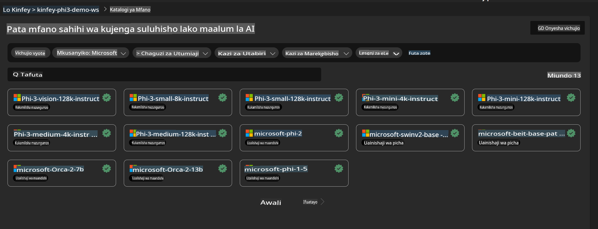
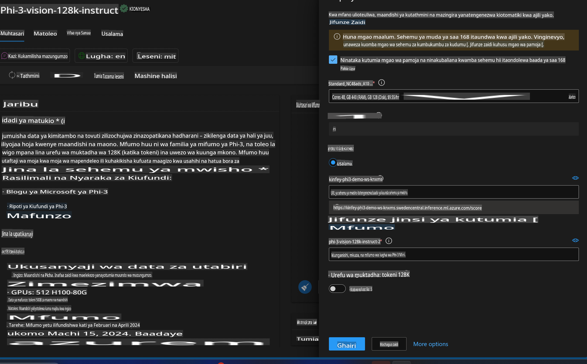
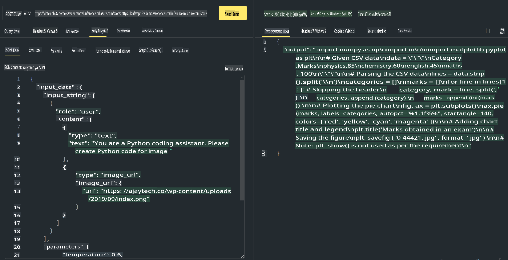

# **Lab 3 - Kusambaza Phi-3-Vision kwenye Azure Machine Learning Service**

Tunatumia NPU kukamilisha usambazaji wa msimbo wa ndani wa uzalishaji, na kisha tunataka kuanzisha uwezo wa kutumia PHI-3-VISION ili kufanikisha uzalishaji wa msimbo kutoka kwa picha.

Katika utangulizi huu, tunaweza haraka kujenga huduma ya Model As Service Phi-3 Vision kwenye Azure Machine Learning Service.

***Note***: Phi-3 Vision inahitaji nguvu ya kompyuta ili kuzalisha maudhui kwa kasi zaidi. Tunahitaji nguvu ya kompyuta ya wingu kutusaidia kufanikisha hili.

### **1. Unda Azure Machine Learning Service**

Tunahitaji kuunda Azure Machine Learning Service kwenye Azure Portal. Ikiwa unataka kujifunza jinsi ya kufanya hivyo, tafadhali tembelea kiungo hiki [https://learn.microsoft.com/azure/machine-learning/quickstart-create-resources?view=azureml-api-2](https://learn.microsoft.com/azure/machine-learning/quickstart-create-resources?view=azureml-api-2)

### **2. Chagua Phi-3 Vision kwenye Azure Machine Learning Service**



### **3. Sambaza Phi-3-Vision kwenye Azure**



### **4. Jaribu Endpoint kwenye Postman**



***Note***

1. Vigezo vinavyopaswa kuwasilishwa lazima vijumuishe Authorization, azureml-model-deployment, na Content-Type. Unahitaji kuangalia taarifa za usambazaji ili kuzipata.

2. Ili kuwasilisha vigezo, Phi-3-Vision inahitaji kuwasilisha kiungo cha picha. Tafadhali rejelea njia ya GPT-4-Vision kuwasilisha vigezo, kama vile

```json

{
  "input_data":{
    "input_string":[
      {
        "role":"user",
        "content":[ 
          {
            "type": "text",
            "text": "You are a Python coding assistant.Please create Python code for image "
          },
          {
              "type": "image_url",
              "image_url": {
                "url": "https://ajaytech.co/wp-content/uploads/2019/09/index.png"
              }
          }
        ]
      }
    ],
    "parameters":{
          "temperature": 0.6,
          "top_p": 0.9,
          "do_sample": false,
          "max_new_tokens": 2048
    }
  }
}

```

3. Piga simu **/score** ukitumia njia ya Post

**Hongera**! Umefanikiwa kukamilisha usambazaji wa haraka wa PHI-3-VISION na kujaribu jinsi ya kutumia picha kuzalisha msimbo. Hatua inayofuata ni kujenga programu kwa kuchanganya NPU na wingu.

**Kanusho**:  
Hati hii imetafsiriwa kwa kutumia huduma za kutafsiri za AI zinazotegemea mashine. Ingawa tunajitahidi kwa usahihi, tafadhali fahamu kwamba tafsiri za kiotomatiki zinaweza kuwa na makosa au kutokuwa sahihi. Hati ya asili katika lugha yake ya kiasili inapaswa kuchukuliwa kama chanzo rasmi. Kwa taarifa muhimu, tafsiri ya kitaalamu ya binadamu inapendekezwa. Hatutawajibika kwa kutoelewana au tafsiri zisizo sahihi zinazotokana na matumizi ya tafsiri hii.